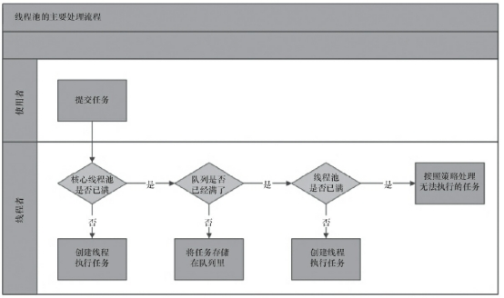
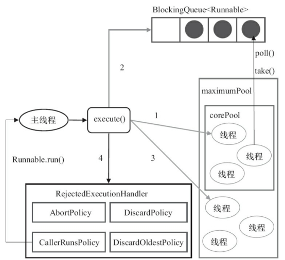
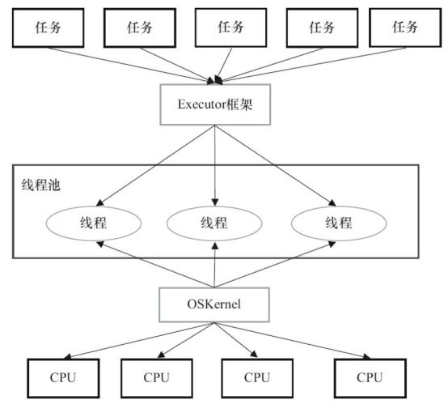
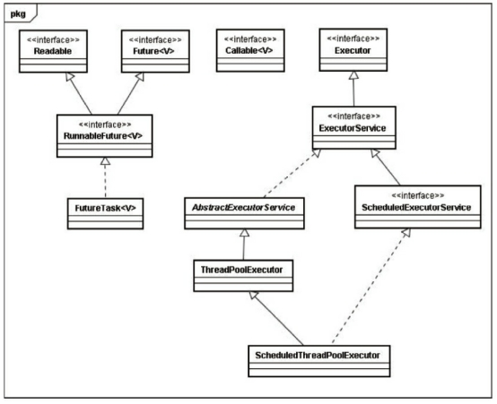

## 1、简介

线程池是一种多线程处理形式，处理过程中将任务添加到队列，然后在创建线程后自动启动这些任务。

**好处**：

1 降低资源消耗。通过重复利用已创建的线程降低线程创建和销毁造成的消耗。

2 提高响应速度。当任务到达时，任务可以不需要等到线程创建就能立即执行。

3 提高线程的可管理性。线程是稀缺资源，如果无限制地创建，不仅会消耗系统资源，还会降低系统的稳定性，使用线程池可以进行统一分配、调优和监控。

## 2、线程池的实现原理

**现线程池流程**：

1 线程池判断核心线程池里的线程是否都在执行任务。如果不是，则创建一个新的工作线程来执行任务。如果核心线程池里的线程都在执行任务，则进入下个流程。

2 线程池判断工作队列是否已经满。如果工作队列没有满，则将新提交的任务存储在这个工作队列里。如果工作队列满了，则进入下个流程。

3 线程池判断线程池的线程是否都处于工作状态。如果没有，则创建一个新的工作线程来执行任务。如果已经满了，则交给饱和策略来处理这个任务。

 

**ThreadPoolExecutor执行execute执行流程**：

 

1 如果当前运行的线程少于corePoolSize，则创建新线程来执行任务（注意，执行这一步骤需要获取全局锁）。

2 如果运行的线程等于或多于corePoolSize，则将任务加入BlockingQueue。

3 如果无法将任务加入BlockingQueue（队列已满），则创建新的线程来处理任务（注意，执行这一步骤需要获取全局锁）。

4 如果创建新线程将使当前运行的线程超出maximumPoolSize，任务将被拒绝，并调用

RejectedExecutionHandler.rejectedExecution()方法。

总结：ThreadPoolExecutor采取上述步骤的总体设计思路，是为了在执行execute()方法时，尽可能地避免获取全局锁（那将会是一个严重的可伸缩瓶颈）。在ThreadPoolExecutor完成预热之后(当前运行的线程数大于等于corePoolSize)，几乎所有的execute()方法调用都是执行步骤2，而步骤2不需要获取全局锁。

## 3、线程池的使用

```java
new ThreadPoolExecutor(corePoolSize, maximumPoolSize, keepAliveTime,
milliseconds,runnableTaskQueue, handler);
```

> 1）corePoolSize（线程池的基本大小）
>
> 2）runnableTaskQueue（任务队列）
>
> 3）maximumPoolSize（线程池最大数量）
>
> 4）ThreadFactory：用于设置创建线程的工厂，可以通过线程工厂给每个创建出来的线程设置更有意义的名字。
>
> 5）RejectedExecutionHandler（饱和策略）
>
> AbortPolicy：直接抛出异常。
>
> CallerRunsPolicy：只用调用者所在线程来运行任务。
>
> DiscardOldestPolicy：丢弃队列里最近的一个任务，并执行当前任务。
>
> DiscardPolicy：不处理，丢弃掉。
>
> 6）keepAliveTime（线程活动保持时间）
>
> 7）timeUnit（线程活动保持时间的单位）
>

### execute()和submit()

都可以向线程池提交任务.

区别：

1 execute()方法用于提交不需要返回值的任务，所以无法判断任务是否被线程池执行成功。

2 submit()方法用于提交需要返回值的任务。线程池会返回一个future类型的对象，通过这个future对象可以判断任务是否执行成功，并且可以通过future的get()方法来获取返回值，get()方法会阻塞当前线程直到任务完成，而使用get（long timeout，TimeUnit unit）方法则会阻塞当前线程一段时间后立即返回，这时候有可能任务没有执行完。

例子：

```java
1 threadsPool.execute(runnable);
2 Feture<Object> feture=executor.submit(task);
```

### shutdown shutdownNow

遍历线程池中的工作线程，然后逐个调用线程的interrupt方法来中断线程，所以无法响应中断的任务可能永远无法终止。

区别：

shutdownNow首先将线程池的状态设置成STOP，然后尝试停止所有的正在执行或暂停任务的线程，并返回等待执行任务的列表，而shutdown只是将线程池的状态设置成SHUTDOWN状态，然后中断所有没有正在执行任务的线程。

## 4、Executor框架的两级调度模型

在HotSpot VM的线程模型中，Java线程（java.lang.Thread）被一对一映射为本地操作系统线程。Java线程启动时会创建一个本地操作系统线程；当该Java线程终止时，这个操作系统线程也会被回收。操作系统会调度所有线程并将它们分配给可用的CPU。

 

## 5、Executor框架类与接口

 

## 6、Executor框架的成员

###  ThreadPoolExecutor

Executor框架最核心的类是ThreadPoolExecutor，它是线程池的实现类，主要由下列4个组件构成。

工具类Executors支持3种类型的ThreadPoolExecutor：

**FixedThreadPool**

可重用固定线程数的线程池。

**SingleThreadExecutor**

SingleThreadExecutor是使用单个worker线程的Executor。

**CachedThreadPool**

CachedThreadPool是一个会根据需要创建新线程的线程池。

###  ScheduledThreadPoolExecutor

主要用来在给定的延迟之后运行任务，或者定期执行任务。ScheduledThreadPoolExecutor的功能与Timer类似.Timer对应的是单个后台线程，而ScheduledThreadPoolExecutor可以在构造函数中指定多个对应的后台线程数。

###  FutureTask

FutureTask 3种状态：

未启动、已启动、已完成。

Future接口和实现Future接口的FutureTask类，代表异步计算的结果。

 

 ```java
    1、默认值
        * corePoolSize=1
        * queueCapacity=Integer.MAX_VALUE
        * maxPoolSize=Integer.MAX_VALUE
        * keepAliveTime=60s
        * allowCoreThreadTimeout=false
        * rejectedExecutionHandler=AbortPolicy()
 
    2、如何来设置
        * 需要根据几个值来决定
            - tasks ：每秒的任务数，假设为1000
            - taskcost：每个任务花费时间，假设为0.1s
            - responsetime：系统允许容忍的最大响应时间，假设为1s
        * 做几个计算
            - corePoolSize = 每秒需要多少个线程处理？ 
                * 一颗CPU核心同一时刻只能执行一个线程，然后操作系统切换上下文，核心开始执行另一个线程的代码，以此类推，超过cpu核心数，就会放入队列，如果队列也满了，就另起一个新的线程执行，所有推荐：corePoolSize = ((cpu核心数 * 2) + 有效磁盘数)，java可以使用Runtime.getRuntime().availableProcessors()获取cpu核心数
            - queueCapacity = (coreSizePool/taskcost)*responsetime
                * 计算可得 queueCapacity = corePoolSize/0.1*1。意思是队列里的线程可以等待1s，超过了的需要新开线程来执行
                * 切记不能设置为Integer.MAX_VALUE，这样队列会很大，线程数只会保持在corePoolSize大小，当任务陡增时，不能新开线程来执行，响应时间会随之陡增。
            - maxPoolSize = (max(tasks)- queueCapacity)/(1/taskcost)
                * 计算可得 maxPoolSize = (1000-corePoolSize)/10，即(每秒并发数-corePoolSize大小) / 10
                * （最大任务数-队列容量）/每个线程每秒处理能力 = 最大线程数
            - rejectedExecutionHandler：根据具体情况来决定，任务不重要可丢弃，任务重要则要利用一些缓冲机制来处理
            - keepAliveTime和allowCoreThreadTimeout采用默认通常能满足
 ```

 ```
    1、corePoolSize：核心线程数
        * 核心线程会一直存活，及时没有任务需要执行
        * 当线程数小于核心线程数时，即使有线程空闲，线程池也会优先创建新线程处理
        * 设置allowCoreThreadTimeout=true（默认false）时，核心线程会超时关闭
 
    2、queueCapacity：任务队列容量（阻塞队列）
        * 当核心线程数达到最大时，新任务会放在队列中排队等待执行
 
    3、maxPoolSize：最大线程数
        * 当线程数>=corePoolSize，且任务队列已满时。线程池会创建新线程来处理任务
        * 当线程数=maxPoolSize，且任务队列已满时，线程池会拒绝处理任务而抛出异常
 
    4、 keepAliveTime：线程空闲时间
        * 当线程空闲时间达到keepAliveTime时，线程会退出，直到线程数量=corePoolSize
        * 如果allowCoreThreadTimeout=true，则会直到线程数量=0
 
    5、allowCoreThreadTimeout：允许核心线程超时
    6、rejectedExecutionHandler：任务拒绝处理器
        * 两种情况会拒绝处理任务：
            - 当线程数已经达到maxPoolSize，切队列已满，会拒绝新任务
            - 当线程池被调用shutdown()后，会等待线程池里的任务执行完毕，再shutdown。如果在调用shutdown()和线程池真正shutdown之间提交任务，会拒绝新任务
        * 线程池会调用rejectedExecutionHandler来处理这个任务。如果没有设置默认是AbortPolicy，会抛出异常
        * ThreadPoolExecutor类有几个内部实现类来处理这类情况：
            - AbortPolicy 丢弃任务，抛运行时异常
            - CallerRunsPolicy 执行任务
            - DiscardPolicy 忽视，什么都不会发生
            - DiscardOldestPolicy 从队列中踢出最先进入队列（最后一个执行）的任务
        * 实现RejectedExecutionHandler接口，可自定义处理器
 ```

## 7、线程池合理设置最大线程数和核心线程数方式

> 线程池大小 = （（线程 IO time + 线程 CPU time ）/线程 CPU time ） CPU数目 

