## 1 volatile简介

volatile是轻量级的synchronized，它在多处理器开发中保证了共享变量的“可见性”。可见性的意思是当一个线程修改一个共享变量时，另外一个线程能读到这个修改的值。volatile执行成本比synchronized底，因为它不会引起线程上下文的切换和调度。

如果一个字段被声明成volatile，Java线程内存模型确保所有线程看到这个变量的值是一致

特性：

1 可见性

2 不保证原子性

3 有序性(禁止重排序)

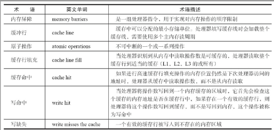 

cpu术语定义

有volatile变量修饰的共享变量进行写操作的时候会多出第二行汇编代码

0x01a3de1d: movb $0×0,0×1104800(%esi);0x01a3de24: lock addl $0×0,(%esp);

Lock前缀的指令在多核处理器下会引发了两件事情：

1）将当前处理器缓存行的数据写回到系统内存。

2）这个写回内存的操作会使在其他CPU里缓存了该内存地址的数据无效。

为了提高处理速度，处理器不直接和内存进行通信，而是先将系统内存的数据读到内部缓存（L1，L2或其他）后再进行操作，但操作完不知道何时会写到内存。如果对声明了volatile的变量进行写操作，JVM就会向处理器发送一条Lock前缀的指令，将这个变量所在缓存行的数据写回到系统内存。

在多处理器下，为了保证各个处理器的缓存是一致的，就会实现缓存一致性协议，每个处理器通过嗅探在总线上传播的数据来检查自己缓存的值是不是过期了，当处理器发现自己缓存行对应的内存地址被修改，就会将当前处理器的缓存行设置成无效状态，当处理器对这个数据进行修改操作的时候，会重新从系统内存中把数据读到处理器缓存里。

volatile的两条实现原则：

1）Lock前缀指令会引起处理器缓存回写到内存。

2）一个处理器的缓存回写到内存会导致其他处理器的缓存无效。

对volatile变量的单个读/写，看成是使用同一个锁对这些单个读/写操作做了同步。

事例：

```java
class VolatileFeaturesExample {
    volatile long vl = 0L; //使用volatile声明64位的long型变量
    public void set(long l) {
        vl = l; //单个volatile变量的写
    }
    public void getAndIncrement() {
        vl++; //复合（多个）volatile变量的读/写
    }
    public long get() {
        return vl; //单个volatile变量的读
    }
}
```

程序语义等价：

```java
class VolatileFeaturesExample1 {
    long vl = 0L; // 64位的long型普通变量
    public synchronized void set(long l) {//对单个的普通变量的写用同一个锁同步
        vl = l;
    }
    public void getAndIncrement() { //普通方法调用
        long temp = get(); //调用已同步的读方法
        temp += 1L; //普通写操作
        set(temp); //调用已同步的写方法
    }
    public synchronized long get() { //对单个的普通变量的读用同一个锁同步
        return vl;
    }
}
```

锁的happens-before规则保证释放锁和获取锁的两个线程之间的内存可见性，这意味着对一个volatile变量的读，总是能看到（任意线程）对这个volatile变量最后的写入。

锁的语义决定了临界区代码的执行具有原子性。

volatile变量特性：

可见性。对一个volatile变量的读，总是能看到（任意线程）对这个volatile变量最后的写入。

原子性：对任意单个volatile变量的读/写具有原子性，但类似于volatile++这种复合操作不具有原子性。

 

## 2 volatile写-读的内存语义

当写一个volatile变量时，JMM会把该线程对应的本地内存中的共享变量值刷新到主内存。

当读一个volatile变量时，JMM会把该线程对应的本地内存置为无效。线程接下来将从主内存中读取共享变量。

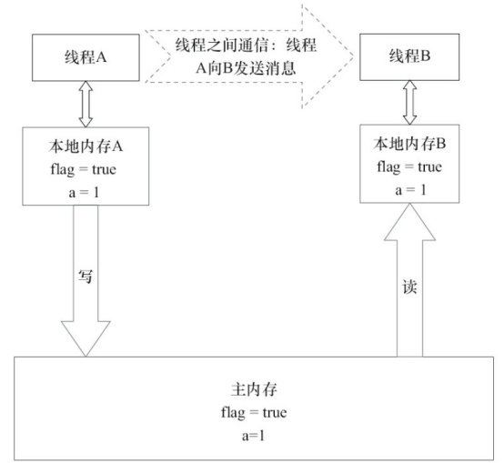 

共享变量的状态示意图

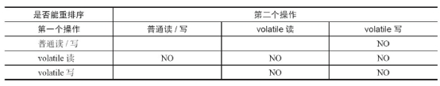 

volatile重排序规则表

​	当第二个操作是volatile写时，不管第一个操作是什么，都不能重排序。这个规则确保volatile写之前的操作不会被编译器重排序到volatile写之后。

​	当第一个操作是volatile读时，不管第二个操作是什么，都不能重排序。这个规则确保volatile读之后的操作不会被编译器重排序到volatile读之前。

当第一个操作是volatile写，第二个操作是volatile读时，不能重排序。

 

为了实现volatile的内存语义，编译器在生成字节码时，会在指令序列中插入内存屏障来禁止特定类型的处理器重排序。

基于保守策略的JMM内存屏障插入策略：

在每个volatile写操作的前面插入一个StoreStore屏障。

在每个volatile写操作的后面插入一个StoreLoad屏障。

在每个volatile读操作的后面插入一个LoadLoad屏障。

在每个volatile读操作的后面插入一个LoadStore屏障。

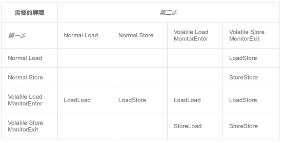 

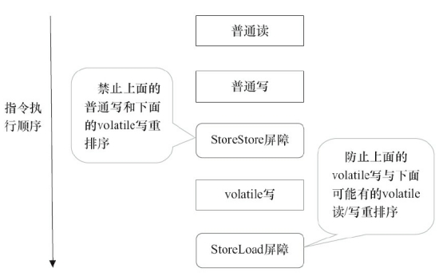 

指令序列示意图

StoreStore屏障可以保证在volatile写之前，其前面的所有普通写操作已经对任意处理器可见了。这是因为StoreStore屏障将保障上面所有的普通写在volatile写之前刷新到主内存。

StoreLoad屏障。此屏障的作用是避免volatile写与后面可能有的volatile读/写操作重排序

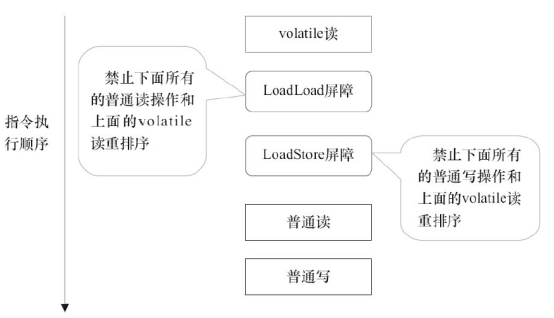 

LoadLoad屏障用来禁止处理器把上面的volatile读与下面的普通读重排序。

LoadStore屏障用来禁止处理器把上面的volatile读与下面的普通写重排序。

```java
class VolatileBarrierExample {
    int          a;
    volatile int v1 = 1;
    volatile int v2 = 2;
    void readAndWrite() {
        int i = v1; //第一个volatile读
        int j = v2; // 第二个volatile读
        a = i + j; //普通写
        v1 = i + 1; // 第一个volatile写
        v2 = j * 2; //第二个 volatile写
    }
    //…                 //其他方法
}
```

字节码解析：

```
  int a;
    descriptor: I
    flags:

  volatile int v1;
    descriptor: I
    flags: ACC_VOLATILE

  volatile int v2;
    descriptor: I
    flags: ACC_VOLATILE

```


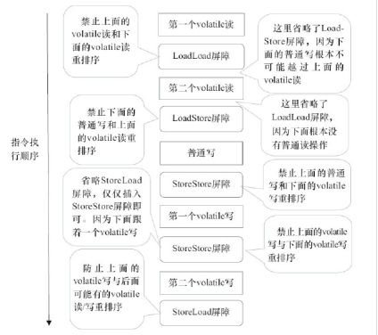 

注意，最后的StoreLoad屏障不能省略。因为第二个volatile写之后，方法立即return。此时编译器可能无法准确断定后面是否会有volatile读或写，为了安全起见，编译器通常会在这里插

入一个StoreLoad屏障。

X86处理器可以优化成：

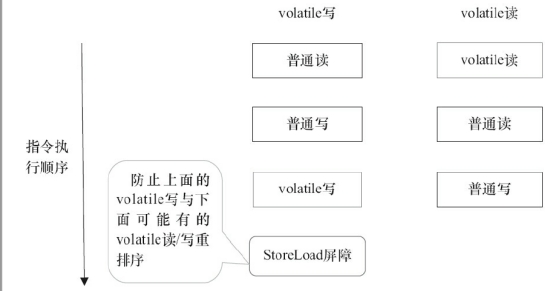 

## 3 双重检查锁定

```java
public class DoubleCheckedLocking { //1
 
    private static Instance instance; //2
 
 
    public static Instance getInstance() { //3
 
        if (instance == null) { //4:第一次检查
 
            synchronized (DoubleCheckedLocking.class) { //5:加锁
 
                if (instance == null) //6:第二次检查
 
                    instance = new Instance(); //7:问题的根源出在这里
 
            } //8
 
        } //9
 
        return instance; //10
 
    } //11
 
 
    static class Instance {
 
    }
 
}
```

在4操作过后再进行5加锁操作，这样可以降低synchronized 带来的性能消耗，然后进行6第二次检查操作，最后再进行7实例化单例对象。

双重检查锁定看起来似乎很完美，但这是一个错误的优化！在线程执行到第4行，代码读

取到instance不为null时，instance引用的对象有可能还没有完成初始化。

分析原因：

memory = allocate(); // 1：分配对象的内存空间

ctorInstance(memory); // 2：初始化对象

instance = memory; // 3：设置instance指向刚分配的内存地址

根据《The Java Language Specification,Java SE 7 Edition》（后文简称为Java语言规范），所有线程在执行Java程序时必须要遵守intra-thread semantics。intra-thread semantics保证重排序不会改变单线程内的程序执行结果。换句话说，intra-thread semantics允许那些在单线程内，不会改变单线程程序执行结果的重排序。上面3行伪代码的2和3之间虽然被重排序了，但这个重排序并不会违反intra-thread semantics。这个重排序在没有改变单线程程序执行结果的前提下，可以提高程序的执行性能。

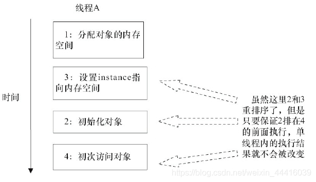

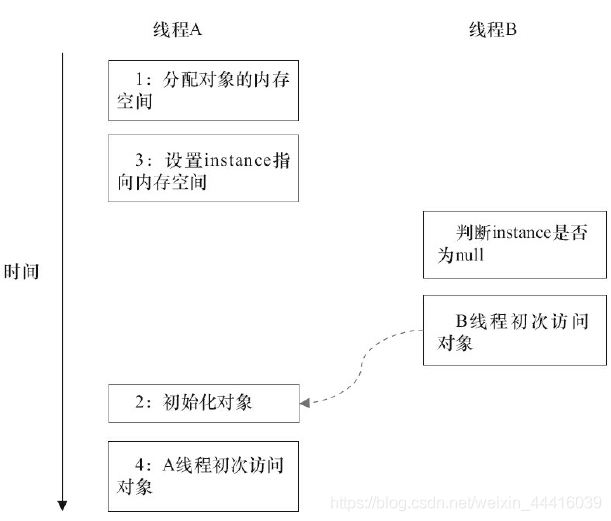

针对上面情况Java提供了一个解决方案，就是通过volatile防止jvm重排序

```java
public class SafeDoubleCheckedLocking {
    private volatile static Instance instance;
 
    public static Instance getInstance() {
        if (instance == null) {
            synchronized (SafeDoubleCheckedLocking.class) {
                if (instance == null)
                    instance = new Instance();//instance为volatile，现在没问题了
            }
        }
        return instance;
    }
 
    static class Instance {
    }
}
```

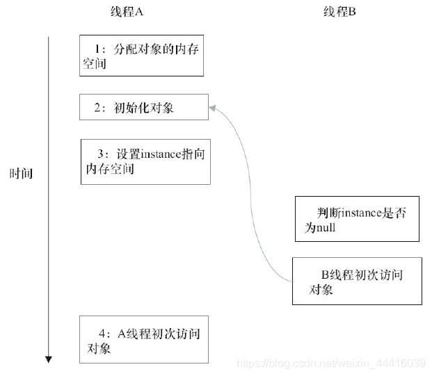

## 4 基于类初始化的解决方案

JVM在类的初始化阶段（即在Class被加载后，且被线程使用之前），会执行类的初始化。在执行类的初始化期间，JVM会去获取一个锁。这个锁可以同步多个线程对同一个类的初始化。

```java
public class InstanceFactory {
 
    private static class InstanceHolder {
 
        public static Instance instance = new Instance();
 
    }
 
 
    public static Instance getInstance() {
 
        return InstanceHolder.instance; //这里将导致InstanceHolder类被初始化
 
    }
 
 
    static class Instance {
 
    }
 
}
```

