# 一、基本算法

- 1)插入排序(直接插入排序、希尔排序)
- 2)交换排序(冒泡排序、快速排序)
- 3)选择排序(直接选择排序、堆排序)
- 4)归并排序
- 5)分配排序(基数排序)

分析：

- 所需辅助空间最多：归并排序
- 所需辅助空间最少：堆排序
- 平均速度最快：快速排序
- 不稳定：快速排序，希尔排序，堆排序。


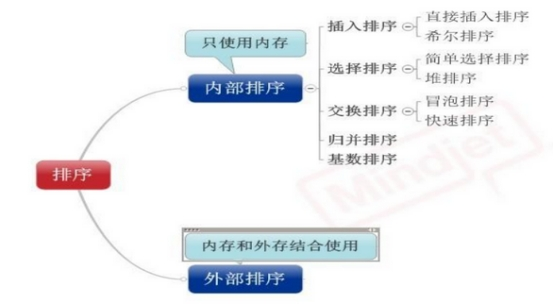

## 1.1 直接插入排序

基本思想

在要排序的一组数中，假设前面(n-1)[n=2]个数已经是排好顺序的,现在要把第n个数插到前面的有序数中,使得这n个数也是排好顺序的。如此反复循环,直到全部排好顺序。

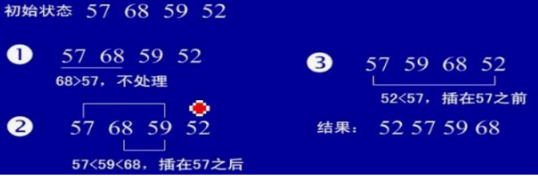

```
public static int[] insertSort() {
       int[] a = new int[]{57, 68, 59, 52};
        // 算法实际次数
        int count = 0;
        for (int i = 1; i < a.length; i++) {
            int j = i - 1;
            int temp = a[i];
            if (a[j] < temp) {
                count++;
            }
            for (; j >= 0 && a[j] > temp; j--) {
                a[j + 1] = a[j];
                count++;
                System.out.println(Arrays.toString(a));
            }
            a[j + 1] = temp;
            System.out.println(Arrays.toString(a));
        }
        System.out.println(a.length + "---" + count);
        return a;
    }
```

打印：

```
[57, 68, 59, 52]
[57, 68, 68, 52]
[57, 59, 68, 52]
[57, 59, 68, 68]
[57, 59, 59, 68]
[57, 57, 59, 68]
[52, 57, 59, 68]
4---5
```

过程：

```
第一次：
57 68  一次
57 68 59 =》57 59 68 一次
57 59 68 52 =》57 59 52 68=》57 52 59 68=》52 57 59 68 三次
```

所以实际算法次数5次

## 1.2 希尔排序(最小增量排序)

**基本思想**

算法先将要排序的一组数按某个增量d(n/2，n为要排序数的个数)分成若干组,每组中记录的下标相差d.对每组中全部元素进行直接插入排序,然后再用一个较小的增量(d/2)对它进行分组,在每组中再进行直接插入排序。当增量减到1时,进行直接插入排序后,排序完成。

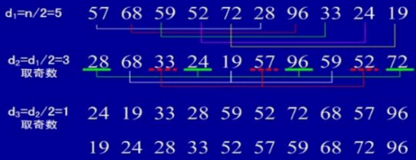

实例

方式一：

```
public class ShellSortTest {
    public static int[] shellSort(int[] a) {
        double d1 = a.length;
        while (true) {
            d1 = Math.ceil(d1 / 2);
            int d = (int) d1;
            for (int i = d; i < a.length; i = i + 1) {
                int j = i - d;
                int temp = a[i];
                for (; j >= 0 && a[j] > temp; j = j - d) {
                    a[j + d] = a[j];
                }
                a[j + d] = temp;
            }
            if (d == 1) {
                break;
            }
        }
        return a;
    }

    public static void main(String[] args) {
        System.out.println(Arrays.toString(shellSort(new int[]{57, 68, 59, 52, 72, 28, 96, 33, 24, 19})));
    }
}
```

方式二：方式一的简写，跨度d没有向上的四舍五入，算法复杂都一样

```
    public static int[] shellSort2(int[] a) {
        for (int d = a.length / 2; d>0; d /= 2) {
            for (int i = d; i < a.length; i = i + 1 ) {
                int j = i - d;
                int temp = a[i];
                for (; j >= 0 && a[j] > temp; j = j - d) {
                    a[j + d] = a[j];
                }
                a[j + d] = temp;
            }
        }
        return a;
    }
```

## 1.3 简单选择排序

基本思想

在要排序的一组数中,选出最小的一个数与第一个位置的数交换；然后在剩下的数当中再找最小的与第二个位置的数交换,如此循环到倒数第二个数和最后一个数比较为止。

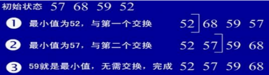

实例

```
public class SelectSortTest {
    public static int[] selectSort(int[] a) {
        int position = 0;
        for (int i = 0; i < a.length; i++) {
            position = i;
            int temp = a[i];
            for (int j = i + 1; j < a.length; j++) {
                if (a[j] < a[i]) {
                    temp = a[j];
                    position = j;
                }
            }
            a[position] = a[i];
            a[i] = temp;
        }
        return a;
    }

    public static void main(String[] args) {
        System.out.println(Arrays.toString(selectSort(new int[]{57, 68, 59, 52})));
    }
}
```

## 1.4 堆排序

基本思想

堆排序是一种树形选择排序,是对直接选择排序的有效改进。

堆的定义如下:具有n个元素的序列(h1,h2,.,hn),当且仅当满足(hi>-h2i,hi>=2i+1)或(hi<=h2i,hi<=2i+1) (i=1,2,...n/2)时称之为堆。在这里只讨论满足前者条件的堆。由堆的定义可以看出,堆顶元素(即第一个元素)必为最大项(大顶堆)。完全二叉树可以很直观地表示堆的结构。堆顶为根,其它为左子树、右子树。初始时把要排序的数的序列看作是棵顺序存储的二叉树,调整它们的存储序,使之成为一个堆,这时堆的根节点的数最大。然后将根节点与堆的最后一个节点交换。然后对前面(n-1)个数重新调整使之成为堆。依此类推,直到只有两个节点的堆,并对它们作交换,最后得到有n个节点的有序序列。从算法描述来看,堆排序需要两个过程,一是建立堆,二是堆顶与堆的最后一个元素交换位置。所以堆排序有两个函数组成。一是建堆的渗透函数,二是反复调用渗透函数实现排序的函数。

实例

初始序列： 46,79,56,38,40,84

建堆

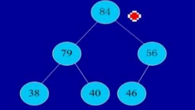

交换,从堆中踢出最大数

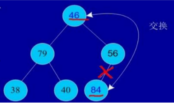

剩余结点再建堆,再交换踢出最大数

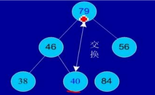

依次类推：最后堆中剩余的最后两个结点交换,踢出一个,排序完成。

```
public class HeapSortTest {
    private static void buildMaxHeap(int[] array, int lastIndex) {
        for (int i = (lastIndex - 1) / 2; i >= 0; i--) {
            int k = i;
            while (2 * k + 1<= lastIndex) {
                int bigIndex = 2 * k + 1;
                if (bigIndex < lastIndex) {
                    if (array[bigIndex] < array[bigIndex + 1]) {
                        bigIndex++;
                    }
                }
                if (array[k] < array[bigIndex]) {
                    swap(array, k, bigIndex);
                    k = bigIndex;
                } else {
                    break;
                }
            }
        }
    }

    /**
     * 堆排序
     *
     * @return
     */
    public static int[] heapSort(int[] array) {
        int arrayLength = array.length;
        for (int i = 0; i < array.length; i++) {
            buildMaxHeap(array, arrayLength-1-i);
            swap(array, 0,arrayLength-1-i);
        }
        return array;
    }

    private static void swap(int[] array, int i, int j) {
        int temp = array[i];
        array[i] = array[j];
        array[j] = temp;
    }
    public static void main(String[] args) {
        System.out.println(Arrays.toString(heapSort(new int[]{46, 79, 56, 38, 40, 84})));
    }
}
```

精简：

```
    public static int[] heapSort2(int[] array) {
        int arrayLength = array.length;
        for (int i = 0; i < array.length; i++) {
            int lastIndex=arrayLength - 1 - i;
            for (int j = lastIndex / 2; j >= 0; j--) {
                int bigIndex=2*j+1;
                if(bigIndex<=lastIndex){
                    if(bigIndex<lastIndex&&array[bigIndex]<array[bigIndex+1]){
                        bigIndex++;
                    }
                    if(array[j]<array[bigIndex]){
                        swap(array,j,bigIndex);
                    }
                }
            }
            swap(array, 0, lastIndex);
        }
        return array;
    }
```

## 1.5 冒泡排序

基本思想

在要排序的一组数中,对当前还未排好序的范围内的全部数,自上而下对相邻的两个数依次进行比较和调整,让较大的数往下沉,较小的往上冒。即:每当两相邻的
数比较后发现它们的排序与排序要求相反时,就将它们互换。

实例

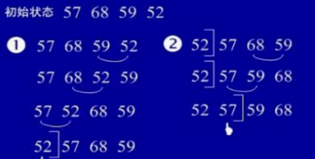

```
    public static int[] bubbleSort() {
        int a[] ={57, 68, 59, 52};
        for (int i = 1; i < a.length; i++) {
            for (int j = 0; j < a.length - i; j++) {
                if (a[j] > a[j + 1]) {
                    int temp = a[j];
                    a[j] = a[j + 1];
                    a[j + 1] = temp;
                }
            }
        }
        return a;
    }
```

## 1.6 快速排序

基本思想

选择一个基准元素,通常选择第一个元素或者最后一个元素.通过一趟扫描,将待排序列分成两部分,一部分比基准元素小,一部分大于等于基准元素,此时基准元素在其
排好序后的正确位置,然后再用同样的方法递归地排序划分的两部分。

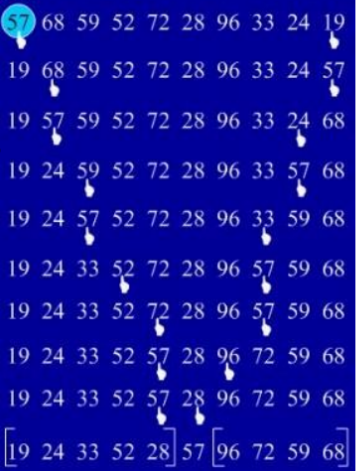

实例：

```
public class QuictSortTest {
    private static int getMiddle(int[] array, int low, int high) {
        int temp = array[low];
        while (low < high) {
            // 找到大于temp的左边界
            while (low < high && array[high] >= temp) {
                high--;
            }
            // 将小于temp的放到low的位置
            array[low] = array[high];
            // 找到小于temp的右边界
            while (low < high && array[low] <= temp) {
                low++;
            }
            //交换 大于temp的放到hign位置
            array[high] = array[low];
        }
        //将开始的temp放到最终的位置
        array[low] = temp;
        return low;
    }

    /**
     * 快速排序
     *
     * @param array
     * @param low
     * @param high
     */
    private static void _quick(int[] array, int low, int high) {
        if (low < high) {
            int middle = getMiddle(array, low, high);
            _quick(array, low, middle - 1);
            _quick(array, middle + 1, high);
        }
    }

    /**
     * 快速排序
     *
     * @return
     */
    public static int[] quictSort(int[] array) {
        if (array.length > 0) {
            _quick(array, 0, array.length - 1);
        }
        return array;
    }

    public static void main(String[] args) {
        System.out.println(Arrays.toString(quictSort(new int[]{57, 68, 59, 52, 72, 28, 96, 33, 24, 19})));
    }
}
```

## 1.7 归并排序

基本排序

归并(Merge)排序法是将两个(或两个以上)有序表合并成一个新的有序表,即把待排序序列分为若干个子序列,每个子序列是有序的。然后再把有序子序列合并
为整体有序序列。

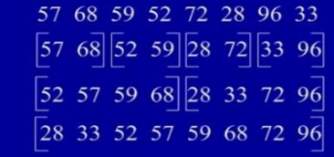

实例:

```java
public class MergeSortTest {
    public static int[] mergeSort(int[] array) {
        sort(array, 0, array.length - 1);
        return array;
    }

    private static void merge(int[] array, int left, int center, int right) {
        int[] tempArray = new int[array.length];
        int middle = center + 1;
        int third = left;
        int temp = left;
        while (left <= center && middle <= right) {
            if (array[left] < array[middle]) {
                tempArray[third++] = array[left++];
            } else {
                tempArray[third++] = array[middle++];
            }
        }
        while (left <= center) {
            tempArray[third++] = array[left++];
        }
        while (middle <= right) {
            tempArray[third++] = array[middle++];
        }
        while (temp <= right) {
            array[temp] = tempArray[temp++];
        }
    }

    private static void sort(int[] array, int left, int right) {
        if (left < right) {
            int center = (left + right) / 2;
            sort(array, left, center);
            sort(array, center + 1, right);
            merge(array, left, center, right);
        }
    }

    public static void main(String[] args) {
        System.out.println(Arrays.toString(mergeSort(new int[]{57, 68, 59, 52, 72, 28, 96, 33})));
    }
}
```

## 1.8 基数排序

基本思想

将所有待比较数值(正整数)统一为同样的数位长度,数位较短的数前面补零。然后,从最低位开始,依次进行一次排序。这样从最低位排序一直到最高位排序完成
以后.数列就变成一个有序序列。

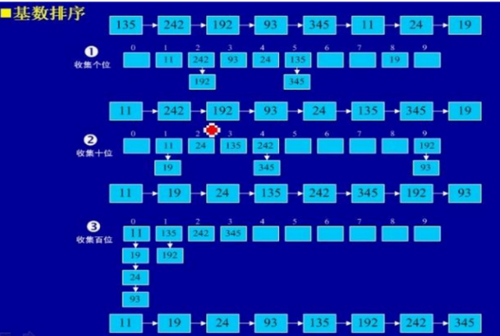

实例：

```java
public class RadixSortTest {
    public static int[] radixSort(int[] array) {
        List<List<Integer>> queue = new ArrayList<List<Integer>>();
        for (int i = 0; i < 10; i++) {
            queue.add(new ArrayList<>());
        }
        int max = 0;
        for (int arr : array) {
            if (arr > max) {
                max = arr;
            }
            int time = max / 10;
            for (int i = 0; i < time; i++) {
                for (int j = 0; j < array.length; j++) {
                    int x = array[j] % (int) Math.pow(10, i + 1) / (int) Math.pow(10, i);
                    List<Integer> list = queue.get(x);
                    list.add(array[j]);
                    queue.set(x, list);
                }
                int count = 0;
                for (int k = 0; k < 10; k++) {
                    while (queue.get(k).size() > 0) {
                        array[count++] = queue.get(k).get(0);
                        queue.get(k).remove(0);
                    }
                }
            }

        }
        return array;
    }

    public static void main(String[] args) {
        System.out.println(Arrays.toString(radixSort(new int[]{49, 38, 65, 97, 76, 13, 27, 49, 78, 34, 12, 64, 5, 4, 62, 99, 98, 54, 101, 56, 17, 18, 23, 34, 15, 35, 25, 53, 51})));
    }
}
```


源码练习：

https://github.com/leellun/javasvc-learn/tree/main/svc-datastruct/src/com/newland/algorithm/basic