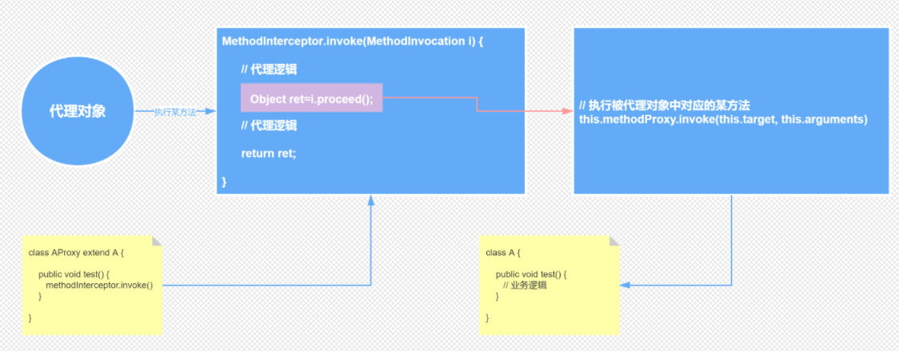

## 1 Spring Bean 生命周期

Spring Bean的生命周期指的是Bean从创建到初始化再到销毁的过程，这个过程由IOC容器管理。 

Bean的初始化和销毁 在整个生命周期过程中，我们可以自定义Bean的初始化和销毁钩子函数，当Bean的生命周期到达相应的阶段的时候，Spring会调用我们自定义的Bean的初始化和销毁方法。自定义Bean初始化和销毁方法有多种方式 。


1. 实例化：实例化一个 bean 对象；

2. 属性赋值：为 bean 设置相关属性和依赖；

3. 检查Aware并设置相关依赖

4. BeanPostProcessor前置处理

5. 检查是否是InitializingBean的子类来决定是否调用afterPropertiesSet方法 

6. 初始化：init-method

   方式1：通过@Bean指定init-method和destroy-method；

   方式2：通过让Bean实现InitializingBean（定义初始化逻辑），DisposableBean（定义销毁逻辑）;

   方式3：可以使用JSR250； @PostConstruct：在bean创建完成并且属性赋值完成；来执行初始化方法 @PreDestroy：在容器销毁bean之前通知我们进行清理工作

7. 初始化后续操作：BeanPostProcessor后置处理。该阶段结束，才能被用户使用；

8. 注册必要的Destruction相关回调接口 

9. 执行DisposableBean的接口

10. 销毁：真正销毁 bean 时再执行相应的方法。

Bean创建过程：

AbstractAutowireCapableBeanFactory 

```
protected Object doCreateBean(String beanName, RootBeanDefinition mbd, @Nullable Object[] args)
			throws BeanCreationException {

		//1 实例化bean
		BeanWrapper instanceWrapper = null;
		//如果当前创建bean是单例
		if (mbd.isSingleton()) {
			instanceWrapper = this.factoryBeanInstanceCache.remove(beanName);
		}
		//如果当前bean是单例，并且之前并没有创建bean
		if (instanceWrapper == null) {
			instanceWrapper = createBeanInstance(beanName, mbd, args);
		}

		// Initialize the bean instance.
		Object exposedObject = bean;
		try {
			//2 属性赋值
			populateBean(beanName, mbd, instanceWrapper);
			//3 初始化
			exposedObject = initializeBean(beanName, exposedObject, mbd);
		}
		catch (Throwable ex) {
					}
		//4 销毁-注册回调接口
		try {
			registerDisposableBeanIfNecessary(beanName, bean, mbd);
		}
		catch (BeanDefinitionValidationException ex) {
		}

		return exposedObject;
	}
```


后续源码分析........

spring阶段总结：

实例化、属性赋值、初始化、销毁这 4 个大阶段 

## 2 Spring AOP工作流程




