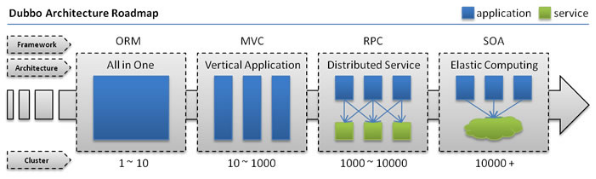
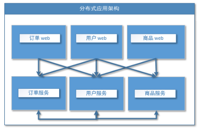
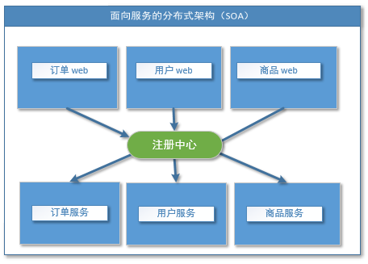
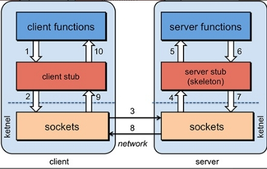
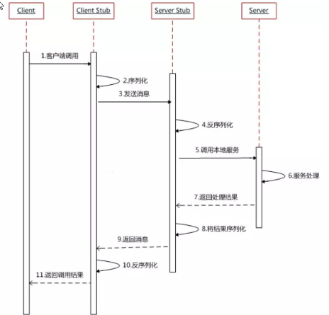
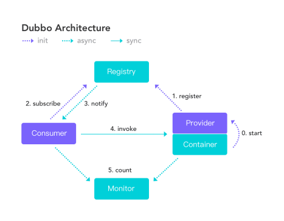

## 1 基本介绍

[简书](https://www.jianshu.com/p/ee700dc6fd9b)

用于提高业务复用及整合的**分布式服务框架(RPC)**是关键。

发展演变





#### *流动计算架构*



## RPC

RPC【Remote Procedure Call】是指远程过程调用，是一种进程间通信方式，他是一种技术的思想，而不是规范。它允许程序调用另一个地址空间（通常是共享网络的另一台机器上）的过程或函数，而不用程序员显式编码这个远程调用的细节。即程序员无论是调用本地的还是远程的函数，本质上编写的调用代码基本相同。

#### *RPC基本原理*

 



## 2、dubbo核心概念

### 2.1）、简介

Apache Dubbo (incubating) |ˈdʌbəʊ| 是一款高性能、轻量级的开源Java RPC框架，它提供了三大核心能力：面向接口的远程方法调用，智能容错和负载均衡，以及服务自动注册和发现。

## 2.2）基本概念



**服务提供者（Provider）**：暴露服务的服务提供方，服务提供者在启动时，向注册中心注册自己提供的服务。

**服务消费者（Consumer）**: 调用远程服务的服务消费方，服务消费者在启动时，向注册中心订阅自己所需的服务，服务消费者，从提供者地址列表中，基于软负载均衡算法，选一台提供者进行调用，如果调用失败，再选另一台调用。

**注册中心（Registry）**：注册中心返回服务提供者地址列表给消费者，如果有变更，注册中心将基于长连接推送变更数据给消费者

**监控中心（Monitor）**：服务消费者和提供者，在内存中累计调用次数和调用时间，定时每分钟发送一次统计数据到监控中心


## 服务启动

[incubator-dubbo-ops](https://github.com/apache/incubator-dubbo-ops )官网资源下载

dubbo-admin：用于查看服务信息及设置路由等等

dubbo-monitor-simple：监控中心

# Spring Dubbo集成

## gmall-interface接口模块

```java
public interface UserService {
	/**
	 * 按照用户id返回所有的收货地址
	 * @param userId
	 * @return
	 */
	public List<UserAddress> getUserAddressList(String userId);
}
```

## user-service-provider提供模块

```xml
<project xmlns="http://maven.apache.org/POM/4.0.0" xmlns:xsi="http://www.w3.org/2001/XMLSchema-instance"
         xsi:schemaLocation="http://maven.apache.org/POM/4.0.0 http://maven.apache.org/xsd/maven-4.0.0.xsd">
    <modelVersion>4.0.0</modelVersion>
    <groupId>com.atguigu.gmall</groupId>
    <artifactId>user-service-provider</artifactId>
    <version>0.0.1-SNAPSHOT</version>
    <dependencies>
        <dependency>
            <groupId>com.atguigu.gmall</groupId>
            <artifactId>gmall-interface</artifactId>
            <version>0.0.1-SNAPSHOT</version>
        </dependency>

        <!-- https://mvnrepository.com/artifact/com.alibaba/dubbo -->
        <dependency>
            <groupId>com.alibaba</groupId>
            <artifactId>dubbo</artifactId>
            <version>2.6.9</version>
        </dependency>

        <!-- https://mvnrepository.com/artifact/org.apache.curator/curator-framework -->
        <dependency>
            <groupId>org.apache.curator</groupId>
            <artifactId>curator-framework</artifactId>
            <version>5.0.0</version>
        </dependency>

    </dependencies>
</project>
```

provider.xml配置：

```xml
<?xml version="1.0" encoding="UTF-8"?>
<beans xmlns:xsi="http://www.w3.org/2001/XMLSchema-instance"
	   xmlns:dubbo="http://dubbo.apache.org/schema/dubbo"
	   xmlns="http://www.springframework.org/schema/beans"
	   xsi:schemaLocation="http://www.springframework.org/schema/beans http://www.springframework.org/schema/beans/spring-beans-4.3.xsd
       http://dubbo.apache.org/schema/dubbo http://dubbo.apache.org/schema/dubbo/dubbo.xsd">

	<!-- 1、指定当前服务/应用的名字（同样的服务名字相同，不要和别的服务同名） -->
	<dubbo:application name="user-service-provider">
		<dubbo:parameter key="mapping-type" value="metadata"/>
	</dubbo:application>

	<dubbo:registry id="registry1" protocol="zookeeper" address="zookeeper://192.168.10.103:2181"/>

	<!-- 3、指定通信规则（通信协议？通信端口） -->
	<dubbo:protocol name="dubbo" port="20882"></dubbo:protocol>
	
	<!-- 4、暴露服务   ref：指向服务的真正的实现对象 -->
	<dubbo:service interface="com.atguigu.gmall.service.UserService" 
		ref="userServiceImpl01" timeout="1000" version="1.0.0">
		<dubbo:method name="getUserAddressList" timeout="1000"></dubbo:method>
	</dubbo:service>
	
	<!--统一设置服务提供方的规则  -->
	<dubbo:provider timeout="1000"></dubbo:provider>
	
	
	<!-- 服务的实现 -->
	<bean id="userServiceImpl01" class="com.atguigu.gmall.service.impl.UserServiceImpl"></bean>
	
	
	<dubbo:service interface="com.atguigu.gmall.service.UserService" 
		ref="userServiceImpl02" timeout="1000" version="2.0.0">
		<dubbo:method name="getUserAddressList" timeout="1000"></dubbo:method>
	</dubbo:service>
	<bean id="userServiceImpl02" class="com.atguigu.gmall.service.impl.UserServiceImpl2"></bean>
	
	<!-- 连接监控中心 -->
	<dubbo:monitor protocol="registry"></dubbo:monitor>
	
</beans>

```

服务

```java
public class UserServiceImpl implements UserService {

	public List<UserAddress> getUserAddressList(String userId) {
		System.out.println("UserServiceImpl.....old...");
		// TODO Auto-generated method stub
		UserAddress address1 = new UserAddress(1, "北京市昌平区宏福科技园综合楼3层", "1", "李老师", "010-56253825", "Y");
		UserAddress address2 = new UserAddress(2, "深圳市宝安区西部硅谷大厦B座3层（深圳分校）", "1", "王老师", "010-56253825", "N");
		/*try {
			Thread.sleep(4000);
		} catch (InterruptedException e) {
			// TODO Auto-generated catch block
			e.printStackTrace();
		}*/
		return Arrays.asList(address1,address2);
	}

}
public class UserServiceImpl2 implements UserService {

	public List<UserAddress> getUserAddressList(String userId) {
		System.out.println("UserServiceImpl.....new...");
		// TODO Auto-generated method stub
		UserAddress address1 = new UserAddress(1, "北京市昌平区宏福科技园综合楼4层", "1", "李老师", "010-56253825", "Y");
		UserAddress address2 = new UserAddress(2, "深圳市宝安区西部硅谷大厦B座4层（深圳分校）", "1", "王老师", "010-56253825", "N");
		
		return Arrays.asList(address1,address2);
	}

}
```

## order-service-consumer服务提供

```xml
<?xml version="1.0" encoding="UTF-8"?>
<beans xmlns="http://www.springframework.org/schema/beans"
	xmlns:xsi="http://www.w3.org/2001/XMLSchema-instance"
	xmlns:dubbo="http://dubbo.apache.org/schema/dubbo"
	xmlns:context="http://www.springframework.org/schema/context"
	xsi:schemaLocation="http://www.springframework.org/schema/beans http://www.springframework.org/schema/beans/spring-beans.xsd
		http://www.springframework.org/schema/context http://www.springframework.org/schema/context/spring-context-4.3.xsd
		http://dubbo.apache.org/schema/dubbo http://dubbo.apache.org/schema/dubbo/dubbo.xsd
		http://code.alibabatech.com/schema/dubbo http://code.alibabatech.com/schema/dubbo/dubbo.xsd">
	<context:component-scan base-package="com.atguigu.gmall.service.impl"></context:component-scan>


	<dubbo:application name="order-service-consumer"></dubbo:application>
	
	<dubbo:registry address="zookeeper://192.168.10.103:2181"></dubbo:registry>
	
	<!--  配置本地存根-->
	
	<!--声明需要调用的远程服务的接口；生成远程服务代理  -->
	<!-- 
		1）、精确优先 (方法级优先，接口级次之，全局配置再次之)
		2）、消费者设置优先(如果级别一样，则消费方优先，提供方次之)
	-->
	<!-- timeout="0" 默认是1000ms-->
	<!-- retries="":重试次数，不包含第一次调用，0代表不重试-->
	<!-- 幂等（设置重试次数）【查询、删除、修改】、非幂等（不能设置重试次数）【新增】 -->
	<dubbo:reference interface="com.atguigu.gmall.service.UserService"
		id="userService" timeout="5000" retries="3" version="1.0.0">
		<!-- <dubbo:method name="getUserAddressList" timeout="1000"></dubbo:method> -->
	</dubbo:reference>
		
	<!-- 配置当前消费者的统一规则：所有的服务都不检查 -->
	<dubbo:consumer check="false" timeout="5000"></dubbo:consumer>

	<dubbo:monitor protocol="registry"></dubbo:monitor>
	<!-- <dubbo:monitor address="127.0.0.1:7070"></dubbo:monitor> -->
	
</beans>

```

服务调用

```java
@Service
public class OrderServiceImpl implements OrderService {

	@Autowired
	UserService userService;
	public List<UserAddress> initOrder(String userId) {
		// TODO Auto-generated method stub
		System.out.println("用户id："+userId);
		//1、查询用户的收货地址
		List<UserAddress> addressList = userService.getUserAddressList(userId);
		for (UserAddress userAddress : addressList) {
			System.out.println(userAddress.getUserAddress());
		}
		return addressList;
	}
}
```

http://localhost:8083/orderController/getOrder?username=admin

http://localhost:8084/userCenter/getUser?username=admin

