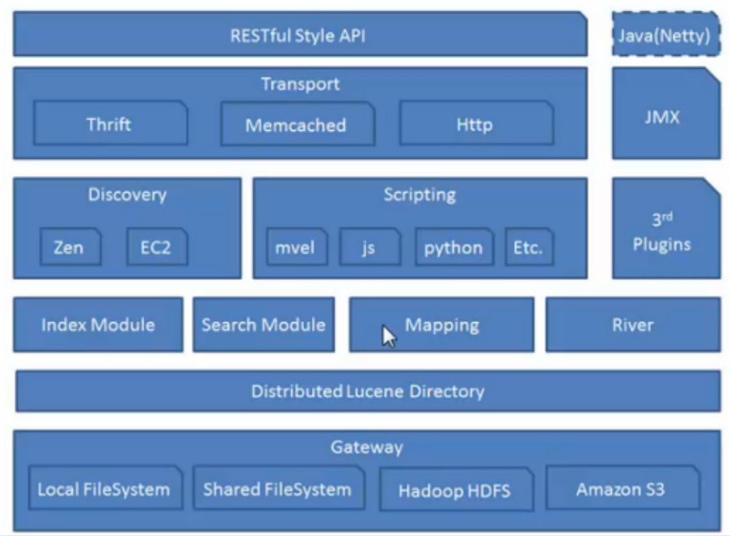
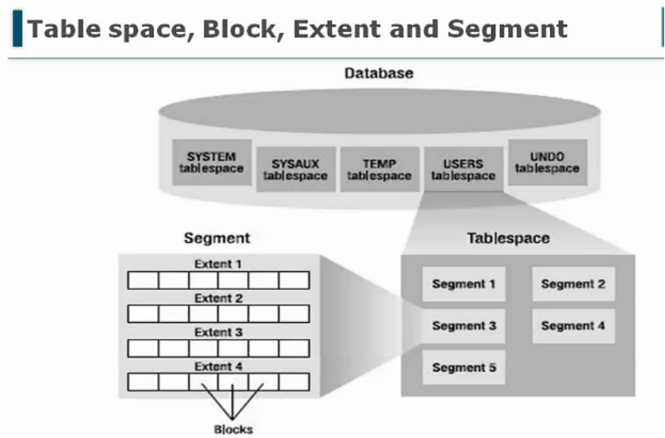
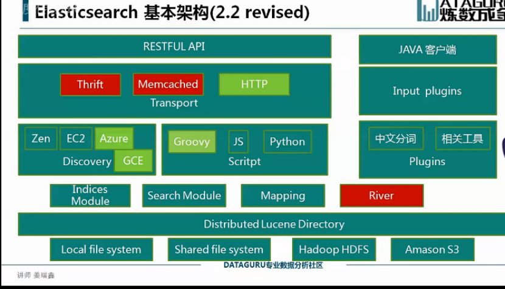
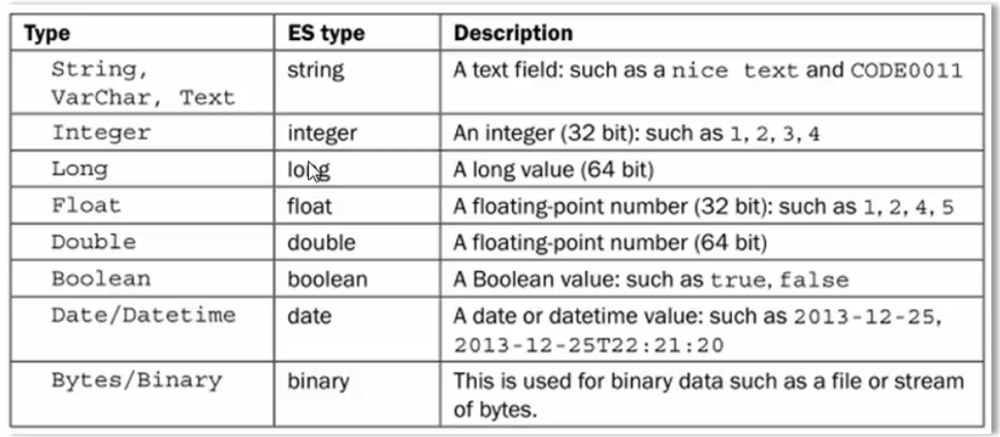
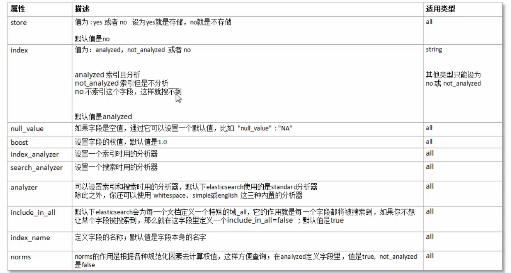
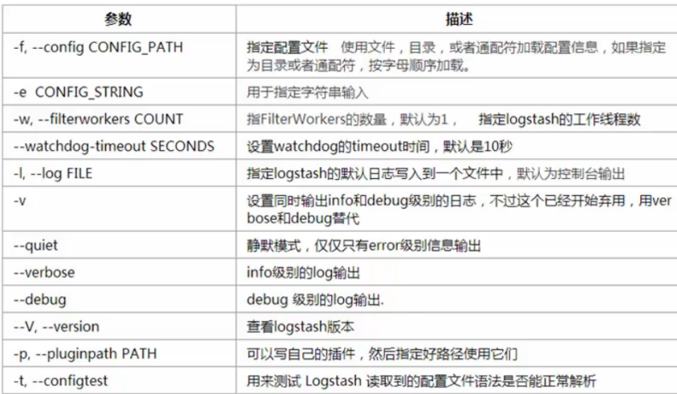

# elasticsearch

# 一、介绍

## 1.1 ES简介

Elasticsearch(以下简称ES)是使用iava开发，基于Lucene、分布式、通过Restful7方式进行交互的近实时搜索平台框架。它的特点有：分布式，零配置，自动发现，索引自动分片，索引副本机制，restful风格接口，多数据源，自动搜索负载等。

ES是ELK架构技术栈的组件之一。

ELK(ES+Logstash+Kibana)是一个免费开源的日志分析架构技术栈总称，但实际上ELK不仅仅适用于日志分析，它还可以支持其它任何数据搜索、分析和收集的场景，日志分析和收集只是更具有代表性。随着elk的发展，又有新成员Beats、elastic cloud的加入，所以就形成了Elastic Stack。.所以说，ELK是旧的称呼，Elastic Stack是新的名字。

## 1.2 ES特点

- 处理方式灵活：ES是目前最流行的准实时全文检索引擎，具有高速检索大数据的能力。
- 接口简单：采用json形式RESTFUL API接受数据并响应，无关语言。
- 性能高效：ES基于优秀的全文搜索技术Lucene,采用倒排索引，可以轻易地在百亿级别数据量下，搜索出想要的内容，并且是秒级响应。
- 功能强大：ES作为传统数据库的一个补充，提供了数据库所不不能提供的很多功能，如全文检索，同义词处理，相关度排名。

## 1.3应用场景

ES主要用于搜索。传统的数据库搜索存在以下弊端：

- 电商、社交网站数据存储往往是GB、PB级。存储上亿条数据时，涉及到的单表数据过大就必须分表，数据库磁盘占用过大就必须分库。
- 当查询一个词或者一行内容时，上亿条数据的帖子需要从标题和内容中逐行扫描，性能相当差。
- 不能分词，当我搜索一个词或者一行内容时，只能搜到指定内容的数据。

而相对的，就可以使用ES进行解决。ES具有以下功能：

- 分布式的搜索引擎搜索：互联网搜索、站内搜索。
- 全文检索，结构化检索，数据分析

对海量数据进行近实时的处理分布式：ES自动可以将海量数据分散到多台服务器上去存储和检索，经行并行查询。
近实时：es只需秒级即可查询海量数据。

## 1.4 Lucene&Solr&ESLucene

最先进、功能最强大的搜索库，直接基于lucene开发，非常复杂，api复杂。

solr：Solr是一个高性能，采用ava开发，基于Lucene的全文搜索服务器。同时对其进行了扩展，提供了比Lucene更为丰富的查询语言同时实现了可配置、可扩展并对查询性能进行了优化，并且提供了一个完善的功能管理界面，是一款非常优秀的全文搜索引擎。

ES：基于lucene，封装了许多lucene)底层功能，提供简单易用的restful api接口和许多语言的客户端。

solr和ES性能对比：

当单纯的对已有数据进行搜索，并且数据量不是很大时，Sol更快。

当实时建立索引时,Solr会产生io阻塞,查询性能较差,ES具有明显的优势。

## 1.5 倒排索引

常规的索引简历方式：文档—>关键词的映射过程（正向索引）

倒排反向建立索引：关键词—>文档的映射 把正向索引的结果重新构造成倒排索引（反向索引）

# 二、ElasticSearch安装

## 2.1 ElasticSearch目录结构

| 文件夹   | 作用                                         |
| -------- | -------------------------------------------- |
| /bin     | 运行ElasticSearch实例和管理插件的一些脚本    |
| /config  | 配置文件夹，如Elasticsearch.yml和logging.yml |
| /data    | 数据文件夹                                   |
| /lib     | ElasticSearch使用库                          |
| /logs    | 日志                                         |
| /plugins | 已经安装的插件存放位置                       |

注意：9300 端口为 Elasticsearch 集群间组件的通信端口，9200 端口为浏览器访问的 http 协议 RESTful 端口。 

## 2.2 linux安装

```
wget -c https://artifacts.elastic.co/downloads/elasticsearch/elasticsearch-8.4.0-linux-x86_64.tar.gz
tar -zxf elasticsearch-8.4.0-linux-x86_64.tar.gz
cd elasticsearch-8.4.0-linux-x86_64
bin/elasticsearch
```

## 2.3 服务配置

```
vi /etc/systemd/system/elasticsearch.service
```

```
[Unit]
Description=elasticsearch 7.16.3

[Service]
Type=forking
User=elk-admin
LimitNOFILE=65536
LimitNPROC=65536
# 后台命令启动
ExecStart=/opt/elasticsearch-7.16.3/bin/elasticsearch -d

[Install]
WantedBy=multi-user.target
```

## 2.4 用户密码配置

```
#设置密码
bin/elasticsearch-setup-passwords interactive
#重置密码
bin/elasticsearch-reset-password -u elastic
# 添加用户
 bin/elasticsearch-users useradd leellun -r superuser 
```

# 三、基础知识

Node(节点)：单个的装有ElasticSearch服务并提供故障转移和扩展的服务器。

Cluster(集群)：一个集群就是由一个或多个node组织在一起，共同作用，共同分享整个数据具有负载均衡功能的集群。

Document（文档）：一个文档是一个可被索引的基础信息单元。

Index（索引）：索引就是一个拥有几分相似特征的文档的集合。

Type（类型）：一个索引种，可以定义一种或多种类型。

Field（列）：Field是ElasticSearch的最小单元，相当于数据的某一列。

Shards（分片）：ElasticSearch将索引分成若干份，每一个部分就是一个shard。

Replicas（复制）：Replicas是索引一份或多分拷贝。

| 关系型数据库    | 非关系型数据库(ElasticSearch) |
| --------------- | ----------------------------- |
| 数据库 database | 索引Index                     |
| 表Table         | 类型Type                      |
| 数据行Row       | 文档Document                  |
| 数据列Column    | 字段Field                     |

# 四、资源操作

- GET：用来获取资源

- POST：用来新建资源(也可以用于更新资源)
- PUT：用来更新资源
- DELETE：用来删除资源

# 五、ElasticSearch架构








**Discovery**

- 负责发现在集群内的节点,以及选举新的节点。
- Elasticsearch 是-个Peer to peer 系统,节点间直接通当操作是delegated/broadcast.
- Master 节点是用来维护Global cluaster state,同时为新加入和离开的节点分配shards.
- 每次集群状态改变,节点都会知道(具体的方式取决于实际的Discovery实现)

# 六、分词插件


# 七、Mapping映射

映射：创建索引的时候，可以预先定义字段的类型以及相关属性。
作用：这样会让索引建立得更加的细致和完善！
分类：静态映射和动态映射

es类型说明：



es属性字段：



## 7.1 动态映射·

文档中碰到一个以前没见过的字段时，动态映射可以自动决定该字段的类型，并对该字段添加映射。

如何配置动态映射？

通过dynamic属性进行控制true:默认值，动态添加字段：false:忽略新字段：strict:碰到陌生字段，抛出异常。

适用范围

适用在根对象上或者object类型的任意字段上

# 八 Logstash

## 8.1 Logstash运行参数



## 8.2 数据类型 

- 布尔boolean：ssl_enable=>true 
- 字节bytes：my_bytes=>"10MiB" #10485760 bytes 
- 字符串String：name=>"Hello world“ 
- 数值Number：port=>514 
- Array：match =["datetime","UNIX","IS08601"] 
- 哈希Hash：options=>{key1=>"value1", key2=>"value2"}
- 编码解码：codec：codec=>“json"
- 密码型：my_password=>“password”
- 路径：my_path=>"/tmp/logstash 
- 注释：#

## 8.3 条件判断

=(等于)，=（不等于），<《小于)，大于)，<=（小于等于），>=（大于等于）=匹配正则)，（不匹配正则）

in(包含)，not in(不包含) and(与)，or(或)，nand非与，xor(非或)

():复合表达式，!()：对复合表达式结果取反

## 8.4 Logstash配置结构 

- inputs 就是输入
- codecs 就是解码 
- filters 就是过滤 
- outputs 输出