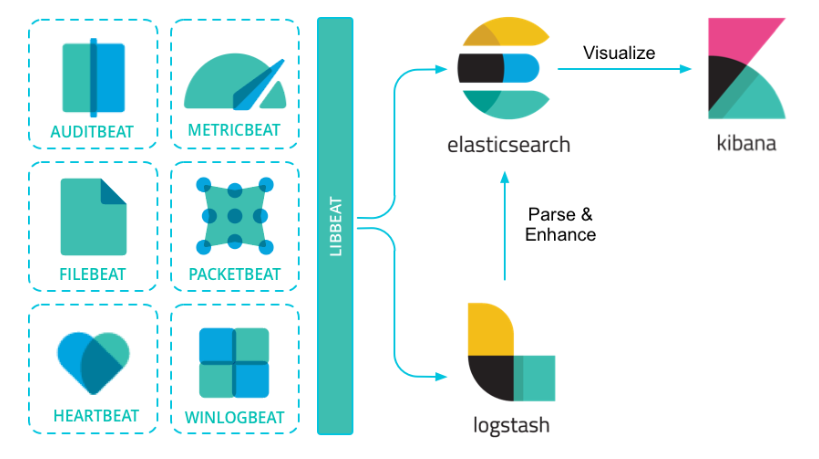

# Beats  学习教程

# 一、介绍

轻量化方式分析、解析和传输数据

Beats是开源的数据托运人，你可以将其作为代理安装在服务器上，将运营数据发送给Elasticsearch。Elastic提供Beats:

| Audit data           | [Auditbeat](https://www.elastic.co/products/beats/auditbeat) |
| -------------------- | ------------------------------------------------------------ |
| 日志文件 和 journals | [Filebeat](https://www.elastic.co/products/beats/filebeat)   |
| Cloud data           | [Functionbeat](https://www.elastic.co/products/beats/functionbeat) |
| Availability         | [Heartbeat](https://www.elastic.co/products/beats/heartbeat) |
| 度量                 | [Metricbeat](https://www.elastic.co/products/beats/metricbeat) |
| 网络流量             | [Packetbeat](https://www.elastic.co/products/beats/packetbeat) |
| Windows事件日志      | [Winlogbeat](https://www.elastic.co/products/beats/winlogbeat) |

 Beats可以直接将数据发送到Elasticsearch或通过Logstash，在那里你可以进一步处理和增强数据，然后在Kibana中可视化它。 



https://blog.csdn.net/hwjcmozw/article/details/109473925

# 二、filebeat

```
# ============================== Filebeat inputs ===============================

filebeat.inputs:

# Each - is an input. Most options can be set at the input level, so
# you can use different inputs for various configurations.
# Below are the input specific configurations.

# filestream is an input for collecting log messages from files.
- type: filestream

  # Unique ID among all inputs, an ID is required.
  id: my-filestream-id

  # true应用配置
  enabled: true

  # Paths that should be crawled and fetched. Glob based paths.
  paths:
    - /var/logs/*.log
    #- c:\programdata\elasticsearch\logs\*
output.logstash:
  # The Logstash hosts
  hosts: ["localhost:5044"]
```

## 2.1 logstash作为输出

```
input {
  beats {
    port => 5044
  }
}
output {
  elasticsearch {
    hosts => ["http://192.168.66.11:9200","http://192.168.66.21:9200","http://192.168.66.22:9200"] #这里可以配置多个
    index => "query-%{yyyyMMdd}"
  }
}
```


```
type: log #input类型为log
enable: true #表示是该log类型配置生效
paths：     #指定要监控的日志，目前按照Go语言的glob函数处理。没有对配置目录做递归处理，比如配置的如果是：
- /var/log/* /*.log  #则只会去/var/log目录的所有子目录中寻找以".log"结尾的文件，而不会寻找/var/log目录下以".log"结尾的文件。
recursive_glob.enabled: #启用全局递归模式，例如/foo/**包括/foo, /foo/*, /foo/*/*
encoding：#指定被监控的文件的编码类型，使用plain和utf-8都是可以处理中文日志的
exclude_lines: ['^DBG'] #不包含匹配正则的行
include_lines: ['^ERR', '^WARN']  #包含匹配正则的行
harvester_buffer_size: 16384 #每个harvester在获取文件时使用的缓冲区的字节大小
max_bytes: 10485760 #单个日志消息可以拥有的最大字节数。max_bytes之后的所有字节都被丢弃而不发送。默认值为10MB (10485760)
exclude_files: ['\.gz$']  #用于匹配希望Filebeat忽略的文件的正则表达式列表
ingore_older: 0 #默认为0，表示禁用，可以配置2h，2m等，注意ignore_older必须大于close_inactive的值.表示忽略超过设置值未更新的
文件或者文件从来没有被harvester收集
close_* #close_ *配置选项用于在特定标准或时间之后关闭harvester。 关闭harvester意味着关闭文件处理程序。 如果在harvester关闭
后文件被更新，则在scan_frequency过后，文件将被重新拾取。 但是，如果在harvester关闭时移动或删除文件，Filebeat将无法再次接收文件
，并且harvester未读取的任何数据都将丢失。
close_inactive  #启动选项时，如果在制定时间没有被读取，将关闭文件句柄
读取的最后一条日志定义为下一次读取的起始点，而不是基于文件的修改时间
如果关闭的文件发生变化，一个新的harverster将在scan_frequency运行后被启动
建议至少设置一个大于读取日志频率的值，配置多个prospector来实现针对不同更新速度的日志文件
使用内部时间戳机制，来反映记录日志的读取，每次读取到最后一行日志时开始倒计时使用2h 5m 来表示
close_rename #当选项启动，如果文件被重命名和移动，filebeat关闭文件的处理读取
close_removed #当选项启动，文件被删除时，filebeat关闭文件的处理读取这个选项启动后，必须启动clean_removed
close_eof #适合只写一次日志的文件，然后filebeat关闭文件的处理读取
close_timeout #当选项启动时，filebeat会给每个harvester设置预定义时间，不管这个文件是否被读取，达到设定时间后，将被关闭
close_timeout 不能等于ignore_older,会导致文件更新时，不会被读取如果output一直没有输出日志事件，这个timeout是不会被启动的，
至少要要有一个事件发送，然后haverter将被关闭
设置0 表示不启动
clean_inactived #从注册表文件中删除先前收获的文件的状态
设置必须大于ignore_older+scan_frequency，以确保在文件仍在收集时没有删除任何状态
配置选项有助于减小注册表文件的大小，特别是如果每天都生成大量的新文件
此配置选项也可用于防止在Linux上重用inode的Filebeat问题
clean_removed #启动选项后，如果文件在磁盘上找不到，将从注册表中清除filebeat
如果关闭close removed 必须关闭clean removed
scan_frequency #prospector检查指定用于收获的路径中的新文件的频率,默认10s
tail_files：#如果设置为true，Filebeat从文件尾开始监控文件新增内容，把新增的每一行文件作为一个事件依次发送，
而不是从文件开始处重新发送所有内容。
symlinks：#符号链接选项允许Filebeat除常规文件外,可以收集符号链接。收集符号链接时，即使报告了符号链接的路径，
Filebeat也会打开并读取原始文件。
backoff： #backoff选项指定Filebeat如何积极地抓取新文件进行更新。默认1s，backoff选项定义Filebeat在达到EOF之后
再次检查文件之间等待的时间。
max_backoff： #在达到EOF之后再次检查文件之前Filebeat等待的最长时间
backoff_factor： #指定backoff尝试等待时间几次，默认是2
harvester_limit：#harvester_limit选项限制一个prospector并行启动的harvester数量，直接影响文件打开数
 
tags #列表中添加标签，用过过滤，例如：tags: ["json"]
fields #可选字段，选择额外的字段进行输出可以是标量值，元组，字典等嵌套类型
默认在sub-dictionary位置
filebeat.inputs:
fields:
app_id: query_engine_12
fields_under_root #如果值为ture，那么fields存储在输出文档的顶级位置
 
multiline.pattern #必须匹配的regexp模式
multiline.negate #定义上面的模式匹配条件的动作是 否定的，默认是false
假如模式匹配条件'^b'，默认是false模式，表示讲按照模式匹配进行匹配 将不是以b开头的日志行进行合并
如果是true，表示将不以b开头的日志行进行合并
multiline.match # 指定Filebeat如何将匹配行组合成事件,在之前或者之后，取决于上面所指定的negate
multiline.max_lines #可以组合成一个事件的最大行数，超过将丢弃，默认500
multiline.timeout #定义超时时间，如果开始一个新的事件在超时时间内没有发现匹配，也将发送日志，默认是5smax_procs #设置可以同时执行的最大CPU数。默认值为系统中可用的逻辑CPU的数量。name #为该filebeat指定名字，默认为主机的hostname
```

