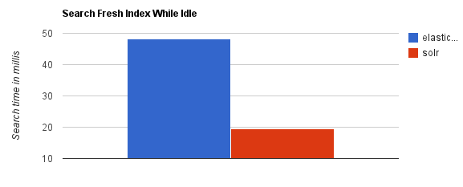
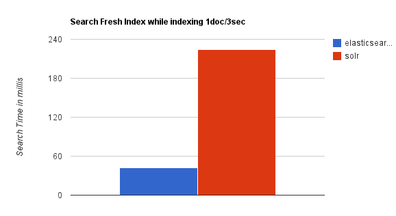
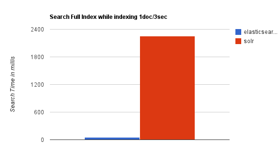
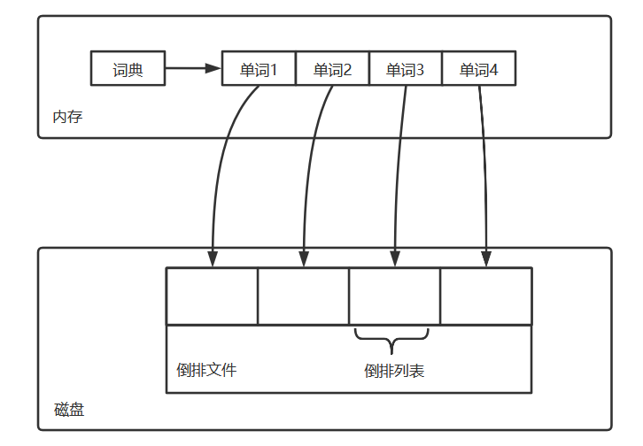
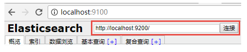
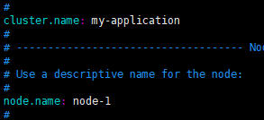
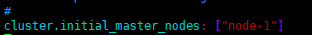
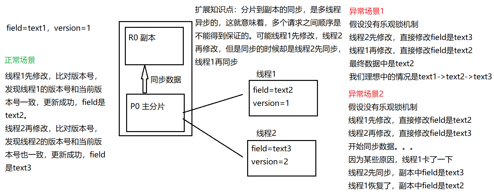
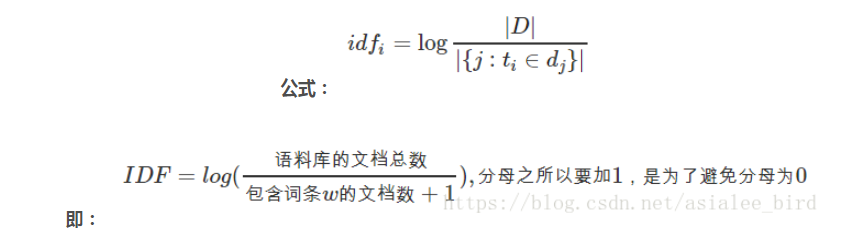
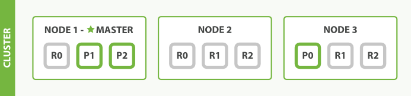

# 1. ElasticSearch简介

## 1.1 ES简介

Elasticsearch（以下简称 **ES**） 是使用java开发，基于Lucene、分布式、通过Restful方式进行交互的**近实时**搜索平台框架。它的特点有：分布式，零配置，自动发现，索引自动分片，索引副本机制，restful风格接口，多数据源，自动搜索负载等。

ES 是 **ELK** 架构技术栈的组件之一。

ELK（ES+Logstash+Kibana）是一个免费开源的日志分析架构技术栈总称，但实际上ELK不仅仅适用于日志分析，它还可以支持其它任何数据搜索、分析和收集的场景，日志分析和收集只是更具有代表性。随着elk的发展，又有新成员Beats、elastic cloud的加入，所以就形成了**Elastic Stack**。所以说，ELK是旧的称呼，Elastic Stack是新的名字。

## 1.2 ES特点

- 处理方式灵活：ES 是目前最流行的准实时全文检索引擎，具有高速检索大数据的能力。
- 接口简单：采用json形式RESTFUL API接受数据并响应，无关语言。
- 性能高效：ES 基于优秀的全文搜索技术Lucene，采用**倒排索引**，可以轻易地在百亿级别数据量下，搜索出想要的内容，并且是秒级响应。
- 功能强大：ES 作为传统数据库的一个补充，提供了数据库所不不能提供的很多功能，如全文检索，同义词处理，相关度排名。

## 1.3 应用场景

ES 主要用于 **搜索** 。传统的数据库搜索存在以下弊端

* 电商、社交网站数据存储往往是GB、PB级。存储上亿条数据时，涉及到的单表数据过大就必须分表，数据库磁盘占用过大就必须分库。
* 当查询 **JavaWeb** 时，上亿条数据的帖子需要从标题和内容中逐行扫描，性能相当差。
* 不能分词，当我搜索 **Java Web** 时，只能搜到 **Java Web** 的数据，而搜不到 **JavaWeb** 的数据。

而相对的，就可以使用 ES 进行解决。ES 具有以下功能

- 分布式的搜索引擎

搜索：互联网搜索、站内搜索

- 全文检索，结构化检索，数据分析

- 对海量数据进行近实时的处理

分布式：ES自动可以将海量数据分散到多台服务器上去存储和检索,经行并行查询。

近实时：es只需秒级即可查询海量数据。

## 1.4 Lucene&Solr&ES

Lucene：最先进、功能最强大的搜索库，直接基于lucene开发，非常复杂，api复杂。

solr：Solr是一个高性能，采用Java开发，基于Lucene的全文搜索服务器。同时对其进行了扩展，提供了比Lucene更为丰富的查询语言，同时实现了可配置、可扩展并对查询性能进行了优化，并且提供了一个完善的功能管理界面，是一款非常优秀的全文搜索引擎。

ES：基于lucene，封装了许多lucene底层功能，提供简单易用的restful api接口和许多语言的客户端。据说ES的搜索性能是Solr的50倍。起源：Shay Banon。2004年失业，陪老婆去伦敦学习厨师。失业在家帮老婆写一个菜谱搜索引擎。封装了lucene的开源项目，compass。找到工作后，做分布式高性能项目，再封装compass，写出了 ES，使得lucene支持分布式。现在是 ES 创始人兼Elastic首席执行官。

solr和 ES 性能对比。

当单纯的对已有数据进行搜索，并且数据量不是很大时，Solr更快。



当实时建立索引时, Solr会产生io阻塞，查询性能较差, ES 具有明显的优势。



随着数据量的增加，Solr的搜索效率会变得更低，而 ES 却没有明显的变化。



综上所述，Solr的架构不适合实时搜索的应用。

## 1.5 倒排索引

### 1.5.1 正排索引

在说倒排索引之前我们先说说什么是正排索引。正排索引也称为"前向索引"，它是创建倒排索引的基础。

这种组织方法在建立索引的时候结构比较简单，建立比较方便且易于维护;因为索引是基于文档建立的，若是有新的文档加入，直接为该文档建立一个新的索引块，挂接在原来索引文件的后面。若是有文档删除，则直接找到该文档号文档对应的索引信息，将其直接删除。

他适合根据文档ID来查询对应的内容。但是在查询一个keyword在哪些文档里包含的时候需对所有的文档进行扫描以确保没有遗漏，这样就使得检索时间大大延长，检索效率低下。

| 文档ID | 文档内容                        |
| ------ | ------------------------------- |
| 1      | elasticsearch是最流行的搜索引擎 |
| 2      | php是世界上最好的语言           |
| 3      | 搜索引擎是如何诞生的            |

> 优点：工作原理非常的简单。
>
> 缺点：检索效率太低，只能在一起简单的场景下使用。

### 1.5.2 倒排索引

根据字面意思可以知道他和正序索引是反的。在搜索引擎中每个文件都对应一个文件ID，文件内容被表示为一系列关键词的集合（文档要除去一些无用的词，比如’的’这些，剩下的词就是关键词，每个关键词都有自己的ID）。例如“文档1”经过分词，提取了3个关键词，每个关键词都会记录它所在在文档中的出现频率及出现位置。

那么上面的文档及内容构建的倒排索引结果会如下图。

| 单词          | 文档ID列表 |
| ------------- | ---------- |
| elasticsearch | 1          |
| 流行          | 1          |
| 搜索引擎      | 1,3        |
| php           | 2          |
| 世界          | 2          |
| 最好          | 2          |
| 语言          | 2          |
| 如何          | 3          |
| 诞生          | 3          |

**如何查询**

比如我们要查询‘搜索引擎’这个关键词在哪些文档中出现过。首先我们通过倒排索引可以查询到该关键词出现的文档位置是在1和3中;然后再通过正排索引查询到文档1和3的内容并返回结果。

### 1.5.3 组成

倒排索引主要由单词词典（Term Dictionary）和倒排列表（Posting List）及倒排文件(Inverted File)组成。

他们三者的关系如下图：



**单词词典（Term Dictionary）：**搜索引擎的通常索引单位是**单词**，单词词典是由文档集合**出现过的所有单词**构成的字符串集合，单词词典内每条索引项记载单词本身的一些信息以及指向“倒排列表”的指针。

**倒排列表(PostingList)：**倒排列表记载了出**现过某个单词的所有文档的文档列表及单词在该文档中出现的位置信息及频率**，每条记录称为一个**倒排项**(Posting)。根据倒排列表，即可获知哪些文档包含某个单词。

**倒排文件(Inverted File)：**所有单词的倒排列表往往顺序地存储在磁盘的某个文件里，这个文件即被称之为倒排文件，**倒排文件是存储倒排索引的物理文件**。

## 1.6 ES核心概念

**近实时（NRT）**

* 写入数据时，内部在分词、录入索引，一般过1秒左右才会被搜索到
* ES搜索时，搜索和分析数据基本秒级出结果

**集群（Cluster）**

包含一个或者多个启动着ES的机器群，同一网络下、集合一样的多个ES实例 **自动组成集群，自动分片** 等行为

**节点（Node）**

每个ES实例称为一个节点。节点名称可以手动设置，默认自动分配。

**索引（Index）**

包含一堆有相似结构的文档数据。相当于数据库（也相当于表）

索引创建规则：

- 仅限小写字母

- 不能包含\、/、 *、?、"、<、>、|、#以及空格符等特殊符号

- 从7.0版本开始不再包含冒号

- 不能以-、_或+开头

- 不能超过255个字节（注意它是字节，因此多字节字符将计入255个限制）

**文档（Document）**

ES中最小的数据单元，对应着数据库中的一条记录。

ES的文档通常用JSON格式展示，多个文档存储于一个索引中

**字段（Field）**

对应数据库中的列

**类型（Type）**

每个索引里都可以有一个或多个type，type是index中的一个逻辑数据分类，一个type下的document，都有相同的field。

> ES官方将在9.0版本之后彻底删除type

**分片（shard）**

索引的数据量过大时，可以将索引中的数据分成多个分片，存储在多个服务器上。支持海量数据和高并发，提升性能和吞吐量。

**副本（replica）**

在分布式环境下，任何一台机器都会随时宕机，如果宕机，就会导致此索引不能搜索。所以，为了保证数据的安全，我们会将每个索引的分片经行备份，存储在另外的机器上。保证少数机器宕机es集群仍可以搜索。

能正常提供查询和插入的分片我们叫做主分片（primary shard），其余的我们就管他们叫做备份的分片（replica shard）。

es6.0默认新建索引时是一主一备，2副本5分片，总计10个集群。因此ES集群 **至少需要2台服务器**

| MySQL          | Elasticsearch                 |
| -------------- | ----------------------------- |
| 数据库Database | 索引Index                     |
| 表Table        | 索引Index（旧版本中对应type） |
| 数据行row      | 文档 Document                 |
| 数据列Column   | 字段Field                     |


# 2. 安装ES

## 2.1 Windows

### 2.1.1 安装ES

1. 安装JDK，至少要 **1.8** 版本（略）

2. 下载安装包并解压。[官网](https://www.elastic.co/cn/downloads/elasticsearch)。

   ```sh
   bin：脚本目录，包括：启动、停止等可执行脚本
   config：配置文件目录
   data：索引目录，存放索引文件的地方
   logs：日志目录
   modules：模块目录，包括了es的功能模块
   plugins :插件目录，es支持插件机制
   ```

3.  配置文件

   安装形式不同，ES配置文件的地址也不同

   * 使用zip、tar安装，配置文件在安装目录的config下

   * 使用rpm安装，配置文件在`/etc/elasticsearch`下

   * 使用msi安装，配置文件在安装目录的config下，并且会自动将config目录的地址写入环境变量 `ES_PATH_CONF`

   * 配置 `elasticsearch.yml`

     配置格式是 yaml，属性SpringBoot的同学都知道怎么配置了。不过这里虽然是yml，但是还是按照property的风格配置

     ```yaml
     path:
       data: /var/lib/elasticsearch
       logs: /var/log/elasticsearch
     或者
     path.data: H:/视频/软件/es/data
     path.logs: H:/视频/软件/es/logs
     ```

     主要的配置内容如下

     ```yaml
     cluster.name: 配置集群名称，默认是elasticsearch。
     node.name: 节点名，es会默认随机指定一个名字。
     path.conf: 设置配置文件的存储路径
     path.data: 设置索引数据的存储路径，默认是es根目录下的data文件夹，可以设置多个存储路径，用逗号隔开。
     path.logs: 设置日志文件的存储路径，默认是es根目录下的logs文件夹
     path.plugins: 设置插件的存放路径，默认是es根目录下的plugins文件夹
     bootstrap.memory_lock: 设置为true可以锁住ES使用的内存，避免内存与swap分区交换数据。
     network.host: 设置绑定主机的ip地址，设置为0.0.0.0表示绑定任何ip，允许外网访问，生产环境建议设置为具体的ip。
     http.port: 设置对外服务的http端口，默认为9200。
     transport.tcp.port: 9300  集群结点之间通信端口
     node.master: 指定该节点是否有资格被选举成为master结点，默认是true，如果原来的master宕机会重新选举新的master。
     node.data: 指定该节点是否存储索引数据，默认为true。
     discovery.zen.ping.unicast.hosts: ["host1:port", "host2:port", "..."] 设置集群中master节点的初始列表。
     discovery.zen.ping.timeout: 设置ES自动发现节点连接超时的时间，默认为3s，如果网络延迟高可设置大些。
     discovery.zen.minimum_master_nodes: 主结点数量的最少值 ,此值的公式为：(master_eligible_nodes / 2) + 1 ，比如：有3个符合要求的主结点，那么这里要设置为2。
     node.max_local_storage_nodes: 单机允许的最大存储结点数，通常单机启动一个结点建议设置为1，开发环境如果单机启动多个节点可设置大于1。
     ```

   * 配置 `jvm.options`

     改配置用于设置一些JVM参数，常见的就是设置JVM堆内存

4. 启动。开箱即用，直接运行bin目录下的 `elasticsearch.bat` 即可

5. 检查是否启动成功，访问 http://localhost:9200/?pretty 

   ```json
   {
       "name": "node-1",
       "cluster_name": "my-application",
       "cluster_uuid": "qSu-6EmsQ_qT9Cf_SiiGSg",
       "version": {
           "number": "7.3.0",
           "build_flavor": "default",
           "build_type": "zip",
           "build_hash": "de777fa",
           "build_date": "2019-07-24T18:30:11.767338Z",
           "build_snapshot": false,
           "lucene_version": "8.1.0",
           "minimum_wire_compatibility_version": "6.8.0",
           "minimum_index_compatibility_version": "6.0.0-beta1"
       },
       "tagline": "You Know, for Search"
   }
   ```

   

6. 浏览器访问 http://localhost:9200/_cluster/health 查询集群状态

   ```json
   {
       "cluster_name": "my-application",
       "status": "green",
       "timed_out": false,
       "number_of_nodes": 1,
       "number_of_data_nodes": 1,
       "active_primary_shards": 0,
       "active_shards": 0,
       "relocating_shards": 0,
       "initializing_shards": 0,
       "unassigned_shards": 0,
       "delayed_unassigned_shards": 0,
       "number_of_pending_tasks": 0,
       "number_of_in_flight_fetch": 0,
       "task_max_waiting_in_queue_millis": 0,
       "active_shards_percent_as_number": 100
   }
   ```

   > Status：集群状态。Green 所有分片可用。Yellow所有主分片可用。Red主分片不可用，集群不可用。

### 2.1.2 安装Head

1. 安装

   ES的安装包只提供了 REST 风格的操作，并没有可视化界面。如果需要可视化界面，可以安装 head 插件。head插件是ES的可视化管理插件，用来监视ES的状态，并通过head客户端和ES交互。

   下载地址：https://github.com/mobz/elasticsearch-head

   运行

   ```sh
   # 装包
   npm i
   # 运行
   npm run start
   ```

   浏览器打开 http://localhost:9100/



2. 配置跨域

   ES 默认是不允许跨域访问的，因此head插件会存在跨域问题。可以配置elasticsearch.yml来开启跨域（注意，需要将该文件另存为utf-8编码格式）

   ```yaml
   #开启cors跨域访问支持，默认为false   
   http.cors.enabled: true   
   #跨域访问允许的域名地址，(允许所有域名)以上使用正则   
   http.cors.allow-origin: /.*/
   ```

   配置成功后如果还存在跨域问题，重启ES即可。

## 2.2 Linux

### 2.2.1 安装ES

1. 安装JDK，至少1.8版本

   下载JDK上传至 `/usr/local/soft`

   解压

   ```sh
   tar -zxvf jdk-8u261-linux-x64.tar.gz
   ```

   修改环境变量

   ```sh
   vi /etc/profile
   ```

   ```sh
   set java environment
   JAVA_HOME=/usr/local/soft/jdk1.8.0_261    
   JRE_HOME=/usr/local/soft/jdk1.8.0_261/jre     
   CLASS_PATH=.:$JAVA_HOME/lib/dt.jar:$JAVA_HOME/lib/tools.jar:$JRE_HOME/lib
   PATH=$PATH:$JAVA_HOME/bin:$JRE_HOME/bin
   export JAVA_HOME JRE_HOME CLASS_PATH PATH
   ```

   让配置生效

   ```sh
   source /etc/profile
   ```

2. 安装ES，下载链接同上，资料已提供

   上传至 `/usr/local/soft`

   解压

   ```sh
   tar -zxvf elasticsearch-7.3.0-linux-x86_64.tar.gz
   ```

3. 添加用户，设置权限

   ES5.0以上版本需要使用非root用户，否则无法启动，因此需要新建一个用户来启动ES。

   ```sh
   useradd es # 创建新用户es。成功后会在/home下创建一个es目录
   passwd es # 给es设置密码
   userdel es # 删除用户es
   ```

   创建数据和日志目录

   ```sh
   mkdir -pv /usr/local/es/data
   mkdir -pv /usr/local/es/logs
   ```

   修改文件所有者

   ```sh
   chown -R es:es /usr/local/es/
   chown -R es:es /usr/local/soft/elasticsearch-7.3.0/     
   ```

   vim 编辑 /etc/security/limits.conf，在末尾加上：

   ```sh
   # 能打开文件的最大数
   es soft nofile 65536
   es hard nofile 65536
   # 进程最大数
   es soft nproc 4096
   es hard nproc 4096
   ```

   vim 编辑 vim /etc/security/limits.d/20-nproc.conf，将* 改为用户名（es）

   ```sh
   # Default limit for number of user's processes to prevent
   # accidental fork bombs.
   # See rhbz #432903 for reasoning.
   
   es      soft    nproc     4096
   root       soft    nproc     unlimited
   ```

   vim 编辑 /etc/sysctl.conf，在末尾加上：

   ```sh
   # 最大虚拟内存大小
   vm.max_map_count = 655360
   ```

   执行

   ```sh
   sysctl -p
   ```

4. 配置 `elasticsearch.yml`

   ```sh
   path.data: /usr/local/es/data
   path.logs: /usr/local/es/logs
   network.host: 0.0.0.0
   ```

   此外，下面两处的配置也需要解开

   

   

   配置 `jvm.options`

   ```sh
   -Xms256m
   -Xmx256m
   ```

   

   考虑到看本课程的同学大部分是学生，服务器也是学生机，因此一定要配置堆内存。

6. 使用上面创建的用户进行登录，并启动es

```sh
nohup bin/elasticsearch &
```

​	查看是否安装成功

### 2.2.2 安装Head

1. 下载并安装nodejs https://npm.taobao.org/mirrors/node/v14.9.0/

   下载成功后上传到 `/usr/local/soft`

   解压

   ```sh
   tar -zxvf node-v14.9.0-linux-x64.tar.gz
   ```

2. 修改环境变量

   ```sh
   vi /etc/profile
   ```

   ```sh
   export NODE_HOME=/usr/local/soft/node-v14.9.0-linux-x64
   export PATH=$PATH:$NODE_HOME/bin
   export NODE_PATH=$NODE_HOME/lib/node_modules
   ```

   让配置生效

   ```sh
   source /etc/profile
   ```

3. 剩余步骤同windows

## 2.3 Docker

### 2.3.1 安装ES

1. 安装Docker

   ```sh
   yum -y install gcc
   yum -y install gcc-c++
   yum install -y yum-utils device-mapper-persistent-data lvm2
   yum-config-manager --add-repo http://mirrors.aliyun.com/docker-ce/linux/centos/docker-ce.repo
   yum makecache fast
   yum -y install docker-ce
   systemctl start docker
   
   上面全部复制，一起粘贴即可
   下面是配置国内仓库，可以不进行
   
   mkdir -p /etc/docker
   vim  /etc/docker/daemon.json
   
   在文件中添加如下配置
   {"registry-mirrors": ["http://hub-mirror.c.163.com"] }
   systemctl daemon-reload
   systemctl restart docker
   ```

   

2. 创建各种目录

   ```sh
   mkdir -p /usr/local/dockeres/data
   mkdir -p /usr/local/dockeres/logs
   mkdir -p /usr/local/dockeres/config
   ```

   > 一般我们只会配置 `elasticsearch.yml` 和 `jvm.options` 两个配置文件，因此我们把两个配置文件复制到config目录下
   >
   > 配置文件的配置方式和linux安装方式一样

3. 拉取镜像并创建容器

   ```sh
   docker run -di --name=elasticsearch -p 9200:9200 -p 9300:9300 \
   -v /usr/local/dockeres/config/elasticsearch.yml:/usr/share/elasticsearch/config/elasticsearch.yml \
   -v /usr/local/dockeres/config/jvm.options:/usr/share/elasticsearch/config/jvm.options \
   -v /usr/local/dockeres/data:/usr/local/dockeres/data \
   -v /usr/local/dockeres/logs:/usr/local/dockeres/logs \
-v /usr/local/dockeres/plugins/:/usr/share/elasticsearch/plugins/ \
   elasticsearch:7.3.0
   
   ```
   
   > 报错可能是因为没有权限
   >
   > chmod -R 777 dockeres

### 2.3.2 安装Head

```sh
docker run -di --name=elastic-head -p 9100:9100 mobz/elasticsearch-head:7
```

之后访问即可

### 2.3.3 安装ElasticHD

elasticsearch-head的UI风格在现在看来实在不敢恭维，因此这里推荐另外两款可视化工具，首先是ElasticHD

```sh
docker run -p 9800:9800 -di --name=elasticHD --link elasticsearch:es containerize/elastichd
```

> 这里的--link是用来连接两个容器，使之可以互相通信。:es是为连接容器起的别名

### 2.3.4 安装Dejavu

Dejavu是另一款可视化工具，UI界面更符合当下主流的前端风格，使用起来也很方便

```sh
docker run -p 1358:1358 -d appbaseio/dejavu
```

# 3. 快速上手

ES采用json形式RESTFUL API接受数据并响应，操作起来极为简单，只需要使用postman即可。

## 3.1 查看集群的健康情况

```http
GET /_cat/health?v
```

```sh
epoch      timestamp cluster        status node.total node.data shards pri relo init unassign pending_tasks max_task_wait_time active_shards_percent
1599841683 16:28:03  my-application green           1         1      0   0    0    0        0             0                  -                100.0%

```

> 1. cluster ，集群名称
> 2. status，集群状态 green代表健康；yellow代表分配了所有主分片，但至少缺少一个副本，此时集群数据仍旧完整；red代表部分主分片不可用，可能已经丢失数据。
> 3. node.total，代表在线的节点总数量
> 4. node.data，代表在线的数据节点的数量
> 5. shards， active_shards 存活的分片数量
> 6. pri，active_primary_shards 存活的主分片数量 正常情况下 shards的数量是pri的两倍。
> 7. relo， relocating_shards 迁移中的分片数量，正常情况为 0
> 8. init，  initializing_shards 初始化中的分片数量 正常情况为 0
> 9. unassign，  unassigned_shards 未分配的分片 正常情况为 0
> 10. pending_tasks，准备中的任务，任务指迁移分片等 正常情况为 0
> 11. max_task_wait_time，任务最长等待时间
> 12. active_shards_percent，正常分片百分比 正常情况为 100%

## 3.2 索引操作

### 3.2.1 查看集群中的索引

```http
GET /_cat/indices?v
```

```http
health status index    uuid                   pri rep docs.count docs.deleted store.size pri.store.size
yellow open   my_index LiwgtxiRRH68FyNW9GLe7A   1   1          0            0       230b           230b

```


### 3.2.2 创建索引

```http
PUT /索引名称?pretty
```

> 这里pretty的作用是格式化返回的json串

```json
{

    "acknowledged": true,
    "shards_acknowledged": true,
    "index": "my_index"

}
```


### 3.2.3 删除索引

```http
DELETE /索引名称?pretty
```

```json
{

    "acknowledged": true

}
```


## 3.3 帖子案例（CRUD）

### 3.3.1 创建帖子索引

```http
PUT /article
```

```json
{

    "acknowledged": true,
    "shards_acknowledged": true,
    "index": "article"

}
```


### 3.3.2 创建文档（新增帖子）

语法

```http
PUT /index/type/id
```

下面创建3条帖子

```http
article/_doc/3
```


第一条

```json
{
  "title": "Java从入门到精通",
"red": 101,
"content": "Java是一门面向对象编程语言，不仅吸收了C++语言的各种优点，还摒弃了C++里难以理解的多继承、指针等概念，因此Java语言具有功能强大和简单易用两个特征。Java语言作为静态面向对象编程语言的代表，极好地实现了面向对象理论，允许程序员以优雅的思维方式进行复杂的编程"

}
```

第二条

```json
{
  "title": "JavaEE从入门到入土",
"red": 50,
"content": "Java EE 是 J2EE的一个新的名称，之所以改名，目的还是让大家清楚J2EE只是Java企业应用。在2004年底中国软件技术大会Ioc微容器（也就是Jdon框架的实现原理）演讲中指出：我们需要一个跨J2SE/WEB/EJB的微容器，保护我们的业务核心组件（中间件），以延续它的生命力，而不是依赖J2SE/J2EE版本"

}
```

第三条

```json
{
  "title": "PHP从入门到精通",
"red": 50,
"content": "众所周知，PHP是世界上最好的语言"

}
```


### 3.3.3 检索文档（查询帖子）

语法

```http
GET /index/type/id

```


**字段含义**

```json
{

    "_index": "article",
    "_type": "_doc",
    "_id": "1",
    "_version": 1,
    "_seq_no": 0,
    "_primary_term": 1,
    "found": true,
    "_source": {
        "title": "Java从入门到精通",
        "red": 101,
        "content": "Java是一门面向对象编程语言，不仅吸收了C++语言的各种优点，还摒弃了C++里难以理解的多继承、指针等概念，因此Java语言具有功能强大和简单易用两个特征。Java语言作为静态面向对象编程语言的代表，极好地实现了面向对象理论，允许程序员以优雅的思维方式进行复杂的编程"
    }

}
```

* _index：该文档属于哪个索引
* _type：相当于表。ES一直在弱化type，现在的type实际上都是\_doc。ES9之后将彻底删除type
* _id：文档的唯一标识，相当于主键。可以手动生成，也可以自动
* _seq_no：递增的序列号，保证每次操作都比前一次大
* _version：版本号，表示该数据被修改了多少次
* found：是否查询到
* _primary_term：当分片重新选举时，+1
* _source：查询的数据


### 3.3.4 替换文档（修改帖子）

所谓替换文档，就是将整个文档的内容全部替换成新内容。替换操作不需要字段对应上，因为是完全替换的

语法

```http
PUT /index/type/id
```

```json
{
  "title": "PHP从入门到跑路"
}
```


### 3.3.5 修改文档（修改帖子）

所谓修改文档，就是修改文档中的某个字段。

语法

```http
POST  /index/type/id/_update
```

> update操作不能直接指定字段，而是需要在外面包一层 doc

```json
{
  "doc" : {"name":"PHP从入门到跑路2"}
}
```


### 3.3.6 删除文档（删除帖子）

语法

```http
DELETE /index/type/1
```

```http
article/_doc/4
```


# 4. CRUD提高

## 4.1 文档ID生成

### 4.1.1 自动生成

当我们从外界导入数据到ES时，我们并不希望改变原本数据的主键，就需要手动设置ID。手动设置的方式在上面已经学习

```http
put /index/type/id
```

### 4.1.2 自动生成

语法

```http
POST /index/type
```

自动生成的ID，长度是20个字符的GUID，分布式全局唯一。

## 4.2 查询指定字段

在我们操作mysql时，想必大部分的公司都是禁止使用 `select *` 的，而要求用到什么列就查询什么列。

而我们上面使用ES的方式，就相当于在写 `select *` ，这是不推荐的，我们在实际使用的时候，可以只查询指定的字段。

语法

```http
GET  /index/type/id?_source_includes=字段名，多个字段逗号隔开    
```

```http
article/_doc/1?_source_includes=title,content
```


## 4.3 强制创建

在上面的学习中，我们发现，替换文档和创建文档的API是一样的，这就意味着，我们在创建文档的过程中，可能这个文档其实已经存在了，但是我们不知道，通过创建的API直接把该文档进行了替换，这不是我们想要的结果，因此需要使用强制创建。

强制创建限定这个API只能是创建文档，如果指定ID的文档已经存在了，就抛出异常。

语法

```http
PUT /index/type/id/_create
```

## 4.4 lazy delete

ES在替换文档、修改文档的时候，本质上并不是直接替换，而是先将旧文档标记为deleted，然后再创建新的文档。此时旧的文档实际上还是存在于索引库里的，并不会立即删除，集群会找个合适的时机，一并删除所有标记deleted的文档

同样，删除的API也只是标记了deleted，并不是立即删除。

如果删除一条数据立马删除的话，所有分片和副本都要立马删除，对es集群压力太大。

## 4.5 手动设置版本号

我们的数据库中可能已经维护了版本号，现在需要同步这些数据，同步的时候需要手动设置版本号

可以通过使用 `external version` 控制，设置的时候版本号必须大于当前文档的版本号

语法：

```http
PUT /index/type/id?version=要修改的版本号&version_type=external
```

两个客户端同时修改，只会有一个修改成功。

## 4.6 批量操作

### 4.6.1 批量查询

当我们要根据id查询的时候，如果一条一条查，性能损耗和网络开销大，可以使用批量查询

语法

```http
GET /_mget
```

_mget是全查询，操作起来并不是那么方便，并且容易报出 `request body or source parameter is required` 异常，因此使用率较少


### 4.6.2 批量增删改

`_bulk` 操作将文档的增删改查一系列操作，通过以此请求全部做完，减少网络传输次数

```http
POST /_bulk
```

注意，bulk操作的形式是多个json，每个json写完必须换行，而在json内则不可以换行。多个json之间操作互不影响，即使报错了，其他行也可以正常执行

```json
{"delete": {"_index": "article", "_id": 6}}
{"create": {"_index": "article", "_id": 7}}
{"title": "我是批量操作中创建的数据，ID是7 "}
{"update": {"_index": "article", "_id": 5}}
{"doc": {"content": "我在批量操作中进行了修改，但是PHP依然是最好的语言"}}

```


总结：

-  delete：删除一个文档，只要1个json串就可以了
-  create：相当于强制创建  PUT /index/type/id/_create 
-  index：普通的put操作，可以是创建文档，也可以是全量替换文档
-  update：执行的是局部更新partial update操作
-  使用json格式发送数据（postman中报错不要紧），最后一行也需要换行 

```json
{
    "took": 6,
    "errors": true,
    "items": [
        {
            "delete": {
                "_index": "article",
                "_type": "_doc",
                "_id": "6",
                "_version": 5,
                "result": "not_found",
                "_shards": {
                    "total": 2,
                    "successful": 1,
                    "failed": 0
                },
                "_seq_no": 31,
                "_primary_term": 1,
                "status": 404
            }
        },
        {
            "create": {
                "_index": "article",
                "_type": "_doc",
                "_id": "7",
                "status": 409,
                "error": {
                    "type": "version_conflict_engine_exception",
                    "reason": "[7]: version conflict, document already exists (current version [1])",
                    "index_uuid": "uHYrNKR2S1Gf6dsFONzwVg",
                    "shard": "0",
                    "index": "article"
                }
            }
        },
        {
            "update": {
                "_index": "article",
                "_type": "_doc",
                "_id": "5",
                "_version": 10,
                "result": "noop",
                "_shards": {
                    "total": 2,
                    "successful": 1,
                    "failed": 0
                },
                "status": 200
            }
        }
    ]
}
```


## 4.7 ES的并发问题

通常情况下，ES在多线程操作的时候，会产生并发问题

举个例子，我跟你在淘宝在同一时间下单买了同一本书，两个线程同时去es扣这本书的库存，库存有100本书，正常情况扣完库存后应该变成98本，但如果两个线程并发冲突，就会变成这样


可以看到库存的值变成了99本，与我们期望中的98本不符。这一现象也叫超卖，对数据库的库存扣减的时候也会出现这种并发冲突的情况。

为控制并发问题，我们通常采用锁机制。分为悲观锁和乐观锁两种机制。

### 4.7.1 悲观锁

悲观锁的思路是在线程1读到库存是100的时候就把es的这条库存给锁上，阻止线程2去读库存，线程1扣完库存并把新的库存量99写入es后，才允许线程2去读取库存，这时线程2读取出来的库存是99而不是100，扣减完变成98再写入es。

> 这种思路实际是把并发的线程转成串行执行，非常方便，直接加锁就行，对程序来说不需要做额外的操作，但是并发能力低，同一时间只能一条线程去扣减库存。

### 4.7.2 乐观锁

乐观锁的思路是给es的库存附加一个版本号，并发冲突的情况下，线程1读取库存库存100(版本号1)，线程2读取库存100(版本号1)，线程1扣减库存后变成99，线程2扣减后变成99，线程1写入库存99到es前比对库存版本号(线程1读取的库存版本号为1，当前es的库存版本号为1)发现一致，于是写入库存99到es并更新库存版本号为2，线程2写入库存99到es前比对库存版本号(线程2读取的库存版本号为1，当前es的库存版本号为2)发现不一致，线程2写入失败，线程2重新读取库存99(版本号2)，线程2扣减后变成98，线程2写入库存98到es前比对库存版本号(都是2)发现一致，于是写入库存98到es并更新库存版本号为3

> 这种方式只是在把库存写入es那一刻检查一下版本号判断是否可以写入就行了，不需要把库存锁上，因此并发能力很高，但这种方式编码的时候比较麻烦，每次更新库存都要去比对版本号和更新版本号，版本号对不上的时候还需要重新读取库存并扣库存。

### 4.7.3 ES的乐观锁

ES对文档的增删改都是基于版本号，也就是 `_version` 字段，新版本基于 `_seq_no`字段



1. 多次新增同一个文档，发现版本号递增
2. 删除文档再新增，发现版本号依然递增，验证了延迟删除策略

### 4.7.4 乐观锁演示

1. 查询数据当前的版本号

   ```http
   GET /article/_doc/7
   ```

   ```json
   {
   
       "_index": "article",
       "_type": "_doc",
       "_id": "10",
       "_version": 9,
       "_seq_no": 39,
       "_primary_term": 1,
       "found": true,
       "_source": {
           "title": "MySQL从入门到秃头6"
       }
   
   }
   ```

   

2. 客户端1更新，带版本号

   ```http
   PUT /article/_doc/7?if_seq_no=40&if_primary_term=1
   ```

   

3. 客户端2更新，带版本号，报错

4. 客户端2重新查询版本号

5. 客户端2更新，带版本号

## 4.8 更新时的重试机制（retry_on_conflict ）

有时候我们更新时，并不希望失败了直接报错，而是想让程序有一定的重试机制，重试一定次数后如果还是失败，就报错，这时候可以使用 **retry_on_conflict**

指定重试次数

```http
POST /index/type/_update?retry_on_conflict=次数
```


和_version一起使用

```http
POST /index/type/5/_update?retry_on_conflict=3&version=22&version_type=external
```


# 5. search搜索

## 5.1 普通搜索

语法：

```http
GET /index/_search
```

```json
{

    "took": 83,
    "timed_out": false,
    "_shards": {
        "total": 1,
        "successful": 1,
        "skipped": 0,
        "failed": 0
    },
    "hits": {
        "total": {
            "value": 3,
            "relation": "eq"
        },
        "max_score": 1,
        "hits": [
            {
                "_index": "article",
                "_type": "_doc",
                "_id": "1",
                "_score": 1,
                "_source": {
                    "title": "Java从入门到精通",
                    "red": 101,
                    "content": "Java是一门面向对象编程语言，不仅吸收了C++语言的各种优点，还摒弃了C++里难以理解的多继承、指针等概念，因此Java语言具有功能强大和简单易用两个特征。Java语言作为静态面向对象编程语言的代表，极好地实现了面向对象理论，允许程序员以优雅的思维方式进行复杂的编程"
                }
            }
            ,
            {
                "_index": "article",
                "_type": "_doc",
                "_id": "2",
                "_score": 1,
                "_source": {
                    "title": "JavaEE从入门到入土",
                    "red": 50,
                    "content": "Java EE 是 J2EE的一个新的名称，之所以改名，目的还是让大家清楚J2EE只是Java企业应用。在2004年底中国软件技术大会Ioc微容器（也就是Jdon框架的实现原理）演讲中指出：我们需要一个跨J2SE/WEB/EJB的微容器，保护我们的业务核心组件（中间件），以延续它的生命力，而不是依赖J2SE/J2EE版本"
                }
            }
            ,
            {
                "_index": "article",
                "_type": "_doc",
                "_id": "3",
                "_score": 1,
                "_source": {
                    "title": "PHP从入门到精通",
                    "red": 50,
                    "content": "众所周知，PHP是世界上最好的语言"
                }
            }
        ]
    }

}
```


> took：执行毫秒
>
> timed_out：是否超时
>
> _shards：到几个分片搜索，成功几个，跳过几个，失败几个。 
>
> total：查询总数
>
> max_score：相关度。越相关分数越高
>
> hits：查询命中的document

## 5.2 传参搜索

语法

```http
GET /index/_search?q=key:value&sort=key:desc或者asc
```

> q是搜索条件，键值对形式，这里的条件是模糊匹配，相当于 like '%value%'
>
> sort是排序条件，desc或者asc

```http
article/_search?q=content:java
article/_search?q=content:java&sort=red:asc
```


语法2

```http
GET /index/_search?q=value
```

> 这样可以搜索到所有的字段。任意一个字段包含指定的关键字都可以搜索出来。
>
> 注意，这种搜索方式并不是把每个字段遍历了一遍，ES在建立索引的时候，会将所有的field值进行全量分词，把这些分词放到 **all field** 中，在不指定字段的时候，就从all中搜索


## 5.3 多索引搜索

语法

```http
/_search：查询所有索引下的所有数据
/index1/_search：查询index下的所有数据
/index1,index2/_search：查询多个index下的所有数据
/index*/_search：通配符去搜索多个索引
```

应用场景：如日志表，会按照日期拆分，每天一个日志

## 5.4 分页搜索

语法

select * from article limit 4,2

```http
GET /index/_search?from=1&size=2
```

这里的from 1 size 2相当于mysql中的 limit 1,2

## 5.5 QUERY DSL

我们上面的搜索方式，是把查询条件用问号拼接到后面，当参数越来越多的时候，搜索条件越来越复杂的时候，操作起来很麻烦。ES可以在请求体携带搜索条件，功能强大。

DSL:Domain Specified Language，特定领域的语言

查询全部 POST /index/_search

```http
POST /index/_search

{
  "query": {
    "match_all": {}
}
}
```

条件查询 POST/index/_search?q=name:java

```http
POST /index/_search 

{
  "query": {
    "match": {
       "title": "java PHP"
  
    }
  }
}
```

排序 POST/index/_search?sort=read

```
POST /index/_search 

{
  "query": {
    "match": {
       "title": "java PHP"
  
    }
  },
  "sort": [
    {
      "red": "asc"
    }
  ]
}
```

分页查询 POST/index/_search?size=10&from=0

```
POST  /index/_search 

{
  "query": {
    "match_all": {}
  },
  "from": 0,
  "size": 2
}
```

指定返回字段 POST/index/ _search? _source=title,content

```
POST /index/_search 

{
  "query": {
    "match_all": {}
  },
  "_source": [
    "title", "content"
  ]
}
```

## 5.6 DSL语法深入

### 5.6.1 全部查询 match_all

```
POST /index/_search

{
  "query": {
    "match_all": {}
  }
}
```

### 5.6.2 查询 match

```
POST /index/_search

{
  "query": {
    "match": {
      "content": "语言"
    }
  }
}
```

### 5.6.3 多字段查询 multi_match

```
POST /index/_search

{
  "query": {
    "multi_match": {
      "query": "语言 Java",
      "fields": [
        "title", "content"
      ]
    }
  }
}
```

### 5.6.4 范围查询 range query 

```
POST /index/_search

{
  "query": {
    "range": {
       "red": {
         "lt": 100,
         "gt": 50
       }
    }
  }
}
```

> - gte：大于等于
> - gt：大于
> - lte：小于等于
> - lt：小于
> - boost：设置查询的推动值（boost），默认为1.0

### 5.6.5 不分词查询 term query

字段为keyword时，存储和搜索都不分词

```
POST /index/_search

{
  "query": {
    "term": {
       "red": 101
    }
  }
}
```

### 5.6.6 多关键字查询 terms query

```
POST /index/_search

{
  "query": {
    "terms": {
       "red": [101, 50]
    }
  }
}
```

### 5.6.7 查询包含某些字段的文档 exist query

```
POST /_search

{
  "query": {
    "exists": {
       "field": "name"
    }
  }
}
```

### 5.6.8 模糊匹配 Fuzzy query

返回包含与搜索词类似的词的文档，该词由Levenshtein编辑距离度量。

* value：查询的关键字

* boost：查询的权值，默认值是1.0

* min_similarity：设置匹配的最小相似度，默认值0.5，对于字符串，取值0-1(包括0和1)；对于数值，取值可能大于1；对于日期取值为1d,1m等，1d等于1天

* prefix_length：指明区分词项的共同前缀长度，默认是0

包括以下几种情况：

- 更改角色（big→pig）

- 删除字符（good→god）

- 插入字符（god→good）

- 调换两个相邻字符（god→dog） 


```
POST /index/_search

{
  "query": {
    "fuzzy": {
       "title": {
         "value": "Java",
         "boost": 0.5
       }
    }
  }
}
```

### 5.6.9 id集合查询 ids

```
POST /index/_search

{
  "query": {
    "ids": {
       "values": [1,3,4]
    }
  }
}
```


### 5.6.10 前缀查询 prefix 

```
POST /index/_search

{
  "query": {
    "prefix": {
       "title": {
          "value": "java"
       }
    }
  }
}
```

### 5.6.11 正则查询 regexp query 

```
POST /index/_search

{
  "query": {
    "regexp": {
       "title": {
          "value": "j.*a.*"
       }
    }
  }
}
```

### 5.6.12 组合查询

在es中，使用组合条件查询是其作为搜索引擎检索数据的一个强大之处，在前节篇中，简单演示了es的查询语法，但基本的增删改查功能并不能很好的满足复杂的查询场景，比如说我们期望像mysql那样做到拼接复杂的条件进行查询该如何做呢？es中有一种语法叫 **bool** ，通过在bool里面拼接es特定的语法可以做到大部分场景下复杂条件的拼接查询，也叫 **复合查询** 

首先简单介绍es中常用的组合查询用到的关键词

* must:如果有多个条件，这些条件都必须满足，相当于and
* should:如果有多个条件，满足一个或多个即可，相当于or
* must_not:和must相反，必须都不满足条件才可以匹配到，相当于非

搜索需求：title必须包含elasticsearch，content可以包含elasticsearch也可以不包含，author_id必须不为111

sql where  and or != 

初始数据：

```
POST /website/_doc/1
{
      "title": "my hadoop article",
      "content": "hadoop is very bad",
      "author_id": 111
}

POST /website/_doc/2
{
      "title": "my elasticsearch  article",
      "content": "es is very bad",
      "author_id": 112
}
POST /website/_doc/3
{
      "title": "my elasticsearch article",
      "content": "es is very goods",
      "author_id": 111
}
```

搜索：

```
GET /website/_doc/_search
{
    "query": {
        "bool": {
            "must": [
                {
                    "match": {
                        "title": "elasticsearch"
                    }
                }
            ],
            "should": [
                {
                    "match": {
                        "content": "elasticsearch"
                    }
                }
            ],
            "must_not": [
                {
                    "match": {
                        "author_id": 111
                    }
                }
            ]
        }
    }
}
```

返回：

```
{

    "took": 5,
    "timed_out": false,
    "_shards": {
        "total": 1,
        "successful": 1,
        "skipped": 0,
        "failed": 0
    },
    "hits": {
        "total": {
            "value": 1,
            "relation": "eq"
        },
        "max_score": 0.47000363,
        "hits": [
            {
                "_index": "website",
                "_type": "_doc",
                "_id": "2",
                "_score": 0.47000363,
                "_source": {
                    "title": "my elasticsearch article",
                    "content": "es is very bad",
                    "author_id": 112
                }
            }
        ]
    }

}
```

### 5.6.13 查询计划

explain可以用来反映本次查询的一些信息，也可以用来定位查询错误

验证错误语句：

```
POST /article/_validate/query?explain
{
"query ": {
  "match": {
    "content": "java"
   }
  }
}
```

返回：

```
{

    "valid": false,
    "error": "org.elasticsearch.common.ParsingException: request does not support [query ]"

}
```

正确

```
POST /book/_validate/query?explain
{
"query": {
  "match": {
    "content": "java"
   }
  }
}
```

返回

```
{

    "_shards": {
        "total": 1,
        "successful": 1,
        "failed": 0
    },
    "valid": true,
    "explanations": [
        {
            "index": "article",
            "valid": true,
            "explanation": "content:java"
        }
    ]

}
```

一般用在那种特别复杂庞大的搜索下，比如你一下子写了上百行的搜索，这个时候可以先用validate api去验证一下，搜索是否合法。

合法以后，explain就像mysql的执行计划，可以看到搜索的目标等信息。

## 5.7 滚动搜索

现在有一个需求，把某个索引中1亿条数据下载下来存到数据库中。

如果一次查询出来，极有可能导致内存溢出，因此需要分批查询。除了我们上面说的分页查询以外，还可以使用滚动搜索技术 `scroll`

scroll搜索会在第一次搜索时，保留一个当时的快照，之后只会基于这个快照提供数据，这个时间段如果发生了数据的变更，用户不会感知。

每次发送scroll请求，我们还需要指定一个scroll参数和一个时间窗口。每次请求只要在这个时间窗口内完成就可以了 。

```http
POST /article/_search?scroll=1m
{
  "query": {
    "match_all": {}
  },
  "size": 2
}
```

返回结果

```json
{

    "_scroll_id": "DXF1ZXJ5QW5kRmV0Y2gBAAAAAAAAAHgWU29BMG1xamtUelNuOEVvSTdWYjdPUQ==",
    "took": 3,
    "timed_out": false,
    "_shards": {
        "total": 1,
        "successful": 1,
        "skipped": 0,
        "failed": 0
    },
    "hits": {
        "total": {
            "value": 4,
            "relation": "eq"
        },
        "max_score": 1,
        "hits": [
            {
                "_index": "article",
                "_type": "_doc",
                "_id": "1",
                "_score": 1,
                "_source": {
                    "title": "Java从入门到精通",
                    "red": 101,
                    "content": "Java是一门面向对象编程语言，不仅吸收了C++语言的各种优点，还摒弃了C++里难以理解的多继承、指针等概念，因此Java语言具有功能强大和简单易用两个特征。Java语言作为静态面向对象编程语言的代表，极好地实现了面向对象理论，允许程序员以优雅的思维方式进行复杂的编程"
                }
            }
            ,
            {
                "_index": "article",
                "_type": "_doc",
                "_id": "2",
                "_score": 1,
                "_source": {
                    "title": "JavaEE从入门到入土",
                    "red": 50,
                    "content": "Java EE 是 J2EE的一个新的名称，之所以改名，目的还是让大家清楚J2EE只是Java企业应用。在2004年底中国软件技术大会Ioc微容器（也就是Jdon框架的实现原理）演讲中指出：我们需要一个跨J2SE/WEB/EJB的微容器，保护我们的业务核心组件（中间件），以延续它的生命力，而不是依赖J2SE/J2EE版本"
                }
            }
        ]
    }

}
```

获得的结果会有一个scoll_id，下一次再发送scoll请求的时候，必须带上这个scoll_id

```
POST /_search/scroll

{"scroll":"1m","scroll_id":"DXF1ZXJ5QW5kRmV0Y2gBAAAAAAAAAHkWU29BMG1xamtUelNuOEVvSTdWYjdPUQ=="}
```


# 6. 分词器 analyzer

## 6.1 什么是分词器

给你一段句子，然后将这段句子拆分成一个一个的单个的单词，同时对每个单词进行时态转换（单复数、同义词）

分词器的组成部分：

1、字符过滤：在一段文本进行分词之前，先进行预处理，比如过滤html标签

2、分词：hello world java --> hello, world, java

3、字符处理：字母转小写，去掉语气词，同义词转换，dogs --> dog，liked --> like，Tom --> tom，a/the/an --> 干掉，mother --> mom，small --> little

选用特定的分词器很重要，一段文本只有经过合适的处理之后才能拿去建立倒排索引

## 6.2 内置分词器

对这句话进行分词：Set the shape to semi-transparent by calling set_trans(5)

standard analyzer标准分词器（默认）：set, the, shape, to, semi, transparent, by, calling, set_trans, 5

simple analyzer简单分词器：set, the, shape, to, semi, transparent, by, calling, set, trans

whitespace analyzer空白分词器：Set, the, shape, to, semi-transparent, by, calling, set_trans(5)

language analyzer（特定的语言的分词器，比如说，english，英语分词器）：set, shape, semi, transpar, call, set_tran, 5

## 6.3 测试分词器

```http
POST /_analyze
{
  "analyzer": "standard",
  "text": "Set the shape to semi-transparent by calling set_trans(5)"
}
```

> token 实际存储的term 关键字
>
> position 在此词条在原文本中的位置
>
> start_offset/end_offset字符在原始字符串中的位置

## 6.4 IK分词器

### 6.4.1 背景

用标准分词器对下面的文本进行分词

> 北京市朝阳区人民群众

分词结果发现，标准分词器相当的不标准。标准分词器只对英文进行标准分词，并不支持中文，因此需要选用三方的中文分词器

IK分词器是目前最流行的中文分词器，2012年12月之后停止了更新，elasticsearch-analyzer-ik依然在持续更新中

### 6.4.2 安装

下载地址：https://github.com/medcl/elasticsearch-analysis-ik/releases

下载后解压到ES目录的 `plugins/ik中`

### 6.4.3 使用

测试

```http
POST _analyze
{
  "analyzer": "ik_max_word",
  "text": "北京市朝阳区人民群众"
}
```

开始使用

```http
PUT /my_index 
{
 "settings":{
     //指定分词器  
    "analysis":{   
      "analyzer":{
    "ik":{
      "tokenizer":"ik_max_word"
    }
      }
    }
  }
}
```

> ik_max_word: 会将文本做最细粒度的拆分。
>
> ik_smart: 会做最粗粒度的拆分。

一般存储时用细粒度存储，查询时没有特殊要求的话用粗粒度查询

测试

```http
GET /my_index/_search?q=北京市朝阳区人民群众
```


### 6.4.4 配置文件

ik配置文件地址：plugins/ik/config目录

* IKAnalyzer.cfg.xml：用来配置自定义词库

* main.dic：ik原生内置的中文词库，总共有 **27万多条** ，只要是这些单词，都会被分在一起

* preposition.dic: 介词

* quantifier.dic：放了一些单位相关的词，量词

* suffix.dic：放了一些后缀

* surname.dic：中国的姓氏

* stopword.dic：英文停用词

最重要的就是下面两个配置，我们一般也只关注这两个

1. main.dic：包含了原生的中文词语，会按照这个里面的词语去分词

2. stopword.dic：包含了英文的停用词

停用词在分词的时候会被直接干掉。

### 6.4.5 自定义词库

每年都会出现一些流行词，比如 鬼畜、空耳、老铁、666、233等，一般不会出现在ik内置的词库中，需要自己进行扩展。

自己补充自己的最新的词语，到ik的词库里面

IKAnalyzer.cfg.xml

```xml
<?xml version="1.0" encoding="UTF-8"?>
<!DOCTYPE properties SYSTEM "http://java.sun.com/dtd/properties.dtd">
<properties>
	<comment>IK Analyzer 扩展配置</comment>
	<!--用户可以在这里配置自己的扩展字典 -->
	<entry key="ext_dict">custom/mydict.dic;custom/single_word_low_freq.dic</entry>
	 <!--用户可以在这里配置自己的扩展停止词字典-->
	<entry key="ext_stopwords">custom/ext_stopword.dic</entry>
	<!--用户可以在这里配置远程扩展字典 -->
	<!-- <entry key="remote_ext_dict">words_location</entry> -->
	<!--用户可以在这里配置远程扩展停止词字典-->
	<!-- <entry key="remote_ext_stopwords">words_location</entry> -->
</properties>
```

在custom目录下创建mydict.dic文件，输入自定义的词语

补充自己的词语，然后需要重启es，才能生效

自己建立停用词库：比如了，的，啥，么，我们可能并不想去建立索引，让人家搜索

custom/ext_stopword.dic，已经有了常用的中文停用词，可以补充自己的停用词，然后重启es

# 7. 聚合操作

所谓聚合，就是在查询完某些数据之后，进行group by等操作，并进行一系列的统计。

基本语法

```http
POST /index/_search
{
  "size": 0, # 不查询任何数据，因为聚合操作主要是为了统计，查询数据并没有意义
  "query": {
    "match_all": {} # 查询所有
  }, 
  "aggs": {
    "group_by_model": { # 相当于给count(*)起一个别名
      "terms": { "field": "根据哪个字段聚合" }
    }
  }
}
```

## 7.1统计每个type下的帖子数量

sql语句： select type，count(*)  from artuicle group by type

```
GET /index/_search
{
    "query": {
        "match_all": {}
    },
    "size": 0,
    "aggs": {
        "types_count": {
            "terms": {
                "field": "types"
            }
        }
    }
}
```

## 7.2 统计阅读量大于100的帖子数量

```json
{
    "query": {
        "range": {
          "red": {
"gt": 100
}
        }
    },
    "size": 0,
    "aggs": {
        "types_count": {
            "terms": {
                "field": "types"
            }
        }
    }
}
```


除了统计数量以外，es还支持最大值、最小值、平均值、总和等操作，分别对应着 **max、min、avg、sum** ，只需要把上面的terms换成这些即可

## 7.3 bucket和metric

bucket：数据的分组

| 班级   | 姓名 |
| ------ | ---- |
| 一年级 | 张三 |
| 一年级 | 李四 |
| 二年级 | 王五 |
| 二年级 | 赵六 |
| 二年级 | 田七 |

划分出来两个bucket，一个一年级，一个是二年级
一年级bucket：包含了2个人，张三，李四
二年级bucket：包含了3个人，王五，赵六，田七

metric：对数据分组执行的统计，比如说最大值、最小值、总数、平均值


# 8. ES7 SQL操作

是的你没听错，ES7之后支持SQL操作了，至少需要JDK11版本 

## 8.1 语法

```http
POST /_sql?format=txt
{
	"query": "select * from article"
}
```

这里的 `format=txt` 是指显示的方式，除了txt之外，还支持以下方式

csv、json、tsv、txt、yaml、cbor、smile

## 8.2 与DSL结合

```http
POST /_sql?format=txt
{
	"query": "select * from article",
	"filter": {
		"range":  {
			"red": {
				"lt": 100
			}
		}
	}
}
```

可惜的是，开源版本的ES并不支持通过Java或者其他语言操作SQL，如果需要操作SQL，则需要购买白金版（直白点说就是要氪金）

# 9. Mapping映射

## 9.1 什么是Mapping映射

概念：自动或手动为index中的_doc建立的一种数据结构和相关配置，简称为mapping映射。

说白了，就是给我们索引中的某些字段指定一下数据类型

插入几条数据，让es自动为我们建立一个索引

```
PUT /website/_doc/1
{
  "post_date": "2019-01-01",
  "title": "my first article",
  "content": "this is my first article in this website",
  "author_id": 11400
}

PUT /website/_doc/2
{
  "post_date": "2019-01-02",
  "title": "my second article",
  "content": "this is my second article in this website",
  "author_id": 11400
}
 
PUT /website/_doc/3
{
  "post_date": "2019-01-03",
  "title": "my third article",
  "content": "this is my third article in this website",
  "author_id": 11400
}
```

对比数据库建表语句

```
create table website(
     post_date date,
     title varchar(50),     
     content varchar(100),
     author_id int(11) 
 );
```

动态映射：dynamic mapping，自动为我们建立index，以及对应的mapping，mapping中包含了每个field对应的数据类型，以及如何分词等设置。

尝试各种搜索

```
GET /website/_search?q=2019        0条结果             
GET /website/_search?q=2019-01-01           1条结果
GET /website/_search?q=post_date:2019-01-01     1条结果
GET /website/_search?q=post_date:2019          0 条结果
```

搜索结果为什么不一致，因为es自动建立mapping的时候，设置了不同的field不同的data type。不同的data type的分词、搜索等行为是不一样的。所以出现了_all field和post_date field的搜索表现完全不一样。

## 9.2 精确搜索与全文搜索对比

### 9.2.1 exact value精确匹配

2019-01-01，exact value，搜索的时候，必须输入2019-01-01，才能搜索出来

如果你输入一个01，是搜索不出来的

类似于下面的sql

```sql
select * from book where name= 'java'
```

### 9.2.2 full text 全文检索

（1）缩写 vs. 全称：cn vs. china

（2）格式转化：like liked likes

（3）大小写：Tom vs tom

（4）同义词：like vs love


2019-01-01，2019 01 01，搜索2019，或者01，都可以搜索出来

china，搜索cn，也可以将china搜索出来

likes，搜索like，也可以将likes搜索出来

Tom，搜索tom，也可以将Tom搜索出来

like，搜索love，同义词，也可以将like搜索出来

就不是说单纯的只是匹配完整的一个值，而是可以对值进行拆分词语后（分词）进行匹配，也可以通过缩写、时态、大小写、同义词等进行匹配。深入 NPL,自然语义处理。

## 9.3 全文检索下倒排索引是如何建立的

doc1：I really liked my small dogs, and I think my mom also liked them.

doc2：He never liked any dogs, so I hope that my mom will not expect me to liked him.

#### 分词，初步的倒排索引的建立

| term       | **doc1** | **doc2** |
| ---------- | -------- | -------- |
| **I**      | *        | *        |
| **really** | *        |          |
| **liked**  | *        | *        |
| **my**     | *        | *        |
| **small**  | *        |          |
| **dogs**   | *        |          |
| **and**    | *        |          |
| **think**  | *        |          |
| **mom**    | *        | *        |
| **also**   | *        |          |
| **them**   | *        |          |
| **He**     |          | *        |
| **never**  |          | *        |
| **any**    |          | *        |
| **so**     |          | *        |
| **hope**   |          | *        |
| **that**   |          | *        |
| **will**   |          | *        |
| **not**    |          | *        |
| **expect** |          | *        |
| **me**     |          | *        |
| **to**     |          | *        |
| **him**    |          | *        |

演示了一下倒排索引最简单的建立的一个过程

#### 搜索

mother like little dog，不可能有任何结果

mother

like

little

dog

这不是我们想要的结果。同义词mom\mother在我们人类看来是一样。想进行标准化操作。

#### 重建倒排索引

normalization正规化，建立倒排索引的时候，会执行一个操作，也就是说对拆分出的各个单词进行相应的处理，以提升后面搜索的时候能够搜索到相关联的文档的概率

时态的转换，单复数的转换，同义词的转换，大小写的转换

mom ―> mother

liked ―> like

small ―> little

dogs ―> dog

重新建立倒排索引，加入normalization，再次用mother liked little dog搜索，就可以搜索到了

| **word**   | **doc1** | **doc2** | **normalization** |
| ---------- | -------- | -------- | ----------------- |
| **I**      | *        | *        |                   |
| **really** | *        |          |                   |
| **like**   | *        | *        | liked ―> like     |
| **my**     | *        | *        |                   |
| **little** | *        |          | small ―> little   |
| **dog**    | *        |          | dogs ―> dog       |
| **and**    | *        |          |                   |
| **think**  | *        |          |                   |
| **mother** | *        | *        | mom ―> mother     |
| **also**   | *        |          |                   |
| **them**   | *        |          |                   |
| **He**     |          | *        |                   |
| **never**  |          | *        |                   |
| **any**    |          | *        |                   |
| **so**     |          | *        |                   |
| **hope**   |          | *        |                   |
| **that**   |          | *        |                   |
| **will**   |          | *        |                   |
| **not**    |          | *        |                   |
| **expect** |          | *        |                   |
| **me**     |          | *        |                   |
| **to**     |          | *        |                   |
| **him**    |          | *        |                   |

#### 重新搜索

搜索：mother liked  little dog，

 对搜索条件经行分词 normalization

mother 

liked  -》like

 little 

dog


doc1和doc2都会搜索出来

## 9.4 Mapping核心数据类型

### 9.4.1 数据类型

string :text and keyword

byte，short，integer，long,float，double

boolean

date

详见：https://www.elastic.co/guide/en/elasticsearch/reference/7.3/mapping-types.html

### 9.4.2 dynamic mapping推测规则

当我们不手动配置映射时，索引会为我们自动配置映射。自动映射会依据字段的值去推测这个字段的数据类型

* true or false   --> boolean

* 123     --> long

* 123.45      --> double

* 2019-01-01  --> date

* "hello world"   --> text/keywod


## 9.5 手动管理Mapping

### 9.5.1 查看Mapping

**查查看mapping**

```http
GET /index/_mapping/
```

**查看所有索引的映射**

```http
GET /_mapping
```

### 9.5.2 创建映射

就像我们编写java代码一样，创建了类之后就需要提供属性。我们创建索引后，也应该立即手动创建映射

```http
PUT book/_mapping
{
"properties": {
"title": {
  "type": "text",
  "analyzer": "ik_max_word",
  "search_analyzer": "ik_smart"
},
"content": {
  "type": "text",
  "analyzer": "ik_max_word",
  "search_analyzer": "ik_smart"
},
"types": {
  "type": "keyword"
},
"read": {
  "type": "integer"
}


}
}
```

#### Text文本类型

* analyzer

  通过analyzer属性指定分词器。

  上边指定了analyzer是指在索引和搜索都使用english，如果单独想定义搜索时使用的分词器则可以通过search_analyzer属性。

* index

  index属性指定是否索引。

  默认为index=true，即要进行索引，只有进行索引才可以从索引库搜索到。

  但是也有一些内容不需要索引，比如：商品图片地址只被用来展示图片，不进行搜索图片，此时可以将index设置为false。

  删除索引，重新创建映射，将pic的index设置为false，尝试根据pic去搜索，结果搜索不到数据。

插入文档

```http
PUT /book/_doc/1
{
  "name":"Bootstrap开发框架",
  "description":"Bootstrap是由Twitter推出的一个前台页面开发框架，在行业之中使用较为广泛。此开发框架包含了大量的CSS、JS程序代码，可以帮助开发者（尤其是不擅长页面开发的程序人员）轻松的实现一个不受浏览器限制的精美界面效果。",
  "pic":"group1/M00/00/01/wKhlQFqO4MmAOP53AAAcwDwm6SU490.jpg",
  "studymodel":"201002"
}
```

Get /book/_search?q=name:开发

Get  /book/_search?q=description:开发

Get /book/_search?q=pic:group1/M00/00/01/wKhlQFqO4MmAOP53AAAcwDwm6SU490.jpg

Get /book/_search?q=studymodel:201002

通过测试发现：name和description都支持全文检索，pic不可作为查询条件。

#### keyword关键字

目前已经取代了"index": false。上边介绍的text文本字段在映射时要设置分词器，keyword字段为关键字字段，通常搜索keyword是按照整体搜索，所以创建keyword字段的索引时是不进行分词的，比如：邮政编码、手机号码、身份证等。keyword字段通常用于过虑、排序、聚合等。

#### date日期类型

日期类型不用设置分词器。

通常日期类型的字段用于排序。

format

通过format设置日期格式

例子：

下边的设置允许date字段存储年月日时分秒、年月日及毫秒三种格式。

```json
{
    "properties": {
        "timestamp": {
            "type":   "date",
            "format": "yyyy-MM-dd HH:mm:ss||yyyy-MM-dd"
        }
    }
}
```


插入文档：

Post book/doc/3 

```http
{
 "name": "spring开发基础",
 "description": "spring 在java领域非常流行，java程序员都在用。",
 "studymodel": "201001",
 "pic":"group1/M00/00/01/wKhlQFqO4MmAOP53AAAcwDwm6SU490.jpg",
 "timestamp":"2018-07-04 18:28:58"
}
```

#### 数值类型

ES支持以下几种数值类型

long、integer、short、byte、double、float、half_float、scaled_float

### 9.5.3 修改和删除映射

只能创建index时手动建立mapping，或者新增field mapping，但是不能update field mapping。

因为已有数据按照映射早已分词存储好。如果修改，那这些存量数据就会出问题。

同样，映射也不能删除，如果想删除映射，只能通过删除索引的方式进行。


# 10. Index索引入门

虽然直接put数据，ES就会为我们创建索引并且动态建立映射，但是为了方便维护，我们需要手动建立索引和映射，就像数据库的建表语句一样，即使Hibernate和jpa已经给我们提供了自动建表功能，我们实际开发中依然是手动建表。

## 10.1 创建索引

语法

```http
PUT /index
{
    "settings": { ... any settings ... },
    "mappings": {
       "properties" : {
            "field1" : { "type" : "text" }
        }
    },
    "aliases": {
    	"default_index": {}
  } 
}
```

如下

```http
PUT /my_index
{
    "settings": {
        "number_of_shards": 1,
        "number_of_replicas": 1
    },
    "mappings": {
        "properties": {
            "content": {
                "type": "text",
                "analyzer": "ik_max_word",
                "search_analyzer": "ik_smart"
            }
        }
    },
    "aliases": {
        "hhhh": {}
    }
}
```

aliases是别名，我们可以使用索引名称查询，也可以使用别名

## 10.2 查询索引

```http
GET /my_index

GET /my_index/_mapping

GET /my_index/_setting
```

## 10.3 修改索引

修改settings

```http
PUT /my_index/_settings
{
    "index" : {
        "number_of_replicas" : 2
    }
}
```

## 10.4 删除索引

```http
DELETE /my_index

DELETE /index_one,index_two

DELETE /index_*

DELETE /_all
```

为了安全起见，防止恶意删除索引，删除时必须指定索引名：

elasticsearch.yml

action.destructive_requires_name: true

## 10.5 type

### 10.5.1 type是什么

type，是一个index中用来区分类似的数据的，类似的数据，但是可能有不同的fields，而且有不同的属性来控制索引建立、分词器.

lucene是没有type的概念的，在document中，实际上将type作为一个document的field来存储，即_type，es通过_type来进行type的过滤和筛选。

### 10.5.2 type存储机制

一个index中的多个type，实际上是放在一起存储的，因此一个index下，不能有多个type重名，而类型或者其他设置不同的，因为那样是无法处理的

```json
{
   "goods": {
      "mappings": {
         "electronic_goods": {
            "properties": {
               "name": {
                  "type": "string",
               },
               "price": {
                  "type": "double"
               },
               "service_period": {
                  "type": "string"
                   }			
                }
         },
         "fresh_goods": {
            "properties": {
               "name": {
                  "type": "string",
               },
               "price": {
                  "type": "double"
               },
               "eat_period": {
              		"type": "string"
               }
                }
         }
      }
   }
}
```

```http
PUT /goods/electronic_goods/1
{
  "name": "小米空调",
  "price": 1999.0,
  "service_period": "one year"
}
```

```http
PUT /goods/fresh_goods/1
{
  "name": "澳洲龙虾",
  "price": 199.0,
  "eat_period": "one week"
}
```

ES底层实际的存储形式其实是这样的

```
{
   "goods": {
      "mappings": {
        "_type": {
          "type": "string",
          "index": "false"
        },
        "name": {
          "type": "string"
        }
        "price": {
          "type": "double"
        }
        "service_period": {
          "type": "string"
        },
        "eat_period": {
          "type": "string"
        }
      }
   }
}
```

底层数据的存储形式

```json
{
  "_type": "electronic_goods",
  "name": "小米空调",
  "price": 1999.0,
  "service_period": "one year",
  "eat_period": ""
}
```

```json
{
  "_type": "fresh_goods",
  "name": "澳洲龙虾",
  "price": 199.0,
  "service_period": "",
  "eat_period": "one week"
}
```

### 10.5.3 type弃用的原因

统一索引下，不同type的数据也需要存储其他type的field，这样就会出现大量的空值，造成资源的浪费，因此不同的数据要放到不同的索引中。

ES9中将会彻底删除type

# 11. Java操作ES

操作ES可以采用 `SpringDataElasticSearch`

## 11.1 配置文件

`pom.xml`

```xml
<dependency>
    <groupId>org.springframework.boot</groupId>
    <artifactId>spring-boot-starter-data-elasticsearch</artifactId>
</dependency>
```

`application.yml`

```yaml
spring:
  elasticsearch:
    rest:
      uris: http://39.102.41.53:9200

```

## 11.2 编写代码

实体类

```java

/**
 * @Author: 杨德石
 * @Date: 2020/9/14 21:57
 * @Version 1.0
 */
@Document(indexName = "article")
public class Article {

    @Id
    private String id;

    @Field(store = true, type = FieldType.Text, analyzer = "ik_max_word", searchAnalyzer = "ik_smart")
    private String title;

    @Field(store = true, type = FieldType.Text, analyzer = "ik_max_word", searchAnalyzer = "ik_smart")
    private String content;

    @Field(store = true, type = FieldType.Integer)
    private Integer read;

    @Field(store = true, type = FieldType.Keyword)
    private String types;

    @Field(store = true, type = FieldType.Keyword)
    private String author;

    public String getId() {
        return id;
    }

    public void setId(String id) {
        this.id = id;
    }

    public String getTitle() {
        return title;
    }

    public void setTitle(String title) {
        this.title = title;
    }

    public String getContent() {
        return content;
    }

    public void setContent(String content) {
        this.content = content;
    }

    public Integer getRead() {
        return read;
    }

    public void setRead(Integer read) {
        this.read = read;
    }

    public String getTypes() {
        return types;
    }

    public void setTypes(String types) {
        this.types = types;
    }

    public String getAuthor() {
        return author;
    }

    public void setAuthor(String author) {
        this.author = author;
    }
}

```

> Spring Data通过注解来声明字段的映射属性，有下面的三个注解：
>
> - `@Document`
>
>    作用在类，标记实体类为文档对象，一般有四个属性
>
>   - indexName：对应索引库名称
>   - type：对应在索引库中的类型
>   - shards：分片数量，默认5
>   - replicas：副本数量，默认1
>
> - `@Id` 作用在成员变量，标记一个字段作为id主键
>
> - `field`
>
>    作用在成员变量，标记为文档的字段，并指定字段映射属性：
>
>   - type：字段类型，取值是枚举：FieldType
>   - index：是否索引，布尔类型，默认是true
>   - store：是否存储，布尔类型，默认是false
>   - analyzer：分词器名称：ik_max_word
>   - searchAnalyzer：搜索时的分词器名称

dao

```java
/**
 * @Author: 杨德石
 * @Date: 2020/9/14 22:02
 * @Version 1.0
 */
public interface ArticleDao extends ElasticsearchRepository<Article, String> {
}

```

service

```java
@Service
public class ArticleService {
    
    @Autowired
    private ArticleDao articleDao;
    
}

```


## 11.4 增删改查

### 11.4.1 添加和修改

```java
    /**
     * 添加
     * @param article
     */
    public void save(Article article) {
        article.setId(UUID.randomUUID().toString());
        articleDao.save(article);
    }

    /**
     * 修改。当数据存在时是更新，当数据不存在时，是修改
     * @param article
     */
    public void update(Article article) {
        if(StringUtils.isEmpty(article.getId())) {
            throw new RuntimeException("ID不能为空");
        }
        articleDao.save(article);
    }
```

测试类

```java
    @Test
    public void save() {
        Article article = new Article();
        article.setAuthor("吴彦祖");
        article.setTitle("PHP是世界上最好的语言");
        article.setContent("学习不可三天打鱼两天晒网，打铁还需自身硬");
        article.setRead(0);
        article.setTypes("Java");
        articleService.save(article);
    }

    @Test
    public void update() {
        Article article = new Article();
        article.setId("1a2282e7-8079-403d-b7cf-87523e414630");
        article.setAuthor("鸡哥");
        article.setTitle("PHP是世界上最好的语言");
        article.setContent("学习不可三天打鱼两天晒网，打铁还需自身硬");
        article.setRead(600);
        article.setTypes("PHP");
        articleService.update(article);
    }
```


### 11.4.2 批量新增

```java
    /**
     * 批量更新
     * @param articles
     */
    public void saveBatch(List<Article> articles) {
        articleDao.saveAll(articles);
    }
```

测试类

```java

    @Test
    public void saveBatch() {
        Article article = new Article();
        article.setAuthor("鸡哥");
        article.setTitle("文档1");
        article.setContent("我是文档1");
        article.setRead(600);
        article.setTypes("PHP");
        Article article2 = new Article();
        article2.setAuthor("鸡哥");
        article2.setTitle("文档2");
        article2.setContent("我是文档2");
        article2.setRead(600);
        article2.setTypes("PHP");
        List<Article> list = new ArrayList<>();
        list.add(article);
        list.add(article2);
        articleService.saveBatch(list);
    }
```


### 11.4.3 删除

```java
    /**
     * 根据id删除
     * @param id
     */
    public void deleteById(String id) {
        articleDao.deleteById(id);
    }
```

测试类

```java
    @Test
    public void deleteById() {
        articleService.deleteById("A7j1jHQB-Gb4jts1l0YE");
    }
```


### 11.4.4 根据id查询

```java
    /**
     * 根据id查询
     * @param id
     * @return
     */
    public Article getById(String id) {
        return articleDao.findById(id).get();
    }

```

测试类

```java

    @Test
    public void getById() {
        Article article = articleService.getById("bc304389-9f69-4cbb-a242-41b846889637");
        System.out.println(article);
    }
```


### 11.4.5 Jpa语法查询 

| Keyword               | Sample                                     | Elasticsearch Query String                                   |
| --------------------- | ------------------------------------------ | ------------------------------------------------------------ |
| `And`                 | `findByNameAndPrice`                       | `{"bool" : {"must" : [ {"field" : {"name" : "?"}}, {"field" : {"price" : "?"}} ]}}` |
| `Or`                  | `findByNameOrPrice`                        | `{"bool" : {"should" : [ {"field" : {"name" : "?"}}, {"field" : {"price" : "?"}} ]}}` |
| `Is`                  | `findByName`                               | `{"bool" : {"must" : {"field" : {"name" : "?"}}}}`           |
| `Between`             | `findByPriceBetween`                       | `{"bool" : {"must" : {"range" : {"price" : {"from" : ?,"to" : ?,"include_lower" : true,"include_upper" : true}}}}}` |
| `LessThanEqual`       | `findByPriceLessThan`                      | `{"bool" : {"must" : {"range" : {"price" : {"from" : null,"to" : ?,"include_lower" : true,"include_upper" : true}}}}}` |
| `GreaterThanEqual`    | `findByPriceGreaterThan`                   | `{"bool" : {"must" : {"range" : {"price" : {"from" : ?,"to" : null,"include_lower" : true,"include_upper" : true}}}}}` |
| `Before`              | `findByPriceBefore`                        | `{"bool" : {"must" : {"range" : {"price" : {"from" : null,"to" : ?,"include_lower" : true,"include_upper" : true}}}}}` |
| `After`               | `findByPriceAfter`                         | `{"bool" : {"must" : {"range" : {"price" : {"from" : ?,"to" : null,"include_lower" : true,"include_upper" : true}}}}}` |
| `Like`                | `findByNameLike`                           | `{"bool" : {"must" : {"field" : {"name" : {"query" : "?*","analyze_wildcard" : true}}}}}` |
| `StartingWith`        | `findByNameStartingWith`                   | `{"bool" : {"must" : {"field" : {"name" : {"query" : "?*","analyze_wildcard" : true}}}}}` |
| `EndingWith`          | `findByNameEndingWith`                     | `{"bool" : {"must" : {"field" : {"name" : {"query" : "*?","analyze_wildcard" : true}}}}}` |
| `Contains/Containing` | `findByNameContaining`                     | `{"bool" : {"must" : {"field" : {"name" : {"query" : "**?**","analyze_wildcard" : true}}}}}` |
| `In`                  | `findByNameIn(Collection<String>names)`    | `{"bool" : {"must" : {"bool" : {"should" : [ {"field" : {"name" : "?"}}, {"field" : {"name" : "?"}} ]}}}}` |
| `NotIn`               | `findByNameNotIn(Collection<String>names)` | `{"bool" : {"must_not" : {"bool" : {"should" : {"field" : {"name" : "?"}}}}}}` |
| `Near`                | `findByStoreNear`                          | `Not Supported Yet !`                                        |
| `True`                | `findByAvailableTrue`                      | `{"bool" : {"must" : {"field" : {"available" : true}}}}`     |
| `False`               | `findByAvailableFalse`                     | `{"bool" : {"must" : {"field" : {"available" : false}}}}`    |
| `OrderBy`             | `findByAvailableTrueOrderByNameDesc`       | `{"sort" : [{ "name" : {"order" : "desc"} }],"bool" : {"must" : {"field" : {"available" : true}}}}` |

```java

    /**
     * 根据content查询
     * 这里如果是需要分词的字段
     * 首先会将传入的参数进行分词
     * 分完词之后，使用这些分词进行查询
     * 然后取交集
     * 其实就是相当于
     * 分词之后多个term取交集
     * @param content
     * @return
     */
    List<Article> findByContent(String content);

    /**
     * 根据content查询
     * 这里会将content进行分词
     * 根据分词的结果查询
     * 取并集
     * 其实就是相当于 match
     * @param content
     * @return
     */
    List<Article> findByContentLike(String content);

```

service

```java

    /**
     * 根据content查询
     * @param content
     * @return
     */
    public List<Article> getByContent(String content) {
        return articleDao.findByContent(content);
    }

    /**
     * 根据content like查询
     * @param content
     * @return
     */
    public List<Article> getByContentLike(String content) {
        return articleDao.findByContentLike(content);
    }
```

测试方法

```java

    @Test
    public void content() {
        List<Article> list = articleService.getByContent("干就完了，奥利给");
        System.out.println(list);
    }

    @Test
    public void contentLike() {
        List<Article> articleList = articleService.getByContentLike("老铁，奥利给");
        System.out.println(articleList);
    }
```


### 11.4.6 分页

分页查询主要涉及两个类。一个是Page，一个是Pageable

Repository中编写代码

```java
    /**
     * 根据content和title分页查询
     *
     * @param content
     * @param title
     * @param pageable
     * @return
     */
    Page<Article> findByContentLikeOrTitleLike(String content, String title, Pageable pageable);

```

Service中添加代码

```java
    /**
     * 分页查询
     * @param content
     * @param title
     * @param page
     * @param size
     * @return
     */
    public Page<Article> getByContentOrTitlePage(String content, String title, int page, int size) {
        // 构造Pageable
        Pageable pageable = PageRequest.of(page - 1, size);
        Page<Article> articlePage = articleDao.findByContentLikeOrTitleLike(content, title, pageable);
        return articlePage;
    }
```

测试类

```java

    @Test
    public void testPage1() {
        Page<Article> page = articleService.getByContentOrTitlePage("奥利给", "PHP", 1, 2);
        System.out.println("总条数：" + page.getTotalElements());
        System.out.println("总页数：" + page.getTotalPages());
        System.out.println("本页数据：" + page.getContent());
    }
```


### 11.4.7 高级查询

虽然基本查询和自定义方法已经很强大了，但是如果是复杂查询（模糊、通配符、词条查询等）就显得力不从心了。此时，我们只能使用原生查询。

#### 11.4.7.1 基本查询

先看看基本玩法

```java
    /**
     * 使用content的原生查询
     * @param content
     * @return
     */
    public List<Article> getByContentNative(String content) {
        MatchQueryBuilder matchQueryBuilder = QueryBuilders.matchQuery("content", content);
        NativeSearchQueryBuilder queryBuilder = new NativeSearchQueryBuilder();
        queryBuilder.withQuery(matchQueryBuilder);
        SearchHits<Article> searchHits = elasticsearchRestTemplate.search(queryBuilder.build(), Article.class);
        return searchHits.get().map(SearchHit::getContent).collect(Collectors.toList());
    }
```

测试方法

```java
    @Test
    public void getByContentNative() {
        List<Article> articleList = articleService.getByContentNative("干就完了，奥利给");
        System.out.println(articleList);
    }

```

QueryBuilders提供了大量的静态方法，用于生成各种不同类型的查询对象，例如：词条、模糊、通配符等QueryBuilder对象。

NativeSearchQueryBuilder：Spring提供的一个查询条件构建器，帮助构建json格式的请求体


#### 11.4.7.2 分页查询

利用`NativeSearchQueryBuilder`可以方便的实现分页：

```java
    public com.example.pojo.Page<Article> getPageByContentNative(String content, String title, int page, int size) {
        NativeSearchQueryBuilder queryBuilder = new NativeSearchQueryBuilder();
        // 构造queryBuilder
        BoolQueryBuilder boolQueryBuilder = QueryBuilders.boolQuery();
        boolQueryBuilder.should(QueryBuilders.matchQuery("content", content));
        boolQueryBuilder.should(QueryBuilders.matchQuery("title", title));
        queryBuilder.withQuery(boolQueryBuilder);
        queryBuilder.withPageable(PageRequest.of(page - 1, size));
        SearchHits<Article> searchHits = elasticsearchRestTemplate.search(queryBuilder.build(), Article.class);
        // 获取查询的数据
        List<Article> articleList = searchHits.get().map(SearchHit::getContent).collect(Collectors.toList());
        // 获取总条数
        long totalHits = searchHits.getTotalHits();
        return new com.example.pojo.Page<Article>(totalHits, size, articleList);
    }
```

测试方法

```java
    @Test
    public void getPageByContentNative() {
        com.example.pojo.Page<Article> page = articleService.getPageByContentNative("奥利给，Java，PHP，文档", "奥利给，Java，PHP，文档", 1, 2);
        System.out.println("总条数：" + page.getTotalCount());
        System.out.println("总页数：" + page.getTotalPage());
        System.out.println("本页数据：");
        page.getList().forEach(System.out::println);
    }

```


可以发现，**Elasticsearch中的分页是从第0页开始**。


#### 11.4.7.3 排序

排序也通用通过`NativeSearchQueryBuilder`完成：

```java

    public com.example.pojo.Page<Article> getPageByContentNativeSort(String content, String title, int page, int size) {
        NativeSearchQueryBuilder queryBuilder = new NativeSearchQueryBuilder();
        // 构造queryBuilder
        BoolQueryBuilder boolQueryBuilder = QueryBuilders.boolQuery();
        boolQueryBuilder.should(QueryBuilders.matchQuery("content", content));
        boolQueryBuilder.should(QueryBuilders.matchQuery("title", title));
        queryBuilder.withQuery(boolQueryBuilder);
        queryBuilder.withPageable(PageRequest.of(page - 1, size));
        // 构造排序对象
        queryBuilder.withSort(SortBuilders.fieldSort("read").order(SortOrder.DESC));

        SearchHits<Article> searchHits = elasticsearchRestTemplate.search(queryBuilder.build(), Article.class);
        // 获取查询的数据
        List<Article> articleList = searchHits.get().map(SearchHit::getContent).collect(Collectors.toList());
        // 获取总条数
        long totalHits = searchHits.getTotalHits();
        return new com.example.pojo.Page<Article>(totalHits, size, articleList);
    }
```

测试方法

```java
    @Test
    public void getPageByContentNativeSort() {
        com.example.pojo.Page<Article> page = articleService.getPageByContentNativeSort("奥利给，Java，PHP，文档", "奥利给，Java，PHP，文档", 1, 2);
        System.out.println("总条数：" + page.getTotalCount());
        System.out.println("总页数：" + page.getTotalPage());
        System.out.println("本页数据：");
        page.getList().forEach(System.out::println);
    }

```


### 11.4.8 聚合

#### 11.4.8.1 聚合为桶

桶就是分组，比如这里我们按照帖子分类进行分组：

```java
    /**
     * 根据type聚合
     */
    public void getCountByTypes() {
        NativeSearchQueryBuilder nativeSearchQueryBuilder = new NativeSearchQueryBuilder();
        // 设置要查询的字段
        nativeSearchQueryBuilder.withSourceFilter(new FetchSourceFilter(new String[]{""}, null));
        // 设置一下查询的条数
        nativeSearchQueryBuilder.withPageable(PageRequest.of(0, 1));
        // 设置聚合字段，指定聚合后的字段名，以及根据哪个字段聚合
        nativeSearchQueryBuilder.addAggregation(AggregationBuilders.terms("typeCount").field("types"));
        // 搜索
        SearchHits<Article> searchHits = elasticsearchRestTemplate.search(nativeSearchQueryBuilder.build(), Article.class);
        // 取出来聚合的数据
        Aggregations aggregations = searchHits.getAggregations();
        // 取出我们聚合的字段
        Terms terms = aggregations.get("typeCount");
        List<? extends Terms.Bucket> buckets = terms.getBuckets();
        for (Terms.Bucket bucket : buckets) {
            System.out.println(bucket.getKey());
            System.out.println(bucket.getDocCount());
        }

    }
```

测试方法

```java
    @Test
    public void getCountByType() {
        articleService.getCountByTypes();
    }
```


#### 11.4.8.2 嵌套聚合

```java
    /**
     * 嵌套聚合
     */
    public void getCountAndSum() {
        NativeSearchQueryBuilder nativeSearchQueryBuilder = new NativeSearchQueryBuilder();
        // 设置要查询的字段
        nativeSearchQueryBuilder.withSourceFilter(new FetchSourceFilter(new String[]{""}, null));
        // 设置一下查询的条数
        nativeSearchQueryBuilder.withPageable(PageRequest.of(0, 1));
        // 设置聚合字段，指定聚合后的字段名，以及根据哪个字段聚合
        nativeSearchQueryBuilder.addAggregation(
                // 按照types聚合，求总数
                AggregationBuilders.terms("typeCount").field("types")
                // types聚合完毕后，再根据read聚合
                .subAggregation(AggregationBuilders.sum("readNum").field("read"))
        );
        // 搜索
        SearchHits<Article> searchHits = elasticsearchRestTemplate.search(nativeSearchQueryBuilder.build(), Article.class);
        Aggregations aggregations = searchHits.getAggregations();
        Terms terms = aggregations.get("typeCount");
        List<? extends Terms.Bucket> buckets = terms.getBuckets();
        for (Terms.Bucket bucket : buckets) {
            System.out.println(bucket.getKey());
            System.out.println(bucket.getDocCount());
            Aggregations subAggs = bucket.getAggregations();
            Sum sum = subAggs.get("readNum");
            System.out.println(sum.getValue());
        }
    }
```

测试方法

```java
    @Test
    public void getCountAndSum() {
        articleService.getCountAndSum();
    }

```


# 12. 评分机制 TF\IDF

## 12.1 算法介绍

relevance score算法，简单来说，就是计算出，一个索引中的文本，与搜索文本，他们之间的关联匹配程度。

Elasticsearch使用的是 term frequency/inverse document frequency算法，简称为TF/IDF算法。TF词频(Term Frequency)，IDF逆向文件频率(Inverse Document Frequency)

**Term frequency**：搜索文本中的各个词条在field文本中出现了多少次，出现次数越多，就越相关。


举例：搜索请求：hello world

doc1 : hello you and me,and world is very good. 

doc2 : hello,how are you

**Inverse document frequency**：搜索文本中的各个词条在整个索引的所有文档中出现了多少次，出现的次数越多，就越不相关.




举例：搜索请求：hello world

doc1 :  hello ,today is very good

doc2 : hi world ,how are you

整个index中1亿条数据。hello的document 1000个，有world的document  有100个。

doc2 更相关

**Field-length norm**：field长度，field越长，相关度越弱

举例：搜索请求：hello world

doc1 : {"title":"hello article","content ":"balabalabal 1万个"}

doc2 : {"title":"my article","content ":"balabalabal 1万个,world"}

## 12.2 _score是如何被计算出来的

```
{
	"query": {
"match": {
"content": "老铁，奥利给"
}
	}
}
```

返回

```
{

    "took": 2,
    "timed_out": false,
    "_shards": {
        "total": 1,
        "successful": 1,
        "skipped": 0,
        "failed": 0
    },
    "hits": {
        "total": {
            "value": 3,
            "relation": "eq"
        },
        "max_score": 1.0393288,
        "hits": [
            {
                "_shard": "[article][0]",
                "_node": "SoA0mqjkTzSn8EoI7Vb7OQ",
                "_index": "article",
                "_type": "_doc",
                "_id": "0352c029-92c1-4bdd-a6e9-672e1ebf6f3e",
                "_score": 1.0393288,
                "_source": {
                    "_class": "com.example.pojo.Article",
                    "id": "0352c029-92c1-4bdd-a6e9-672e1ebf6f3e",
                    "title": "Java从入门到精通",
                    "content": "老铁们，今天就不拍什么搞笑段子了，给大家表演一个铁锅炖大鹅，奥利给",
                    "read": 500,
                    "types": "Java",
                    "author": "鸡哥"
                },
                "_explanation": {
                    "value": 1.0393288,"description": "sum of:","details": [
                        {
                            "value": 0.91478837,"description": "weight(content:老铁 in 0) [PerFieldSimilarity], result of:","details": [
                                {
                                    "value": 0.91478837,"description": "score(freq=1.0), product of:","details": [
                                        {
                                            "value": 2.2,"description": "boost","details": [ ]},{
                                            "value": 0.98082924,"description": "idf, computed as log(1 + (N - n + 0.5) / (n + 0.5)) from:","details": [
                                                {
                                                    "value": 1,"description": "n, number of documents containing term","details": [ ]},{
                                                    "value": 3,"description": "N, total number of documents with field","details": [ ]}]},{
                                            "value": 0.42394015,"description": "tf, computed as freq / (freq + k1 * (1 - b + b * dl / avgdl)) from:","details": [
                                                {
                                                    "value": 1,"description": "freq, occurrences of term within document","details": [ ]},{
                                                    "value": 1.2,"description": "k1, term saturation parameter","details": [ ]},{
                                                    "value": 0.75,"description": "b, length normalization parameter","details": [ ]},{
                                                    "value": 20,"description": "dl, length of field","details": [ ]},{
                                                    "value": 17,"description": "avgdl, average length of field","details": [ ]}]}]}]},{
                            "value": 0.1245405,"description": "weight(content:奥利给 in 0) [PerFieldSimilarity], result of:","details": [
                                {
                                    "value": 0.1245405,"description": "score(freq=1.0), product of:","details": [
                                        {
                                            "value": 2.2,"description": "boost","details": [ ]},{
                                            "value": 0.13353139,"description": "idf, computed as log(1 + (N - n + 0.5) / (n + 0.5)) from:","details": [
                                                {
                                                    "value": 3,"description": "n, number of documents containing term","details": [ ]},{
                                                    "value": 3,"description": "N, total number of documents with field","details": [ ]}]},{
                                            "value": 0.42394015,"description": "tf, computed as freq / (freq + k1 * (1 - b + b * dl / avgdl)) from:","details": [
                                                {
                                                    "value": 1,"description": "freq, occurrences of term within document","details": [ ]},{
                                                    "value": 1.2,"description": "k1, term saturation parameter","details": [ ]},{
                                                    "value": 0.75,"description": "b, length normalization parameter","details": [ ]},{
                                                    "value": 20,"description": "dl, length of field","details": [ ]},{
                                                    "value": 17,"description": "avgdl, average length of field","details": [ ]}]}]}]}]}
            }
            ,
            {
                "_shard": "[article][0]",
                "_node": "SoA0mqjkTzSn8EoI7Vb7OQ",
                "_index": "article",
                "_type": "_doc",
                "_id": "077f557a-c26f-479a-9111-c44a587dbfe5",
                "_score": 0.16058116,
                "_source": {
                    "_class": "com.example.pojo.Article",
                    "id": "077f557a-c26f-479a-9111-c44a587dbfe5",
                    "title": "Java从入门到精通",
                    "content": "Java是一门面向对象语言，奥利给",
                    "read": 500,
                    "types": "PHP",
                    "author": "雷哥"
                },
                "_explanation": {
                    "value": 0.16058116,
                    "description": "sum of:",
                    "details": [
                        {
                            "value": 0.16058116,"description": "weight(content:奥利给 in 0) [PerFieldSimilarity], result of:","details": [
                                {
                                    "value": 0.16058116,"description": "score(freq=1.0), product of:","details": [
                                        {
                                            "value": 2.2,"description": "boost","details": [ ]},{
                                            "value": 0.13353139,"description": "idf, computed as log(1 + (N - n + 0.5) / (n + 0.5)) from:","details": [
                                                {
                                                    "value": 3,"description": "n, number of documents containing term","details": [ ]},{
                                                    "value": 3,"description": "N, total number of documents with field","details": [ ]}]},{
                                            "value": 0.54662377,"description": "tf, computed as freq / (freq + k1 * (1 - b + b * dl / avgdl)) from:","details": [
                                                {
                                                    "value": 1,"description": "freq, occurrences of term within document","details": [ ]},{
                                                    "value": 1.2,"description": "k1, term saturation parameter","details": [ ]},{
                                                    "value": 0.75,"description": "b, length normalization parameter","details": [ ]},{
                                                    "value": 10,"description": "dl, length of field","details": [ ]},{
                                                    "value": 17,"description": "avgdl, average length of field","details": [ ]}]}]}]}]
                }
            }
            ,
            {
                "_shard": "[article][0]",
                "_node": "SoA0mqjkTzSn8EoI7Vb7OQ",
                "_index": "article",
                "_type": "_doc",
                "_id": "76eae24a-925f-48f8-99b7-7807b03c14e0",
                "_score": 0.12180669,
                "_source": {
                    "_class": "com.example.pojo.Article",
                    "id": "76eae24a-925f-48f8-99b7-7807b03c14e0",
                    "title": "PHP是世界上最好的语言",
                    "content": "学习不可三天打鱼两天晒网，打铁还需自身硬，干就完了，加油奥利给",
                    "read": 0,
                    "types": "Java",
                    "author": "吴彦祖"
                },
                "_explanation": {
                    "value": 0.12180669,"description": "sum of:","details": [
                        {
                            "value": 0.12180669,"description": "weight(content:奥利给 in 0) [PerFieldSimilarity], result of:","details": [
                                {
                                    "value": 0.12180669,"description": "score(freq=1.0), product of:","details": [
                                        {
                                            "value": 2.2,"description": "boost","details": [ ]},{
                                            "value": 0.13353139,"description": "idf, computed as log(1 + (N - n + 0.5) / (n + 0.5)) from:","details": [
                                                {
                                                    "value": 3,"description": "n, number of documents containing term","details": [ ]},{
                                                    "value": 3,"description": "N, total number of documents with field","details": [ ]}]},{
                                            "value": 0.41463417,"description": "tf, computed as freq / (freq + k1 * (1 - b + b * dl / avgdl)) from:","details": [
                                                {
                                                    "value": 1,"description": "freq, occurrences of term within document","details": [ ]},{
                                                    "value": 1.2,"description": "k1, term saturation parameter","details": [ ]},{
                                                    "value": 0.75,"description": "b, length normalization parameter","details": [ ]},{
                                                    "value": 21,"description": "dl, length of field","details": [ ]},{
                                                    "value": 17,"description": "avgdl, average length of field","details": [ ]}]}]}]}]}
            }
        ]
    }

}
```

## 12.3 一个document是如何被匹配上的

```
GET /article/_explain/0352c029-92c1-4bdd-a6e9-672e1ebf6f3e
{
	"query": {
"match": {
"content": "老铁，奥利给"
}
	}
}
```


# 13. 集群搭建

## 13.1 为什么要搭建集群

假如 Elasticsearch 只放在一台服务器上，即单机运行，假如这台主机突然断网了或者被攻击了，那么整个 Elasticsearch  的服务就不可用了。但如果改成 Elasticsearch 集群的话，有一台主机宕机了，还有其他的主机可以支撑，这样就仍然可以保证服务是可用的。

## 13.2 集群简介

接下来我们再来了解下集群的结构是怎样的。

首先我们应该清楚多台主机构成了一个集群，每台主机称作一个节点（Node）。

如图就是一个三节点的集群：



在图中，每个 Node 都有三个分片，其中 P 开头的代表 Primary 分片，即主分片，R 开头的代表 Replica  分片，即副本分片。所以图中主分片 1、2，副本分片 0 储存在 1 号节点，副本分片 0、1、2 储存在 2 号节点，主分片 0 和副本分片  1、2 储存在 3 号节点，一共是 3 个主分片和 6 个副本分片。同时我们还注意到 1 号节点还有个 MASTER  的标识，这代表它是一个主节点，它相比其他的节点更加特殊，它有权限控制整个集群，比如资源的分配、节点的修改等等。

这里就引出了一个概念就是节点的类型，我们可以将节点分为这么四个类型：

- 主节点：即 Master  节点。主节点的主要职责是和集群操作相关的内容，如创建或删除索引，跟踪哪些节点是群集的一部分，并决定哪些分片分配给相关的节点。稳定的主节点对集群的健康是非常重要的。默认情况下任何一个集群中的节点都有可能被选为主节点。索引数据和搜索查询等操作会占用大量的cpu，内存，io资源，为了确保一个集群的稳定，分离主节点和数据节点是一个比较好的选择。虽然主节点也可以协调节点，路由搜索和从客户端新增数据到数据节点，但最好不要使用这些专用的主节点。一个重要的原则是，尽可能做尽量少的工作。
- 数据节点：即 Data 节点。数据节点主要是存储索引数据的节点，主要对文档进行增删改查操作，聚合操作等。数据节点对 CPU、内存、IO 要求较高，在优化的时候需要监控数据节点的状态，当资源不够的时候，需要在集群中添加新的节点。
- 负载均衡节点：也称作 Client  节点，也称作客户端节点。当一个节点既不配置为主节点，也不配置为数据节点时，该节点只能处理路由请求，处理搜索，分发索引操作等，从本质上来说该客户节点表现为智能负载平衡器。独立的客户端节点在一个比较大的集群中是非常有用的，他协调主节点和数据节点，客户端节点加入集群可以得到集群的状态，根据集群的状态可以直接路由请求。
- 预处理节点：也称作 Ingest 节点，在索引数据之前可以先对数据做预处理操作，所有节点其实默认都是支持 Ingest 操作的，也可以专门将某个节点配置为 Ingest 节点。

以上就是节点几种类型，一个节点其实可以对应不同的类型，如一个节点可以同时成为主节点和数据节点和预处理节点，但如果一个节点既不是主节点也不是数据节点，那么它就是负载均衡节点。

## 13.3 搭建

* 创建数据目录和日志目录

  ```sh
  mkdir -p /usr/local/es/data
  mkdir -p /usr/local/es/log
  修改文件所有者
  chown -R es:es /usr/local/es/
  chown -R es:es /usr/local/soft/elasticsearch-7.3.0/
  ```

  

* 配置文件

  集群配置中最重要的两项是`node.name`与`network.host`，每个节点都必须不同。其中`node.name`是节点名称主要是在Elasticsearch自己的日志加以区分每一个节点信息。`discovery.seed_hosts`是集群中的节点信息，可以使用IP地址、可以使用主机名(必须可以解析)。

  编辑 `elasticsearch.yml`

  ```yaml
  # 如下是每个节点的配置文件内容
  cluster.name: my-application
  node.name: node-1
  
  # 主节点
  node.master: true
  # 数据节点
  node.data: true 
  
  network.host: 该节点ip
  http.port: 9200
  transport.port: 9300
  transport.tcp.compress: true
  
  discovery.seed_hosts: ["192.168.0.160", "192.168.0.160","192.168.0.160"]
  cluster.initial_master_nodes: ["node-1"] # 确保当前节点是主节点
  
  http.cors.enabled: true
  http.cors.allow-origin: "*"
  ```

  每个节点都这么去部署

* 启动所有节点，使用可视化界面连接节点测试。

# 14. ELK

## 14.1 简介

ELK是包含但不限于Elasticsearch（简称es）、Logstash、Kibana 三个开源软件的组成的一个整体。这三个软件合成ELK。是用于数据抽取（Logstash）、搜索分析（Elasticsearch）、数据展现（Kibana）的一整套解决方案，所以也称作elastic stack。

Elasticsearch提供搜索分析，Logstash从内部采集数据到指定地方来展现它数据采集的功能。Kibana则从数据绘图展现数据可视化的功能。

## 14.2 Logstash

### 14.2.1 简介

logstash是一个数据抽取工具，将数据从一个地方转移到另一个地方。logstash之所以功能强大和流行，还与其丰富的过滤器插件是分不开的，过滤器提供的并不单单是过滤的功能，还可以对进入过滤器的原始数据进行复杂的逻辑处理，甚至添加独特的事件到后续流程中。

Logstash配置文件有如下三部分组成，其中input、output部分是必须配置，filter部分是可选配置，而filter就是过滤器插件，可以在这部分实现各种日志过滤功能。

### 14.2.2 配置

logback的 `logstash-sample.conf` 一般不进行配置，而是在config目录下新建一个配置文件进行配置。配置完毕后，通过下面命令指定配置文件启动

```sh
logstash.bat -f ../config/配置文件
```


#### 14.2.2.1 input输入插件

**读取文件**

logstash使用一个名为filewatch的ruby gem库来监听文件变化,并通过一个叫.sincedb的数据库文件来记录被监听的日志文件的读取进度（时间戳），这个sincedb数据文件的默认路径在 <path.data>/plugins/inputs/file下面，文件名类似于.sincedb_123456，而<path.data>表示logstash插件存储目录，默认是LOGSTASH_HOME/data。

input通常有以下几个配置项，只能选用其中一种

- file：从文件系统中读取一个文件，很像UNIX命令 “tail -0a”
- syslog：监听514端口，按照RFC3164标准解析日志数据
- redis：从redis服务器读取数据，支持channel(发布订阅)和list模式。redis一般在Logstash消费集群中作为"broker"角色，保存events队列共Logstash消费。
- tcp：从网络中获取数据
- stdin：标准输如，从控制台获取
- 其他扩展，如jdbc

```json
stdin { } # 从控制台中输入来源


file { # 从文件中来
    path => "/data/*" #单一文件
     #监听文件的多个路径
    path => ["/data/*.log","F:/*.log"]
    #排除不想监听的文件
    exclude => "1.log"
    
    #添加自定义的字段
    add_field => {"test"=>"test"}
    #增加标签
    tags => "tag1"

    #设置新事件的标志
    delimiter => "\n"

    #设置多长时间扫描目录，发现新文件
    discover_interval => 15
    #设置多长时间检测文件是否修改
    stat_interval => 1

     #监听文件的起始位置，默认是end
    start_position => beginning

    #监听文件读取信息记录的位置
    sincedb_path => "\/test.txt"
    #设置多长时间会写入读取的位置信息
    sincedb_write_interval => 15
}


syslog { # 系统日志方式
    type => "system-syslog"  # 定义类型
    port => 10514    # 定义监听端口
}

```


#### 14.2.2.2 output输出插件

output用于向外输出，一个事件可以经过多个输出，而一旦所有输出处理完成，整个事件就执行完成。 一些常用的输出包括：

- file：  表示将数据写入磁盘上的文件。
- elasticsearch：表示将数据发送给Elasticsearch。Elasticsearch可以高效方便和易于查询的保存数据。
- stdout：输出到控制台

输出的模式可以选用多种

1、输出到标准输出(stdout)

```
output {
    stdout {
        codec => rubydebug
    }
}
```

2、保存为文件（file）

```
output {
    file {
        path => "/data/log/%{+yyyy-MM-dd}/%{host}_%{+HH}.log"
    }
}
```

3、输出到elasticsearch

```
output {
    elasticsearch {
        hosts => ["192.168.1.1:9200"]
        index => "logstash-%{+YYYY.MM.dd}"       
    }
}
```

- hosts：是一个数组类型的值，后面跟的值是elasticsearch节点的地址与端口，默认端口是9200。可添加多个地址。
- index：写入elasticsearch的索引的名称，这里可以使用变量。Logstash提供了%{+YYYY.MM.dd}这种写法。在语法解析的时候，看到以+ 号开头的，就会自动认为后面是时间格式，尝试用时间格式来解析后续字符串。这种以天为单位分割的写法，可以很容易的删除老的数据或者搜索指定时间范围内的数据。此外，注意索引名中不能有大写字母。

#### 14.2.2.3 filter过滤器插件

filter是可选配置，用来过滤从input中读取的数据，一般用于日志处理

##### Grok 正则捕获

grok是一个十分强大的 `filter` 插件，他可以通过正则解析任意文本，将非结构化日志数据弄成结构化和方便查询的结构。他是目前logstash 中解析非结构化日志数据最好的方式。

Grok 的语法规则是：

```
%{语法: 语义}
```

例如输入的内容为：

```
172.16.213.132 [07/Feb/2019:16:24:19 +0800] "GET / HTTP/1.1" 403 5039
```

%{IP:ip}匹配模式将获得的结果为：ip: 192.168.0.1

%{HTTPDATE:timestamp}匹配模式将获得的结果为：timestamp: 07/Feb/2018:16:24:19 +0800

而%{QS:referrer}匹配模式将获得的结果为：referrer: "GET / HTTP/1.1"

下面是一个组合匹配模式，它可以获取上面输入的所有内容：

```
%{IP:clientip}\ \[%{HTTPDATE:timestamp}\]\ %{QS:referrer}\ %{NUMBER:response}\ %{NUMBER:bytes}
```

通过上面这个组合匹配模式，我们将输入的内容分成了五个部分，即五个字段，将输入内容分割为不同的数据字段，这对于日后解析和查询日志数据非常有用，这正是使用grok的目的。

例子：

```
input{
    stdin{}
}
filter{
    grok{
        match => ["message","%{IP:clientip}\ \[%{HTTPDATE:timestamp}\]\ %{QS:referrer}\ %{NUMBER:response}\ %{NUMBER:bytes}"]
    }
}
output{
    stdout{
        codec => "rubydebug"
    }
}
```


输入内容：

```
172.16.213.132 [07/Feb/2019:16:24:19 +0800] "GET / HTTP/1.1" 403 5039
```

**grok 内置类型**

```
USERNAME ：[a-zA-Z0-9._-]+
USER ：%{USERNAME}
INT ：(?:[+-]?(?:[0-9]+))
BASE10NUM ：(?<![0-9.+-])(?>[+-]?(?:(?:[0-9]+(?:\.[0-9]+)?)|(?:\.[0-9]+)))
NUMBER ：(?:%{BASE10NUM})
BASE16NUM ：(?<![0-9A-Fa-f])(?:[+-]?(?:0x)?(?:[0-9A-Fa-f]+))
BASE16FLOAT ：\b(?<![0-9A-Fa-f.])(?:[+-]?(?:0x)?(?:(?:[0-9A-Fa-f]+(?:\.[0-9A-Fa-f]*)?)|(?:\.[0-9A-Fa-f]+)))\b

POSINT ：\b(?:[1-9][0-9]*)\b
NONNEGINT ：\b(?:[0-9]+)\b
WORD ：\b\w+\b
NOTSPACE ：\S+
SPACE ：\s*
DATA ：.*?
GREEDYDATA ：.*
QUOTEDSTRING ：(?>(?<!\\)(?>"(?>\\.|[^\\"]+)+"|""|(?>'(?>\\.|[^\\']+)+')|''|(?>`(?>\\.|[^\\`]+)+`)|``))
UUID ：[A-Fa-f0-9]{8}-(?:[A-Fa-f0-9]{4}-){3}[A-Fa-f0-9]{12}

# Networking
MAC ：(?:%{CISCOMAC}|%{WINDOWSMAC}|%{COMMONMAC})
CISCOMAC ：(?:(?:[A-Fa-f0-9]{4}\.){2}[A-Fa-f0-9]{4})
WINDOWSMAC ：(?:(?:[A-Fa-f0-9]{2}-){5}[A-Fa-f0-9]{2})
COMMONMAC ：(?:(?:[A-Fa-f0-9]{2}:){5}[A-Fa-f0-9]{2})
IPV6 ：((([0-9A-Fa-f]{1,4}:){7}([0-9A-Fa-f]{1,4}|:))|(([0-9A-Fa-f]{1,4}:){6}(:[0-9A-Fa-f]{1,4}|((25[0-5]|2[0-4]\d|1\d\d|[1-9]?\d)(\.(25[0-5]|2[0-4]\d|1\d\d|[1-9]?\d)){3})|:))|(([0-9A-Fa-f]{1,4}:){5}(((:[0-9A-Fa-f]{1,4}){1,2})|:((25[0-5]|2[0-4]\d|1\d\d|[1-9]?\d)(\.(25[0-5]|2[0-4]\d|1\d\d|[1-9]?\d)){3})|:))|(([0-9A-Fa-f]{1,4}:){4}(((:[0-9A-Fa-f]{1,4}){1,3})|((:[0-9A-Fa-f]{1,4})?:((25[0-5]|2[0-4]\d|1\d\d|[1-9]?\d)(\.(25[0-5]|2[0-4]\d|1\d\d|[1-9]?\d)){3}))|:))|(([0-9A-Fa-f]{1,4}:){3}(((:[0-9A-Fa-f]{1,4}){1,4})|((:[0-9A-Fa-f]{1,4}){0,2}:((25[0-5]|2[0-4]\d|1\d\d|[1-9]?\d)(\.(25[0-5]|2[0-4]\d|1\d\d|[1-9]?\d)){3}))|:))|(([0-9A-Fa-f]{1,4}:){2}(((:[0-9A-Fa-f]{1,4}){1,5})|((:[0-9A-Fa-f]{1,4}){0,3}:((25[0-5]|2[0-4]\d|1\d\d|[1-9]?\d)(\.(25[0-5]|2[0-4]\d|1\d\d|[1-9]?\d)){3}))|:))|(([0-9A-Fa-f]{1,4}:){1}(((:[0-9A-Fa-f]{1,4}){1,6})|((:[0-9A-Fa-f]{1,4}){0,4}:((25[0-5]|2[0-4]\d|1\d\d|[1-9]?\d)(\.(25[0-5]|2[0-4]\d|1\d\d|[1-9]?\d)){3}))|:))|(:(((:[0-9A-Fa-f]{1,4}){1,7})|((:[0-9A-Fa-f]{1,4}){0,5}:((25[0-5]|2[0-4]\d|1\d\d|[1-9]?\d)(\.(25[0-5]|2[0-4]\d|1\d\d|[1-9]?\d)){3}))|:)))(%.+)?
IPV4 (?<![0-9])(?:(?:25[0-5]|2[0-4][0-9]|[0-1]?[0-9]{1,2})[.](?:25[0-5]|2[0-4][0-9]|[0-1]?[0-9]{1,2})[.](?:25[0-5]|2[0-4][0-9]|[0-1]?[0-9]{1,2})[.](?:25[0-5]|2[0-4][0-9]|[0-1]?[0-9]{1,2}))(?![0-9])
IP ：(?:%{IPV6}|%{IPV4})
HOSTNAME ：\b(?:[0-9A-Za-z][0-9A-Za-z-]{0,62})(?:\.(?:[0-9A-Za-z][0-9A-Za-z-]{0,62}))*(\.?|\b)
HOST ：%{HOSTNAME}
IPORHOST ：(?:%{HOSTNAME}|%{IP})
HOSTPORT ：%{IPORHOST}:%{POSINT}

# paths
PATH ：(?:%{UNIXPATH}|%{WINPATH})
UNIXPATH ：(?>/(?>[\w_%!$@:.,-]+|\\.)*)+
TTY ：(?:/dev/(pts|tty([pq])?)(\w+)?/?(?:[0-9]+))
WINPATH ：(?>[A-Za-z]+:|\\)(?:\\[^\\?*]*)+
URIPROTO ：[A-Za-z]+(\+[A-Za-z+]+)?
URIHOST ：%{IPORHOST}(?::%{POSINT:port})?
# uripath comes loosely from RFC1738, but mostly from what Firefox
# doesn't turn into %XX
URIPATH ：(?:/[A-Za-z0-9$.+!*'(){},~:;=@#%_\-]*)+
#URIPARAM \?(?:[A-Za-z0-9]+(?:=(?:[^&]*))?(?:&(?:[A-Za-z0-9]+(?:=(?:[^&]*))?)?)*)?
URIPARAM ：\?[A-Za-z0-9$.+!*'|(){},~@#%&/=:;_?\-\[\]]*
URIPATHPARAM ：%{URIPATH}(?:%{URIPARAM})?
URI ：%{URIPROTO}://(?:%{USER}(?::[^@]*)?@)?(?:%{URIHOST})?(?:%{URIPATHPARAM})?

# Months: January, Feb, 3, 03, 12, December
MONTH ：\b(?:Jan(?:uary)?|Feb(?:ruary)?|Mar(?:ch)?|Apr(?:il)?|May|Jun(?:e)?|Jul(?:y)?|Aug(?:ust)?|Sep(?:tember)?|Oct(?:ober)?|Nov(?:ember)?|Dec(?:ember)?)\b
MONTHNUM ：(?:0?[1-9]|1[0-2])
MONTHNUM2 ：(?:0[1-9]|1[0-2])
MONTHDAY ：(?:(?:0[1-9])|(?:[12][0-9])|(?:3[01])|[1-9])

# Days: Monday, Tue, Thu, etc...
DAY ：(?:Mon(?:day)?|Tue(?:sday)?|Wed(?:nesday)?|Thu(?:rsday)?|Fri(?:day)?|Sat(?:urday)?|Sun(?:day)?)

# Years?
YEAR ：(?>\d\d){1,2}
HOUR ：(?:2[0123]|[01]?[0-9])
MINUTE ：(?:[0-5][0-9])
# '60' is a leap second in most time standards and thus is valid.
SECOND ：(?:(?:[0-5]?[0-9]|60)(?:[:.,][0-9]+)?)
TIME ：(?!<[0-9])%{HOUR}:%{MINUTE}(?::%{SECOND})(?![0-9])
# datestamp is YYYY/MM/DD-HH:MM:SS.UUUU (or something like it)
DATE_US ：%{MONTHNUM}[/-]%{MONTHDAY}[/-]%{YEAR}
DATE_EU ：%{MONTHDAY}[./-]%{MONTHNUM}[./-]%{YEAR}
ISO8601_TIMEZONE ：(?:Z|[+-]%{HOUR}(?::?%{MINUTE}))
ISO8601_SECOND ：(?:%{SECOND}|60)
TIMESTAMP_ISO8601 ：%{YEAR}-%{MONTHNUM}-%{MONTHDAY}[T ]%{HOUR}:?%{MINUTE}(?::?%{SECOND})?%{ISO8601_TIMEZONE}?
DATE ：%{DATE_US}|%{DATE_EU}
DATESTAMP ：%{DATE}[- ]%{TIME}
TZ ：(?:[PMCE][SD]T|UTC)
DATESTAMP_RFC822 ：%{DAY} %{MONTH} %{MONTHDAY} %{YEAR} %{TIME} %{TZ}
DATESTAMP_RFC2822 ：%{DAY}, %{MONTHDAY} %{MONTH} %{YEAR} %{TIME} %{ISO8601_TIMEZONE}
DATESTAMP_OTHER ：%{DAY} %{MONTH} %{MONTHDAY} %{TIME} %{TZ} %{YEAR}
DATESTAMP_EVENTLOG ：%{YEAR}%{MONTHNUM2}%{MONTHDAY}%{HOUR}%{MINUTE}%{SECOND}

# Syslog Dates: Month Day HH:MM:SS
SYSLOGTIMESTAMP ：%{MONTH} +%{MONTHDAY} %{TIME}
PROG ：(?:[\w._/%-]+)
SYSLOGPROG ：%{PROG:program}(?:\[%{POSINT:pid}\])?
SYSLOGHOST ：%{IPORHOST}
SYSLOGFACILITY ：<%{NONNEGINT:facility}.%{NONNEGINT:priority}>
HTTPDATE ：%{MONTHDAY}/%{MONTH}/%{YEAR}:%{TIME} %{INT}

# Shortcuts
QS ：%{QUOTEDSTRING}

# Log formats
SYSLOGBASE ：%{SYSLOGTIMESTAMP:timestamp} (?:%{SYSLOGFACILITY} )?%{SYSLOGHOST:logsource} %{SYSLOGPROG}:
COMMONAPACHELOG ：%{IPORHOST:clientip} %{USER:ident} %{USER:auth} \[%{HTTPDATE:timestamp}\] "(?:%{WORD:verb} %{NOTSPACE:request}(?: HTTP/%{NUMBER:httpversion})?|%{DATA:rawrequest})" %{NUMBER:response} (?:%{NUMBER:bytes}|-)
COMBINEDAPACHELOG ：%{COMMONAPACHELOG} %{QS:referrer} %{QS:agent}

# Log Levels
LOGLEVEL ：([Aa]lert|ALERT|[Tt]race|TRACE|[Dd]ebug|DEBUG|[Nn]otice|NOTICE|[Ii]nfo|INFO|[Ww]arn?(?:ing)?|WARN?(?:ING)?|[Ee]rr?(?:or)?|ERR?(?:OR)?|[Cc]rit?(?:ical)?|CRIT?(?:ICAL)?|[Ff]atal|FATAL|[Ss]evere|SEVERE|EMERG(?:ENCY)?|[Ee]merg(?:ency)?)
```

##### 时间处理(Date)

date插件是对于排序事件和回填旧数据尤其重要，它可以用来转换日志记录中的时间字段，变成LogStash::Timestamp对象，然后转存到@timestamp字段里。

下面是date插件的一个配置示例（这里仅仅列出filter部分）：

```
filter {
    grok {
        match => ["message", "%{HTTPDATE:timestamp}"]
    }
    date {
        match => ["timestamp", "dd/MMM/yyyy:HH:mm:ss Z"]
        target => "timestamp"
    }
}
```

##### 数据修改(Mutate)

* 正则表达式替换匹配字段

gsub可以通过正则表达式替换字段中匹配到的值，只对字符串字段有效，下面是一个关于mutate插件中gsub的示例（仅列出filter部分）：

```
filter {
    mutate {
        gsub => ["filed_name_1", "/" , "_"]
    }
}
```

这个示例表示将filed_name_1字段中所有"/"字符替换为"_"。

* 分隔符分割字符串为数组

split可以通过指定的分隔符分割字段中的字符串为数组，下面是一个关于mutate插件中split的示例（仅列出filter部分）：

```
filter {
    mutate {
        split => ["filed_name_2", "|"]
    }
}
```

这个示例表示将filed_name_2字段以"|"为区间分隔为数组。

* 重命名字段

rename可以实现重命名某个字段的功能，下面是一个关于mutate插件中rename的示例（仅列出filter部分）：

```
filter {
    mutate {
        rename => { "old_field" => "new_field" }
    }
}
```

这个示例表示将字段old_field重命名为new_field。

* 删除字段

remove_field可以实现删除某个字段的功能，下面是一个关于mutate插件中remove_field的示例（仅列出filter部分）：

```
filter {
    mutate {
        remove_field  =>  ["timestamp"]
    }
}
```

这个示例表示将字段timestamp删除。

* GeoIP 地址查询归类

```
filter {
    geoip {
        source => "ip_field"
    }
}
```

* 综合例子：

```
input {
  # stdin {}

  file {
    path => "H:/logstash-7.3.0/nginx.log"
    start_position => beginning
        #添加自定义的字段
    add_field => {"test"=>"test"}
    #增加标签
    stat_interval => 1
  }
}

filter {
  grok {
    # 127.0.0.1 - - [11/Nov/2022:17:10:00 +0800] "GET / HTTP/1.1" 200 2384 "-" "Mozilla/5.0 (Windows NT 10.0; Win64; x64; rv:70.0) Gecko/20100101 Firefox/70.0"
    match => ["message", "%{IP:clientIp}\ \-\ \-\ \[%{HTTPDATE:timestamp}\]\ %{QS:referrer}\ %{NUMBER:response}\ %{NUMBER:bytes}\ %{GREEDYDATA:ua}"]
  }
  date {
    match => ["timestamp", "dd/MMM/yyyy:HH:mm:ss Z"]
    target => "timestamp"
  }
  mutate {
    gsub => ["ua", "\"-\" ", ""]
    gsub => ["ua", "\"", ""]
    gsub => ["ua", "\r", ""]
    gsub => ["referrer", "\"", ""]

    split => ["clientIp", "."]

    rename => ["timestamp", "create_time"]
    remove_field => ["message"]
  }
}

output {
  stdout {
    codec => rubydebug
  }
  # file {
  #   path => "H:/logstash-7.3.0/logdata/%{host}_%{+HH}.log"
  # }
  # elasticsearch {
  #   hosts => ["39.102.41.53:9200"]
  #   index => "nginxlog-%{+YYYY.MM.dd}"
  # }
}
```

## 14.3 Kibana

Kibana是一个针对Elasticsearch的开源分析及可视化平台，用来搜索、查看交互存储在Elasticsearch索引中的数据。使用Kibana，可以通过各种图表进行高级数据分析及展示。

Kibana让海量数据更容易理解。它操作简单，基于浏览器的用户界面可以快速创建仪表板（dashboard）实时显示Elasticsearch查询动态。

设置Kibana非常简单。无需编码或者额外的基础架构，几分钟内就可以完成Kibana安装并启动Elasticsearch索引监测。

### 14.3.1 windows安装

下载，解压，配置 `kibana.yml` ，主要是配置ES的地址

```sh
#配置Kibana的远程访问
server.host: 0.0.0.0

#配置es访问地址
elasticsearch.hosts: ["http://192.168.42.21:9200"]

#汉化访问
i18n.locale: "zh-CN"
```


启动bin/kibana.bat即可

访问 http://localhost:5601 进入Dev Tools界面，就可以操作ES， 并且拥有代码提示

### 14.3.2 Linux安装

将安装包放到 `soft` 文件夹下，解压

```sh
tar zxvf kibana-7.3.0-linux-x86_64.tar.gz  
```

修改配置文件同上

授权文件给es用户

```sh
chown -R es:es kibana-7.3.0-linux-x86_64
```

启动

```sh
nohup bin/kinaba &
```


### 14.3.3 Docker安装

创建kibana目录，并创建配置文件

```sh
mkdir -p /usr/local/kibana/config

touch kibana.yml

```

启动kibana

```sh
docker run --name kibana \
-v /usr/local/kibana/config/kibana.yml:/usr/share/kibana/config/kibana.yml \
-p 5601:5601 -d kibana:7.3.0
```

# 15. 案例

## 15.1 日志分析


* 代码输出日志

  ```java
      @Test
      public void contextLoads() throws InterruptedException {
          while (true) {
              Random random = new Random();
              int i = random.nextInt(1000);
              if (i % 2 == 0) {
                  log.info("我是info，当前生成的随机数是 {}", i);
              } else {
                  log.error("我是error，当前生成的随机数是 {}", i);
              }
              if (i == 99) {
                  break;
              }
              Thread.sleep(100);
          }
      }
  ```
  
  
  
* logstash同步到ES

  ```sh
  input {
    file {
      path => "H:/es/**/*.log"
      start_position => beginning
      #增加标签
      stat_interval => 1
    }
  }
  
  filter {
    grok {
      match => ["message", "%{TIMESTAMP_ISO8601:log_time}\ %{GREEDYDATA:level}\ \[%{GREEDYDATA:thread}\]\ \[%{GREEDYDATA:app_name}\]\ %{GREEDYDATA:package_name}\:%{NUMBER:code_line}\ \-%{GREEDYDATA:info}"]
    }
    mutate {
      gsub => ["info", "\r", ""]
      remove_field => ["message", "@timestamp", "host"]
    }
  }
  
  output {
    stdout {
      codec => rubydebug
    }
    elasticsearch {
      hosts => ["39.102.41.53:9200"]
      index => "log-%{+YYYY.MM.dd}"
    }
  }
  ```

  

* kibana显示

## 15.2 mysql数据同步

将数据同步到ES

* 代码持续生成数据存库

* 配置logstash

  ```sh
  input {
   jdbc {
  	  jdbc_connection_string => "jdbc:mysql://127.0.0.1:3306/article?characterEncoding=UTF8"
  	  jdbc_user => "root"
  	  jdbc_password => "yangdeshi"
  	  jdbc_driver_library => "H:/logstash-7.3.0/config/mysql-connector-java-5.1.47.jar"
  	  jdbc_driver_class => "com.mysql.jdbc.Driver"
  	  #使用其它字段追踪，而不是用时间
      use_column_value => true
      #追踪的字段
      tracking_column => id
      record_last_run => true
      #上一个sql_last_value值的存放文件路径, 必须要在文件中指定字段的初始值
      #指定文件,来记录上次执行到的 tracking_column 字段的值
  	  #比如上次数据库有 10000 条记录,查询完后该文件中就会有数字 10000 这样的记录,下次执行 SQL 查询可以从 10001 条处开始.
  	  #我们只需要在 SQL 语句中 WHERE MY_ID > :sql_last_value 即可. 其中 :sql_last_value 取得就是该文件中的值(10000).
      last_run_metadata_path => "H:/logstash-7.3.0/config/station_parameter"
  	  #是否开启分页
  	  #jdbc_paging_enabled => "true"
  	  #每页条数
  	  #jdbc_page_size => "100"
  	  #以下对应着要执行的sql的绝对路径。
  	  #sql太长写在文件中，这里指定路径statement_filepath => "文件路径"
  	  statement_filepath => "H:/logstash-7.3.0/config/article.sql"
  	  #定时执行，最小一分钟一次
  	  schedule => "* * * * *"
    }
  }
  
  output {
    stdout {
      codec => rubydebug
    }
    elasticsearch {
      hosts => ["39.102.41.53:9200"]
      index => "article-%{+YYYY.MM.dd}"
    }
  }
  ```

* 查看同步情况

