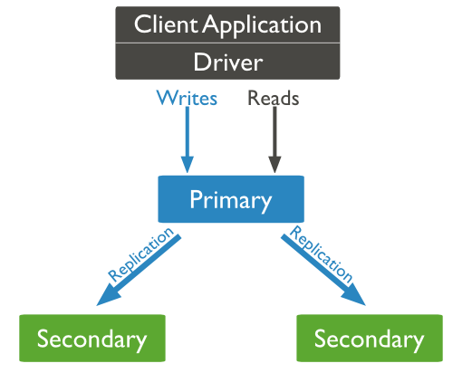
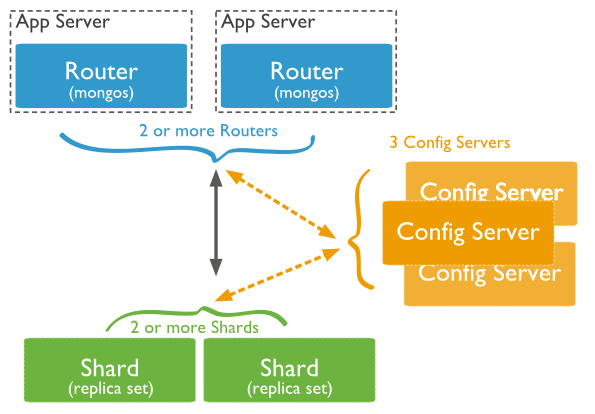

# 一、介绍

MongoDB 是由C++语言编写的，是一个基于分布式文件存储的开源数据库系统。

MongoDB 将数据存储为一个文档，数据结构由键值(key=>value)对组成。MongoDB 文档类似于 JSON 对象。字段值可以包含其他文档，数组及文档数组。

优点

- 1  满足对数据库的高并发读写
- 2  对海量数据的高效存储和访问
- 3  对数据库高扩展性和高可用性
- 4  灵活的数据结构，满足数据结构不固定的场景

缺点

- 1  一般不支持事务
- 2  实现复杂SQL查询比较复杂
- 3  运维人员数据维护门槛较高
- 4  目前不是主流的数据库技术

# 二、主要特点

- MongoDB 是一个面向文档存储的数据库，操作起来比较简单和容易。
- 你可以在MongoDB记录中设置任何属性的索引 (如：FirstName="Sameer",Address="8 Gandhi Road")来实现更快的排序。
- 你可以通过本地或者网络创建数据镜像，这使得MongoDB有更强的扩展性。
- 如果负载的增加（需要更多的存储空间和更强的处理能力） ，它可以分布在计算机网络中的其他节点上这就是所谓的分片。
- Mongo支持丰富的查询表达式。查询指令使用JSON形式的标记，可轻易查询文档中内嵌的对象及数组。
- MongoDb 使用update()命令可以实现替换完成的文档（数据）或者一些指定的数据字段 。
- Mongodb中的Map/reduce主要是用来对数据进行批量处理和聚合操作。
- Map和Reduce。Map函数调用emit(key,value)遍历集合中所有的记录，将key与value传给Reduce函数进行处理。
- Map函数和Reduce函数是使用Javascript编写的，并可以通过db.runCommand或mapreduce命令来执行MapReduce操作。
- GridFS是MongoDB中的一个内置功能，可以用于存放大量小文件。
- MongoDB允许在服务端执行脚本，可以用Javascript编写某个函数，直接在服务端执行，也可以把函数的定义存储在服务端，下次直接调用即可。

# 三、安装mongodb

```
# 安装依赖
yum install libcurl openssl -y
 wget -c https://fastdl.mongodb.org/linux/mongodb-linux-x86_64-rhel70-6.0.0.tgz
tar -zxf mongodb-linux-x86_64-rhel70-6.0.0.tgz
 mv mongodb-linux-x86_64-rhel70-6.0.0 /usr/local/mongodb
 export PATH=/usr/local/mongodb/bin:$PATH
#数据
mkdir -p /var/lib/mongo
#日志
mkdir -p /var/log/mongodb
```

启动

```
mongod --bind_ip=0.0.0.0 --port=27017 --dbpath /var/lib/mongo --logpath /var/log/mongodb/mongod.log --fork
```

# 四、基本操作

https://www.runoob.com/mongodb/mongodb-create-database.html

##  4.1 用户操作

```
db.createUser(
{       user: "leellun",
pwd: "123456",
roles:[{role: "readWrite" , db:"admin"}]})
# 删除
db.dropUser('leellun')
```

## 4.2 数据库

```
# 选择数据
use DATABASE_NAME
# 数据列表
show dbs
#当前数据库
db
# 插入数据
db.runoob.insert({"name":"菜鸟教程"})
# 删除当前数据库
db.dropDatabase()
# 删除集合
db.collection.drop()
# 创建集合
db.createCollection(name, options)
# 插入集合
db.COLLECTION_NAME.insert(document)
#集合修改
db.collection.update
#集合删除
db.collection.remove
```

# 五、副本

https://www.runoob.com/mongodb/mongodb-replication.html



副本集特征：

- N 个节点的集群
- 任何节点可作为主节点
- 所有写入操作都在主节点上
- 自动故障转移
- 自动恢复

 ````
# 创建从节点
mongod --port 27018 --dbpath /var/lib/mongo2 --replSet rs0
mongod --port 27019 --dbpath /var/lib/mongo2 --replSet rs1
 ````

添加从节点

```
$ mongo
$ rs.add("localhost:27018")
$ rs.add("localhost:27019")
```

# 六、分片

https://www.runoob.com/mongodb/mongodb-sharding.html



- Shard:

  用于存储实际的数据块，实际生产环境中一个shard server角色可由几台机器组个一个replica set承担，防止主机单点故障

- Config Server:

  mongod实例，存储了整个 ClusterMetadata，其中包括 chunk信息。

- Query Routers:

  前端路由，客户端由此接入，且让整个集群看上去像单一数据库，前端应用可以透明使用。

fumi-mongo-kafka了解更多

## 6.1 配置shard数据节点

```
[root@100 /]# mkdir -p /www/mongoDB/shard/s0
[root@100 /]# mkdir -p /www/mongoDB/shard/s1
[root@100 /]# mkdir -p /www/mongoDB/shard/s2
[root@100 /]# mkdir -p /www/mongoDB/shard/s3
[root@100 /]# mkdir -p /www/mongoDB/shard/log
[root@100 /]# /usr/local/mongoDB/bin/mongod --port 27020 --dbpath=/www/mongoDB/shard/s0 --logpath=/www/mongoDB/shard/log/s0.log --logappend --fork
[root@100 /]# /usr/local/mongoDB/bin/mongod --port 27021 --dbpath=/www/mongoDB/shard/s1 --logpath=/www/mongoDB/shard/log/s1.log --logappend --fork
[root@100 /]# /usr/local/mongoDB/bin/mongod --port 27022 --dbpath=/www/mongoDB/shard/s2 --logpath=/www/mongoDB/shard/log/s2.log --logappend --fork
[root@100 /]# /usr/local/mongoDB/bin/mongod --port 27023 --dbpath=/www/mongoDB/shard/s3 --logpath=/www/mongoDB/shard/log/s3.log --logappend --fork
```

## 6.2 配置启动配置节点

```
[root@100 /]# mkdir -p /www/mongoDB/shard/config
[root@100 /]# /usr/local/mongoDB/bin/mongod --port 27100 --dbpath=/www/mongoDB/shard/config --logpath=/www/mongoDB/shard/log/config.log --logappend --fork
```

## 6.3  启动Route Process 

```
/usr/local/mongoDB/bin/mongos --port 40000 --configdb localhost:27100 --fork --logpath=/www/mongoDB/shard/log/route.log --chunkSize 500
```

## 6.4 添加节点

```
[root@100 shard]# /usr/local/mongoDB/bin/mongo admin --port 40000
MongoDB shell version: 2.0.7
connecting to: 127.0.0.1:40000/admin
mongos> db.runCommand({ addshard:"localhost:27020" })
{ "shardAdded" : "shard0000", "ok" : 1 }
......
mongos> db.runCommand({ addshard:"localhost:27023" })
{ "shardAdded" : "shard0009", "ok" : 1 }
mongos> db.runCommand({ enablesharding:"test" }) #设置分片存储的数据库
{ "ok" : 1 }
mongos> db.runCommand({ shardcollection: "test.log", key: { id:1,time:1}})
{ "collectionsharded" : "test.log", "ok" : 1 }
```

# 七、高可用方案

keepalived+haproxy+(mongos+config+share)