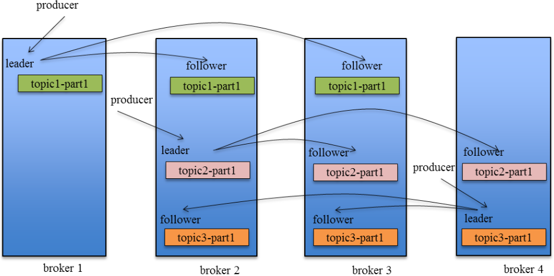

# 一、指标对比


| 指标                        | ActiveMQ                                                     | RabbitMQ                                                     | RocketMQ                                   | Kafka                                                        |
| --------------------------- | ------------------------------------------------------------ | ------------------------------------------------------------ | ------------------------------------------ | ------------------------------------------------------------ |
| 开发语言                    | java                                                         | erlang                                                       | java                                       | scala                                                        |
| 单机吞吐量                  | 万级                                                         | 万级                                                         | 10万级                                     | 10万级                                                       |
| 时效性                      | ms级                                                         | us级                                                         | ms级                                       | ms级内                                                       |
| 可用性                      | 高(主从架构)                                                 | 高(主从架构)                                                 | 非常高(分布式架构)                         | 非常高(分布式架构)                                           |
| 客户端                      | Java, .NET, C++ etc.                                         | AMQP协议支持多语言SDK，而JMS仅支持Java SDK                   | Java, C++, Go                              | Java, Scala etc.                                             |
| 协议                        | OpenWire, STOMP, AMQP, MQTT, JMS                             | RabbitMQ、STOMP、MQTT、AMQP 0-9-1、AMQP 1.0、HTTP、JMS       | TCP, JMS, OpenMessaging                    | PLAINTEXT、SSL、SASL_PLAINTEXT、SASL_SSL                     |
| 消息获取                    | push/pull                                                    | push/pull                                                    | push/pull                                  | push/pull                                                    |
| 功能特性                    | 成熟的产品，在很多公司得到应用；有较多的文档；各种协议支持较好 | 基于erlang开发，所以并发能力很强，性能极其好，延时很低;管理界面较丰富 | MQ功能比较完备，扩展性佳                   | 只支持主要的MQ功能，像一些消息查询，消息回溯等功能没有提供，毕竟是为大数据准备的，在大数据领域应用广。 |
| 有序消息                    | 独占消费者或独占队列可以确保排序                             | 不能。除非单消费者-单队列的点对点模型                        | 确保消息的严格顺序，并且可以优雅地向外扩展 | 确保分区内消息的顺序                                         |
| 定时消息                    | 支持                                                         | 支持（死信队列、延迟插件）                                   | 支持                                       | 不支持                                                       |
| 批次消息                    | 不支持                                                       |                                                              | 支持，具有同步模式，以避免消息丢失         | 支持，使用异步生成器                                         |
| 广播消息                    | 支持                                                         | 支持（fanout扇出也称之为广播）                               | 支持                                       | 不支持                                                       |
| 消息过滤                    | 支持                                                         | 支持                                                         | 支持，基于SQL92的属性过滤器表达式          | 支持（ Kafka Streams ）                                      |
| Server Triggered Redelivery | 不支持                                                       |                                                              | 支持                                       | 不支持                                                       |
| 消息存储                    | 支持使用JDBC和高性能日志(如levelDB、kahaDB)快速持久          | 文件来存储                                                   | 高性能、低时延的文件存储                   | 高性能文件存储                                               |
| 信息追溯                    | 支持                                                         | 支持                                                         | 支持timestamp和offset两个指标              | 支持offset                                                   |
| Priority                    | 支持                                                         | 支持                                                         | 不支持                                     | 不支持                                                       |
| 高可用性和故障转移          | 支持，取决于存储，如果使用levelDB，它需要一个ZooKeeper服务器 | 支持                                                         | 支持，主从模式，不需要另一个工具包         | 支持，需要ZooKeeper服务器                                    |
| 消息追踪                    | 不支持                                                       | 不支持                                                       | 支持                                       | 不支持                                                       |
| 配置                        | 默认配置为低级别，用户需要优化配置参数                       | 默认单机，集群需要配置                                       | 开箱即用，用户只需要注意几个配置           | Kafka使用键值对格式进行配置。这些值可以通过文件或编程方式提供。 |
| 管理和操作工具              | 支持                                                         | 支持（web和终端）                                            | 支持，富web和终端命令暴露核心指标          | 支持，使用终端命令公开核心指标                               |

1 RabbitMQ，erlang语言天生具备高并发的特性，而且他的管理界面用起来十分方便。

2 kafka，根据业务场景选择，如果有日志采集功能，肯定是首选kafka了。

# 二、mq线上方案

## 2.1 如何保证消息队列不被重复消费

1 数据库唯一性

2 消息做redis的set的操作 

## 2.2 如何保证消费的可靠性传输?

### RabbitMQ 

生产者：

（1）RabbitMQ提供transaction和confirm模式来确保生产者不丢消息 

（2）生产者confirm 确认

```
ConfirmListener addConfirmListener(ConfirmCallback ackCallback, ConfirmCallback nackCallback);
```

消息队列丢数据:

(1)队列持久化、消息持久化

deliveryMode ：设置消息持久化

duration：true设置队列持久化

消费者丢数据：

（1）手动确认消息

### kafka 



Producer在发布消息到某个Partition时，先通过zk找到该Partition的Leader，然后无论该Topic的Replication Factor为多少（也即该Partition有多少个Replica），Producer只将该消息发送到该Partition的Leader。Leader会将该消息写入其本地Log。每个Follower都从Leader中pull数据。

生产者丢数据：

在producer端设置acks=all。这个配置保证了，follwer同步完成后，才认为消息发送成功。
在producer端设置retries=MAX，一旦写入失败，这无限重试

消息队列丢数据：

针对消息队列丢数据的情况，无外乎就是，数据还没同步，leader就挂了，这时zookpeer会将其他的follwer切换为leader,那数据就丢失了。针对这种情况，应该做两个配置。

replication.factor参数，这个值必须大于1，即要求每个partition必须有至少2个副本
min.insync.replicas参数，这个值必须大于1，这个是要求一个leader至少感知到有至少一个follower还跟自己保持联系
这两个配置加上上面生产者的配置联合起来用，基本可确保kafka不丢数据

消费者丢数据：

手动提交

## 2.3 如何保证消息的顺序性？

将需要保持先后顺序的消息放到同一个消息队列中(kafka中就是partition,rabbitMq中就是queue)。然后只用一个消费者去消费该队列。 