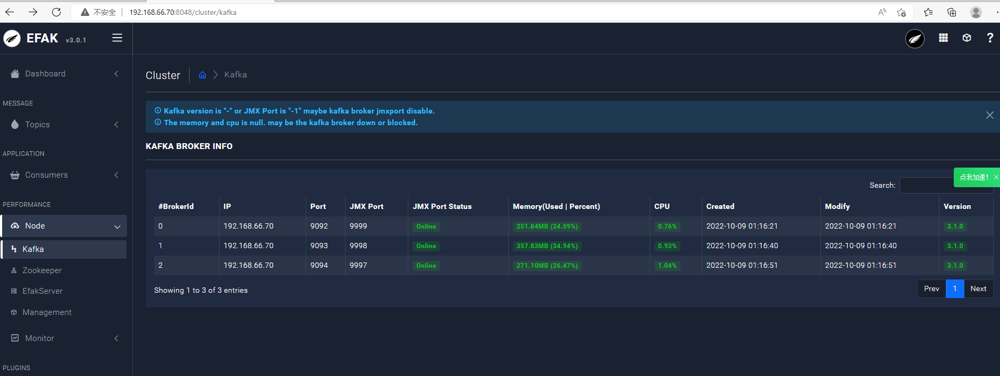
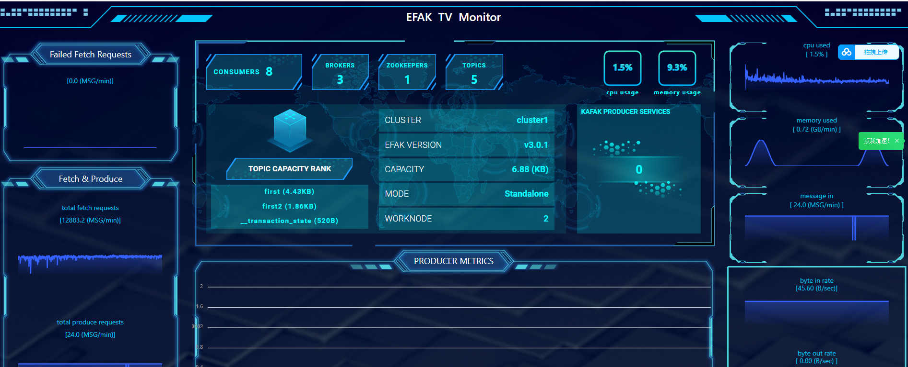

## 一、下载安装kafka-eagle

````
wget -c https://github.com/smartloli/kafka-eagle-bin/archive/v3.0.1.tar.gz
tar -zxf v3.0.1.tar.gz
tar -zxf efak-web-3.0.1-bin.tar.gz
````

配置kafka：

```
vi /etc/profile

export KE_HOME=/root/efak-web-3.0.1

source /etc/profile
```

配置文件配置

```
efak.zk.cluster.alias=cluster1
cluster1.zk.list=localhost:2181

# offset 保存在 kafka
cluster1.efak.offset.storage=kafka

#jdbc
efak.driver=com.mysql.cj.jdbc.Driver
efak.url=jdbc:mysql://192.168.66.2:3308/ke?autoReconnect=true&userUnicode=true&characterEncoding=UTF8&useSSL=false&serverTimezone=GMT%2B8&rewriteBatchedStatements=true&allowMultiQueries=true&allowPublicKeyRetrieval=true
efak.username=leellun
efak.password=xx
```

## 二、服务启动

开启JMX_PORT，并启动kafka，推荐方式：

```
JMX_PORT=9999 bin/kafka-server-start.sh config/server.properties
```

开启efak：

```
bin/ke.sh start
```

开启efak会由默认的用户名和密码，需要修改密码的可以配置文件ke_users表进行修改

## 三、查看





## 四、遇到的坑

1 因为我是在虚拟机搭建的kafka、euak，为了节省资源，用的mysql是实体机window10的，一直连不上，没有想到window10防火墙问题，关了防火墙就可以登录进去了；

2 还是mysql问题，kafka一直没有节点显示，最后查看日志，提示timezone问题，但是在连接上添加了serverTimezone=GMT%2B8各种都使用了还是不行，最后只好去mysql修改，查看mysql的timezone值是system，修改配置my.ini设置

```
[mysqld] 
default-time_zone = '+8:00'
```

然后重启mysql，终于连上了

最后我想说，操。。。

这TM，这种问题居然也能让我饶头，这问题也能遇到，这么简单的东西，居然解决半天。。。。。。。。。。。。。。。。。。。。。。。。。。