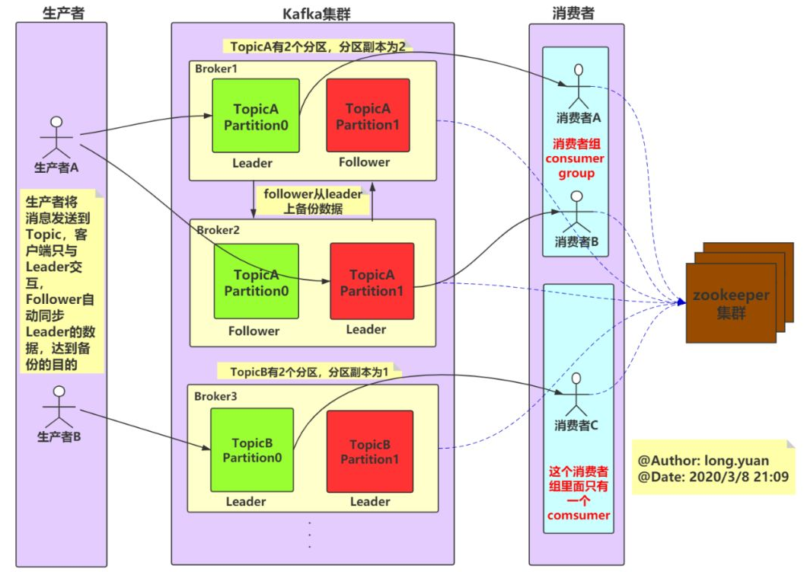
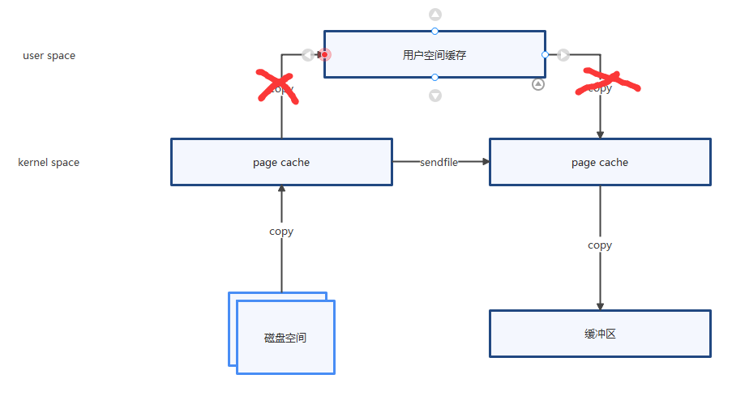

## 1 介绍

Kafka是一个分布式、分区的、多副本的、多订阅者，基于zookeeper协调的分布式日志系统（也可以当做MQ系统），常见可以用于web/nginx日志、访问日志，消息服务等等.

## 2 kafka特性

- 高吞吐量、低延迟：kafka每秒可以处理几十万条消息，它的延迟最低只有几毫秒；
- 可扩展性：kafka集群支持热扩展；
- 持久性、可靠性：消息被持久化到本地磁盘，并且支持数据备份防止丢失；
- 容错性：允许集群中的节点失败(若分区副本数量为n,则允许n-1个节点失败)；
- 高并发：单机可支持数千个客户端同时读写；

## 3 应用场景

- 日志收集：一个公司可以用Kafka收集各种服务的log，通过kafka以统一接口开放给各种消费端，例如hadoop、Hbase、Solr等。
- 消息系统：解耦生产者和消费者、缓存消息等。
- 用户活动跟踪：Kafka经常被用来记录web用户或者app用户的各种活动，如浏览网页、搜索记录、点击等活动，这些活动信息被各个服务器发布到kafka的topic中，然后订阅者通过订阅这些topic来做实时的监控分析，或者装载到hadoop、数据仓库中做离线分析和挖掘。
- 运营指标：Kafka也经常用来记录运营监控数据。
- 流式处理

## 4 kafka架构



1 broker

kafka 集群包含一个或多个服务器，每个服务器节点称为一个broker。

2 topic

每条发布到kafka集群的消息都有一个类别，这个类别称为topic，其实就是将消息按照topic来分类，topic就是逻辑上的分类，同一个topic的数据既可以在同一个broker上也可以在不同的broker结点上。

3 partition

分区，每个topic被物理划分为一个或多个分区，每个分区在物理上对应一个文件夹，该文件夹里面存储了这个分区的所有消息和索引文件。在创建topic时可指定parition数量，生产者将消息发送到topic时，消息会根据 分区策略 追加到分区文件的末尾，属于**顺序写磁盘**，因此效率非常高（经验证，顺序写磁盘效率比随机写内存还要高，这是Kafka高吞吐率的一个很重要的保证）。

**分区策略**

决定生产者将消息发送到哪个分区的算法。
Kafka 提供了默认的分区策略，同时它也支持自定义分区策略。

**Key-ordering 策略**

kafka允许为每条消息设置一个key，一旦消息被定义了 Key，那么就可以保证同一个 Key 的所有消息都进入到相同的分区，这种策略属于自定义策略的一种，被称作"按消息key保存策略"，或Key-ordering 策略。

同一partition中的数据是有序的，但topic下的多个partition之间在消费数据时不能保证有序性。

如何解决消息的有序性？

- 将partition数设为1，但这种做法的缺点是降低了吞吐
- 通过分区策略Key-ordering 保证相同key的消息落入同一分区。

4 offset

partition中的每条消息都被标记了一个序号，这个序号表示消息在partition中的偏移量，称为offset，每一条消息在partition都有唯一的offset，消息者通过指定offset来指定要消费的消息。 

consumer 可以设置offset指定消费消息，所以kafka broker是无状态的，它不需要标记哪些消息被消费过。 正常情况offset会在消费消息后+1.

server.propertise配置文件中定义了数据的保存时间，当文件到设定的保存时间时才会删除，

```
# 数据的保存时间(单位:小时，默认为7天)
log.retention.hours=168
```

5、producer

生产者，生产者发送消息到指定的topic下，消息再根据分配规则append到某个partition的末尾。

6、consumer

消费者，消费者从topic中消费数据。

7、consumer group

消费者组，每个consumer属于一个特定的consumer group，可为每个consumer指定consumer group，若不指定则属于默认的group。

同一topic的一条消息只能被同一个consumer group内的一个consumer消费，但多个consumer group可同时消费这一消息。这也是kafka用来实现一个topic消息的广播和单播的手段，如果需要实现广播，一个consumer group内只放一个消费者即可，要实现单播，将所有的消费者放到同一个consumer group即可。

用consumer group还可以将consumer进行自由的分组而不需要多次发送消息到不同的topic。

8、leader

每个partition有多个副本，其中有且仅有一个作为leader，leader会负责所有的客户端读写操作。

9、follower

follower不对外提供服务，只与leader保持数据同步，如果leader失效，则选举一个follower来充当新的leader。当follower与leader挂掉、卡住或者同步太慢，leader会把这个follower从ISR列表中删除，重新创建一个follower。

10、rebalance

同一个consumer group下的多个消费者互相协调消费工作，我们这样想，一个topic分为多个分区，一个consumer group里面的所有消费者合作，一起去消费所订阅的某个topic下的所有分区(每个消费者消费部分分区)，kafka会将该topic下的所有分区均匀的分配给consumer group下的每个消费者。

rebalance表示"重平衡"，consumer group内某个消费者挂掉后，其他消费者自动重新分配订阅主题分区的过程，是 Kafka 消费者端实现高可用的重要手段。 

## 5 kafka消息

### 5.1 消息传递模式

**点对点模式**

生产者发送消息到queue中，queue支持存在多个消费者，但是对一个消息而言，只可以被一个消费者消费，并且在点对点模式中，已经消费过的消息会从queue中删除不再存储。

**发布订阅模式**

生产者将消息发布到topic中，topic可以被多个消费者订阅，且发布到topic的消息会被所有订阅者消费。

消息者通过指定offset来指定要消费的消息。可以通过log.retention.hours=168来指定消息保存时间。

### 5.2 消息的两种获取方式

**消费端 pull** 

由消费者主动向消息中间件拉取消息；

优点：消费端可以按处理能力进行拉取；

缺点：消费端需要另开线程监控中间件，有性能开销；

**消息中间件主动push**

由消息中间件主动地将消息推送给消费者；

优点：优点是不需要消费者额外开启线程监控中间件，节省开销。

缺点：无法适应消费速率不相同的消费者。因为消息的发送速率是broker决定的，而消费者的处理速度又不尽相同，所以容易造成部分消费者空闲，部分消费者堆积，造成缓冲区溢出。

总结：

对于Kafka而言，pull模式更合适。pull模式可简化broker的设计，Consumer可自主控制消费消息的速率，同时Consumer可以自己控制消费方式，既可批量消费也可逐条消费，同时还能选择不同的提交方式从而实现不同的传输语义。

### 5.3 延迟消息

延时消息分为**延时生产消息**和**延时拉取消息**。

```
LEO：该副本底层 log文件下一条要写入的消息的位移，例如 LEO=10则当前文件已经写了了10条消息，位移是[0,10)。
HW：所有分区已提交的的位移，一般HW<=LEO。
```

**延时生产消息**


## 6 kafka和rabbitMQ对比 

|                    | RabbitMQ                                                     | Kafka                                                        |
| ------------------ | ------------------------------------------------------------ | ------------------------------------------------------------ |
| 开发语言           | erlang                                                       | scala，Java                                                  |
| 架构模型           | ① 遵循AMQP；② 生产者、消费者、broker。③ broker由exchange、binding、queue组成；④ consumer消费位置由broker通过确认机制保存； | ① 不遵循AMQP；② 生产者、消费者、kafka集群、zookeeper集群；③ kafka集群由多个broker节点组成，消息按照topic分类，每个topic又划分为多个partition；④ broker无状态，offset由消费者指定； |
| 可靠性             | RabbitMQ可靠性更好，支持事务，支持消息确认机制               |                                                              |
| 高可用             | 采用镜像队列，即主从模式，数据是异步同步的，当消息过来，主从全部写完后，回ack，这样保障了数据的一致性。 | 每个分区都有一个或多个副本，这些副本保存在不同的broker上，其中有且仅有一个分区副本作为leader，其余的作为follower，当leader不可用时，会选举follower作为新leader继续提供服务。只有leader提供读写服务，follower从leader同步拉取数据然后备份。 |
| 吞吐量             |                                                              | kafka更高                                                    |
| 是否支持事务       | 支持                                                         | 不支持                                                       |
| 负载均衡           | 需要外部支持才能实现（如：loadbalancer）                     | kafka利用zk和分区机制实现负载均衡                            |
| 是否支持中间件Push | 不支持                                                       | 支持                                                         |
| 是否支持消费者Pull | 支持                                                         | 支持                                                         |
| 适用场景           | 具有较高的严谨性，数据丢失的可能性更小，同时具备较高的实时性，用在对实时性、可靠性要求较高的消息传递上。 | kafka的优势主要体现在吞吐量上，它主要用在高吞吐量的场景。比如日志采集。 |

## 7 kafka吞吐量为什么这么高？

1 顺序读写磁盘 

Kafka是将消息持久化到本地磁盘中的.

不管是内存还是磁盘，快或慢的关键在于寻址方式，分为顺序读写与随机读写。

2 page cache 

为了优化读写性能，Kafka利用了操作系统本身的Page Cache，就是利用操作系统自身的内存而不是JVM空间内存。

> JVM中一切皆对象，对象的存储会带来额外的内存消耗；

> 使用JVM会受到GC的影响，随着数据的增多，垃圾回收也会变得复杂与缓慢，降低吞吐量；

另外操作系统本身对page cache做了大量优化，通过操作系统的Page Cache，Kafka的读写操作基本上是基于系统内存的，读写性能也得到了极大的提升。

3 零拷贝 

零拷贝是指Kafka利用 linux 操作系统的 "zero-copy" 机制在消费端做的优化。 

消费端在消费数据时，数据从broker磁盘通过网络传输到消费端的整个过程： 

- 操作系统从磁盘读取数据到内核空间（kernel space）的page cache；
- 应用程序读取page cache的数据到用户空间（user space）的缓冲区；
- 应用程序将用户空间缓冲区的数据写回内核空间的socket缓冲区（socket buffer）；
- 操作系统将数据从socket缓冲区复制到硬件（如网卡）缓冲区；



整个过程如上图所示，这个过程包含4次copy操作和2次系统上下文切换，而上下文切换是CPU密集型的工作，数据拷贝是I/O密集型的工作，性能其实非常低效。

零拷贝就是使用了一个名为sendfile()的系统调用方法，将数据从page cache直接发送到Socket缓冲区，避免了系统上下文的切换，消除了从内核空间到用户空间的来回复制。从上图可以看出，"零拷贝"并不是说整个过程完全不发生拷贝，而是站在内核的角度来说的，避免了内核空间到用户空间的来回拷贝。

4、分区分段

Kafka的message是按topic分类存储的，topic中的数据又是按照一个一个的partition即分区存储到不同broker节点。每个partition对应了操作系统上的一个文件夹，partition实际上又是按照segment分段存储的。这也非常符合分布式系统分区分桶的设计思想。

通过这种分区分段的设计，Kafka的message消息实际上是分布式存储在一个一个小的segment中的，每次文件操作也是直接操作的segment。为了进一步的查询优化，Kafka又默认为分段后的数据文件建立了索引文件，就是文件系统上的.index文件。这种分区分段+索引的设计，不仅提升了数据读取的效率，同时也提高了数据操作的并行度。

总之，Kafka采用顺序读写、Page Cache、零拷贝以及分区分段等这些设计，再加上在索引方面做的优化，另外Kafka数据读写也是批量的而不是单条的，使得Kafka具有了高性能、高吞吐、低延时的特点。

## 8 kafka中的Leader选举 

### 8.1 controller的选举【broker的leader】  

controller的选举是通过broker在zookeeper的"/controller"节点下创建临时节点来实现的，并在该节点中写入当前broker的信息 

```
{“version”:1,”brokerid”:1,”timestamp”:”1512018424988”}
```

利用zookeeper的强一致性特性，一个节点只能被一个客户端创建成功，创建成功的broker即为controller，即"先到先得"。 

当controller宕机或者和zookeeper失去连接时，zookeeper检测不到心跳，zookeeper上的临时节点会被删除，而其它broker会监听临时节点的变化，当节点被删除时，其它broker会收到通知，重新发起controller选举。

### 8.2 leader的选举【分区副本的leader】

分区leader的选举由 controller 负责管理和实施，当leader发生故障时，controller会将leader的改变直接通过RPC的方式通知需要为此作出响应的broker，需要为此作出响应的broker即该分区的ISR集合中follower所在的broker，kafka在zookeeper中动态维护了一个ISR，只有ISR里的follower才有被选为Leader的可能。 

具体过程是这样的：按照AR集合中副本的顺序 查找到 第一个 存活的、并且属于ISR集合的 副本作为新的leader。一个分区的AR集合在创建分区副本的时候就被指定，只要不发生重分配的情况，AR集合内部副本的顺序是保持不变的，而分区的ISR集合上面说过因为同步滞后等原因可能会改变，所以注意这里是根据AR的顺序而不是ISR的顺序找。

如果partition的所有副本都不可用时，kafka提供了两种可行的方案：

1、选择 ISR中 第一个活过来的副本作为Leader；

2、选择第一个活过来的副本（不一定是ISR中的）作为Leader；

这就需要在可用性和数据一致性当中做出选择，如果一定要等待ISR中的副本活过来，那不可用的时间可能会相对较长。选择第一个活过来的副本作为Leader，如果这个副本不在ISR中，那数据的一致性则难以保证。kafka支持用户通过配置选择，以根据业务场景在可用性和数据一致性之间做出权衡。

### 8.3 消费组leader的选举

组协调器会为消费组（consumer group）内的所有消费者选举出一个leader，这个选举的算法也很简单，第一个加入consumer group的consumer即为leader，如果某一时刻leader消费者退出了消费组，那么会重新 随机 选举一个新的leader。


参考文章：

[kafka概述](https://www.cnblogs.com/qingyunzong/p/9004509.html)

[《大白话kafka架构原理》](http://mp.weixin.qq.com/s?__biz=MzU1NDA0MDQ3MA==&mid=2247483958&idx=1&sn=dffaad318b50f875eea615bc3bdcc80c&chksm=fbe8efcfcc9f66d9ff096fbae1c2a3671f60ca4dc3e7412ebb511252e7193a46dcd4eb11aadc&scene=21#wechat_redirect)

[《秒懂kafka HA（高可用）》](http://mp.weixin.qq.com/s?__biz=MzU1NDA0MDQ3MA==&mid=2247483965&idx=1&sn=20dd02c4bf3a11ff177906f0527a5053&chksm=fbe8efc4cc9f66d258c239fefe73125111a351d3a4e857fd8cd3c98a5de2c18ad33aacdad947&scene=21#wechat_redirect) 

