# 一、介绍

Kafka是一个分布式、分区的、多副本的、多订阅者的基于发布/订阅模式的消息队列（Message Queue），基于zookeeper协调的分布式日志系统（也可以当做MQ系统），常见可以用于web/nginx日志、访问日志，消息服务等等.

发布/订阅：消息的发布者不会将消息直接发送给特定的订阅者，而是将发布的消息分为不同的类别，订阅者只接收感兴趣的消息。

发布/订阅模式的消息队列（Message Queue），主要应用于大数据实时处理领域。 

同时Kafka是 一个开源的分布式事件流平台 （Event Streaming Platform），被用于高性能数据管道、流分析、数据集成和关键任务应用。 

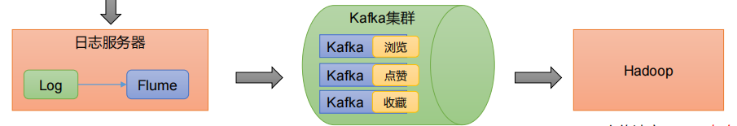

例如：对于网站浏览、收藏、点赞、评论日志。

# 二、应用场景

- 日志收集：一个公司可以用Kafka收集各种服务的log，通过kafka以统一接口开放给各种消费端，例如hadoop、Hbase、Solr等。
- 消息系统：解耦生产者和消费者、缓存消息等。
- 用户活动跟踪：Kafka经常被用来记录web用户或者app用户的各种活动，如浏览网页、搜索记录、点击等活动，这些活动信息被各个服务器发布到kafka的topic中，然后订阅者通过订阅这些topic来做实时的监控分析，或者装载到hadoop、数据仓库中做离线分析和挖掘。
- 运营指标：Kafka也经常用来记录运营监控数据。
- 流式处理

# 三、消息传递模式

**点对点模式**

生产者发送消息到queue中，queue支持存在多个消费者，但是对一个消息而言，只可以被一个消费者消费，并且在点对点模式中，已经消费过的消息会从queue中删除不再存储。

**发布订阅模式**

生产者将消息发布到topic中，topic可以被多个消费者订阅，且发布到topic的消息会被所有订阅者消费。

消息者通过指定offset来指定要消费的消息。可以通过log.retention.hours=168来指定消息保存时间。

# 四、Kafka 基础架构 

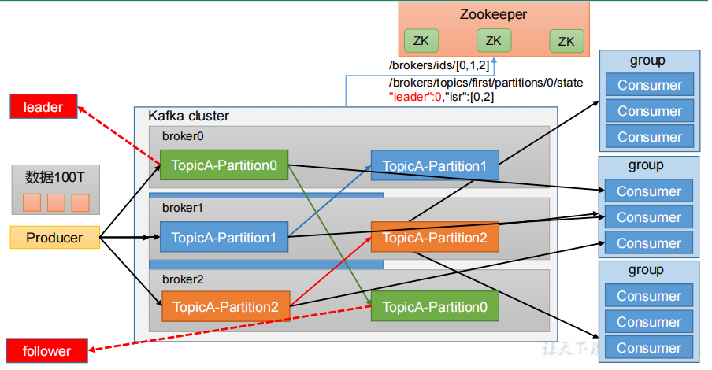

- 1. 为方便扩展，并提高吞吐量，一个topic分为多个partition 
- 2. 配合分区的设计，提出消费者组的概念，组内每个消费者并行消费 
- 3. 为提高可用性，为每个partition增加若干副本，类似NameNode HA 
- 4. ZK中记录谁是leader，Kafka2.8.0以后也可以配置不采用ZK 

（1）Producer：消息生产者，就是向 Kafka broker 发消息的客户端。 

（2）Consumer：消息消费者，向 Kafka broker 取消息的客户端。 

（3）Consumer Group（CG）：消费者组，由多个 consumer 组成。消费者组内每个消费者负责消费不同分区的数据，一个分区只能由一个组内消费者消费；消费者组之间互不影响。所有的消费者都属于某个消费者组，即消费者组是逻辑上的一个订阅者。 

（4）Broker：一台 Kafka 服务器就是一个 broker。一个集群由多个 broker 组成。一个broker 可以容纳多个 topic。 

（5）Topic：可以理解为一个队列，生产者和消费者面向的都是一个 topic。 

（6）Partition：为了实现扩展性，一个非常大的 topic 可以分布到多个 broker（即服务器）上，一个 topic 可以分为多个 partition，每个 partition 是一个有序的队列。 

（7）Replica：副本。一个 topic 的每个分区都有若干个副本，一个 Leader 和若干Follower。 

（8）Leader：每个分区多个副本的“主”，生产者发送数据的对象，以及消费者消费数据的对象都是 Leader。 

（9）Follower：每个分区多个副本中的“从”，实时从 Leader 中同步数据，保持和Leader 数据的同步。Leader 发生故障时，某个 Follower 会成为新的 Leader。

# 五、集群部署

## 5.1 下载安装

```
wget -c https://archive.apache.org/dist/kafka/3.1.0/kafka_2.12-3.1.0.tgz
tar -zxf kafka_2.12-3.1.0.tgz
mv kafka_2.12-3.1.0 kafka
```

## 5.2 配置文件

```
############################# Server Basics #############################
#broker 的全局唯一编号，不能重复，只能是数字。
broker.id=0
############################# Socket Server Settings #############################
#监听器列表 - 使用逗号分隔URI列表和监听器名称。如果侦听器名称不是安全协议，则还必须设置listener.security.protocol.map。指定主机名为0.0.0.0来绑定到所有接口。留空则绑定到默认接口上。合法监听器列表的示例：PLAINTEXT：// myhost：9092，SSL：//：9091 CLIENT：//0.0.0.0：9092，REPLICATION：// localhost：9093
#listeners=PLAINTEXT://:9092

# 监听器发布到ZooKeeper供客户端使用，如果与listeners配置不同。在IaaS环境,这可能需要与broker绑定不通的接口。如果没有设置，将使用listeners的配置。与listeners不同的是，配置0.0.0.0元地址是无效的。
#advertised.listeners=PLAINTEXT://your.host.name:9092
#处理网络请求的线程数量
num.network.threads=3

#处理网络请求的线程数量
num.io.threads=8

#发送套接字的缓冲区大小
socket.send.buffer.bytes=102400

#接收套接字的缓冲区大小
socket.receive.buffer.bytes=102400

#请求套接字的缓冲区大小
socket.request.max.bytes=104857600


############################# Log Basics #############################

#kafka 运行日志(数据)存放的路径，路径不需要提前创建，kafka 自动帮你创建，可以
配置多个磁盘路径，路径与路径之间可以用"，"分隔
log.dirs=/tmp/kafka-logs

#topic 在当前 broker 上的分区个数
num.partitions=1
#用来恢复和清理 data 下数据的线程数量
num.recovery.threads.per.data.dir=1

############################# Internal Topic Settings  #############################
# 每个 topic 创建时的副本数，默认时 1 个副本
offsets.topic.replication.factor=1
transaction.state.log.replication.factor=1
transaction.state.log.min.isr=1

############################# Log Flush Policy #############################
# 在强制将数据刷新到磁盘之前要接受的消息数
#log.flush.interval.messages=10000

# 在强制刷新消息之前，消息在日志中可驻留的最长时间
#log.flush.interval.ms=1000

############################# Log Retention Policy #############################
#segment 文件保留的最长时间，超时将被删除
log.retention.hours=168

#每个log文件的大小，默认最大 1G
#log.retention.bytes=1073741824

#每个 segment 文件的大小，默认最大 1G
log.segment.bytes=1073741824

# 检查过期数据的时间，默认 5 分钟检查一次是否数据过期
log.retention.check.interval.ms=300000

############################# Zookeeper #############################

# "127.0.0.1:3000,127.0.0.1:3001,127.0.0.1:3002"
zookeeper.connect=localhost:2181

# 连接zookeeper超时(毫秒)
zookeeper.connection.timeout.ms=18000
############################# Group Coordinator Settings #############################

#设置消费组进入到PreparingRebalance真正执行其业务逻辑的延迟时间，其主要目的是等待更多的消费者进入。
group.initial.rebalance.delay.ms=0
```

## 5.3 服务管理

zk启动关闭：

```
# 启动zk
bin/zookeeper-server-start.sh -daemon config/zookeeper.properties
# 关闭zk
bin/zookeeper-server-stop.sh -daemon config/zookeeper.properties
```

 启动及停止kafka：

```
# 启动
bin/kafka-server-start.sh -daemon config/server.properties
# 关闭 
bin/kafka-server-stop.sh config/server.properties
#启动日志查看
tail -f logs/server.log
```

# 六、命令

## 6.1 topic命令

```
bin/kafka-topics.sh
```

| 参数                                              | 描述                                   |
| ------------------------------------------------- | -------------------------------------- |
| --bootstrap-server <String: server toconnect to>  | 连接的 Kafka Broker 主机名称和端口号。 |
| --topic <String: topic>                           | 操作的 topic 名称。                    |
| --create                                          | 创建主题。                             |
| --delete                                          | 删除主题。                             |
| --alter                                           | 修改主题。                             |
| --list                                            | 查看所有主题。                         |
| --describe                                        | 查看主题详细描述。                     |
| --partitions <Integer: # of partitions>           | 设置分区数。                           |
| --replication-factor<Integer: replication factor> | 设置分区副本。                         |
| --config <String: name=value>                     | 更新系统默认的配置。                   |
| --topic                                           | 定义 topic 名                          |

查看所有topic：

```
bin/kafka-topics.sh --bootstrap-server 192.168.66.70:9092,192.168.66.70:9093,192.168.66.70:9094 --list
```

创建topic：

```
bin/kafka-topics.sh --bootstrap-server 192.168.66.70:9092,192.168.66.70:9093,192.168.66.70:9094 --create --partitions 1 --replication-factor 3 --topic first
```

详情查看：

```
bin/kafka-topics.sh --bootstrap-server 192.168.66.70:9092,192.168.66.70:9093,192.168.66.70:9094 --describe --topic first
```

修改分区数 :

```
bin/kafka-topics.sh --bootstrap-server 192.168.66.70:9092,192.168.66.70:9093,192.168.66.70:9094 --alter --topic first --partitions 3
```

删除 topic  :

```
bin/kafka-topics.sh --bootstrap-server 192.168.66.70:9092,192.168.66.70:9093,192.168.66.70:9094 --delete --topic first
```

## 6.2  生产者命令行操作 

```
bin/kafka-console-producer.sh
```

| 参数                                             | 描述                                   |
| ------------------------------------------------ | -------------------------------------- |
| --bootstrap-server <String: server toconnect to> | 连接的 Kafka Broker 主机名称和端口号。 |
| --topic <String: topic>                          | 操作的 topic 名称。                    |

 发送消息 :

```
bin/kafka-console-producer.sh --bootstrap-server 192.168.66.70:9092,192.168.66.70:9093,192.168.66.70:9094 --topic first
```

## 6.3 消费者命令行操作 

```
bin/kafka-console-consumer.sh
```

| 参数                                             | 描述                                   |
| ------------------------------------------------ | -------------------------------------- |
| --bootstrap-server <String: server toconnect to> | 连接的 Kafka Broker 主机名称和端口号。 |
| --topic <String: topic>                          | 操作的 topic 名称。                    |
| --from-beginning                                 | 从头开始消费。                         |
| --group <String: consumer group id>              | 指定消费者组名称。                     |

消费 first 主题中的数据 :

```
bin/kafka-console-consumer.sh --bootstrap-server 192.168.66.70:9092,192.168.66.70:9093,192.168.66.70:9094 --topic first
```

把主题中所有的数据都读取出来（包括历史数据）:

```
bin/kafka-console-consumer.sh --bootstrap-server 192.168.66.70:9092,192.168.66.70:9093,192.168.66.70:9094 --from-beginning --topic first
```

# 七、Kafka 生产者 

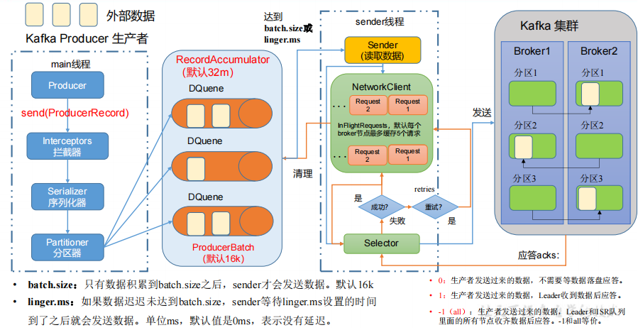

## 7.1 发送

在消息发送的过程中，涉及到了两个线程——main 线程和 Sender 线程。在 main 线程中创建了一个双端队列 RecordAccumulator。main 线程将消息发送给 RecordAccumulator，Sender 线程不断从 RecordAccumulator 中拉取消息发送到 Kafka Broker。

  生产者重要参数列表 

| 参数                                  | 描述                                                         |
| ------------------------------------- | ------------------------------------------------------------ |
| bootstrap.servers                     | 可以设置 1 个或者多个，中间用逗号隔开。                      |
| key.serializer 和 value.serializer    | 指定发送消息的 key 和 value 的序列化类型。                   |
| buffer.memory                         | RecordAccumulator 缓冲区总大小，默认 32m。                   |
| batch.size                            | 缓冲区一批数据最大值，默认 16k。适当增加该值，可以提高吞吐量，但是如果该值设置太大，会导致数据传输延迟增加。 |
| linger.ms                             | 如果数据迟迟未达到 batch.size，sender 等待 linger.time之后就会发送数据。单位 ms，默认值是 0ms，表示没有延迟。生产环境建议该值大小为 5-100ms 之间。 |
| acks                                  | 0：生产者发送过来的数据，不需要等数据落盘应答。 <br />1：生产者发送过来的数据，Leader 收到数据后应答。<br /> -1（all）：生产者发送过来的数据，Leader+和 isr 队列里面的所有节点收齐数据后应答。默认值是-1，-1 和all 是等价的。 |
| max.in.flight.requests.per.connection | 允许最多没有返回 ack 的次数，默认为 5，开启幂等性要保证该值是 1-5 的数字。 |
| retries                               | 当消息发送出现错误的时候，系统会重发消息。retries表示重试次数。默认是 int 最大值，2147483647。如果设置了重试，还想保证消息的有序性，需要设置 |
| retry.backoff.ms                      | 两次重试之间的时间间隔，默认是 100ms。                       |
| enable.idempotence                    | 是否开启幂等性，默认 true，开启幂等性。                      |
| compression.type                      | 生产者发送的所有数据的压缩方式。默认是 none，也就是不压缩。支持压缩类型：none、gzip、snappy、lz4 和 zstd。 |

 ## 7.2 生产者分区 

（1）便于合理使用存储资源，每个Partition在一个Broker上存储，可以把海量的数据按照分区切割成一块一块数据存储在多台Broker上。合理控制分区的任务，可以实现负载均衡的效果。 

（2）提高并行度，生产者可以以分区为单位发送数据；消费者可以以分区为单位进行消费数据。 

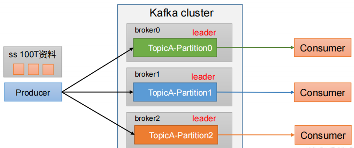

生产者分区策略：

```
public class DefaultPartitioner implements Partitioner {
 … …
}
```

（1）指明partition的情况下，直接将指明的值作为partition值； 例如partition=0，所有数据写入分区0

（2）没有指明partition值但有key的情况下，将key的hash值与topic的partition数进行取余得到partition值； 

例如：key1的hash值=5， key2的hash值=6 ，topic的partition数=2，那么key1 对应的value1写入1号分区，key2对应的value2写入0号分区。 

（3）既没有partition值又没有key值的情况下，Kafka采用Sticky Partition（黏性分区器），会随机选择一个分区，并尽可能一直使用该分区，待该分区的batch已满或者已完成，Kafka再随机一个分区进行使用（和上一次的分区不同）。 

例如：第一次随机选择0号分区，等0号分区当前批次满了（默认16k）或者linger.ms设置的时间到， Kafka再随机一个分区进行使用（如果还是0会继续随机）。 

## 7.3 生产经验——生产者如何提高吞吐量 

• batch.size：批次大小，默认16k  

• linger.ms：等待时间，修改为5-100ms 

• compression.type：压缩snappy 

• RecordAccumulator：缓冲区大小，修改为64m

```java
 // 0 配置
Properties properties = new Properties();

// 连接kafka集群
properties.put(ProducerConfig.BOOTSTRAP_SERVERS_CONFIG, KafkaConstant.BOOTSTRAP_SERVERS);

// 序列化
properties.put(ProducerConfig.KEY_SERIALIZER_CLASS_CONFIG, StringSerializer.class.getName());
properties.put(ProducerConfig.VALUE_SERIALIZER_CLASS_CONFIG,StringSerializer.class.getName());

// 缓冲区大小
properties.put(ProducerConfig.BUFFER_MEMORY_CONFIG,33554432);
// 批次大小
properties.put(ProducerConfig.BATCH_SIZE_CONFIG,16384);
// linger.ms
properties.put(ProducerConfig.LINGER_MS_CONFIG, 1);
// 压缩
properties.put(ProducerConfig.COMPRESSION_TYPE_CONFIG,"snappy");

// 1 创建生产者
KafkaProducer<String, String> kafkaProducer = new KafkaProducer<>(properties);

// 2 发送数据
for (int i = 0; i < 5; i++) {
    kafkaProducer.send(new ProducerRecord<>("first","sdf"+i));
}

// 3 关闭资源
kafkaProducer.close();
```

## 7.4 生产经验——数据可靠性 

 Leader维护了一个动态的in-sync replica set（ISR），意为和Leader保持同步的Follower+Leader集合(leader：0，isr:0,1,2)。

如果Follower长时间未向Leader发送通信请求或同步数据，则该Follower将被踢出ISR。该时间阈值由replica.lag.time.max.ms参数设定，默认30s。例如2超时，(leader:0, isr:0,1)。 

数据完全可靠条件 = ACK级别设置为-1 + 分区副本大于等于2 + ISR里应答的最小副本数量大于等于2

可靠性总结： 

acks=0，生产者发送过来数据就不管了，可靠性差，效率高； 

acks=1，生产者发送过来数据Leader应答，可靠性中等，效率中等； 

acks=-1，生产者发送过来数据Leader和ISR队列里面所有Follwer应答，可靠性高，效率低； 

在生产环境中，acks=0很少使用；acks=1，一般用于传输普通日志，允许丢个别数据；acks=-1，一般用于传输和钱相关的数据，对可靠性要求比较高的场景。 

## 7.5 数据重复性

### 7.5.1 语义

- 至少一次（At Least Once）= ACK级别设置为-1 + 分区副本大于等于2 + ISR里应答的最小副本数量大于等于2 

- 最多一次（At Most Once）= ACK级别设置为0 


- 总结： 
  - At Least Once可以保证数据不丢失，但是不能保证数据不重复； 
  - At Most Once可以保证数据不重复，但是不能保证数据不丢失。 

- 精确一次（Exactly Once）：对于一些非常重要的信息，比如和钱相关的数据，要求数据既不能重复也不丢失。 
  - Kafka 0.11版本以后，引入了一项重大特性：幂等性和事务。 

### 7.5.1 冥等性

幂等性就是指Producer不论向Broker发送多少次重复数据，Broker端都只会持久化一条，保证了不重复。 

精确一次（Exactly Once）= 幂等性 + 至少一次（ ack=-1 + 分区副本数>=2 + ISR最小副本数量>=2） 。 

重复数据的判断标准：具有<PID, Partition, SeqNumber>相同主键的消息提交时，Broker只会持久化一条。其中PID是Kafka每次重启都会分配一个新的；Partition 表示分区号；Sequence Number是单调自增的。 

所以幂等性只能保证的是在单分区单会话内不重复。 

```
开启参数 enable.idempotence 默认为 true，false 关闭。
```

### 7.5.2 有序消息

单分区内，有序（有条件的，详见下节）； 多分区，分区与分区间无序；

 ### 7.5.3 数据乱序

1）kafka在1.x版本之前保证数据单分区有序，条件如下： 

max.in.flight.requests.per.connection=1（不需要考虑是否开启幂等性）。 

2）kafka在1.x及以后版本保证数据单分区有序，条件如下： 

（1）未开启幂等性 

max.in.flight.requests.per.connection需要设置为1。

（2）开启幂等性 

max.in.flight.requests.per.connection需要设置小于等于5。 

 原因说明：因为在kafka1.x以后，启用幂等后，kafka服务端会缓存producer发来的最近5个request的元数据， 故无论如何，都可以保证最近5个request的数据都是有序的。

# 八、Kafka Broker

## 8.1 kafka信息

 ```
$ bin/zkCli.sh
$ ls /kafka
 ```

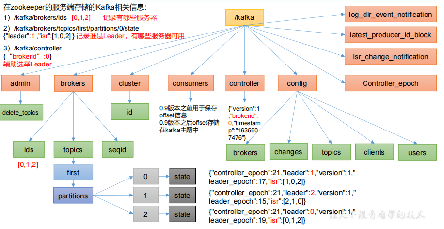


##  8.2  Kafka Broker 总体工作流程 

 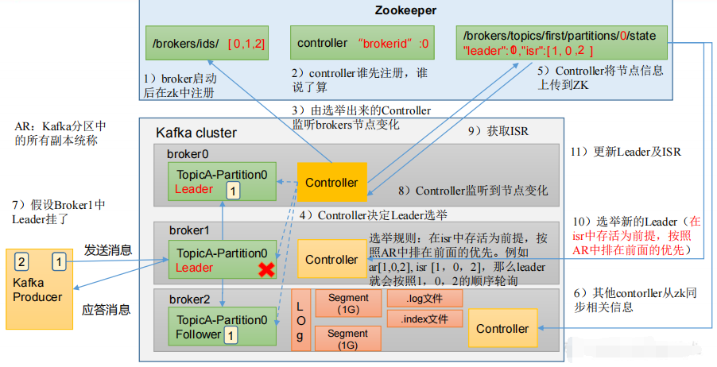

 查看/kafka/brokers/ids 路径上的节点：

```
ls /brokers/ids
[0, 1, 2]
```

查看/kafka/controller 路径上的数据:

```
get /controller
{"version":1,"brokerid":0,"timestamp":"1665127439213"}
```

查看/kafka/brokers/topics/first/partitions/0/state 路径上的数据 :

```
get /brokers/topics/first/partitions/0/state
{"controller_epoch":1,"leader":1,"version":1,"leader_epoch":0,"isr":[1]}
```

## 8.3 参数

| 参数名称                                | 描述                                                         |
| --------------------------------------- | ------------------------------------------------------------ |
| replica.lag.time.max.ms                 | ISR 中，如果 Follower 长时间未向 Leader 发送通信请求或同步数据，则该 Follower 将被踢出 ISR。该时间阈值，默认 30s。 |
| auto.leader.rebalance.enable            | 默认是 true。 自动 Leader Partition 平衡。                   |
| leader.imbalance.per.broker.percentage  | 默认是 10%。每个 broker 允许的不平衡的 leader的比率。如果每个 broker 超过了这个值，控制器会触发 leader 的平衡。 |
| leader.imbalance.check.interval.seconds | 默认值 300 秒。检查 leader 负载是否平衡的间隔时间。          |
| log.segment.bytes                       | Kafka 中 log 日志是分成一块块存储的，此配置是指 log 日志划分 成块的大小，默认值 1G。 |
| log.index.interval.bytes                | 默认 4kb，kafka 里面每当写入了 4kb 大小的日志（.log），然后就往 index 文件里面记录一个索引。 |
| log.retention.hours                     | Kafka 中数据保存的时间，默认 7 天。                          |
| log.retention.minutes                   | Kafka 中数据保存的时间，分钟级别，默认关闭。                 |
| log.retention.ms                        | Kafka 中数据保存的时间，毫秒级别，默认关闭。                 |
| log.retention.check.interval.ms         | 检查数据是否保存超时的间隔，默认是 5 分钟。                  |
| log.retention.bytes                     | 默认等于-1，表示无穷大。超过设置的所有日志总大小，删除最早的 segment。 |
| log.cleanup.policy                      | 默认是 delete，表示所有数据启用删除策略；如果设置值为 compact，表示所有数据启用压缩策略。 |
| num.io.threads                          | 默认是 8。负责写磁盘的线程数。整个参数值要占总核数的 50%。   |
| num.replica.fetchers                    | 副本拉取线程数，这个参数占总核数的 50%的 1/3                 |
| num.network.threads                     | 默认是 3。数据传输线程数，这个参数占总核数的50%的 2/3 。     |
| log.flush.interval.messages             | 强制页缓存刷写到磁盘的条数，默认是 long 的最大值，9223372036854775807。一般不建议修改，交给系统自己管理。 |
| log.flush.interval.ms                   | 每隔多久，刷数据到磁盘，默认是 null。一般不建议修改，交给系统自己管理。 |

## 8.4 节点服役和退役 

### 8.4.1 添加新节点

创建一个要均衡的主题 :

```
$ vi topics-to-move.json
{
 "topics": [
 {"topic": "first"}
 ],
 "version": 1
}
```

生成一个负载均衡的计划 :

```
bin/kafka-reassign-partitions.sh --bootstrap-server hadoop102:9092 --topics-to-move-json-file topics-to-move.json --broker-list "0,1,2,3" --generate
```

创建副本存储计划 :

```
$ vi increase-replication-factor.json
{"version":1,"partitions":[{"topic":"first","partition":0,"replicas":[2,3,0],"log_dirs":["any","any","any"]},"topic":"first","par
tition":1,"replicas":[3,0,1],"log_dirs":["any","any","any"]},{"topic":"first","partition":2,"replicas":[0,1,2],"log_dirs":["any","any","any"]}]}
```

执行副本存储计划 :

```
bin/kafka-reassign-partitions.sh --bootstrap-server hadoop102:9092 --reassignment-json-file increase-replication-factor.json --execute
```

验证副本存储计划 :

```
bin/kafka-reassign-partitions.sh --bootstrap-server hadoop102:9092 --reassignment-json-file increase-replication-factor.json --verify
```

### 8.4.2 退役旧节点 

 先按照退役一台节点，生成执行计划，然后按照服役时操作流程执行负载均衡。  

创建一个要均衡的主题 ：

```
vi topics-to-move.json
{
 "topics": [
 {"topic": "first"}
 ],
 "version": 1
}
```

创建执行计划 :

```
bin/kafka-reassign-partitions.sh --bootstrap-server hadoop102:9092 --topics-to-move-json-file topics-to-move.json --broker-list "0,1,2" --generate
```

创建副本存储计划（所有副本存储在 broker0、broker1、broker2 中）:

```
vi increase-replication-factor.json
{"version":1,"partitions":[{"topic":"first","partition":0,"replicas":[2,0,1],"log_dirs":["any","any","any"]},{"topic":"first","partition":1,"replicas":[0,1,2],"log_dirs":["any","any","any"]},{"topic":"first","partition":2,"replicas":[1,2,0],"log_dirs":["any","any","any"]}]}
```

执行副本存储计划 :

```
bin/kafka-reassign-partitions.sh --bootstrap-server hadoop102:9092 --reassignment-json-file increase-replication-factor.json --execute
```

验证副本存储计划 :

```
bin/kafka-reassign-partitions.sh --bootstrap-server hadoop102:9092 --reassignment-json-file increase-replication-factor.json --verify
```

执行命令：

```
bin/kafka-server-stop.sh
```

## 8.5 Kafka 副本 

### 8.5.1 副本基本信息

（1）Kafka 副本作用：提高数据可靠性。 

（2）Kafka 默认副本 1 个，生产环境一般配置为 2 个，保证数据可靠性；太多副本会增加磁盘存储空间，增加网络上数据传输，降低效率。 

（3）Kafka 中副本分为：Leader 和 Follower。Kafka 生产者只会把数据发往 Leader，然后 Follower 找 Leader 进行同步数据。 

（4）Kafka 分区中的所有副本统称为 AR（Assigned Repllicas）。 

AR = ISR + OSR 

ISR，表示和 Leader 保持同步的 Follower 集合。如果 Follower 长时间未向 Leader 发送通信请求或同步数据，则该 Follower 将被踢出 ISR。该时间阈值由 replica.lag.time.max.ms 参数设定，默认 30s。Leader 发生故障之后，就会从 ISR 中选举新的 Leader。 

OSR，表示 Follower 与 Leader 副本同步时，延迟过多的副本。 

###  8.5.2 Leader 选举流程

Kafka 集群中有一个 broker 的 Controller 会被选举为 Controller Leader，负责管理集群broker 的上下线，所有 topic 的分区副本分配和 Leader 选举等工作。

Controller 的信息同步工作是依赖于 Zookeeper 的。 

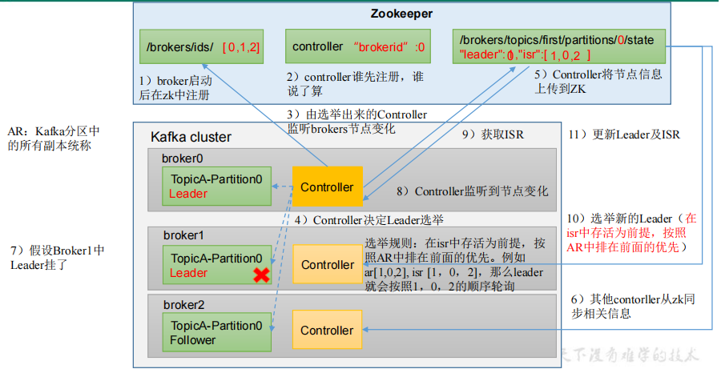

（1）创建一个新的 topic，4 个分区，4 个副本 

```
[root@localhost kafka]# bin/kafka-topics.sh --bootstrap-server 192.168.66.70:9092 --create --topic test2 --partitions 3 --replication-factor 3 
Created topic test2.
```

(2) 查看

```
[root@localhost kafka]#  bin/kafka-topics.sh --bootstrap-server 192.168.66.70:9092 --describe --topic test2
Topic: test2    TopicId: rw_pdhqkS1yxbNg4SjZFsQ PartitionCount: 3       ReplicationFactor: 3    Configs: segment.bytes=1073741824
        Topic: test2    Partition: 0    Leader: 0       Replicas: 0,2,1 Isr: 0,2,1
        Topic: test2    Partition: 1    Leader: 2       Replicas: 2,1,0 Isr: 2,1,0
        Topic: test2    Partition: 2    Leader: 1       Replicas: 1,0,2 Isr: 1,0,2
```

## 8.6 Leader 和 Follower 故障处理细节 

 LEO（Log End Offset）：每个副本的最后一个offset，LEO其实就是最新的offset + 1。 

HW（High Watermark）：所有副本中最小的LEO 。 

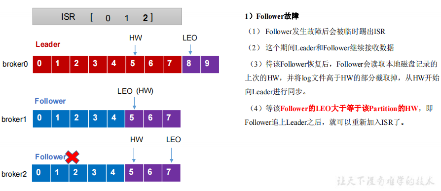

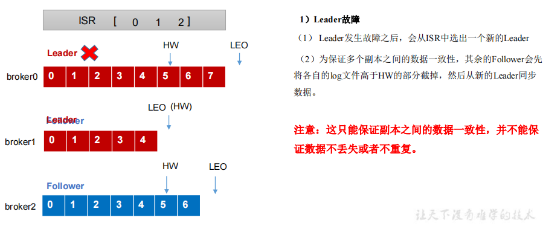

## 8.7 手动调整分区副本存储  

 在生产环境中，每台服务器的配置和性能不一致，但是Kafka只会根据自己的代码规则创建对应的分区副本，就会导致个别服务器存储压力较大。所有需要手动调整分区副本的存储。 

创建副本存储计划 :

```
vi increase-replication-factor.json
{
"version":1,
"partitions":[{"topic":"test3","partition":0,"replicas":[0,1]},
{"topic":"test3","partition":1,"replicas":[0,1]},
{"topic":"test3","partition":2,"replicas":[1,0]},
{"topic":"test3","partition":3,"replicas":[1,0]}] }
```

执行副本存储计划 

```
bin/kafka-reassign-partitions.sh --bootstrap-server 192.168.66.70:9092 --reassignment-json-file increase-replication-factor.json --execute
```

查看：

```
[root@localhost kafka]#  bin/kafka-topics.sh --bootstrap-server 192.168.66.70:9092 --describe --topic test3
Topic: test3    TopicId: HkZL5FkIS4m1myBVp9Yvpg PartitionCount: 16      ReplicationFactor: 2    Configs: segment.bytes=1073741824
        Topic: test3    Partition: 0    Leader: 0       Replicas: 0,1   Isr: 1,0
        Topic: test3    Partition: 1    Leader: 1       Replicas: 0,1   Isr: 1,0
        Topic: test3    Partition: 2    Leader: 0       Replicas: 1,0   Isr: 0,1
        Topic: test3    Partition: 3    Leader: 1       Replicas: 1,0   Isr: 0,1
        Topic: test3    Partition: 4    Leader: 1       Replicas: 1,2,0 Isr: 1,2,0
        Topic: test3    Partition: 5    Leader: 0       Replicas: 0,1,2 Isr: 0,1,2
        Topic: test3    Partition: 6    Leader: 2       Replicas: 2,1,0 Isr: 2,1,0
        Topic: test3    Partition: 7    Leader: 1       Replicas: 1,0,2 Isr: 1,0,2
        Topic: test3    Partition: 8    Leader: 0       Replicas: 0,2,1 Isr: 0,2,1
        Topic: test3    Partition: 9    Leader: 2       Replicas: 2,0,1 Isr: 2,0,1
        Topic: test3    Partition: 10   Leader: 1       Replicas: 1,2,0 Isr: 1,2,0
        Topic: test3    Partition: 11   Leader: 0       Replicas: 0,1,2 Isr: 0,1,2
        Topic: test3    Partition: 12   Leader: 2       Replicas: 2,1,0 Isr: 2,1,0
        Topic: test3    Partition: 13   Leader: 1       Replicas: 1,0,2 Isr: 1,0,2
        Topic: test3    Partition: 14   Leader: 0       Replicas: 0,2,1 Isr: 0,2,1
        Topic: test3    Partition: 15   Leader: 2       Replicas: 2,0,1 Isr: 2,0,1
```

验证：

```
bin/kafka-reassign-partitions.sh --bootstrap-server 192.168.66.70:9092 --reassignment-json-file increase-replication-factor.json --verify
```

## 8.8 增加副本因子 

```
 vim increase-replication-factor.json
 
 {"version":1,"partitions":[{"topic":"four","partition":0,"replicas":[0,1,2]},{"topic":"four","partition":1,"replicas":[0,1,2]},{"topic":"four","partition":2,"replicas":[0,1,2]}]}

bin/kafka-reassign-partitions.sh --bootstrap-server 192.168.66.70:9092 --reassignment-json-file increase-replication-factor.json --execute
```

## 8.9 生产经验——Leader Partition 负载平衡

Kafka本身会自动把Leader Partition均匀分散在各个机器上，来保证每台机器的读写吞吐量都是均匀的。但是如果某些broker宕机，会导致Leader Partition过于集中在其他少部分几台broker上，这会导致少数几台broker的读写请求压力过高，其他宕机的broker重启之后都是follower partition，读写请求很低，造成集群负载不均衡。 

```
auto.leader.rebalance.enable，默认是true。 自动Leader Partition 平衡 
leader.imbalance.per.broker.percentage， 默认是10%。每个broker允许的不平衡的leader的比率。如果每个broker超过了这个值，控制器会触发leader的平衡。 
leader.imbalance.check.interval.seconds， 默认值300秒。检查leader负载是否平衡的间隔时间。
```

# 九、文件存储

## 9.1 文件存储机制 

Topic是逻辑上的概念，而partition是物理上的概念，每个partition对应于一个log文件，该log文件中存储的就是Producer生产的数据。Producer生产的数据会被不断追加到该log文件末端，为防止log文件过大导致数据定位效率低下，Kafka采取了分片和索引机制，将每个partition分为多个segment。每个segment包括：“.index”文件、“.log”文件和.timeindex等文件。这些文件位于一个文件夹下，该文件夹的命名规则为：topic名称+分区序号，例如：first-0。

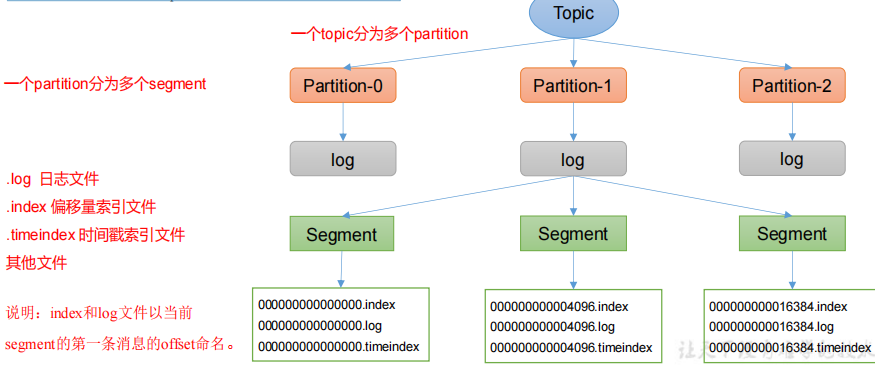

index 文件和 log 文件详解：

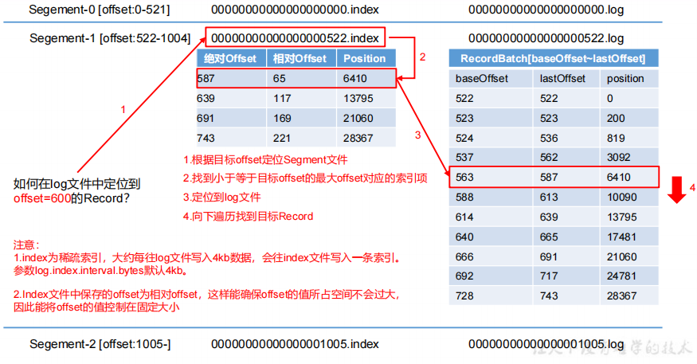

日志存储参数配置 ：

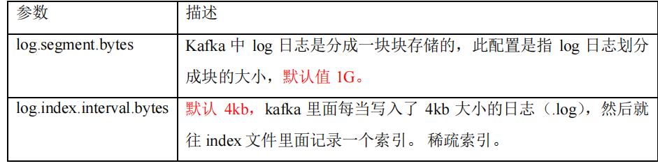

## 9.2 文件清理策略 

 Kafka 中默认的日志保存时间为 7 天，可以通过调整如下参数修改保存时间。 

⚫ log.retention.hours，最低优先级小时，默认 7 天。 

⚫ log.retention.minutes，分钟。 

⚫ log.retention.ms，最高优先级毫秒。 

⚫ log.retention.check.interval.ms，负责设置检查周期，默认 5 分钟。

Kafka 中提供的日志清理策略有 delete 和 compact 两种。 

1）delete 日志删除：将过期数据删除 

⚫ log.cleanup.policy = delete 所有数据启用删除策略 

（1）基于时间：默认打开。以 segment 中所有记录中的最大时间戳作为该文件时间戳。 

（2）基于大小：默认关闭。超过设置的所有日志总大小，删除最早的 segment。 

log.retention.bytes，默认等于-1，表示无穷大。 

思考：如果一个 segment 中有一部分数据过期，一部分没有过期，怎么处理？ 

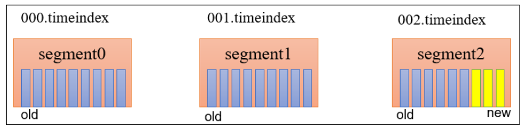

2）compact 日志压缩 

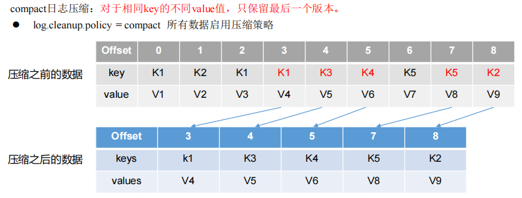

压缩后的offset可能是不连续的，比如上图中没有6，当从这些offset消费消息时，将会拿到比这个offset大的offset对应的消息，实际上会拿到offset为7的消息，并从这个位置开始消费。 

这种策略只适合特殊场景，比如消息的key是用户ID，value是用户的资料，通过这种压缩策略，整个消息集里就保存了所有用户最新的资料。

## 9.3 高效读写数据 

1）Kafka 本身是分布式集群，可以采用分区技术，并行度高 

2）读数据采用稀疏索引，可以快速定位要消费的数据 

3）顺序写磁盘

Kafka 的 producer 生产数据，要写入到 log 文件中，写的过程是一直追加到文件末端，为顺序写。同样的磁盘，顺序写能到 600M/s，而随机写只有 100K/s。这 

与磁盘的机械机构有关，顺序写之所以快，是因为其省去了大量磁头寻址的时间。 

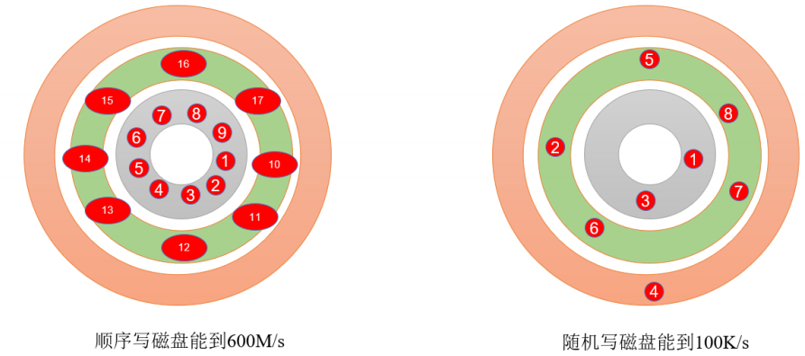

4）页缓存 + 零拷贝技术 

零拷贝：

Kafka的数据加工处理操作交由Kafka生产者和Kafka消费者处理。Kafka Broker应用层不关心存储的数据，所以就不用走应用层，传输效率高。

PageCache页缓存：

Kafka重度依赖底层操作系统提供的PageCache功 能。当上层有写操作时，操作系统只是将数据写入PageCache。当读操作发生时，先从PageCache中查找，如果找不到，再去磁盘中读取。实际上PageCache是把尽可能多的空闲内存都当做了磁盘缓存来使用。

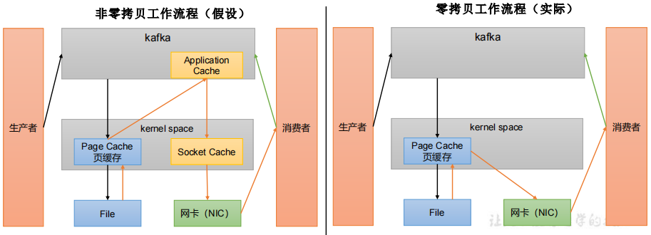

| 参数                        | 描述                                                         |
| --------------------------- | ------------------------------------------------------------ |
| log.flush.interval.messages | 强制页缓存刷写到磁盘的条数，默认是 long 的最大值，9223372036854775807。一般不建议修改，交给系统自己管理。 |
| log.flush.interval.ms       | 每隔多久，刷数据到磁盘，默认是 null。一般不建议修改，交给系统自己管理。 |

# 十、Kafka 消费者 

 ## 10.1 Kafka 消费方式 

pull（拉）模 式： 

consumer采用从broker中主动拉取数据。 Kafka采用这种方式。 

pull模式不足之处是，如 果Kafka没有数据，消费者可能会陷入循环中，一直返回空数据。

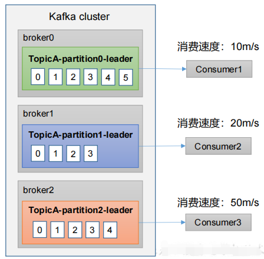

## 10.2 Kafka 消费者工作流程

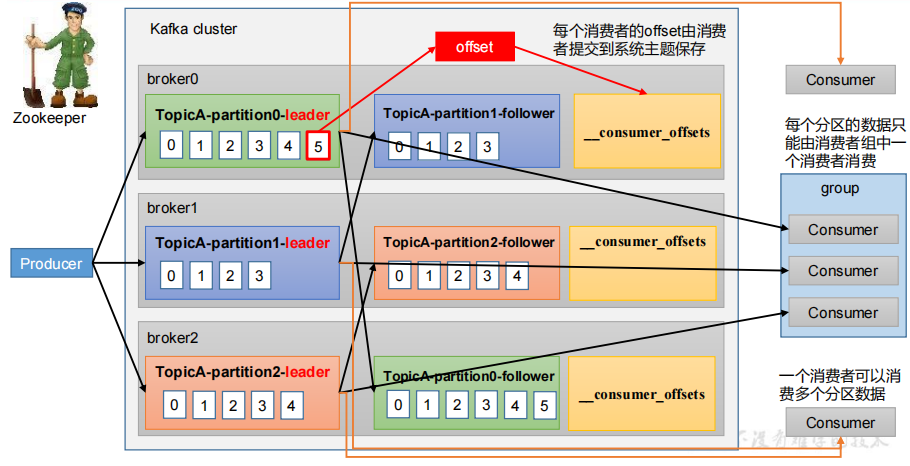

## 10.3 消费者组原理 

Consumer Group（CG）：消费者组，由多个consumer组成。形成一个消费者组的条件，是所有消费者的groupid相同。  

• 消费者组内每个消费者负责消费不同分区的数据，一个分区只能由一个组内消费者消费。 

• 消费者组之间互不影响。所有的消费者都属于某个消费者组，即消费者组是逻辑上的一个订阅者。 

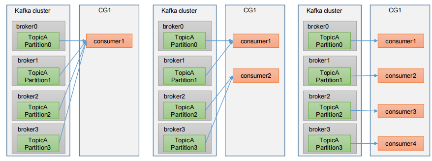

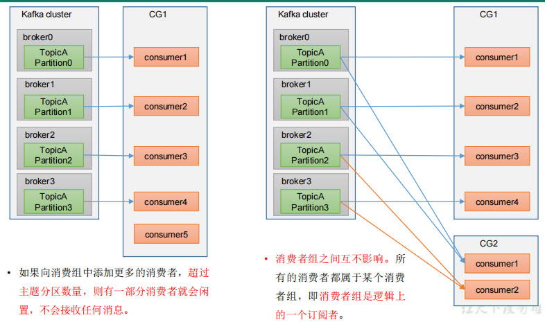

消费者组初始化流程 ：

1、coordinator：辅助实现消费者组的初始化和分区的分配。 

coordinator节点选择 = groupid的hashcode值 % 50（ __consumer_offsets的分区数量） 

例如： groupid的hashcode值 = 1，1% 50 = 1，那么__consumer_offsets 主题的1号分区，在哪个broker上，就选择这个节点的coordinator 

作为这个消费者组的老大。消费者组下的所有的消费者提交offset的时候就往这个分区去提交offset。 

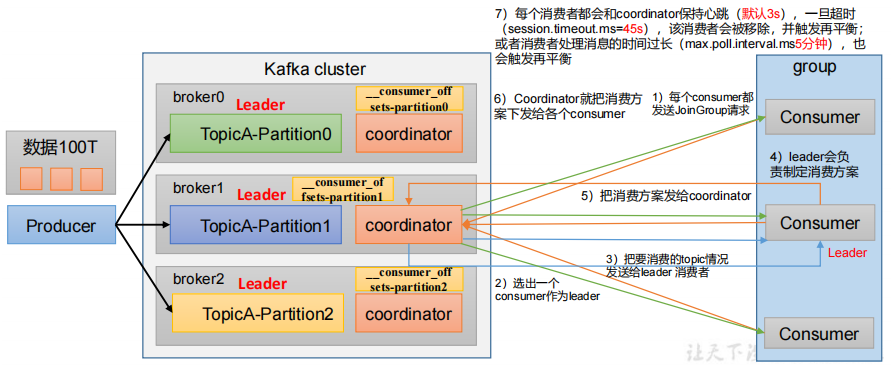

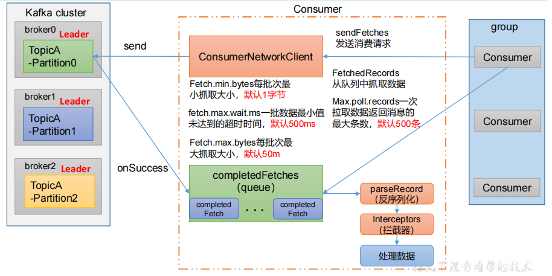

## 10.4 消费者重要参数 

| 参数名称                               | 描述                                                         |
| -------------------------------------- | ------------------------------------------------------------ |
| bootstrap.servers                      | 向 Kafka 集群建立初始连接用到的 host/port 列表。             |
| key.deserializer 和 value.deserializer | 指定接收消息的 key 和 value 的反序列化类型。一定要写全类名。 |
| group.id                               | 标记消费者所属的消费者组。                                   |
| enable.auto.commit                     | 默认值为 true，消费者会自动周期性地向服务器提交偏移量。      |
| auto.commit.interval.ms                | 如果设置了 enable.auto.commit 的值为 true， 则该值定义了消费者偏移量向 Kafka 提交的频率，默认 5s。 |
| auto.offset.reset                      | 当 Kafka 中没有初始偏移量或当前偏移量在服务器中不存在（如，数据被删除了），该如何处理？ earliest：自动重置偏移量到最早的偏移量。 latest：默认，自动重置偏移量为最 新的偏移量。 none：如果消费组原来的（previous）偏移量不存在，则向消费者抛异常。 anything：向消费者抛异常。offsets.topic.num.partitions __consumer_offsets 的分区数，默认是 50 个分区。 |
| heartbeat.interval.ms                  | Kafka 消费者和 coordinator 之间的心跳时间，默认 3s。 该条目的值必须小于 session.timeout.ms ，也不应该高于session.timeout.ms 的 1/3。 |
| session.timeout.ms                     | Kafka 消费者和 coordinator 之间连接超时时间，默认 45s。 超过该值，该消费者被移除，消费者组执行再平衡。 |
| max.poll.interval.ms                   | 消费者处理消息的最大时长，默认是 5 分钟。超过该值，该 消费者被移除，消费者组执行再平衡。 |
| fetch.min.bytes                        | 默认 1 个字节。消费者获取服务器端一批消息最小的字节数。      |
| fetch.max.wait.ms                      | 默认 500ms。如果没有从服务器端获取到一批数据的最小字节数。该时间到，仍然会返回数据。 |
| fetch.max.bytes                        | 默认 Default: 52428800（50 m）。消费者获取服务器端一批消息最大的字节数。如果服务器端一批次的数据大于该值（50m）仍然可以拉取回来这批数据，因此，这不是一个绝 对最大值。一批次的大小受 message.max.bytes （broker  config）or max.message.bytes （topic config）影响。 |
| max.poll.records                       | 一次 poll 拉取数据返回消息的最大条数，默认是 500 条。        |

## 10.5 生产经验——分区的分配以及再平衡 

 Kafka有四种主流的分区分配策略： Range、RoundRobin、Sticky、CooperativeSticky。 

可以通过配置参数partition.assignment.strategy，修改分区的分配策略。默认策略是Range + CooperativeSticky。Kafka可以同时使用多个分区分配策略。 

| 参数名称                      | 描述                                                         |
| ----------------------------- | ------------------------------------------------------------ |
| heartbeat.interval.ms         | Kafka 消费者和 coordinator 之间的心跳时间，默认 3s。该条目的值必须小于 session.timeout.ms，也不应该高于 session.timeout.ms 的 1/3。 |
| session.timeout.ms            | Kafka 消费者和 coordinator 之间连接超时时间，默认 45s。超过该值，该消费者被移除，消费者组执行再平衡。 |
| max.poll.interval.ms          | 消费者处理消息的最大时长，默认是 5 分钟。超过该值，该消费者被移除，消费者组执行再平衡。 |
| partition.assignment.strategy | 消 费 者 分 区 分 配 策 略 ， 默 认 策 略 是 Range + CooperativeSticky。Kafka 可以同时使用多个分区分配策略。 可 以 选 择 的 策 略 包 括 ： Range 、 RoundRobin 、 Sticky 、CooperativeSticky |

### 10.5.1 Range 以及再平衡

Range 是对每个 topic 而言的。 

首先对同一个 topic 里面的分区按照序号进行排序，并对消费者按照字母顺序进行排序。 

假如现在有 7 个分区，3 个消费者，排序后的分区将会 是0,1,2,3,4,5,6；消费者排序完之后将会是C0,C1,C2。 

例如，7/3 = 2 余 1 ，除不尽，那么 消费者 C0 便会多消费 1 个分区。 8/3=2余2，除不尽，那么C0和C1分别多消费一个。 

通过 partitions数/consumer数 来决定每个消费者应该消费几个分区。如果除不尽，那么前面几个消费者将会多消费 1 个分区。 

注意：如果只是针对 1 个 topic 而言，C0消费者多消费1个分区影响不是很大。但是如果有 N 多个 topic，那么针对每个 topic，消费者 C0都将多消费 1 个分区，topic越多，C0消费的分区会比其他消费者明显多消费 N 个分区。 

容易产生数据倾斜！ 

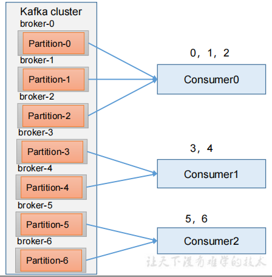

### 10.5.2 RoundRobin 

 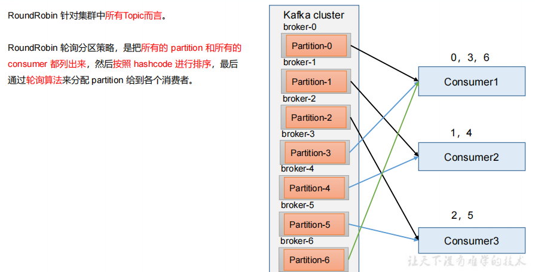

```
// 修改分区分配策略
properties.put(ConsumerConfig.PARTITION_ASSIGNMENT_STRATEGY_CONFIG, "org.apache.kafka.clients.consumer.RoundRobinAssignor");
```

### 10.5.3 Sticky 以及再平衡 

粘性分区定义：可以理解为分配的结果带有“粘性的”。即在执行一次新的分配之前，考虑上一次分配的结果，尽量少的调整分配的变动，可以节省大量的开销。 

粘性分区是 Kafka 从 0.11.x 版本开始引入这种分配策略，首先会尽量均衡的放置分区到消费者上面，在出现同一消费者组内消费者出现问题的时候，会尽量保持原有分配的分区不变化。 

```
org.apache.kafka.clients.consumer.StickyAssignor
```

## 10.6 offset 位移 

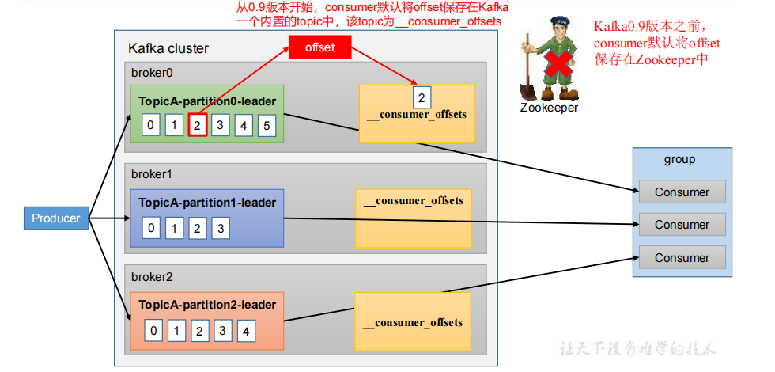

__consumer_offsets 主题里面采用 key 和 value 的方式存储数据。key 是 group.id+topic+分区号，value 就是当前 offset 的值。每隔一段时间，kafka 内部会对这个 topic 进行compact，也就是每个 group.id+topic+分区号就保留最新数据。

自动提交 offset :

- enable.auto.commit：是否开启自动提交offset功能，默认是true 
- auto.commit.interval.ms：自动提交offset的时间间隔，默认是5s

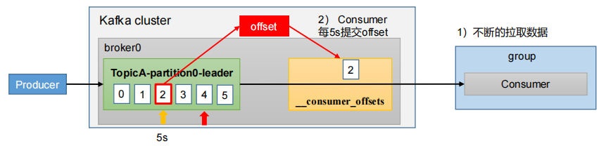

手动提交：

commitSync（同步提交）：必须等待offset提交完毕，再去消费下一批数据。 

commitAsync（异步提交） ：发送完提交offset请求后，就开始消费下一批数据了。

指定 Offset 消费 ：

auto.offset.reset = earliest | latest | none 默认是 latest。 

当 Kafka 中没有初始偏移量（消费者组第一次消费）或服务器上不再存在当前偏移量时（例如该数据已被删除），该怎么办？ 

（1）earliest：自动将偏移量重置为最早的偏移量，--from-beginning。 

（2）latest（默认值）：自动将偏移量重置为最新偏移量。 

（3）none：如果未找到消费者组的先前偏移量，则向消费者抛出异常。 

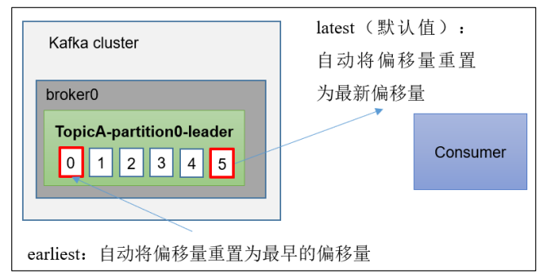


## 10.7 漏消费和重复消费

 重复消费：已经消费了数据，但是 offset 没提交。 

漏消费：先提交 offset 后消费，有可能会造成数据的漏消费

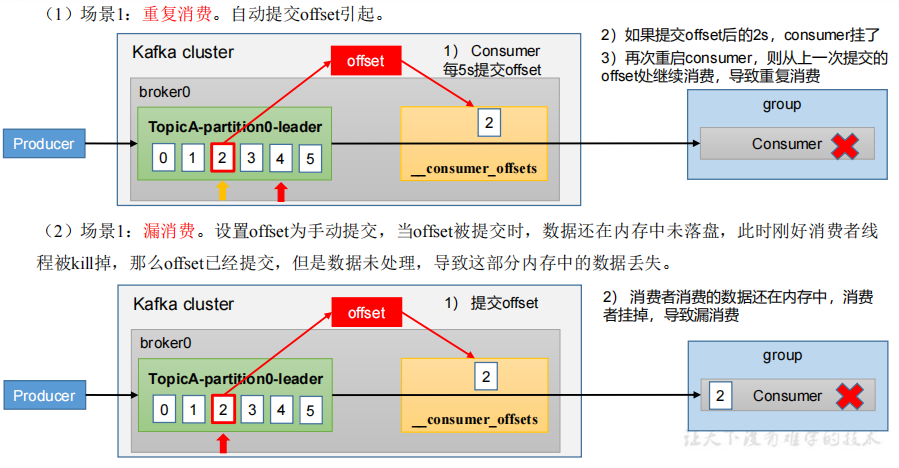

## 10.8 消费者事务 

Kafka消费端将消费过程和提交offset过程做原子绑定

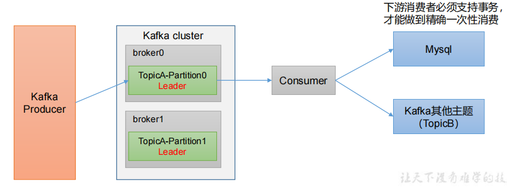

## 10.9 数据积压（消费者如何提高吞吐量） 

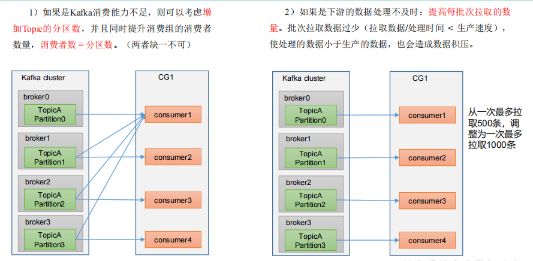

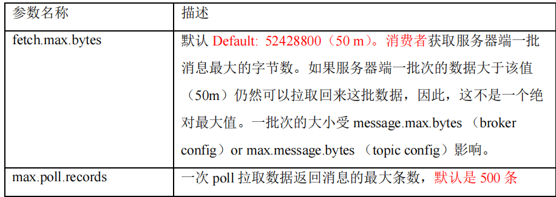


学习源码：

https://github.com/leelun/kafkaexamples.git


 

 


 


 


 

 

 


 


 

 

 


 


 


 


 

 


