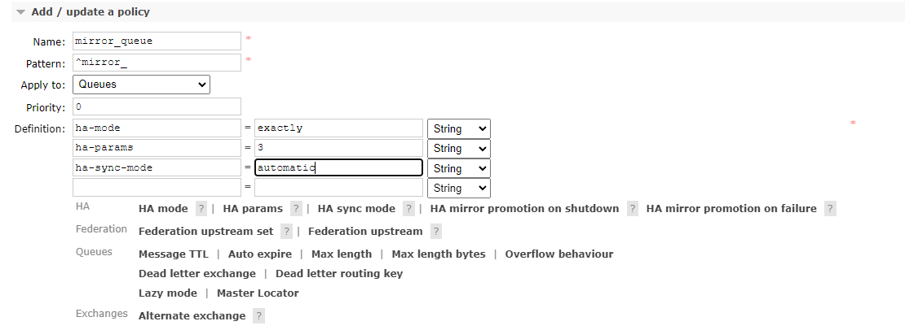

## 1 清理单机内容 

要搭建集群,先将之前单机版中历史记录干掉,删除rabbitmq /var/lib/rabbitmq/mnesia下的所有内容。

## 2 启动伪集群实例 

```
RABBITMQ_NODE_IP_ADDRESS=0.0.0.0 RABBITMQ_NODE_PORT=5672 RABBITMQ_SERVER_START_ARGS="-rabbitmq_management listener [{port,15672}]" RABBITMQ_NODENAME=rabbit rabbitmq-server -detached
RABBITMQ_NODE_IP_ADDRESS=0.0.0.0 RABBITMQ_NODE_PORT=5673 RABBITMQ_SERVER_START_ARGS="-rabbitmq_management listener [{port,15673}]" RABBITMQ_NODENAME=rabbit2 rabbitmq-server -detached
RABBITMQ_NODE_IP_ADDRESS=0.0.0.0 RABBITMQ_NODE_PORT=5674 RABBITMQ_SERVER_START_ARGS="-rabbitmq_management listener [{port,15674}]" RABBITMQ_NODENAME=rabbit3 rabbitmq-server -detached
```

rabbitmq-defaults 的相应配置 :

```
RABBITMQ_NODE_IP_ADDRESS：绑定某个特定的网络接口 .默认值是空字符串 ，即绑定到所有网络接口上.如果要 绑定两个或者更多的网络接口，可以参考 rabbitmq.∞咽句中的 tcp_listeners 配置
RABBITMQ_NODE_PORT：监听客户端连接的端口号，默认为 5672
RABBITMQ_DIST_PORT：RabbitMQ 节点内部通信的端口号，默认值为 RABBITMQ_NODE_PORT+20000.即25672。如果设置了kernel.inet_dist_listen_min 或者 kernel.inect_dist_listen_max时，此环绕变量将被忽略
RABBITMQ_NODENAME：RabbitMQ的节点名称，默认为 rabbit@$HOSTNAME。在每个 Erlang 节点和机器的组合中，节点名称必须唯一
RABBITMQ_CONF_ENV_FlLE：RabbitMQ 环境变量的配置文件(rabbitmq-env.conf)的地址，默认值为$RABBITMQ_HOME/etc/rabbitmq/rabbitmq-env.conf注意这里与RabbitMq配置文件rabbitmq.config的区别。
RABBITMQ_USE_LONGNAME：如果当前的 hostname 为node1.longname，那么默认情况下创建的节点名称为rabbit@nodel.将此参数设置为 true 时，创建的节点名称就为rabbit@node1.longname，即使用了长名称命名.默认值为空
RABBITMQ_CONFIG_FILE：RabbitMq配置文件(rabbitmq.config)的路径，注意没有".config" 的后缀。默认值为$RABBITMQ_HOME/etc/rabbitmq/rabbitmq
RABBITMQ_MNESIA_BASE：RABBITMQ_MNESIA_DIR的父目录。除非明确设置了 RABBITMQ_MNESIA_DIR 目录，否则每个节点都应该配置这个环境变量.默认值为$RABBITMQ_HOME/var/lib/rabbitmq/mnesia注意对于RabbitMQ的操作用户来说，需要有对当前目录可读、可写、可创建文件及子目录的权限
RABBITMQ_MNESIA_DIR：包含 RabbitMQ服务节点的数据库、数据存储及集群状态等目录，默认值为$RABBITMQ_MNESIA_BASEI$RABBITMQ_NODENAME
RABBITMQ_LOG_BASE：RabbitMQ 服务日志所在基础目录.默认值为$RABBITMQ_HOME/var/log/rabbitmq
RABBITMQ_LOGS：RabbitMQ 服务与 Erlang 相关的日志，默认值为 $RABBITMQ_LOG_BASEI$RABBITMQ_NODENAME.log
RABBITMQ_SASL_LOGS：RabbitMQ 服务于 Erlang的SASL(System Application Support Libraries)相关的日志，默认值为$RABBITMQ_LOG_BASE/$RABBITMQ_NODENAME-sasl.log
RABBJTMQ_PLUGINS_DIR：插件所在路径。默认值为$RABBITMQ_HOME/plugins
```

## 3 rabbit伪集群搭建

rabbit2的配置:

```
rabbitmqctl -n rabbit2 stop_app
rabbitmqctl -n rabbit2 reset
rabbitmqctl -n rabbit2 join_cluster rabbit@`hostname -s`
#join_cluster所有节点再启动start_app
rabbitmqctl -n rabbit2 start_app
```

rabbit3的配置:

```
rabbitmqctl -n rabbit3 stop_app
rabbitmqctl -n rabbit3 reset
rabbitmqctl -n rabbit3 join_cluster rabbit@`hostname -s`
#join_cluster所有节点再启动start_app
rabbitmqctl -n rabbit3 start_app
```

## 4 查看集群信息

```
rabbitmqctl -n rabbit cluster_status
```

## 5 高可用集群

```
rabbitmqctl set_policy ha-all "^" '{"ha-mode":"all"}'
```

## 6 镜像队列

```
rabbitmqctl set_policy --priority 0 --apply-to queues mirror_queue "^mirror_" '{"ha-mode":"exactly","ha-params":3,"ha-sync-mode":"automatic"}'
```

说明：添加镜像队列mirror_queue，匹配规则为"mirror_"开头队列，匹配到队列，规则为exactly指定代理生成ha-params=3的个数上生成镜像，并且ha-sync-mode为异步

通过界面添加镜像队列：



测试源码：

https://github.com/leelun/rabbitmq-learn