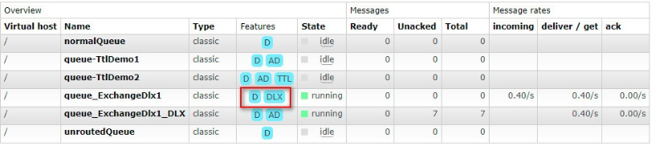
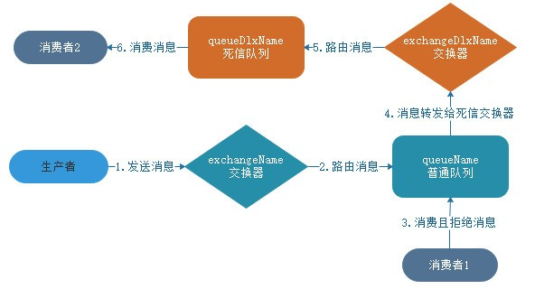
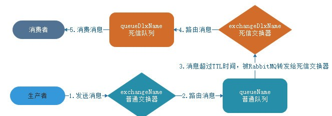
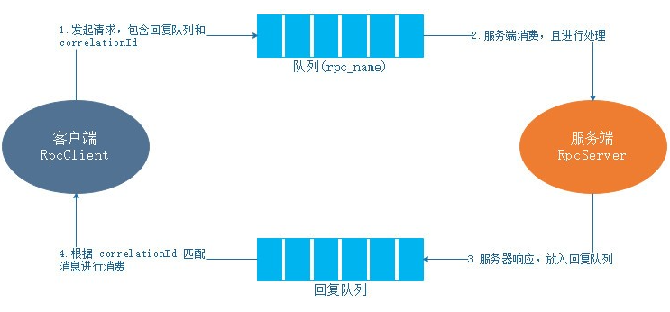
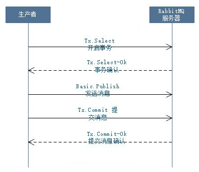
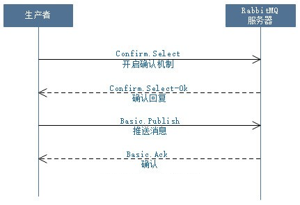

# 一、未匹配消息最终走向

## 1.1 未被路由的情况

```java
void basicPublish(String exchange, String routingKey, boolean mandatory, boolean immediate, BasicProperties props, byte[] body) throws IOException;
```

参数说明：

- **mandatory：**

  交换器无法根据自身的类型和路由键找到一个符合条件的队列时。

  true：RabbitMQ 会调用 Basic.Return 命令将消息返回给生产者。

  false：消息直接被丢弃。

- **immediate：**

  当 immediate 参数设为 true 时，如果交换器在将消息路由到队列时发现队列上并不存在任何消费者，那么这条消息将不会存入队列中。当与路由键匹配的所有队列都没有消费者时，该消息会通过 Basic .Return 返回至生产者。

```java
// 创建通道
Channel channel = connection.createChannel();
channel.exchangeDeclare(EXCHANGE_NAME, "topic");
channel.addReturnListener(new ReturnListener() {
    public void handleReturn(int replyCode, String replyText, String exchange,
            String routingKey, AMQP.BasicProperties properties,
            byte[] body) throws IOException {
        System.out.println("<< " + new String(body));
    }
});
// 发送消息
channel.basicPublish(EXCHANGE_NAME, "",true,
                     MessageProperties.PERSISTENT_TEXT_PLAIN, msg);
```

## 1.2 备份交换器（AE）

通过在声明交换器（调用 channel.exchangeDeclare 方法）的时候添加 alternate-exchange 参数来实现，也可以通过策略（ Policy）的方式实现。如果两者同时使用，则声明交换器时设置的优先级更高，会覆盖掉 Policy 的设置。 

```java
// 声明交换器
// 下面交换器用作备份交换器，该交换器的所有消息均路由到 unroutedQueue 队列
channel.exchangeDeclare("myAe","direct",
        true , false, null) ;
channel.queueDeclare("unroutedQueue", true,
        false , false, null);
channel.queueBind("unroutedQueue","myAe","");
 
// 下面交换器通过 alternate-exchange 参数设置一个备份交换器
// 将交换器 myAe 设置为 normalExchange 的交换器
Map<String, Object> exchangeArgs = new HashMap<String, Object>();
exchangeArgs.put("alternate-exchange", "myAe");
channel.exchangeDeclare("normalExchange","direct",
        true, false, exchangeArgs);
channel.queueDeclare("normalQueue", true,
        false , false , null);
channel.queueBind("normalQueue", "normalExchange", "normalKey");
```

步骤说明：

1 申明备份交换器

申请一个交换器myAe和队列unroutedQueue，然后绑定myAe和unroutedQueue  

```java
channel.exchangeDeclare("myAe","direct",
        true , false, null) ;
channel.queueDeclare("unroutedQueue", true,
        false , false, null);
channel.queueBind("unroutedQueue","myAe","");
```

2 申请一个交换器normalExchange和队列normalQueue，通过alternate-exchange指定备份交换器myAe，然后绑定normalExchange和normalQueue

```java
Map<String, Object> exchangeArgs = new HashMap<String, Object>();
exchangeArgs.put("alternate-exchange", "myAe");
channel.exchangeDeclare("normalExchange","direct",
        true, false, exchangeArgs);
channel.queueDeclare("normalQueue", true,
        false , false , null);
channel.queueBind("normalQueue", "normalExchange", "normalKey");
```

# 二、过期时间

RabbitMQ 可以对消息和队列设置过期时间（TTL，全称 Time To Live）

- 第一种方法是通过队列属性设置，队列中所有消息都有相同的过期时间。
- 第二种方法是对消息进行单独设置，每条消息的过期时间可以不同。

如果同时设置队列和消息的过期时间，则消息的过期时间以两者之间过期时间较小的那个数值为准。消息在队列的生存时间一旦超过设置的过期时间值，就成为“死信”（Dead Message），消费者将无法再收到该消息。 

## 2.1 设置消息TTL

### 2.1.1 通过消息属性

如果需要为每条消息单独设置过期时间， 通过往 AMQP.BasicProperties 属性中添加 expiration 属性来实现（单位：毫秒） 

```java
// 发送消息
AMQP.BasicProperties properties = new AMQP.BasicProperties.Builder()
        .deliveryMode(2) // 持久化消息
        .expiration("6000") // 设置过期时间为 6 秒,等待 6 秒钟后消息将会自动删除。
        .build();
 
channel.basicPublish(EXCHANGE_NAME, "",
        properties, "ttl message".getBytes());
```

### 2.1.2 通过队列属性

在声明队列的时候通过队列属性设置消息过期时间的方法是在 channel.queueDeclare() 方法中加入 x-message-ttl 参数实现，参数单位是毫秒。 

```java
// 声明队列
Map<String,Object> argss =new HashMap<String,Object>() ;
argss.put("x-message-ttl", 6000); // 设置过期时间为 6 秒
channel.queueDeclare(QUEUE_NAME, true, false, true, argss) ;
channel.queueBind(QUEUE_NAME, EXCHANGE_NAME, "");
```

## 2.2 设置队列TTL

通过 channel.queueDeclare() 方法中的 x-expires 参数控制队列被自动删除前处于未使用状态的时间。未使用的意思是队列上没有任何的消费者，队列也没有被重新声明，并且在过期时间段内也未调用过 Basic.Get 命令。 

设置队列里的过期时间可以应用于类似 RPC 方式的回复队列。在 RPC 中，许多队列会被创建出来，但是却是未被使用的。

RabbitMQ 会确保在过期时间到达后将队列删除，但是不能保证队列会被及时删除。在 RabbitMQ 重启后，持久化的队列的过期时间会被重新计算。

x-expires 参数以毫秒为单位，不能设置为 0。 

```java
// 声明队列
Map<String,Object> argss =new HashMap<String,Object>() ;
argss.put("x-expires", 6000); // 设置过期时间为 6 秒
channel.queueDeclare(QUEUE_NAME, true, false, false, argss) ;
channel.queueBind(QUEUE_NAME, EXCHANGE_NAME, "");
```

# 三、死信队列（DLX）

当出现路由键和绑定键不匹配，或者交换器上面没有绑定队列等导致消息无法被正确的投递，为了确保消息不会被无故的丢弃，可以将其置于一个特殊的队列中，这个队列一般称之为死信队列。

如果消息在一个队列中变成死信（Dead Message）之后，它将被重新发送到另一个交换器中，该交换器称为死信交换器，绑定在死信交换器上的队列就称之为死信队列。

死信交换器的简称为 DLX（Dead-Letter-Exchange），消息变成死信有如下几种情况：

- 消息被拒绝（Basic.Reject/Basic.Nack），并且设置 requeue 参数为 false；
- 消息过期；
- 队列达到最大长度；
- 路由键和绑定键不匹配
- 交换器上面没有绑定队列

死信交换器也是一个正常的交换器，和一般的交换器没有区别，它能在任何的队列上被指定，实际上就是设置某个队列的属性。当这个队列中存在死信时 RabbitMQ 就会自动地将这个消息重新发布到设置的死信交换器，进而死信交换器将消息路由到绑定到它的队列（即死信队列）。我们可以监听这个队列中的消息、以进行相应的处理，这个特性与将消息的 TTL 设置为 0 配合使用可以弥补 immediate 参数的功能。



“D”（即持久化 durable）。其中，queueName 队列还标记了“DLX”，DLX 指的是 x-dead-letter-exchange 属性设置的死信交换器。 

消费者拒绝消息情况下的死信队列流程图：



## 3.1 队列添加死信交换器

通过在队列声明方法 channel.queueDeclare() 中设置 x-dead-letter-exchange 参数来为当前队列添加死信交换器（DLX）。 

```java
// 声明死信交换器和死信队列
channel.exchangeDeclare(exchangeDlxName, "fanout");
channel.queueDeclare(queueDlxName, true, false, true, null);
// 将死信队列绑定到死信交换器上
channel.queueBind(queueDlxName, exchangeDlxName, "");
  
// 声明普通交换器和队列
channel.exchangeDeclare(exchangeName, "topic");
Map<String,Object> queueArgs = new HashMap<String, Object>();
// 为队列设置死信交换器
queueArgs.put("x-dead-letter-exchange", exchangeDlxName);
channel.queueDeclare(queueName, true, false, false, queueArgs);
// 将普通队列绑定到普通交换器
channel.queueBind(queueName, exchangeName, "");
```

# 四、延迟队列

延迟队列顾名思义就是存放延迟消息的队列，所谓“延迟消息”是指消息被发送后，并不想让消费者立刻进行消费，而是需要等待指定的时间后，消费者才能够进行消费。 

延迟队列的使用场景：订单支付、定时任务等。

模拟延迟队列的思路：

消息生产者发送一个带有 TTL（过期时间）的消息到正常的交换器，且正常交换器绑定的队列没有被任何消费者订阅（也就不会被消费）。当时间超过我们为消息设置的 TTL 时间后，RabbitMQ 将会自动将过期的消息发送到队列指定的死信交换器，死信交换器将消息路由到死信队列。此时，如果有消费者订阅了死信队列，则这些消息将被消费者消费，就这样成功模拟了一个延迟队列。消息流转过程如下图： 



生产者代码：

```java
// 声明死信交换器和死信队列，且将两者绑定到一起
channel.exchangeDeclare(exchangeDlxName, "fanout");
channel.queueDeclare(queueDlxName, true, false, true, null);
channel.queueBind(queueDlxName, exchangeDlxName, "");
 
// 声明普通交换器和队列，且将两者绑定到一起
channel.exchangeDeclare(exchangeName, "topic");
Map<String,Object> queueArgs = new HashMap<String, Object>();
// 为队列设置死信交换器
queueArgs.put("x-dead-letter-exchange", exchangeDlxName);
channel.queueDeclare(queueName, true, false, false, queueArgs);
channel.queueBind(queueName, exchangeName, "");
 
// 通过消息属性设置设置消息TTL时间
AMQP.BasicProperties properties = new AMQP.BasicProperties.Builder()
        .deliveryMode(2) // 持久化消息
        .expiration("10000") // 设置 TTL=10秒
        .build();
        
channel.basicPublish(exchangeName, "", properties, message.getBytes());
```

消费者代码：

```java
// 声明队列
// 声明死信交换器和死信队列，且将两者绑定
channel.exchangeDeclare(exchangeDlxName, "direct");
channel.queueDeclare(queueDlxName, true, false, true, null);
channel.queueBind(queueDlxName, exchangeDlxName, "");
// 消费消息
channel.basicConsume(queueDlxName, false, new DefaultConsumer(channel){
    @Override
    public void handleDelivery(String consumerTag, Envelope envelope,
            AMQP.BasicProperties properties, byte[] body) throws IOException {
        System.out.println("[Consumer] body = " + new String(body));
    }
});
```

# 五、优先级队列

优先级（priority）是一种约定，通常约定优先级高的先做/先处理，优先级低的后做/后处理。 

在 RabbitMQ 中，可以通过设置队列的 x-max-priority 参数来实现。 

生产者：

队列的优先级

```java
// 声明交换器
channel.exchangeDeclare(EXCHANGE_NAME, "topic");
// 声明队列
Map<String,Object> argss =new HashMap<String,Object>() ;
// 设置队列的优先级为10
argss.put("x-max-priority", 10);
channel.queueDeclare(QUEUE_NAME, true, false, true, argss) ;
channel.queueBind(QUEUE_NAME, EXCHANGE_NAME, "");
```

设置发送消息的优先级

```java
// 为每个消息设置随机优先级，优先级位于 0~10
int priority = (int)(Math.random()*11);
String message = "Priority Message priority=" + priority;
// 设置消息的优先级
AMQP.BasicProperties msgProps = new AMQP.BasicProperties.Builder()
    .priority(priority).build();
channel.basicPublish(EXCHANGE_NAME, "",
                     msgProps, message.getBytes());
```

消费者：

```java
// 创建信道
final Channel channel = connection.createChannel();
 
// 声明交换器
channel.exchangeDeclare(EXCHANGE_NAME, "topic");
 
// 声明队列
Map<String,Object> argss =new HashMap<String,Object>() ;
// 设置队列的优先级为10
argss.put("x-max-priority", 10);
channel.queueDeclare(QUEUE_NAME, true, false, true, argss) ;
channel.queueBind(QUEUE_NAME, EXCHANGE_NAME, "");
 
// 消费消息
System.out.println("[Consumer] Waiting Message...");
channel.basicConsume(QUEUE_NAME, false, new DefaultConsumer(channel){
    @Override
    public void handleDelivery(String consumerTag, Envelope envelope,
            AMQP.BasicProperties properties, byte[] body) throws IOException {
        try {
            // 模拟费时超过
            System.out.println("[Consumer] message = " + new String(body));
            Thread.sleep(1000);
 
            // 手动发送ACK确认消息
            channel.basicAck(envelope.getDeliveryTag(), false);
        } catch (Exception e) {
            e.printStackTrace();
        }
    }
});
```

代码分析：

最高优先级为队列设置的最大优先级（上面设置的为10），每个消息设置了随机优先级，默认最低优先级为 0。

上面的代码中为每个消息设置了随机优先级，默认最低优先级为 0，最高优先级为队列设置的最大优先级（上面设置的为10）。

优先级高的消息可以被优先消费，前提：

如果在消费者的消费速度大于生产者的速度且 Broker 服务中没有消息堆积的情况下，对发送的消息设置优先级也就没有什么实际意义。因为生产者刚发送完一条消息就被消费者消费了，那么就相当于 Broker 服务中至多只有一条消息，对于单条消息来说优先级是没有什么意义的。 

# 六、回复队列

在 RabbitMQ 中，回复队列主要用于接收 RPC 调用的响应消息。 

```java
Channel channel = connection.createChannel();
// 由 RabbitMQ 自动创建队列名
String replyQueueName = channel.queueDeclare().getQueue();
// 消息唯一标识，消费的时候需要进行对别
String corrId = UUID.randomUUID().toString();
// 通过属性设置回复队列
AMQP.BasicProperties props = new AMQP.BasicProperties.Builder()
        .correlationId(corrId)
        .replyTo(replyQueueName)
        .build();
// 发送一个消息
channel.basicPublish("", RPC_QUEUE_NAME, props, message.getBytes());

```

生产者（RPC客户端）和一个消费者（RPC服务端），生产者向一个普通的队列发送一条消息（该消息需要设置一个回复队列，通过 replyTo() 进行设置，以及一个消息唯一标识符 correlationId），消费者订阅该队列。

当消费者收到消息时，进行业务处理，业务处理完成后，将处理结果和收到消息的唯一标识符一并打包发送到回复队列（回复队列从收到消息的 replyTo 中获取），这条消息可以称为响应消息。然后，生产者从回复队列中接收响应消息，并根据消息唯一标识符进行处理。整个过程如下图： 



消费者：

```java
channel.queueDeclare(RPC_QUEUE_NAME, false, false, false, null) ;
// 指该消费者在接收到队列里的消息但没有返回确认结果之前,队列不会将新的消息分发给该消费者。
// 队列中没有被消费的消息不会被删除，还是存在于队列中
channel.basicQos(1) ;
 
System.out.println("[RpcServer] Awaiting RPC requests");
channel.basicConsume(RPC_QUEUE_NAME, false, new DefaultConsumer(channel) {
    @Override
    public void handleDelivery(String consumerTag, Envelope envelope,
            AMQP.BasicProperties properties, byte[] body) throws IOException {
        String response = "";
        try {
            String message = new String(body, "UTF-8");
            int n = Integer.parseInt(message);
            System.out.println("[RpcServer] fib(" + message + ")");
            // 计算斐波那契数列
            // 调用业务方法
            response += fib(n);
        } catch (RuntimeException e) {
            System.out.println("[RpcServer] " + e.toString());
        } finally {
            // 回复消息属性
            AMQP.BasicProperties replyProps = new AMQP.BasicProperties.Builder()
                    // 消息的唯一标识回传
                    .correlationId(properties.getCorrelationId())
                    .build();
            // 将响应消息写入到回复队列，回复队列有客户端通过 replyTo 指定
            channel.basicPublish("", properties.getReplyTo(),
                    replyProps, response.getBytes("UTF-8"));
            // 手动确认消息
            channel.basicAck(envelope.getDeliveryTag(), false);
        }
    }
});
```

生产者：

```java
// 发送消息给RPC服务端
String corrId = UUID.randomUUID().toString();
AMQP.BasicProperties props = new AMQP.BasicProperties.Builder()
        .correlationId(corrId)
        .replyTo(replyQueueName)
        .build();
channel.basicPublish("", RPC_QUEUE_NAME, props, message.getBytes());
 
// 等待接收服务端响应
String response;
while (true) {
    QueueingConsumer.Delivery delivery= consumer.nextDelivery();
    if(delivery.getProperties().getCorrelationId().equals(corrId)) {
        response = new String(delivery.getBody());
        break;
    }
}
```

#七、持久化

持久化（Persistence），即把数据（如内存中的对象）保存到可永久保存的存储设备中（如磁盘）。持久化的主要应用是将内存中的对象存储在数据库中，或者存储在磁盘文件中、XML数据文件中等等。 

持久化可以提高 RabbitMQ 的可靠性，以防止在异常情况（重启、关闭、宿机等）下的数据丢失。RabbitMQ 的持久化分为三个部分：交换器持久化、队列持久化和消息持久化 

## 7.1 交换器（Exchange）持久化

 exchangeDeclare() 中的 durable 参数置为 true 实现的 ，将交换器信息存储到磁盘，重启 RabbitMQ 服务后交换器信息不会丢失。 

```java
Exchange.DeclareOk exchangeDeclare(String exchange, String type, boolean durable, boolean autoDelete, Map<String, Object> arguments) throws IOException;
```

如果设置为 false，则不开启持久化功能，那么在 RabbitMQ 服务重启之后，相关的交换器元数据会丢失，不过消息不会丢失。只是不能将新的消息发送到该交换器中了。如果需要长期使用的交换器，建议将其设置为持久化。 

## 7.2 队列（Queue）持久化

队列的持久化是通过将声明队列方法 queueDeclare() 中的 durable 参数置为 true 实现的，队列开启持久化功能 . 队列的持久化能保证其本身的元数据不会因异常情况而丢失，但是并不能保证内部所存储的消息不会丢失。 

如果设置为 false，则队列不开启持久化功能。那么在 RabbitMQ 服务重启之后，队列相关的元数据会丢失，存储在队列中的消息也会丢失。 

```java
Queue.DeclareOk queueDeclare(String queue, boolean durable , boolean exclusive,  boolean autoDelete , Map<String, Object> arguments) throws IOException;
```

## 7.3 消息（Message）持久化

消息持久化可以通过将消息的投递模式 (BasicProperties 中的 deliveryMode 属性）设置为 2 即可实现消息的持久化。 

```java
BasicProperties PERSISTENT_TEXT_PLAIN =
	new BasicProperties("text/plain",null,null,2,0, null, null, null,null, null, null, null,null, null);
// 发送消息
System.out.println("[Send] Sending Message...");
boolean mandatory = true;
byte[] msg = "hello wrold".getBytes();
channel.basicPublish(EXCHANGE_NAME, "",
        mandatory, MessageProperties.PERSISTENT_TEXT_PLAIN, msg);
```

同时将队列和消息设置为持久化，当重启 RabbitMQ 服务后，消息依旧存在。如果仅仅将队列设置为持久化，重启之后消息会丢失；如果仅仅将消息设置为持久化，重启之后队列消失，而且消息也丢失； 

## 7.4 持久化分析

将交换器、队列、消息都设置了持久化之后并不能百分之百保证数据不丢失 。

导致数据丢失情况：

- 订阅消费队列时将 autoAck（自动确认）参数设置为 true ，当消费者接收到相关消息之后，还没来得及处理就宕机了，那么这条消息就丢失了。这种情况很好解决，将 autoAck 参数设置为 false ，并进行手动确认即可。

- 将持久化消息发送到 RabbitMQ 服务之后，消息还没有刷到磁盘就宕机了。

  可以引入镜像队列+slave机制来解决这个问题，但并不能完全保证消息不丢失。

- 最后，还可以在发送端引入事务机制或者发送方确认机制来保证消息己经正确地发送并存储至 RabbitMQ 中，前提还要保证在调用 channel.basicPublish() 方法的时候交换器能够将消息正确路由到相应的队列之中。

# 八、如何保证消息是否成功发送到mq服务器

解决方案：

（1）通过事务机制实现；

（2）通过发送方确认（Publisher Confirm）机制实现；

## 8.1 事务机制

RabbitMQ Java 客户端中与事务机制相关的方法有三个：

- channel.txSelect() 用于将当前信道 Channel 设置为事务模式；
- channel.txCommit() 用于提交事务；
- channel.txRollback() 用于事务回滚；

```java
try {
    // 开启事务
    channel.txSelect();
    // 发送消息
    String message = "transaction message";
    channel.basicPublish(EXCHANGE_NAME, "",false, null, message.getBytes());
    System.out.println("[Send] Send message ‘" + message + "’");
    // 提交消息
    channel.txCommit();
} catch (Exception e) {
    e.printStackTrace();
    // 事务回滚
    channel.txRollback();
}
```

但是使用事务机制会 “吸干” RabbitMQ 的性能



## 8.2 发送方确认机制

同步确认：

```java
// 将信道置为 publisher confirm 模式
channel.confirmSelect();
// 发送消息
String message = "transaction message";
channel.basicPublish(EXCHANGE_NAME, "",
        false, null, message.getBytes());
System.out.println("[Send] Send message ‘" + message + "’");
// 等待消息被确认
if(!channel.waitForConfirms()) {
    System.out.println("[Send] Send message failed.");
}
```



异步确认方法：

```java
// 添加监听器
channel.addConfirmListener(new ConfirmListener() {
    // 处理 Basic.Ack 命令
    public void handleAck(long deliveryTag, boolean multiple) throws IOException {
        System.out.println("ConfirmListener.handleAck deliveryTag=" +
                deliveryTag + ", multiple=" + multiple);
        if (multiple) {
            // headSet() 方法将返回小于 deliveryTag - 1 的元素
            MESSAGE_LIST.headSet(deliveryTag - 1).clear();
        } else {
            // 移除等于 deliveryTag 的元素
            MESSAGE_LIST.remove(deliveryTag);
        }
    }
 
    // 处理 Basic.Nack 命令
    public void handleNack(long deliveryTag, boolean multiple) throws IOException {
        System.out.println("ConfirmListener.handleNack deliveryTag=" +
                deliveryTag + ", multiple=" + multiple);
        if (multiple) {
            MESSAGE_LIST.headSet(deliveryTag - 1).clear();
        } else {
            MESSAGE_LIST.remove(deliveryTag);
        }
    }
});
```

# 九、消息分发

当 RabbitMQ 服务器的队列拥有多个消费者时，队列收到的消息将以轮询（round-robin）的方式分发给消费者。 

默认情况下，如果有 n 个消费者，那么 RabbitMQ 服务器会将第 m 条消息分发给第 m%n（取余的方式）个消费者，RabbitMQ 服务器不管消费者是否消费并己经确认（Basic.Ack）了消息，到下一个轮训周期依然会发送消息给当前消费者。 

如果某些消费者任务繁重，来不及消费那么多的消息，而某些其他消费者由于某些原因（比如业务逻辑简单、机器性能卓越等）很快地处理完了所分配到的消息，进而进程空闲，这样就会造成整体应用吞吐量的下降，即部分机器忙的不行，部分机器闲的不行，资源没有被最大程度使用。 

channel.basicQos(int prefetchCount)方法，channel.basicQos() 方法允许限制信道上的消费者所能保持的最大未确认消息的数量。 

```java
void basicQos(int prefetchCount) throws IOException;
void basicQos(int prefetchCount, boolean global) throws IOException;
void basicQos(int prefetchSize, int prefetchCount, boolean global) throws IOException;
```

- **prefetchSize：**未确认消息的总体大小的上限（单位：B，0则表示没有上限。

- **prefetchCount：**最大未确认消息的数量， 0表示没有上限。

  **注意：**对于一个信道来说，它可以同时消费多个队列，当设置了 prefetchCount 大于 1 时，这个信道需要和各个队列协调以确保发送的消息都没有超过所限定的 prefetchCount 的值，这样会降低 RabbitMQ 的性能，尤其是这些队列分散在集群中的多个 Broker 节点之中。

- **global：**RabbitMQ 为了提升相关的性能（例如：同一个信道消费多个队列时，且 prefetchCount 参数大于 1），在 AMQP0-9-1 协议之上重新定义了 global 这个参数。取值如下：

- - true：所有的消费者都要遵从 prefetchCount 的限定值；
  - false：信道上新的消费者才需要遵从 prefetchCount 参数的限定；

# 十、消息传输可靠性

- 消费者确认
- 生产者确认
- mandatory标志说明开启了消息故障检测模式，只会让RabbitMq向你通知失败，而不会通知成功。 或者通过备份交换器来确保消息能够从交换器路由到队列中，进而能够保存下来而不会被丢弃。 
- 消息和队列都需要进行持久化处理 

# 十一、RabbitMQ 可靠性、重复消费、顺序性、消息积压解决方案

1 消息确认机制、消息未路由机制

```java
@Configuration
@Slf4j
public class RabbitMQConfig {

    @Autowired
    private RabbitTemplate rabbitTemplate;

    @PostConstruct
    public void enableConfirmCallback() {
        //ack true:当消息成功发到交换机 false:没有发送到交换机 
        //correlationData:可在发送时指定消息唯一 id
        rabbitTemplate.setConfirmCallback((correlationData, ack, cause) -> {
            if(!ack){
                //记录日志、发送邮件通知、落库定时任务扫描重发
            }
        });
        
        //当消息成功发送到交换机没有路由到队列触发此监听
        rabbitTemplate.setReturnsCallback(returned -> {
            //记录日志、发送邮件通知、落库定时任务扫描重发
        });
    }
}
```

对于消息未路由到消息队列可以通过设置alternate-exchange备份交换机交给rabbitmq去做可靠性

2 可靠性保障

- 为了防止rabbitmq 宕机或者重启弄丢消息，加入持久化
- 创建镜像队列做高可用机制
- 消费者手动应答（ack）机制 

```
spring:
  rabbitmq:
    listener:
      simple:
        acknowledge-mode: manual #手动应答
```

```
channel.basicNack(deliveryTag, false, true);//容易出现问题，不管第三个参数true还是false，true表示重新回到队列顶部，false表示抛弃
```

真实的场景一般是三种选择

- **当消费失败后将此消息存到 Redis，记录消费次数，如果消费了三次还是失败，就丢弃掉消息，记录日志落库保存**
- **直接填 false ，不重回队列，记录日志、发送邮件等待开发手动处理**
- **不启用手动 ack ，使用 SpringBoot 提供的消息重试**

 springboot消息解决方式：

```
spring:
  rabbitmq:
    listener:
      simple:
        retry:
          enabled: true
          max-attempts: 3 #重试次数
```

3 消息重复消费（幂等性）

(1)确保消费端只执行一次

通过redis设置状态，比如订单：redis.set("order"+订单id)

(2)允许消费端执行多次，保证数据不受影响 

- 数据库唯一键约束 
- 数据库乐观锁思想 

4 顺序性

顺序消费的业务，我们可以只部署一个消费者实例，然后设置 RabbitMQ 每次只推送一个消息 

# 十二、 消息（堆积）积压

可能消费者突然挂了我们没有发现，可能消费者处理消费能力出现问题，与生产者产生消息速度不匹配。 

问题：

- 消息存留时间过长，导致失效消失；
- 消息队列集群磁盘被写满；
- 长时间挤压，哪怕是消费者恢复了消费速度还是要很久才能慢慢消费完

解决方式：

1、申请资源新建一个topic增加partition分区，比如原来是3个，那我们就增加到30个，并且建立30个消费者去同时消费，那速度自然就增加了10倍。原来的3个就需要将原本的数据也写入新的topic中。等到积压消息处理完了，再改回原本的消费者中。

2、如果用了rabbitMQ，并且设置了超时时间，消息积压的时候就有可能会出现超时丢失的情况。一般情况下生产环境是不会设置超时时间的，但是万一设置了出现这种情况，我们首先是要排除问题保证后续消息处理正常，不会再造成丢失。然后等过了数据高峰期再写个临时程序，将丢失的数据一点点查询出来，重新写入topic中。

3、如果长时间没有消费导致磁盘满了怎么办，如果不能临时扩容，那么只有两种方案，要么将消息扔掉等过了高峰期走上面的第二种方案，去补偿数据；要么新建立一个消费者，将消息快速消费存入一个新的地方。

# 十三、延迟插件

```
//下载对应版本插件
https://github.com/rabbitmq/rabbitmq-delayed-message-exchange/releases

wget -c https://github.com/rabbitmq/rabbitmq-delayed-message-exchange/releases/download/v3.8.0/rabbitmq_delayed_message_exchange-3.8.0.ez
cp rabbitmq_delayed_message_exchange-3.8.0.ez  /usr/local/rabbitmq/plugins/.
#启用插件
rabbitmq-plugins enable rabbitmq_delayed_message_exchange
#查看插件列表
rabbitmq-plugins list
```

代码分析：

生产者

```java
Map<String, Object> arguments = new HashMap<String, Object>();
arguments.put("x-delayed-type", "direct");
// 声明普通交换器和队列
channel.exchangeDeclare(exchangeName, "x-delayed-message", false, false, arguments);
channel.queueDeclare(queueName, true, false, false, null);
channel.queueBind(queueName, exchangeName, "");

// 发送带有TTL过期时间的消息
System.out.println("[Sender] Send Message...");
String message = "exchange delay message";
Map<String, Object> headers = new HashMap<>();
headers.put("x-delay", 5000);
AMQP.BasicProperties properties = new AMQP.BasicProperties.Builder()
    .headers(headers)
    .build();
channel.basicPublish(exchangeName, "", properties, message.getBytes());
```

# 十四、镜像队列

```
rabbitmqctl set_policy --priority 0 --apply-to queues mirror_queue "^mirror_" '{"ha-mode":"exactly","ha-params":3,"ha-sync-mode":"automatic"}'
```

说明：添加镜像队列mirror_queue，匹配规则为"mirror_"开头队列，匹配到队列，规则为exactly指定代理生成ha-params=3的个数上生成镜像，并且ha-sync-mode为异步

通过界面添加镜像队列：


# 源码分享：

https://github.com/leelun/rabbitmq-learn