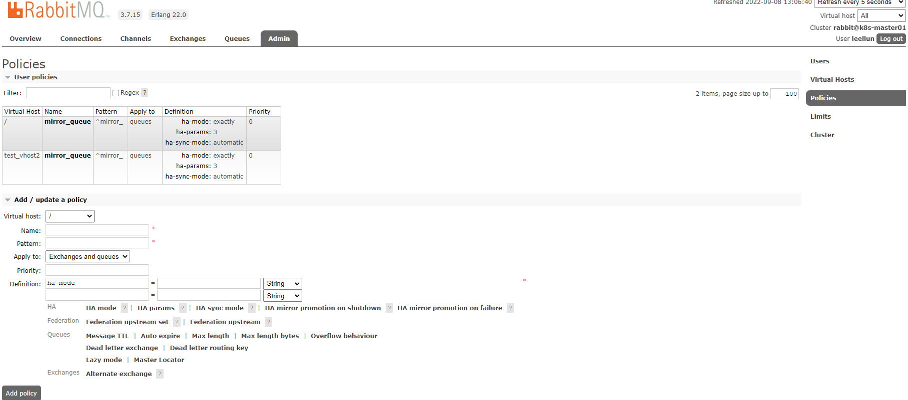

# 一、介绍

消息中间件rabbitmq，一般以集群方式部署，主要提供消息的接受和发送，实现各微服务之间的消息异步。

原理：

rabbitmq是依据erlang的分布式特性(RabbitMQ底层是通过Erlang架构来实现的,所以rabbitmqctl会启动Erlang节点,并基于Erlang节点来使用Erlang系统连接RabbitMQ节点,在连接过程中要正确的Erlang Cookie和节点名称, Erlang节点通过交换Erlang Cookie以获得认证)来实现的,所以部置rabbitmg分布式集群时要先安装erlang,并把基中一个服务的cookie复制到另外的节点。rabbitmq集群中,各个rabbitmq为对等节点,即每个节点均提供给客户端连接,进行消息的接收和发送。节点分为内存节点和磁盘节点,般的,均应建立为磁盘节点,为了防止机器重启后的消息消失;

RabbitMQ的Cluster集群模式一般分为两种，普通模式和镜像模式。消息队列通过rabbitmq HA镜像队列进行消息队列实体复制。

普通模式下，以两个节点(rabbit01,rabbit02)为例来进行说明。对于Queue来说,消息实体只存在于其中一个节点rabbit01 (或者rabbit02), rabbit01和rabbit02两个节点仅有相同的元数据,即队列的结构。当消息进入rabbit01节点的Queue后,consumer从rabbit02节点消费时, RabbitMQ会临时在rabbit01,rabbit02间进行消息传输,把A中的消息实体取出并经过B发送给consumer。所以consumer应尽量连接每一个节点,从中取消息。即对于同一个逻辑队列,要在多个节点建立物理Queue。否则无论consumer连rabbit01 或rabbit02,出口总在rabbit01,会产生瓶颈。

镜像模式下、将需要消费的队列变为镜像队列,存在于多个节点,这样就可以实现RabbitMQ的HA高可用性。作用就是消息实体会主动在镜像节点之间实现同步,而不是像普通模式那样,在consumer消费数据时临时读取。缺点就是,集群内部的同步通讯会占用大量的网络带。

# 二、安装

erlang安装：

```
//安装依赖
yum -y install gcc glibc-devel make ncurses-devel openssl-devel xmlto perl wget gtk2-devel binutils-devel

//-------下面是安装RabbitMQ的依赖环境 因为RabbitMQ是基于erlang语言开发的，所以必须安装erlang----
//下载erlang
wget -c http://erlang.org/download/otp_src_22.0.tar.gz
tar -zxvf otp_src_22.0.tar.gz
cd otp_src_22.0
./configure --prefix=/usr/local/erlang
make install

//添加安装环境
echo 'export PATH=$PATH:/usr/local/erlang/bin' >> /etc/profile
source /etc/profile

//测试erl
erl
```

安装RabbitMQ

```
//下载
wget https://github.com/rabbitmq/rabbitmq-server/releases/download/v3.7.15/rabbitmq-server-generic-unix-3.7.15.tar.xz
yum install -y xz
xz -d rabbitmq-server-generic-unix-3.7.15.tar.xz
tar -xvf rabbitmq-server-generic-unix-3.7.15.tar
mv rabbitmq_server-3.7.15/ /usr/local/
mv /usr/local/rabbitmq_server-3.7.15  /usr/local/rabbitmq

//添加系统环境
echo 'export PATH=$PATH:/usr/local/rabbitmq/sbin' >> /etc/profile
source /etc/profile

//配置目录
mkdir /etc/rabbitmq
```

# 三、服务管理

```
# 启动
rabbitmq-server -detached
# 停止
rabbitmqctl stop
# 状态
rabbitmqctl status
# web插件
rabbitmq-plugins enable rabbitmq_management
```

# 四、用户权限

```
# 查看所有用户
rabbitmqctl list_users
# 添加一个用户
rabbitmqctl add_user leellun 123456
# 配置权限
rabbitmqctl set_permissions -p "/" leellun ".*" ".*" ".*"
# 查看用户权限
rabbitmqctl list_user_permissions leellun
# 设置tag 加入administrator用户组
rabbitmqctl set_user_tags leellun administrator
# 删除用户（安全起见，删除默认用户）
rabbitmqctl delete_user guest
```

# 五、集群

| 节点         | ip            |
| ------------ | ------------- |
| k8s-master01 | 192.168.66.11 |
| k8s-node01   | 192.168.66.21 |
| k8s-node02   | 192.168.66.22 |

启动k8s-master01:

```
# 启动
rabbitmq-server -detached
# web插件
rabbitmq-plugins enable rabbitmq_management
```

同步erlang.cookie

```
# 分别复制.erlang.cookie 到k8s-node01和k8s-node02
scp -r /root/.erlang.cookie root@192.168.66.21:/root/
scp -r /root/.erlang.cookie root@192.168.66.22:/root/
```

rabbitmq-server启动时,会一起启动节点和应用，它预先设置RabbitMQ应用为standalone模式。要将一个节点加入到现有的集群中,需要停止这个应用，并将节点设置为原始状态。如果使用rabbitmqctl stop，应用和节点都将被关闭。所以使用rabbitmqctl stop_app仅仅关闭应用。

分别启动k8s-node01和k8s-node02：

```
# 启动
sbin/rabbitmq-server -detached
# 关闭app
sbin/rabbitmqctl stop_app
# 加入rabbitmq 节点
sbin/rabbitmqctl join_cluster rabbit@k8s-master01
# 开启app
sbin/rabbitmqctl start_app
# web插件
sbin/rabbitmq-plugins enable rabbitmq_management
```

如果要使用内存节点,则可以使用下面加入集群

```
rabbitmqctl join_cluster --ram rabbit@k8s-master01
```

查看集群：

```
rabbitmqctl cluster_status
```

```
[root@k8s-master01 rabbitmq]# rabbitmqctl cluster_status
Cluster status of node rabbit@k8s-master01 ...
[{nodes,[{disc,['rabbit@k8s-master01','rabbit@k8s-node01',
                'rabbit@k8s-node02']}]},
 {running_nodes,['rabbit@k8s-node02','rabbit@k8s-node01',
                 'rabbit@k8s-master01']},
 {cluster_name,<<"rabbit@k8s-master01">>},
 {partitions,[]},
 {alarms,[{'rabbit@k8s-node02',[]},
          {'rabbit@k8s-node01',[]},
          {'rabbit@k8s-master01',[]}]}]
```

镜像模式设置：

```
rabbitmqctl set_policy [-p vhost] [–priority priority] [–apply-to apply-to] name pattern definition
rabbitmqctl [--node <node>] [--longnames] [--quiet] set_policy [--vhost <vhost>] [--priority <priority>] [--apply-to <apply-to>] <name> <pattern> <definition>
```

参数解释：

- Name: policy的名称，用户自定义。

- Pattern: queue的匹配模式（正则表达式）。^表示所有队列都是镜像队列。

- Definition: 镜像定义，包括三个部分ha-sync-mode、ha-mode、ha-params。

  ​	ha-mode: 指明镜像队列的模式，有效取值范围为all/exactly/nodes。
  		all：表示在集群所有的代理上进行镜像。
  		exactly：表示在指定个数的代理上进行镜像，代理的个数由ha-params指定。
  		nodes：表示在指定的代理上进行镜像，代理名称通过ha-params指定。
  	ha-params: ha-mode模式需要用到的参数。
  	ha-sync-mode: 表示镜像队列中消息的同步方式，有效取值范围为：automatic，manually。
  		automatic：表示自动向master同步数据。
  		manually：表示手动向master同步数据。

- Priority: 可选参数， policy的优先级。

```
rabbitmqctl set_policy --priority 0 --apply-to queues mirror_queue "^mirror_" '{"ha-mode":"exactly","ha-params":3,"ha-sync-mode":"automatic"}'
```

指定vhost:

```
rabbitmqctl set_policy -p test_vhost2  --priority 0 --apply-to queues mirror_queue "^mirror_" '{"ha-mode":"exactly","ha-params":3,"ha-sync-mode":"automatic"}'
```

