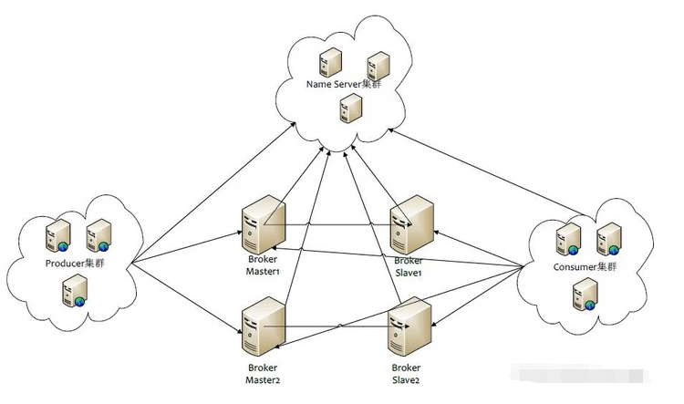

# 一、概念特性

## 1.1 概念

1 消息模型（Message Model）

RocketMQ主要由 Producer、Broker、Consumer 三部分组成，其中Producer 负责生产消息，Consumer 负责消费消息，Broker 负责存储消息。Broker 在实际部署过程中对应一台服务器，每个 Broker 可以存储多个Topic的消息，每个Topic的消息也可以分片存储于不同的 Broker。Message Queue 用于存储消息的物理地址，每个Topic中的消息地址存储于多个 Message Queue 中。ConsumerGroup 由多个Consumer 实例构成。

2 消息生产者（Producer）

负责生产消息，一般由业务系统负责生产消息。一个消息生产者会把业务应用系统里产生的消息发送到broker服务器。RocketMQ提供多种发送方式，同步发送、异步发送、顺序发送、单向发送。同步和异步方式均需要Broker返回确认信息，单向发送不需要。

3 消息消费者（Consumer）

负责消费消息，一般是后台系统负责异步消费。一个消息消费者会从Broker服务器拉取消息、并将其提供给应用程序。从用户应用的角度而言提供了两种消费形式：拉取式消费、推动式消费。

4 主题（Topic）

表示一类消息的集合，每个主题包含若干条消息，每条消息只能属于一个主题，是RocketMQ进行消息订阅的基本单位。

5 代理服务器（Broker Server）

消息中转角色，负责存储消息、转发消息。代理服务器在RocketMQ系统中负责接收从生产者发送来的消息并存储、同时为消费者的拉取请求作准备。代理服务器也存储消息相关的元数据，包括消费者组、消费进度偏移和主题和队列消息等。

6 名字服务（Name Server）

名称服务充当路由消息的提供者。生产者或消费者能够通过名字服务查找各主题相应的Broker IP列表。多个Namesrv实例组成集群，但相互独立，没有信息交换。

## 1.2 特性

1 订阅与发布

消息的发布是指某个生产者向某个topic发送消息；消息的订阅是指某个消费者关注了某个topic中带有某些tag的消息，进而从该topic消费数据。

2 消息顺序

消息有序指的是一类消息消费时，能按照发送的顺序来消费。例如：一个订单产生了三条消息分别是订单创建、订单付款、订单完成。消费时要按照这个顺序消费才能有意义，但是同时订单之间是可以并行消费的。RocketMQ可以严格的保证消息有序。

顺序消息分为全局顺序消息与分区顺序消息，全局顺序是指某个Topic下的所有消息都要保证顺序；部分顺序消息只要保证每一组消息被顺序消费即可。

- 全局顺序 对于指定的一个 Topic，所有消息按照严格的先入先出（FIFO）的顺序进行发布和消费。 适用场景：性能要求不高，所有的消息严格按照 FIFO 原则进行消息发布和消费的场景
- 分区顺序 对于指定的一个 Topic，所有消息根据 sharding key 进行区块分区。 同一个分区内的消息按照严格的 FIFO 顺序进行发布和消费。 Sharding key 是顺序消息中用来区分不同分区的关键字段，和普通消息的 Key 是完全不同的概念。 适用场景：性能要求高，以 sharding key 作为分区字段，在同一个区块中严格的按照 FIFO 原则进行消息发布和消费的场景。

3 消息过滤

RocketMQ的消费者可以根据Tag进行消息过滤，也支持自定义属性过滤。消息过滤目前是在Broker端实现的，优点是减少了对于Consumer无用消息的网络传输，缺点是增加了Broker的负担、而且实现相对复杂。

4 消息可靠性

RocketMQ支持消息的高可靠，影响消息可靠性的几种情况：

1. Broker非正常关闭
2. Broker异常Crash
3. OS Crash
4. 机器掉电，但是能立即恢复供电情况
5. 机器无法开机（可能是cpu、主板、内存等关键设备损坏）
6. 磁盘设备损坏

1)、2)、3)、4) 四种情况都属于硬件资源可立即恢复情况，RocketMQ在这四种情况下能保证消息不丢，或者丢失少量数据（依赖刷盘方式是同步还是异步）。

5)、6)属于单点故障，且无法恢复，一旦发生，在此单点上的消息全部丢失。RocketMQ在这两种情况下，通过异步复制，可保证99%的消息不丢，但是仍然会有极少量的消息可能丢失。通过同步双写技术可以完全避免单点，同步双写势必会影响性能，适合对消息可靠性要求极高的场合，例如与Money相关的应用。注：RocketMQ从3.0版本开始支持同步双写。

5 至少一次

至少一次(At least Once)指每个消息必须投递一次。Consumer先Pull消息到本地，消费完成后，才向服务器返回ack，如果没有消费一定不会ack消息，所以RocketMQ可以很好的支持此特性。

6 回溯消费

回溯消费是指Consumer已经消费成功的消息，由于业务上需求需要重新消费，要支持此功能，Broker在向Consumer投递成功消息后，消息仍然需要保留。并且重新消费一般是按照时间维度，例如由于Consumer系统故障，恢复后需要重新消费1小时前的数据，那么Broker要提供一种机制，可以按照时间维度来回退消费进度。RocketMQ支持按照时间回溯消费，时间维度精确到毫秒。

7 事务消息

RocketMQ事务消息（Transactional Message）是指应用本地事务和发送消息操作可以被定义到全局事务中，要么同时成功，要么同时失败。RocketMQ的事务消息提供类似 X/Open XA 的分布事务功能，通过事务消息能达到分布式事务的最终一致。

# 二、架构



- Producer：消息发布的角色，支持分布式集群方式部署。Producer通过MQ的负载均衡模块选择相应的Broker集群队列进行消息投递，投递的过程支持快速失败并且低延迟。
- Consumer：消息消费的角色，支持分布式集群方式部署。支持以push推，pull拉两种模式对消息进行消费。同时也支持集群方式和广播方式的消费，它提供实时消息订阅机制，可以满足大多数用户的需求。
- NameServer：NameServer是一个非常简单的Topic路由注册中心，其角色类似Dubbo中的zookeeper，支持Broker的动态注册与发现。主要包括两个功能：Broker管理，NameServer接受Broker集群的注册信息并且保存下来作为路由信息的基本数据。然后提供心跳检测机制，检查Broker是否还存活；路由信息管理，每个NameServer将保存关于Broker集群的整个路由信息和用于客户端查询的队列信息。然后Producer和Consumser通过NameServer就可以知道整个Broker集群的路由信息，从而进行消息的投递和消费。NameServer通常也是集群的方式部署，各实例间相互不进行信息通讯。Broker是向每一台NameServer注册自己的路由信息，所以每一个NameServer实例上面都保存一份完整的路由信息。当某个NameServer因某种原因下线了，Broker仍然可以向其它NameServer同步其路由信息，Producer和Consumer仍然可以动态感知Broker的路由的信息。NameServer是一个几乎无状态节点，可集群部署，节点之间无任何信息同步。 
- BrokerServer：Broker主要负责消息的存储、投递和查询以及服务高可用保证

# 三、安装启动

下载：

```
wget -c https://archive.apache.org/dist/rocketmq/4.9.0/rocketmq-all-4.9.0-bin-release.zip
```

1）启动 NameServer

```
### 首先启动Name Server
$ nohup sh mqnamesrv &
 
### 验证Name Server 是否启动成功
$ tail -f ~/logs/rocketmqlogs/namesrv.log
The Name Server boot success...
```

2）启动 Broker

```
### 启动Broker
$ nohup sh bin/mqbroker -n localhost:9876 &

### 验证Broker是否启动成功，例如Broker的IP为：192.168.1.2，且名称为broker-a
$ tail -f ~/logs/rocketmqlogs/broker.log 
The broker[broker-a, 192.169.1.2:10911] boot success...
```

# 四、消息

## 4.1 发送普通消息（三种方式）

三种方式来发送普通消息：同步（Sync）发送、异步（Async）发送和单向（Oneway）发送。 

| 发送方式 | 发送TPS | 发送结果反馈 | 可靠性   |
| -------- | ------- | ------------ | -------- |
| 同步发送 | 快      | 有           | 不丢失   |
| 异步发送 | 快      | 有           | 不丢失   |
| 单向发送 | 最快    | 无           | 可能丢失 |

消息队列RocketMQ版的消费者和生产者客户端对象是线程安全的，可以在多个线程之间共享使用。 

## 4.2 订阅方式

集群订阅

同一个Group ID所标识的所有Consumer平均分摊消费消息。例如某个Topic有9条消息，一个Group ID有3个Consumer实例，那么在集群消费模式下每个实例平均分摊，只消费其中的3条消息。设置方式如下所示。

```
// 集群订阅方式设置（不设置的情况下，默认为集群订阅方式）。
properties.put(PropertyKeyConst.MessageModel, PropertyValueConst.CLUSTERING);
```

广播订阅

同一个Group ID所标识的所有Consumer都会各自消费某条消息一次。例如某个Topic有9条消息，一个Group ID有3个Consumer实例，那么在广播消费模式下每个实例都会各自消费9条消息。设置方式如下所示。

```
// 广播订阅方式设置。
properties.put(PropertyKeyConst.MessageModel, PropertyValueConst.BROADCASTING);    
```

## 4.3 消息获取方式

消息队列RocketMQ版支持以下两种消息获取方式：

- Push：消息由消息队列RocketMQ版推送至Consumer。Push方式下，消息队列RocketMQ版还支持批量消费功能，可以将批量消息统一推送至Consumer进行消费。
- Pull：消息由Consumer主动从消息队列RocketMQ版拉取。

Pull Consumer提供了更多接收消息的选择。相比于Push Consumer，您可以使用Pull Consumer更加自由地控制消息拉取。 

## 4.4 顺序消息 

| 生产顺序                       | 消费顺序 | 顺序性效果                                                   |
| ------------------------------ | -------- | ------------------------------------------------------------ |
| 设置消息组，保证消息顺序发送。 | 顺序消费 | 按照消息组粒度，严格保证消息顺序。同一消息组内的消息的消费顺序和发送顺序完全一致。 |
| 设置消息组，保证消息顺序发送。 | 并发消费 | 并发消费，尽可能按时间顺序处理。                             |
| 未设置消息组，消息乱序发送。   | 顺序消费 | 按队列存储粒度，严格顺序。基于消息队列RocketMQ版本身队列的属性，消费顺序和队列存储的顺序一致，但不保证和发送顺序一致。 |
| 未设置消息组，消息乱序发送。   | 并发消费 | 并发消费，尽可能按照时间顺序处理。                           |

顺序消息分为两类：

- 全局顺序：对于指定的一个Topic，所有消息按照严格的先入先出FIFO（First In First Out）的顺序进行发布和消费。
- 分区顺序：对于指定的一个Topic，所有消息根据Sharding Key进行区块分区。同一个分区内的消息按照严格的FIFO顺序进行发布和消费。Sharding Key是顺序消息中用来区分不同分区的关键字段，和普通消息的Key是完全不同的概念。

## 4.5 事务消息


 发送事务消息包含以下两个步骤： 

1 发送半事务消息（Half Message）及执行本地事务 

2 提交事务消息状态。

当本地事务执行完成（执行成功或执行失败），需要通知服务器当前消息的事务状态。通知方式有以下两种：

- 执行本地事务完成后提交。
- 执行本地事务一直没提交状态，等待服务器回查消息的事务状态。

事务状态有以下三种：

- `TransactionStatus.CommitTransaction`：提交事务，允许订阅方消费该消息。
- `TransactionStatus.RollbackTransaction`：回滚事务，消息将被丢弃不允许消费。
- `TransactionStatus.Unknow`：无法判断状态，期待消息队列RocketMQ版的Broker向发送方再次询问该消息对应的本地事务的状态。

事务回查机制说明:

发送事务消息为什么必须要实现回查Check机制？

当步骤1中半事务消息发送完成，但本地事务返回状态为`TransactionStatus.Unknow`，或者应用退出导致本地事务未提交任何状态时，从Broker的角度看，这条半事务消息的状态是未知的。因此Broker会定期向消息发送方即消息生产者集群中的任意一生产者实例发起消息回查，要求发送方回查该Half状态消息，并上报其最终状态。

Check被回调时，业务逻辑都需要做些什么？

事务消息的Check方法里面，应该写一些检查事务一致性的逻辑。消息队列RocketMQ版发送事务消息时需要实现`LocalTransactionChecker`接口，用来处理Broker主动发起的本地事务状态回查请求，因此在事务消息的Check方法中，需要完成两件事情：

1. 检查该半事务消息对应的本地事务的状态（committed or rollback）。
2. 向Broker提交该半事务消息本地事务的状态。


参考文档：

https://help.aliyun.com/document_detail/29547.html

源码：

[leellun/springcloud-learn (github.com)](https://github.com/leellun/springcloud-learn) 

https://github.com/leellun/rocketmq-learn.git