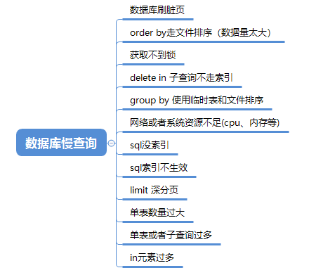
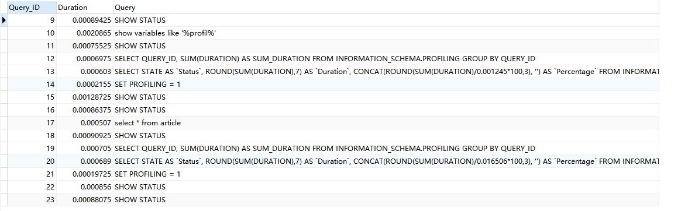

## 1、考虑分析

- 分析慢查询日志
- 使用explain查看执行计划
- 索引优化
- 深分页优化
- 避免全表扫描
- 避免返回不必要的数据（如select具体字段而不是select*）
- 使用合适的数据类型（如可以使用int类型的话，就不要设计为varchar）
- 优化sql结构（如join优化等等）
- 适当分批量进行 (如批量更新、删除)
- 定期清理无用的数据
- 适当分库分表
- 读写分离

## 2、深分页优化

**标签记录法** 

就是标记一下上次查询到哪一条了，下次再来查的时候，从该条开始往下扫描。 

```
select  id,name,balance FROM account where id > 100000 limit 10;
```

局限：连续自增的id字段 

**延迟关联法** 

把条件转移到主键索引树，然后减少回表。 

例如：

```
select id,name,balance from account where create_time> '2020-09-19' limit 100000,10;
```

优化：创建索引 idx_create_time(id,create_time) 

```
select  t1.id,t1.name,t1.balance FROM account t1 INNER JOIN 
(SELECT id FROM account  WHERE create_time > '2020-09-19' limit 100000, 10) 
AS t2 on t1.id= t2.id;
```

通过idx_create_time二级索引树查询到满足条件的主键ID，再与原表通过主键ID内连接，这样后面直接走了主键索引了。 

## 3、大表的优化方案

**数据库设计优化** 

可以考虑**拆分表、使用分区表、添加索引等方式**来优化表结构。 同时也要**避免使用大量冗余字段、避免频繁使用join查询**等操作。 

**索引优化** 

**增加索引、使用覆盖索引、使用联合索引等方式来提高查询效率**。同时也要注意**定期清理冗余的索引以及对于经常使用的查询语句建立索引**。 

**分区优化** 

将大表按照某个列分成多个分区表，每个分区表的数据量较小，可以提高查询和更新的性能。分区表还可以帮助在维护表结构的同时，减少锁表时间，提高并发处理能力。 

> 例如：我最近做的一个saas的cms的网站，通过siteId将多个网站的数据按照siteId进行分区，隔离多个网站的数据，并且能够高效查找当前网站的数据

**数据清理归档** 

对于一些历史数据或者无用数据，**可以进行定期归档，避免数据过多造成SQL查询效率降低**。同时也要注意对于大表进行定期的数据备份以及紧急数据恢复的准备工作。 

**缓存优化** 

对于一些经常被查询的数据，可以使用缓存优化。使用Redis等缓存中间件来缓存常用的数据，以减少查询数据库的次数，提高查询效率。 

**SQL语句优化** 

使用Explain执行计划来进行优化。同时也要注意避免使用OR等耗费性能的操作符。 

**分库分表** 

如果数据量千万级别，需要考虑分库分表

## 4、哪些因素可能导致MySQL慢查询？



## 5、使用索引优化SQL查询

- 添加合适索引（在where、group by、order by等后面的字段添加合适索引）
- 选择合适的索引类型 (B-tree索引适合范围查询、哈希索引适合等值查询)
- 注意不适合加索引的场景（数据量少的表，更新频繁的字段，区分度低的字段）
- 加索引的时候，需要考虑覆盖索引，减少回表，**考虑联合索引的最左前缀原则**
- explain查看SQL的执行计划，确认是否会命中索引。
- 注意索引并不是越多越好，**通常建议在单个表中不要超过5个索引**。因为索引会占用磁盘空间，索引更新代价高。

## 6、SQL优化分析步骤

### 6.1 查看慢查询日志记录，分析慢SQL

- slow query log表示慢查询开启的状态
- slow_query_log_file表示慢查询日志存放的位置
- long_query_time表示查询超过多少秒才记录到慢查询日志。 

查看变量：

```
show variables like 'slow_query_log%'
```

### 6.2 explain查看分析SQL的执行计划

具体分析看 其它文章

### 6.3 profile 分析执行耗时

explain只能看SQL的预估执行计划，如果要了解SQL真正的执行线程状态及消耗的时间，需要使用profiling。开启profiling参数后，后续执行的SQL语句都会记录其资源开销，包括IO，上下文切换，CPU，内存等等，可以根据这些开销进一步分析当前慢SQL的瓶颈再进一步进行优化。

profiling默认是关闭，我们可以使用show variables like '%profil%'查看是否开启 

```
select * from article
show profiles
```

show profiles会显示最近发给服务器的多条语句，条数由变量profiling_history_size定义，默认是15。如果我们需要看单独某条SQL的分析，可以show profile查看最近一条SQL的分析。也可以使用show profile for query id（其中id就是show profiles中的QUERY_ID）查看具体一条的SQL语句分析。 



除了查看profile ，还可以查看cpu和io，如上图。 

### 6.4 Optimizer Trace分析详情

profile只能查看到SQL的执行耗时，但是无法看到SQL真正执行的过程信息，即不知道MySQL优化器是如何选择执行计划。这时候，我们可以使用Optimizer Trace，它可以跟踪执行语句的解析优化执行的全过程。 

```
//打开分析
set optimizer_trace="enabled=on"
//查看
select * from information_schema.optimizer_trace
```

- oin_preparation：准备阶段
- join_optimization：分析阶段
- join_execution：执行阶段

### 6.5 确定问题并采用相应的措施

- 多数慢SQL都跟索引有关，比如不加索引，索引不生效、不合理等，这时候，我们可以**优化索引**。
- 还可以优化SQL语句，比如一些in元素过多问题（分批），深分页问题（基于上一次数据过滤等），进行时间分段查询
- SQl没办法很好优化，可以改用ES的方式，或者数仓。
- 如果单表数据量过大导致慢查询，则可以考虑分库分表
- 如果数据库在刷脏页导致慢查询，考虑是否可以优化一些参数，跟DBA讨论优化方案
- 如果存量数据量太大，考虑是否可以让部分数据归档

## 7、一条sql执行过长的时间，你如何优化，从哪些方面入手？

- 确定瓶颈
- 索引优化
- 优化SQL语句
- 数据库参数优化
- 分析锁的情况
- 数据库硬件升级

**确定瓶颈** 

**查看MySQL日志，慢查询日志，explain分析SQL的执行计划，profile 分析执行耗时，Optimizer Trace分析详情**等操作 。确定了瓶颈，才能有针对性地进行优化。 

**索引优化** 

**优化SQL语句** 

针对join频繁、过多子查询

**数据库参数优化** 

可以通过修改数据库参数来优化查询效率，如修改内存缓存大小、修改连接池大小等。 

**分析锁的情况** 

查询执行时间过长有可能是由于锁的问题导致的，需要分析查询语句中是否存在锁的问题，如果存在锁的问题，可以考虑增加锁的并发度，从而提高查询效率。 

## 8、常用的数据库设计优化技巧？

- 字段尽量避免使用NULL
- 合理选择数据类型
- 字段选择合适的长度
- 正确使用索引
- 尽量少定义text类型
- 合理的数据表结构设计
- 适当的冗余设计
- 优化SQL查询语句
- 一张表的字段不宜过多
- 查询SQL尽量不要使用select *，而是select具体字段。
- 小表驱动大表
- 优化你的like语句
- 尽量避免在索引列上使用mysql的内置函数
- 如果插入数据过多，考虑批量操作。
- 多用limit
- exist & in合理利用
- in元素不要过多
- 尽量用union all替换union

## 9、order by查询效率慢,如何优化.

order by排序，分为全字段排序和rowid排序。它是拿max_length_for_sort_data和结果行数据长度对比，如果结果行数据长度超过max_length_for_sort_data这个值，就会走rowid排序，相反，则走全字段排序。 

rowid排序，一般需要回表去找满足条件的数据，所以效率会慢一点.如果是order by排序,可能会借助磁盘文件排序的话，效率就更慢一点. 

如何优化order by的文件排序?

- 因为数据是无序的，所以就需要排序。如果数据本身是有序的，那就不会再用到文件排序啦。而索引数据本身是有序的，我们通过建立索引来优化order by语句。
- 我们还可以通过调整max_length_for_sort_data、sort_buffer_size等参数优化；

## 10 后续更多