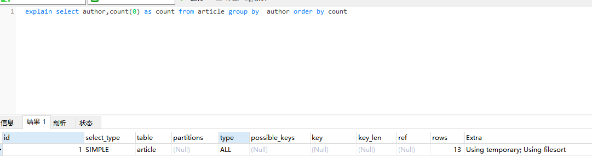

## 1、说明 

根据一定的规则，进行分组。 

group by可能会慢在哪里？**因为它既用到临时表，又默认用到排序。有时候还可能用到磁盘临时表。** 

- 如果执行过程中，会发现内存临时表大小到达了上限（控制这个上限的参数就是tmp_table_size），会把内存临时表转成磁盘临时表。
- 如果数据量很大，很可能这个查询需要的磁盘临时表，就会占用大量的磁盘空间。

## 2、如何优化group by呢? 

- group by 后面的字段加索引
- order by null 不用排序
- 尽量只使用内存临时表
- 使用SQL_BIG_RESULT

## 3、 使用group by的简单例子

```
select city ,count(*) as num from staff group by city;
```

## 4、group by 原理分析



- Extra 这个字段的Using temporary表示在执行分组的时候使用了**临时表**
- Extra 这个字段的Using filesort表示使用了**排序**

## 5、group by 的简单执行流程

1. 创建内存临时表，表里有两个字段author和count；
2. 全表扫描article的记录，依次取出author= 'X'的记录。

- 判断**临时表**中是否有为 author='X'的行，没有就插入一个记录 (X,1);
- 如果临时表中有author='X'的行的行，就将x 这一行的num值加 1；

遍历完成后，再根据字段author做**排序**，得到结果集返回给客户端 

> 就是把需要排序的字段，放到sort buffer，排完就返回。在这里注意一点哈，排序分**全字段排序**和**rowid排序**
>
> 如果是全字段排序，需要查询返回的字段，都放入sort buffer，根据**排序字段**排完，直接返回
>
> 如果是rowid排序，只是需要排序的字段放入sort buffer，然后多一次**回表**操作，再返回。
>
> 怎么确定走的是全字段排序还是rowid 排序排序呢？由一个数据库参数控制的，max_length_for_sort_data

## 6、group by的一些优化方案

- group by 后面的字段加索引
- order by null 不用排序
- 尽量只使用内存临时表
- 使用SQL_BIG_RESULT