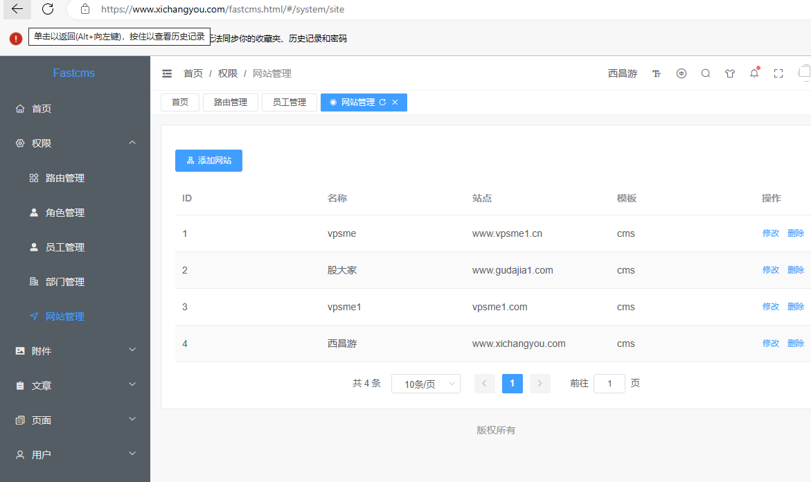
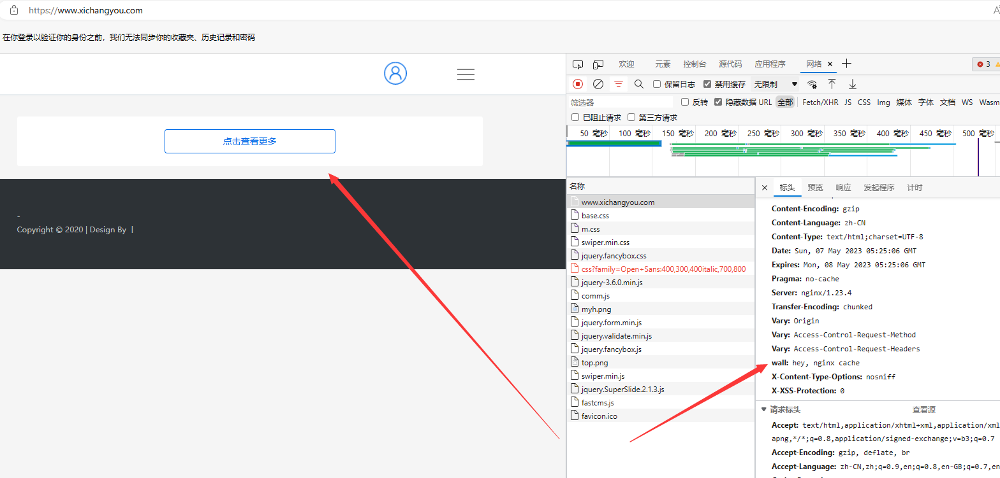

## 1 nginx配置文件目录

```
-- conf
     |-- nginx.conf
-- conf.d
     |-- *.conf
```

nginx.conf不做任何server配置，制作include包含conf.d文件夹里面的所有conf配置，做聚合处理

## 2 nginx配置文件

**nginx.conf**

主要配置缓存，include 网站配置模块conf

```
#user  nobody;
worker_processes  1;
http {
    proxy_connect_timeout 10;
    proxy_read_timeout 180;
    proxy_send_timeout 5;
    proxy_buffer_size 16k;
    proxy_buffers 4 32k;
    proxy_busy_buffers_size 96k;
    proxy_temp_file_write_size 96k;
    proxy_temp_path /tmp/temp_dir;
    proxy_cache_path /tmp/cache levels=1:2 keys_zone=cache_cms:100m inactive=1d max_size=10g;

   include /usr/local/nginx/conf.d/*.conf;
}
```

www.xichangyou.com.conf

```
server {
    listen 80;
    server_name xichangyou.com www.xichangyou.com;
    rewrite ^(.*)$ https://${server_name}$1 permanent;
}
server {
    listen       443 ssl;
    server_name  xichangyou.com www.xichangyou.com;

    ssl_certificate      /usr/local/nginx/certs/xichangyou.com.pem;
    ssl_certificate_key  /usr/local/nginx/certs/xichangyou.com.key;

    ssl_session_cache    shared:SSL:1m;
    ssl_session_timeout  5m;

    ssl_ciphers  HIGH:!aNULL:!MD5;
    ssl_prefer_server_ciphers  on;

    client_max_body_size 20m;
    client_body_buffer_size 128k;

    gzip on;
    gzip_buffers 32 4K;
    gzip_comp_level 6;
    gzip_min_length 100;
    gzip_types application/javascript text/css text/xml application/font-woff;
    gzip_disable "MSIE [1-6]\.";

    if ( $host = 'xichangyou.com') {
        rewrite ^/(.*)$ https://www.xichangyou.com/$1 permanent;
    }
    location ^~ /.well-known/acme-challenge/ {
        default_type "text/plain";
        root /usr/local/nginx/html;
    }
    location ~ ^/upload/(.*)\.(png|jpg|jpeg|gif)$ {
        root /opt/img;
        expires 5d;
        set $img_width -;
        set $img_height -;
        # 获取参数size的值
        if ($arg_size ~* "^(\d+)x(\d+)$") {
          set $img_width $1;
          set $img_height $2;
        }
        # 裁剪图片并且调整大小
        image_filter resize $img_width $img_height;

        image_filter_jpeg_quality 25;
        image_filter_buffer 10M;
    }
    location /fastcms.html {
        alias   /usr/local/nginx/html;
        # 此处的 @router 实际上是引用下面的转发，否则在 Vue 路由刷新时可能会抛出 404
        try_files $uri $uri/ @router;
        # 请求指向的首页
        index  index.html index.htm;
    }
    location /fastcms {
	    alias   /usr/local/nginx/html;
    }
	location /fastcms/api {
        proxy_pass http://www.xichangyou.com:8085;
        proxy_set_header Host      $host;
        proxy_set_header X-Real-IP $remote_addr;
    }
    location / {
        proxy_pass http://www.xichangyou.com:8085;
        proxy_set_header Host      $host;
        proxy_set_header X-Real-IP $remote_addr;
		proxy_redirect off;
        proxy_cache cache_cms;
		proxy_cache_key "$scheme$request_method$host$request_uri";
        proxy_cache_valid 200 304 12h;
        proxy_cache_valid 301 302 1d;
        proxy_cache_valid any 5m;
        expires 1d;
        add_header wall  "hey, nginx cache";
    }

    # 由于路由的资源不一定是真实的路径，无法找到具体文件
    # 所以需要将请求重写到 index.html 中，然后交给真正的 Vue 路由处理请求资源
    location @router {
      rewrite ^.*$ /index.html last;
    }

}
```

## 3 模块配置文件详解

### 图片资源配置

解析地址  *.png?size=width x height 得到指定大小的图片资源

```
    location ~ ^/upload/(.*)\.(png|jpg|jpeg|gif)$ {
        root /opt/img;
        expires 5d;
        set $img_width -;
        set $img_height -;
        # 获取参数size的值
        if ($arg_size ~* "^(\d+)x(\d+)$") {
          set $img_width $1;
          set $img_height $2;
        }
        # 裁剪图片并且调整大小
        image_filter resize $img_width $img_height;

        image_filter_jpeg_quality 25;
        image_filter_buffer 10M;
    }
```

### vue静态资源的解析

单页面设置为fastcms.html

```
    location /fastcms.html {
        alias   /usr/local/nginx/html;
        # 此处的 @router 实际上是引用下面的转发，否则在 Vue 路由刷新时可能会抛出 404
        try_files $uri $uri/ @router;
        # 请求指向的首页
        index  index.html index.htm;
    }
```

### http接口配置

方向代理到 8085端口

```
	location /fastcms/api {
        proxy_pass http://www.xichangyou.com:8085;
        proxy_set_header Host      $host;
        proxy_set_header X-Real-IP $remote_addr;
    }
```

### 网页代理设置

方向代理到8085端口 并且设置缓存

```
    location / {
        proxy_pass http://www.xichangyou.com:8085;
        proxy_set_header Host      $host;
        proxy_set_header X-Real-IP $remote_addr;
		proxy_redirect off;
        proxy_cache cache_cms;
		proxy_cache_key "$scheme$request_method$host$request_uri";
        proxy_cache_valid 200 304 12h;
        proxy_cache_valid 301 302 1d;
        proxy_cache_valid any 5m;
        expires 1d;
        add_header wall  "hey, nginx cache";
    }
```

## 4 结果验证

后台管理系统验证



官网验证:

能够看到解析成功，并且缓存已经生效

