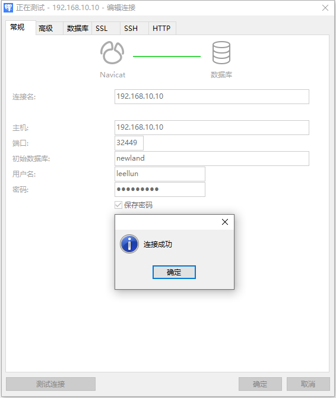

## 1 下载postgresql的helm安装包

拉取helm安装包：

```
helm repo add bitnami https://charts.bitnami.com/bitnami
helm pull  bitnami/postgresql --version 11.7.0
```

## 2 修改helm包配置

```
tar -zxf postgresql-11.7.0.tgz
cd postgresql
```

修改values.yaml的配置：

```
global:
    # 设置认证信息，包括postgres账户密码、自定义用户名和密码、数据库
    auth:
      postgresPassword: "123456"
      username: "leellun"
      password: "123456"
      database: "newland"
      existingSecret: ""
primary:
  name: primary
  # 配置pg_hba.conf文件
  pgHbaConfiguration: |-
     local    all             all                                     trust
     host     all             all             0.0.0.0/0               md5
     host     all             all             ::1/128                 md5
```

下面这行非常重要（必须手动修改，因为认证信息的修改添加基于trust认证）：

```
local    all             all                                     trust
```

我通过官方的helm直接安装一直提示认证失败等信息，安装了几天，网上也没找出答案，通过实体机上直接安装，反复测试才发现helm直接安装的pg_hba配置与helm默认的配置不一样。

## 3 开始安装

```
helm install postgresql ../postgresql -n newland
```

结果：

```

** Please be patient while the chart is being deployed **

PostgreSQL can be accessed via port 5432 on the following DNS names from within your cluster:

    postgresql.newland.svc.cluster.local - Read/Write connection

To get the password for "postgres" run:

    export POSTGRES_ADMIN_PASSWORD=$(kubectl get secret --namespace newland postgresql -o jsonpath="{.data.postgres-password}" | base64 -d)

To get the password for "leellun" run:

    export POSTGRES_PASSWORD=$(kubectl get secret --namespace newland postgresql -o jsonpath="{.data.password}" | base64 -d)

To connect to your database run the following command:

    kubectl run postgresql-client --rm --tty -i --restart='Never' --namespace newland --image docker.io/bitnami/postgresql:14.4.0-debian-11-r23 --env="PGPASSWORD=$POSTGRES_PASSWORD" \
      --command -- psql --host postgresql -U leellun -d newland -p 5432

    > NOTE: If you access the container using bash, make sure that you execute "/opt/bitnami/scripts/postgresql/entrypoint.sh /bin/bash" in order to avoid the error "psql: local user with ID 1001} does not exist"

To connect to your database from outside the cluster execute the following commands:

    kubectl port-forward --namespace newland svc/postgresql 5432:5432 &
    PGPASSWORD="$POSTGRES_PASSWORD" psql --host 127.0.0.1 -U leellun -d newland -p 5432
```

## 4 查看结果

```
[root@k8s-master01 postgresql]#  kubectl run postgresql-client --rm --tty -i --restart='Never' --namespace newland --image docker.io/bitnami/postgresql:14.4.0-debian-11-r23 --env="PGPASSWORD=$POSTGRES_PASSWORD" \
>       --command -- psql --host postgresql -U leellun -d newland -p 5432
If you don't see a command prompt, try pressing enter.

newland=> 
newland=> \l
                                  List of databases
   Name    |  Owner   | Encoding |   Collate   |    Ctype    |   Access privileges   
-----------+----------+----------+-------------+-------------+-----------------------
 newland   | leellun  | UTF8     | en_US.UTF-8 | en_US.UTF-8 | =Tc/leellun          +
           |          |          |             |             | leellun=CTc/leellun
 postgres  | postgres | UTF8     | en_US.UTF-8 | en_US.UTF-8 | 
 template0 | postgres | UTF8     | en_US.UTF-8 | en_US.UTF-8 | =c/postgres          +
           |          |          |             |             | postgres=CTc/postgres
 template1 | postgres | UTF8     | en_US.UTF-8 | en_US.UTF-8 | =c/postgres          +
           |          |          |             |             | postgres=CTc/postgres
(4 rows)
```

## 5 通过navicat连接查看

这里的navicat最好采用高版本，我这里采用的是15的版，推荐下面的版本含注册机。

```
百度网盘地址：   https://pan.baidu.com/s/11U0fmxKzwKfQslklBm2xwQ
提取码：        mt2b
```



## 6 推荐部署

k8s现在推荐operator的配置方案