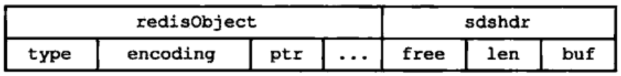
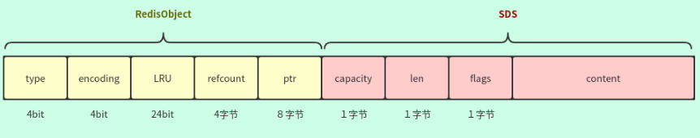
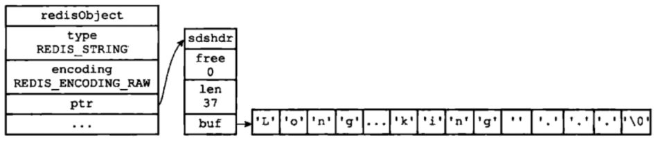
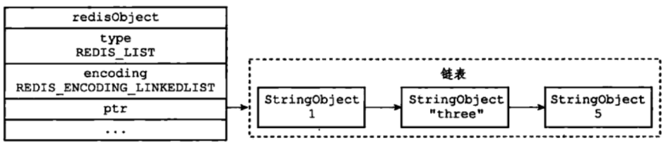
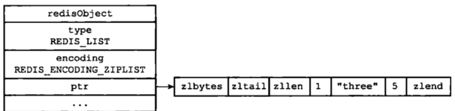
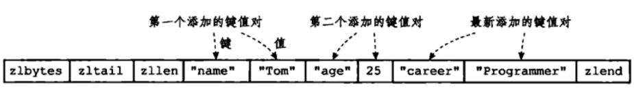
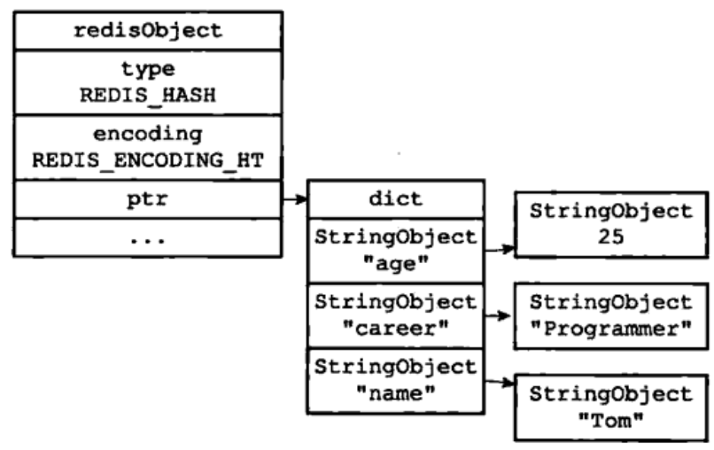
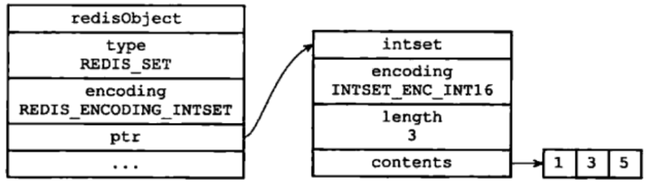
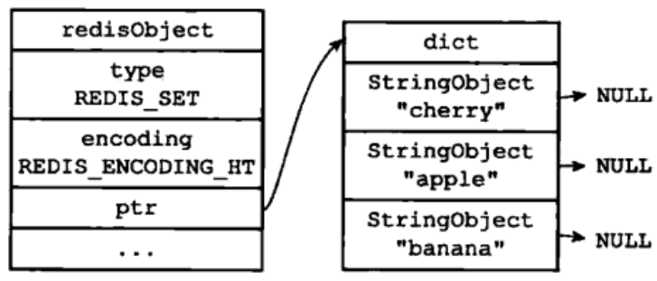
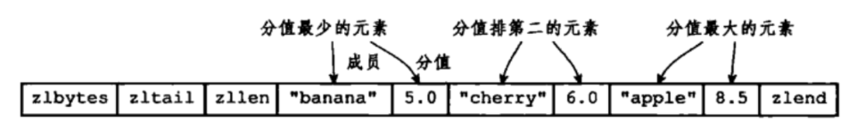

# redis底层数据结构

```
typedef struct redisObject{
     //类型
     unsigned type:4;// 4bit
     //编码
     unsigned encoding:4;// 4bit
     //指向底层数据结构的指针
     void *ptr;// 8字节
     //引用计数
     int refcount;// ４字节
     //记录最后一次被程序访问的时间
     unsigned lru:22;// 24bit
}
/*
 * 保存字符串对象的结构
 */
struct sdshdr {
    // buf 中已占用空间的长度
    unsigned int len;
    // buf 中剩余可用空间的长度
    unsigned int free;
    // 数据空间
    char buf[];
};
```

获取编码类型：

```
object encoding str //获取str的编码类型
```

redis支持的编码：

- int、embstr、raw
- linkedlist
- ziplist
- hashtable
- intset
- skiplist

# 1 字符串

字符串的长度不能超过512M。

内部编码有3种，int（8字节长整型）/embstr（小于等于39字节字符串，redis3.2之后使44字节）/raw（大于39个字节字符串，redis3.2是44字节）

```
SDS_TYPE_5　-- 32 Byte
SDS_TYPE_8　-- 256 Byte
SDS_TYPE_16 -- 64KＢ
SDS_TYPE_32 -- ...
SDS_TYPE_64 -- ...
```

## 1.1  int

数字型字符串（long）：最大值=2^(8x8-1)-1=9223372036854775807

incr/decr/incrby/decrby 数字操作，一定要是数字才能进行加减，当操作的结果大于long的最大值时会报错。

```
127.0.0.1:6379> set str 9223372036854775807
OK
127.0.0.1:6379> object encoding str
"int"
127.0.0.1:6379> set str 9223372036854775808
OK
127.0.0.1:6379> object encoding str
"embstr"
```

问题：当 int 编码保存的值不再是整数，或大小超过了long的范围时，自动转化为raw。 

```
127.0.0.1:6379> set str 9223372036854775807
OK
127.0.0.1:6379> object encoding str
"int"
127.0.0.1:6379> incr str
(error) ERR increment or decrement would overflow
```

上面的问题我没有测试成功，当超过long的最大值，就会报错。

```
127.0.0.1:6379> set str 1
OK
127.0.0.1:6379> debug object str
Value at:00007FA524C0D370 refcount:8 encoding:int serializedlength:2 lru:3830714 lru_seconds_idle:5562
```

## 1.2 embstr

优点：创建时少分配一次空间，删除时释放一次空间，数据相连查找方便。

缺点：字符串的长度增加需要重新分配内存时，整个redisObject和sds都需要重新分配空间，因此redis中的embstr实现为只读。



embstr，这种形式使得 RedisObject和SDS 内存地址是连续的。 



64字节，减去RedisObject头信息19字节，再减去３字节SDS头信息，剩下45字节，再去除\0结尾。这样最后可以存储44字节。 

```
127.0.0.1:6379> set str a
OK
127.0.0.1:6379> object encoding str
"embstr"
```

在对embstr对象进行修改时，都会先转化为raw再进行修改，因此，只要是修改embstr对象，修改后的对象一定是raw的，无论是否达到了44个字节。 

```
127.0.0.1:6379> set str a
OK
127.0.0.1:6379> get str
"a"
127.0.0.1:6379> object encoding str
"embstr"
127.0.0.1:6379> append str b
(integer) 2
127.0.0.1:6379> get str
"ab"
127.0.0.1:6379> object encoding str
"raw"
```

## 1.3 raw



embstr与raw都使用redisObject和sds保存数据 ，区别：

- embstr的使用只分配一次内存空间（因此redisObject和sds是连续的 ）
- raw需要分配两次内存空间（分别为redisObject和sds分配空间） 

# 2 list

Redis 列表是简单的字符串列表，按照插入顺序排序。可以添加一个元素导列表的头部（左边）或者尾部（右边）。它的底层实际是个链表。

```
简介：列表（list）类型是用来存储多个有序的字符串，一个列表最多可以存储2^32-1个元素。
简单实用举例：lpush key value [value ...] 、lrange key start end
内部编码：ziplist（压缩列表）、linkedlist（链表）
应用场景：消息队列，文章列表
```

## 2.1 linkedlist



## 2.2 ziplist



- 1、列表保存元素个数小于512个
- 2、每个元素长度小于64字节

 不能满足这两个条件的时候使用 linkedlist 编码。

 两个条件可以在redis.conf 配置文件中的 list-max-ziplist-value选项和 list-max-ziplist-entries 选项进行配置。

```
127.0.0.1:6379> lpush strs 1
(integer) 1
127.0.0.1:6379> object encoding strs
"ziplist"
127.0.0.1:6379> lpush strs 1222222222222222222222222222222222222222222222222222222222222222222222222222222222222222222222222222222222222222222222222222222222222222222222222222222222222222222222222222222222222222222222222222222222222222222222222222222222222222222222222222222222222222222222aaaaaaaaaaaaaaaaaaaaaaaaaaaaaaaaaaaaaaaaaaaaaaaaaaaaaaaaaaaaaaaaaaaaaaaaaaaaaaaaaaaaaaaaaaaaaaaaaaaaaaaaaaaaaaaaaa
(integer) 2
127.0.0.1:6379> object encoding strs
"linkedlist"
```

```
typedef struct zlentry {
    unsigned int prevrawlensize; /* 内存中编码后的prevrawlen用了多少字节 */
    unsigned int prevrawlen;     /* 前一个entry占用的长度，主要是为了entry之间跳转 */
    unsigned int lensize;        /* 内存中编码后的len用了多少字节 */
    unsigned int len;            /* 当前entry的长度，如果是string则表示string的长度，如果是整数，则len依赖于具体数值大小。*/
    unsigned int headersize;     /* prevrawlensize + lensize. entry的head部分用了多少字节 */
    unsigned char encoding;      /* 当前entry的编码格式 */
    unsigned char *p;            /* 指向数据域的指针 */
} zlentry;
```

# 3 hash

```
简介：在Redis中，哈希类型是指v（值）本身又是一个键值对（k-v）结构
简单使用举例：hset key field value 、hget key field
内部编码：ziplist（压缩列表） 、hashtable（哈希表）
应用场景：缓存用户信息等。
注意点：如果开发使用hgetall，哈希元素比较多的话，可能导致Redis阻塞，可以使用hscan。而如果只是获取部分field，建议使用hmget。
```

## 3.1 ziplist



## 3.2 hashtable



hashtable 编码的哈希表对象底层使用字典数据结构，哈希对象中的每个键值对都使用一个字典键值对。

使用ziplist（压缩列表）编码：

- 1、列表保存元素个数小于512个, set-max-intset-entries 进行修改
- 2、每个元素长度小于64字节

# 4 set

```
简介：集合（set）类型也是用来保存多个的字符串元素，但是不允许重复元素
简单使用举例：sadd key element [element ...]、smembers key
内部编码：intset（整数集合）、hashtable（哈希表）
注意点：smembers和lrange、hgetall都属于比较重的命令，如果元素过多存在阻塞Redis的可能性，可以使用sscan来完成。
应用场景：用户标签,生成随机数抽奖、社交需求。
```

## 4.1 intset  



使用 intset 编码条件：

1、集合对象中所有元素都是整数 

2、集合对象所有元素数量不超过512 ，可以set-max-intset-entries 进行配置 

```
127.0.0.1:6379> sadd set1 1
(integer) 1
127.0.0.1:6379> smembers set1
1) "1"
127.0.0.1:6379> object encoding set1
"intset"
127.0.0.1:6379> sadd set1 a
(integer) 1
127.0.0.1:6379> object encoding set1
"hashtable"
```

## 4.2 hashtable



# 5 zset

> - 简介：已排序的字符串集合，同时元素不能重复
> - 简单格式举例：`zadd key score member [score member ...]`，`zrank key member`
> - 底层内部编码：`ziplist（压缩列表）`、`skiplist（跳跃表）`
> - 应用场景：排行榜，社交需求（如用户点赞）

与列表使用索引下标作为排序依据不同，有序集合为每个元素设置一个分数（score）作为排序依据。 

## 5.1 ziplist

 ziplist 编码的有序集合对象使用压缩列表作为底层实现，每个集合元素使用两个紧挨在一起的压缩列表节点来保存，第一个节点保存元素的成员，第二个节点保存元素的分值。并且压缩列表内的集合元素按分值从小到大的顺序进行排列，小的放置在靠近表头的位置，大的放置在靠近表尾的位置。 



使用 ziplist 编码条件：

- 1、保存的元素数量小于128；
- 2、保存的所有元素长度都小于64字节。

可以通过Redis配置文件zset-max-ziplist-entries 选项和 zset-max-ziplist-value 进行修改。

```
127.0.0.1:6379> zadd zset1 0.1 1
(integer) 1
127.0.0.1:6379> zadd zset1 0.2 2
(integer) 1
127.0.0.1:6379> object encoding zset1
"ziplist"
127.0.0.1:6379> zadd zset1 0.3 a
(integer) 1
127.0.0.1:6379> object encoding zset1
127.0.0.1:6379> zadd zset1 0.4 aaaaaaaaaaaaaaaaaaaaaaaaaaaaaaaaaaaaaaaaaaaaaaaaaaaaaaaaaaaaaaaaaaaaaaaaaaaaaaaaaaaaaaaaaaaaaaaaaaaaaaaaaaaaaaaaaaaaaaaaaaaaaaaaaaaaaaaaaaaaaaaaaaaaaaaaaaaaaaaaaaaaaaaaaaaaaaaaaaaaaaaaaaaaaaaaaaaaaaaaaaaaaaaaaaaaaaaaaaaaaaaaaaaaaaaaaaaaaaaaaaaaaaaaaaaaaaaa
(integer) 1
127.0.0.1:6379> object encoding zset1
"skiplist"
```

## 5.2 skiplist 

skiplist 编码的有序集合对象使用 zet 结构作为底层实现，一个 zset 结构同时包含一个字典和一个跳跃表： 

```
typedef struct zset{
     //跳跃表
     zskiplist *zsl;
     //字典
     dict *dice;
} zset;

```

