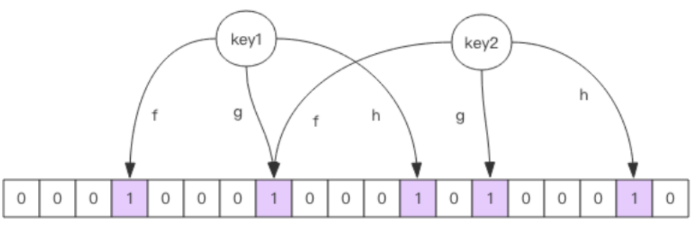
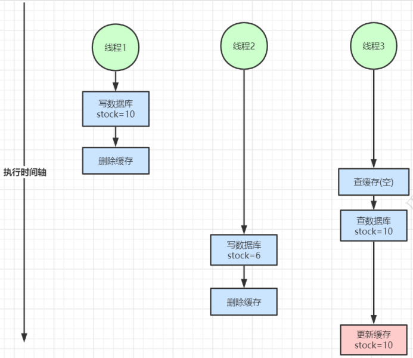

缓存穿透 

# 一、缓存穿透

## 1.1 说明

缓存穿透是指查询一个根本不存在的数据， 缓存层和存储层都不会命中， 通常出于容错的考虑， 如果从存储层查不到数据则不写入缓存层。 

缓存穿透将导致不存在的数据每次请求都要到存储层去查询， 失去了缓存保护后端存储的意义。 

造成缓存穿透的基本原因有两个： 

- 第一， 自身业务代码或者数据出现问题。 
- 第二， 一些恶意攻击、 爬虫等造成大量空命中。 

## 1.2 解决方案

### 1.2.1 缓存空对象

```
@Override
    public Product getProduct(Long productId) {
        String productCacheKey = RedisKeyPrefixconst.PRODUCT_CACHE + productId;
        Product product = getProductFromCache(productCacheKey);
        if (product != null) {
            if (product.getId() == null) return null;
            return product;
        }
        RLock hotCacheCreateLock = redissonClient.getLock(LOCK_PRODUCT_HOT_CACHE_CLEAR_PREFIX + productId);
        hotCacheCreateLock.lock();
        //如果采用trylock，当数据库查找存在偶尔延迟操作可以提高效率；弊端：存在同一时刻查询mysql量陡增的风险
//        hotCacheCreateLock.tryLock(3, TimeUnit.MINUTES);
        try {
            product = getProductFromCache(productCacheKey);
            if (product != null) {
                if (product.getId() == null) return null;
                return product;
            }
            RReadWriteLock productUpdateLock = redissonClient.getReadWriteLock(LOCK_PRODUCT_UPDATE_PREFIX + product.getId());
            RLock rLock = productUpdateLock.readLock();
            try {
                /**
                 * 数据库数据查询
                 */
                product = baseMapper.selectById(productId);
                if (product != null) {
                    redisutil.set(productCacheKey, JSON.toJSONString(product), getProductCacheTimeout());
                    cacheMap.put(productCacheKey, product);
                } else {
                    /**
                     * 防止内存穿透 带来的性能消耗问题
                     */
                    redisutil.set(productCacheKey, EMPTY_CACHE, getEmptyCacheTimeout());
                    cacheMap.put(productCacheKey, new Product());
                }
            } finally {
                cacheMap.remove(productCacheKey);
                rLock.unlock();
            }
        } finally {
            hotCacheCreateLock.unlock();
        }


        return product;
    }

    private Product getProductFromCache(String productCacheKey) {
        /**
         * JVM进程级别缓存
         */
        Product product = cacheMap.get(productCacheKey);
        if (product != null) {
            return product;
        }
        /**
         * redis 内存数据库级别缓存
         */
        String productStr = (String) redisutil.get(productCacheKey);
        if (!StringUtils.isEmpty(productStr)) {
            if (EMPTY_CACHE.equals(productStr)) {
                return new Product();
            }
            product = JSON.parseObject(productStr, Product.class);
        }
        return product;
    }
```

过程说明：

```
//1 从jvm进程级别缓存
Product product = cacheMap.get(productCacheKey);
//2 redis 内存数据库级别缓存
String productStr = (String) redisutil.get(productCacheKey);
//3 当1和2都未获取到数据时就查询数据库
product = baseMapper.selectById(productId);
//4.1 更新缓存
redisutil.set(productCacheKey, JSON.toJSONString(product), getProductCacheTimeout());
cacheMap.put(productCacheKey, product);
//4.2 数据库未查找缓存空对象
redisutil.set(productCacheKey, EMPTY_CACHE, getEmptyCacheTimeout());
cacheMap.put(productCacheKey, new Product());
```

总体代码思路：Java的double checked lock思路

```
查找缓存
if(缓存不存在){
  查找缓存
  if(缓存不存在){
     //这里加入了读写锁，当数据更新时，为了查找数据为最新引入读写机制
     查找数据库   
  }
}
```

### 1.2.2 布隆过滤器

对于不存在的数据布隆过滤器一般都能够过滤掉，不让请求再往后端发送。当布隆过滤器说某个值存在时，这个值可能不存在；当它说不存在时，那就肯定不存在。



 向布隆过滤器中添加 key 时，会使用多个 hash 函数对 key 进行 hash 算得一个整数索引值然后对位数组长度 进行取模运算得到一个位置，每个 hash 函数都会算得一个不同的位置。再把位数组的这几个位置都置为 1 就 完成了 add 操作。 向布隆过滤器询问 key 是否存在时，跟 add 一样，也会把 hash 的几个位置都算出来，看看位数组中这几个 位置是否都为 1，只要有一个位为 0，那么说明布隆过滤器中这个key 不存在。如果都是 1，这并不能说明这 个 key 就一定存在，只是极有可能存在，因为这些位被置为 1 可能是因为其它的 key 存在所致。如果这个位数组比较稀疏，这个概率就会很大，如果这个位数组比较拥挤，这个概率就会降低。

这种方法适用于数据命中不高、 数据相对固定、 实时性低（通常是数据集较大） 的应用场景， 代码维护较为 复杂， 但是缓存空间占用很少。

简单来说：

就是把一个key通过多个hash函数得到值，和布隆过滤器中的size进行mod运算，得到多个位置，把状态置为1。

由于不同的key的hash可能相同，所以当前key的hash得到1时，不一定当前key一定存在；相反如果得到0时，肯定不存在。

所以在具体的项目中在需要对存储空间 和误差率做一个权衡，

```
public Product getProduct2(Long productId) {
//这两句代码需要放到初始化中
        RBloomFilter<Long> bloomFilter = redissonClient.getBloomFilter(PRODUCT_CACHE_BLOOM_FILTER);
        bloomFilter.tryInit(100000000L, 0.03);

        String productCacheKey = RedisKeyPrefixconst.PRODUCT_CACHE + productId;
        Product product = getProductFromCache(productCacheKey);
        if (product != null || bloomFilter.contains(productId)) {
            return product;
        }
        RLock hotCacheCreateLock = redissonClient.getLock(LOCK_PRODUCT_HOT_CACHE_CLEAR_PREFIX + productId);
        hotCacheCreateLock.lock();
        //如果采用trylock，当数据库查找存在偶尔延迟操作可以提高效率；弊端：存在同一时刻查询mysql量陡增的风险
//        hotCacheCreateLock.tryLock(3, TimeUnit.MINUTES);
        try {
            product = getProductFromCache(productCacheKey);
            if (product != null || bloomFilter.contains(productId)) {
                return product;
            }
            RReadWriteLock productUpdateLock = redissonClient.getReadWriteLock(LOCK_PRODUCT_UPDATE_PREFIX + product.getId());
            RLock rLock = productUpdateLock.readLock();
            try {
                /**
                 * 数据库数据查询
                 */
                product = baseMapper.selectById(productId);
                if (product != null) {
                    redisutil.set(productCacheKey, JSON.toJSONString(product), getProductCacheTimeout());
                    cacheMap.put(productCacheKey, product);
                } else {
                    bloomFilter.add(productId);
                }
            } finally {
                cacheMap.remove(productCacheKey);
                rLock.unlock();
            }
        } finally {
            hotCacheCreateLock.unlock();
        }


        return product;
    }

    private Product getProductFromCache(String productCacheKey) {
        /**
         * JVM进程级别缓存
         */
        Product product = cacheMap.get(productCacheKey);
        if (product != null) {
            return product;
        }
        /**
         * redis 内存数据库级别缓存
         */
        String productStr = (String) redisutil.get(productCacheKey);
        if (!StringUtils.isEmpty(productStr)) {
            product = JSON.parseObject(productStr, Product.class);
        }
        return product;
    }
```

# 二、缓存击穿 

由于大批量缓存在同一时间失效可能导致大量请求同时穿透缓存直达数据库，可能会造成数据库瞬间压力过大甚至挂掉，对于这种情况我们在批量增加缓存时最好将这一批数据的缓存过期时间设置为一个时间段内的不同时间。

```
//获取一个随机时间，避免同一时间段
private Long getProductCacheTimeout() {
	return PRODUCT_CACHE_TIMEOUT + new Random().nextInt(30) * 60;
}
```

添加分布式锁机制：

```
RLock hotCacheCreateLock = redissonClient.getLock(LOCK_PRODUCT_HOT_CACHE_CLEAR_PREFIX + productId);
hotCacheCreateLock.lock();
```

上面1.2.1的算法思路

```
查找缓存
if(缓存不存在){
  查找缓存
  if(缓存不存在){
     //这里加入了读写锁，当数据更新时，为了查找数据为最新引入读写机制
     查找数据库   
  }
}
```

# 三、缓存雪崩

缓存雪崩指的是缓存层支撑不住或宕掉后， 流量会像奔逃的野牛一样， 打向后端存储层。 

由于缓存层承载着大量请求， 有效地保护了存储层， 但是如果缓存层由于某些原因不能提供服务(比如超大并发过来，缓存层支撑不住，或者由于缓存设计不好，类似大量请求访问bigkey，导致缓存能支撑的并发急剧下降)， 于是大量请求都会打到存储层， 存储层的调用量会暴增， 造成存储层也会级联宕机的情况。 

预防和解决缓存雪崩问题， 可以从以下三个方面进行着手。 

- 1） 保证缓存层服务高可用性，比如使用Redis Sentinel或Redis Cluster。 

- 2） 依赖隔离组件为后端限流熔断并降级。比如使用Sentinel或Hystrix限流降级组件。 

  比如服务降级，我们可以针对不同的数据采取不同的处理方式。当业务应用访问的是非核心数据（例如电商商品属性，用户信息等）时，暂时停止从缓存中查询这些数据，而是直接返回预定义的默认降级信息、空值或是错误提示信息；当业务应用访问的是核心数据（例如电商商品库存）时，仍然允许查询缓存，如果缓存缺失，也可以继续通过数据库读取。 

- 3） 提前演练。 在项目上线前， 演练缓存层宕掉后， 应用以及后端的负载情况以及可能出现的问题， 在此基础上做一些预案设定。

# 四、热点缓存key重建优化 

问题：

- 当前key是一个热点key，并发量非常大。 
- 重建缓存不能在短时间完成， 可能是一个复杂计算， 例如复杂的SQL、 多次IO、 多个依赖等。

在缓存失效的瞬间， 有大量线程来重建缓存， 造成后端负载加大， 甚至可能会让应用崩溃。 

要解决这个问题主要就是要避免大量线程同时重建缓存。 

可以利用互斥锁来解决，此方法只允许一个线程重建缓存， 其他线程等待重建缓存的线程执行完， 重新从缓存获取数据即可

```
RLock hotCacheCreateLock = redissonClient.getLock(LOCK_PRODUCT_HOT_CACHE_CLEAR_PREFIX + productId);
hotCacheCreateLock.lock();
```

# 五、缓存与数据库双写不一致

在大并发下，同时操作数据库与缓存会存在数据不一致性问题 

1、双写不一致情况 


2、读写并发不一致 



解决方案： 

1、对于并发几率很小的数据(如用户数据等)，这种几乎不用考虑这个问题，很少会发生缓存不一致，可以给缓存数据加上过期时间，每隔一段时间触发读的主动更新即可。 

2、就算并发很高，如果业务上能容忍短时间的缓存数据不一致(如商品名称，商品分类菜单等)，缓存加上过期时间依然可以解决大部分业务对于缓存的要求。 

3、如果不能容忍缓存数据不一致，可以通过加读写锁保证并发读写或写写的时候按顺序排好队，读读的时候相当于无锁。 

4、也可以用阿里开源的canal通过监听数据库的binlog日志及时的去修改缓存，但是引入了新的中间件，增加了系统的复杂度。 

总结：

对于读多写少的情况加入缓存提高性能，如果写多读多的情况又不能容忍缓存数据不一致，那就没必要加缓存了，可以直接操作数据库。如果数据库抗不住压力，还可以把缓存作为数据读写的主存储，异步将数据同步到数据库，数据库只是作为数据的备份。 

放入缓存的数据应该是对实时性、一致性要求不是很高的数据。切记不要为了用缓存，同时又要保证绝对的一致性做大量的过度设计和控制，增加系统复杂性！

# 六、redis开发规范说明

## 6.1 键值设计  

**key名设计**

(1)【建议】: 可读性和可管理性 

以业务名(或数据库名)为前缀(防止key冲突)，用冒号分隔，比如业务名:表名:id 

```
trade:order:1 
```

(2)【建议】：简洁性 

保证语义的前提下，控制key的长度，当key较多时，内存占用也不容忽视，例如： 

```
user:{uid}:friends:messages:{mid} 简化为 u:{uid}:frm:{mid} 
```

(3)【强制】：不要包含特殊字符 

反例：包含空格、换行、单双引号以及其他转义字符 

**value设计**

(1)【强制】：拒绝bigkey(防止网卡流量、慢查询) 

在Redis中，一个字符串最大512MB，一个二级数据结构（例如hash、list、set、zset）可以存储大约40亿个(2^32-1)个元素，但实际中如果下面两种情况，我就会认为它是bigkey。 

1. 字符串类型：它的big体现在单个value值很大，一般认为超过10KB就是bigkey。 
2. 非字符串类型：哈希、列表、集合、有序集合，它们的big体现在元素个数太多。 

一般来说，string类型控制在10KB以内，hash、list、set、zset元素个数不要超过5000。 

反例：一个包含200万个元素的list。 

## 6.2 bigkey的危害 

1 导致redis阻塞 

2 网络拥塞 

bigkey也就意味着每次获取要产生的网络流量较大，假设一个bigkey为1MB，客户端每秒访问量为1000，那么每秒产生1000MB的流量，对于普通的千兆网卡(按照字节算是128MB/s)的服务器来说简直是灭顶之灾，而且一般服务器会采用单机多实例的方式来部署，也就是说一个bigkey可能会对其他实例也造成影响，其后果不堪设想。 

3 过期删除 

有个bigkey，它安分守己（只执行简单的命令，例如hget、lpop、zscore等），但它设置了过期时间，当它过期后，会被删除，如果没有使用Redis 4.0的过期异步删除(lazyfree-lazy-expire yes)，就会存在阻塞Redis的可能性。 

bigkey的产生： 

一般来说，bigkey的产生都是由于程序设计不当，或者对于数据规模预料不清楚造成的，来看几个例子： 

(1) 社交类：粉丝列表，如果某些明星或者大v不精心设计下，必是bigkey。 

(2) 统计类：例如按天存储某项功能或者网站的用户集合，除非没几个人用，否则必是bigkey。 

(3) 缓存类：将数据从数据库load出来序列化放到Redis里，这个方式非常常用，但有两个地方需要注意，第一，是不是有必要把所有字段都缓存；第二，有没有相关关联的数据，有的同学为了图方便把相关数据都存一个key下，产生bigkey。 

## 6.3 如何优化bigkey 

1. 拆

- big list： list1、list2、...listN 
- big hash：可以讲数据分段存储，比如一个大的key，假设存了1百万的用户数据，可以拆分成200个key，每个key下面存放5000个用户数据 

2. 如果bigkey不可避免，也要思考一下要不要每次把所有元素都取出来(例如有时候仅仅需要hmget，而不是hgetall)，删除也是一样，尽量使用优雅的方式来处理。 

## 6.4 选择适合的数据类型。 

例如：实体类型(要合理控制和使用数据结构，但也要注意节省内存和性能之间的平衡) 

反例：

```
set user:1:name tom 
set user:1:age 19 
set user:1:favor football 
```

正例：

```
hmset user:1 name tom age 19 favor football
```

## 6.5 控制key的生命周期，打散过期时间。 

# 七、命令使用 

1.【推荐】 O(N)命令关注N的数量 

例如hgetall、lrange、smembers、zrange、sinter等并非不能使用，但是需要明确N的值。有 

遍历的需求可以使用hscan、sscan、zscan代替。 

2.【推荐】：禁用命令 

禁止线上使用keys、flushall、flushdb等，通过redis的rename机制禁掉命令，或者使用scan的方式渐进式处理。 

3.【推荐】合理使用select 

redis的多数据库较弱，使用数字进行区分，很多客户端支持较差，同时多业务用多数据库实际还是单线程处理，会有干扰。 

4.【推荐】使用批量操作提高效率 

1 原生命令：例如mget、mset。 

2 非原生命令：可以使用pipeline提高效率。 

但要注意控制一次批量操作的元素个数(例如500以内，实际也和元素字节数有关)。 

注意两者不同： 

- 原生命令是原子操作，pipeline是非原子操作。 
- pipeline可以打包不同的命令，原生命令做不到 
- pipeline需要客户端和服务端同时支持。 

5.【建议】Redis事务功能较弱，不建议过多使用，可以用lua替代 

例如：setNX和setnxAndExpire，setnxAndExpire可以通过lua脚本实现同时向redis发送setnx和过期时间，这样能够避免setnx后过期时间设置失败的尴尬局面

```java
  private static final String SETNX_EXPIRE_SCRIPT = "if redis.call('setnx', KEYS[1], ARGV[1]) == 1 then\n"
            + "return redis.call('expire', KEYS[1], ARGV[2]);\n" + "end\n" + "return 0;";
   public boolean setNX(String key, int timeout) {
        Boolean notExists = redisTemplate.getConnectionFactory().getConnection().setNX(key.getBytes(), new byte[0]);
        Boolean expire = redisTemplate.expire(key, timeout, TimeUnit.SECONDS);
        return notExists != null?notExists.booleanValue():false;
    }
    public boolean setnxAndExpire(String key,Object value,int seconds){
        RedisScript<Long> script = new DefaultRedisScript<Long>(SETNX_EXPIRE_SCRIPT, Long.class);
        Long result = (Long)redisTemplate.execute(script,Collections.singletonList(key),value,seconds);
        return result>0?true:false;
    }
```


