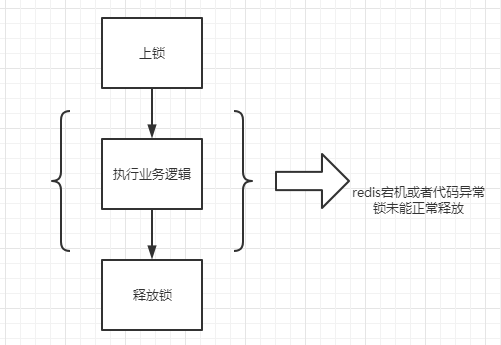
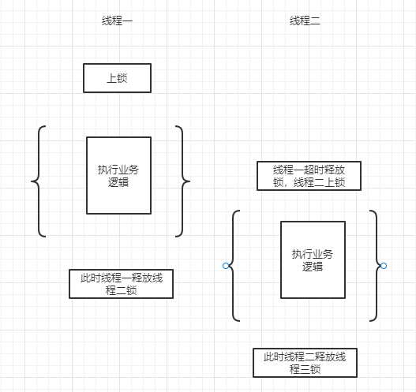
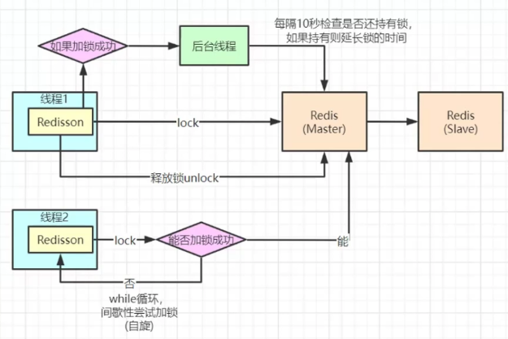

# 1 分布式锁基础方案

```
    @Override
    public String payment(String account, int money, String orderId) {
        //redis 核心原理还是setnx orderId TokenLock 命令方式
        boolean lock = redisTemplate.opsForValue().setIfAbsent(orderId, "lock");
        if (!lock) {
            return "锁具被上锁";
        }
        try {
            int balance = Integer.valueOf(redisTemplate.opsForValue().get("balance"));
            if(balance-money>0){
                redisTemplate.opsForValue().set("balance",String.valueOf(balance-money));
                return "扣减成功";
            }else{
                return "扣减失败，金额不足";
            }
        } finally {
            redisTemplate.delete(orderId);
        }
    }
```

基础redis的实现方案原理：

```
setnx orderId lock
```

问题一：通过redis的命令setnx来实现基础分布式锁，但未设置过期时间，redis 宕机或者代码异常导致订单锁未被成功释放，导致订单支付不能重新支付。



# 2 基础方案优化

```java
/**
     * 虽然payment2解决了redis宕机或者异常导致锁不能释放的问题，但还有其它问题，
     */
public String payment2(String account, int money, String orderId) {
    //redis 核心原理还是setnx orderId TokenLock 命令方式
    boolean lock = redisTemplate.opsForValue().setIfAbsent(orderId, "lock",30, TimeUnit.SECONDS);
    if (!lock) {
        return "锁具被上锁";
    }
    try {
        int balance = Integer.valueOf(redisTemplate.opsForValue().get("balance"));
        if(balance-money>0){
            redisTemplate.opsForValue().set("balance",String.valueOf(balance-money));
            return "扣减成功";
        }else{
            return "扣减失败，金额不足";
        }
    } finally {
        redisTemplate.delete(orderId);
    }
}
```

redis命令执行：

```
setnx orderId lock
expire orderId 时间
```

虽然加上了过期时间，但是如果在特殊场景下：

```java
int balance = Integer.valueOf(redisTemplate.opsForValue().get("balance"));
if(balance-money>0){
    redisTemplate.opsForValue().set("balance",String.valueOf(balance-money));
    return "扣减成功";
}else{
    return "扣减失败，金额不足";
}
```

问题二：线程一执行时间过长，导致分布式锁设置的key失效，而线程二进入执行创建了一把新的分布式锁，而这个时候线程一执行完成通过finally中的代码删除分布式锁，然后这个时候的锁已经不是之前线程一创建的锁了。所以在高并发中，如果出现一个任务执行时间超过30s，redis锁出现自动过期，就会导致：

线程1删除线程2的锁，线程2删除线程3的锁，线程3删除线程4的锁，线程n-1删除线程n的锁，可能会出现 同一把锁中执行了x个任务（出现锁过期数+1）



# 3 继续优化

```java
    public String payment3(String account, int money, String orderId) {
        String uuid = UUID.randomUUID().toString();
        boolean lock = redisTemplate.opsForValue().setIfAbsent(orderId, uuid, 30, TimeUnit.SECONDS);
        if (!lock) {
            return "锁具被上锁";
        }
        try {
            int balance = Integer.valueOf(redisTemplate.opsForValue().get("balance"));
            if (balance - money > 0) {
                redisTemplate.opsForValue().set("balance", String.valueOf(balance - money));
                return "扣减成功";
            } else {
                return "扣减失败，金额不足";
            }
        } finally {
            if (uuid.equals(redisTemplate.opsForValue().get(orderId))) {
                redisTemplate.delete(orderId);
            }
        }
    }
```

在payment2的基础上加入一个唯一的value，当删除当前锁的时候判断是否持有。

```java
if (uuid.equals(redisTemplate.opsForValue().get(orderId))) {
                redisTemplate.delete(orderId);
            }
```

但还是不能保证，如果当执行redisTemplate.opsForValue().get(orderId)返回成功后，之前设置的分布式锁突然过期了，这个时候其它线程还是会涌入进来创建新锁，所以payment2出现的问题还是没有解决

# 4 锁续期解决方案

```java
public String payment4(String account, int money, String orderId) {
    RLock lock = redissonClient.getLock(orderId);
    try {
        lock.lock();
        int balance = Integer.valueOf(redisTemplate.opsForValue().get("balance"));
        if (balance - money > 0) {
            redisTemplate.opsForValue().set("balance", String.valueOf(balance - money));
            return "扣减成功";
        } else {
            return "扣减失败，金额不足";
        }
    } finally {
        lock.unlock();
    }
}
```

这里用到了redission的方案。

# 5 redission的源码实现

```java
    <T> RFuture<T> tryLockInnerAsync(long waitTime, long leaseTime, TimeUnit unit, long threadId, RedisStrictCommand<T> command) {
        return evalWriteAsync(getRawName(), LongCodec.INSTANCE, command,
                "if (redis.call('exists', KEYS[1]) == 0) then " +
                        "redis.call('hincrby', KEYS[1], ARGV[2], 1); " +
                        "redis.call('pexpire', KEYS[1], ARGV[1]); " +
                        "return nil; " +
                        "end; " +
                        "if (redis.call('hexists', KEYS[1], ARGV[2]) == 1) then " +
                        "redis.call('hincrby', KEYS[1], ARGV[2], 1); " +
                        "redis.call('pexpire', KEYS[1], ARGV[1]); " +
                        "return nil; " +
                        "end; " +
                        "return redis.call('pttl', KEYS[1]);",
                Collections.singletonList(getRawName()), unit.toMillis(leaseTime), getLockName(threadId));
    }
```

具体执行的就是lua脚本，通过以上命令可以看出，



源码：https://github.com/leellun/redis-clean.git