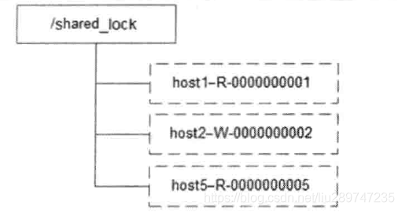

# ZooKeeper介绍

ZooKeeper是一个分布式协调服务、分布式数据一致性的解决方案，是Google Chubby的开源实现。分布式应用程序可以基于它实现诸如发布/订阅、负载均衡、命名服务、分布式协调/通知、集群管理、Master选举、分布式锁和分布式队列等功能。

## ZooKeeper分布式特性

顺序一致性：从同一个客户端发起的事务请求，最终将会严格地按照其发起顺序被应用到ZooKeeper中去。

原子性：所有事务请求的处理结果在整个集群中所有机器上的应用情况是一致的，即要么整个集群所有机器都成功应用了某一个事务，要么都没有应用。

单一视图：无论客户端连接的是哪个ZooKeeper服务器，其看到的服务端数据模型都是一致的。

可靠性：一旦服务端成功地应用了一个事务，并完成对客户端的响应，那么该事务所引用的服务端状态变更将会被一直保留下来，除非又另一个事务又对其进行了变更。

实时性：一旦一个事务被成功应用，那么客户端能够被立即从服务端上读取到这个事务变更后的最新数据状态。但ZooKeeper仅仅保证在一定的时间段内，客户端最终一定能够从服务端上读取到最新的数据状态。

## ZooKeeper设计目标

ZooKeeper致力于提供一个高性能、高可用，且最具有严格的顺序访问控制能力（主要写操作的严格顺序性）的分布式协调服务。

（1）简单的数据模型

ZooKeeper使得分布式程序能够通过一个共享的、树型结构的命名空间来进行享互协调。树型结构的名字空间是指ZooKeeper服务器内存中的一个数据模型，其由一些列被称为ZNode的数据节点组成，类似文件系统。不同之处在ZooKeeper将全部数据存储在内存中，以此来实现提高服务器吞吐、减少延迟。

（2）可以构建集群

ZooKeeper由一组机器组成，可以3~5台机器，建议不小于3的奇数。


组成ZooKeeper集群的每台服务器都会在内存中维护当前的服务器状态，并且每台机子之间都互相保持着通信。只要集群中保持着一般的机子能够正常工作，那么整个集群九能够正常对外服务。

ZooKeeper的客服端程序会选择和集群中任意一台机器共同创建一个TCP连接，而一旦客户端和某台ZooKeeper服务之间的连接断开后，客服端会自动连接到集群中的其它机器。

（3）顺序访问

对于来自客户端的每个更新请求，ZooKeeper都会分配一个全局唯一的递增编号，这个编号反映了所有事务操作的时候顺序，应用程序可以使用ZooKeeper的这个特性来实现更高层次的同步原语。

（4）高性能

由于ZooKeeper将全部数据存储在内存中，并直接服务与客户端的所有非事务请求，因此尤其适用于以读操作为主的应用场景。

## ZooKeeper基本概念

### 集群

ZooKeeper并没有沿用传统的Master/Slave模式，而是引入Leader、Follower和Observer三种角色。ZooKeeper集群中的所有机器通过一个Leader选举过程来选定一台被称为“Leader”的机器，Leader服务器为客户端提供读和写的服务。Follower和Observer都能够提供读服务，唯一的区别在于Observer机器不参与Leader选举过程，也不参与写操作的“过半写成功”策略，因此Observer在不影响写性能的情况下提升集群的读性能。

### 会话

https://www.cnblogs.com/leesf456/p/6103870.html

### 数据节点（Znode）

分布式中，“节点”指组成集群的每一台机器。在ZooKeeper中，“节点”分为两类，第一类指构成集群的机器，称为机器节点；第二类指数据模型中的数据单元，称为数据节点(ZNode)。

ZooKeeper将所有的数据存储在内存中，数据模型是一棵树(ZNode Tree)。名字空间由节点znode构成，其组织方式类似文件系统，其中各个节点相当于目录和文件，通过路径作为唯一标识，例如/path1/path2。

与文件系统不同的是，每个节点具有与之对应的数据内容和一系列属性信息，同时也可以具有子节点。

zookeeper用于存储协调数据，如状态、配置、位置等信息，每个节点存储的数据量很小，KB级别。

在ZooKeeper中，ZNode可以分为持久节点和临时节点两类。

持久节点：指一旦这个ZNode被创建，除非主动进行ZNode的移除操作，否则这个ZNode将一直保存在ZooKeeper上。

临时节点：生命周期和客户端会话绑定，一旦客户端会话失效，这个客户端创建的所有临时节点都会被移除。

SEQUENTIAL：当用户为节点添加这个属性时，节点被创建时，ZooKeeper会自动在其节点后面追加一个整型数字，这个整型数字由父节点维护的自增数字。

### 版本

对于每个ZNode，ZooKeeper会为其维护一个Stat的数据结构，Stat中记录了Znode的三个数据版本，分别时version(当前Znode版本)、cversion(当前ZNode子节点的版本)和aversion(当前ZNode的ACL版本)。

### Watcher

Watcher(事件监听器)，Zookeeper对Node的增删改查都可触发监听。

watch事件是一次性触发器，当watch监视的数据发生变化时，通知设置了该watch的client，即watcher。

watch事件异步发送至观察者。

watch是一次性出发的并且在获取watch事件和设置新watch事件之间又延迟，所以不能可靠的观察节点的每一次变化。

客户端监视一个节点总是先获取watch事件，再发现节点的数据变化。

watch事件的顺序对应于zookeeper服务所见的数据更新的顺序。

### ACL

ZooKeeper采用ACL(Access Control Lists)策略来进行权限控制，类似于UNIX文件系统的权限控制。**ZooKeeper 5种权限：**

CREATE：创建子节点的权限

READ：获取节点数据和子节点列表的权限

WRITE：更新节点数据的权限

DELETE：删除子节点的权限

ADMIN：设置节点ACL的权限

这5种权限简写为crwda(即：每个单词的首字符缩写) 

**zookeeper的身份认证有4种方式 **

world：默认方式，相当于全世界都能访问

auth：代表已经认证通过的用户(cli中可以通过addauth digest user:pwd 来添加当前上下文中的授权用户)

digest：即用户名:密码这种方式认证，这也是业务系统中最常用的 

ip：使用ip地址认证 

### ZAB协议

ZAB（ZooKeeper Atomic Broadcast，ZooKeeper原子消息广播协议）协议作为ZooKeeper数据一致性的核心算法。

ZAB协议是为分布式协调服务ZooKeeper专门设计的一种支持崩溃恢复的原子广播协议。给予该协议，ZooKeeper实现了一种主备模式的系统架构来保持集群中各副本之间数据的一致性。换言之，ZooKeeper使用一个单一的主进程来接收并处理客户端的所有事务请求，并采用ZAB的原子协议，将服务器数据的状态变更以事务Proposal的形式广播到所有的副本进程上去。ZAB协议的这个主备模型架构保证了同一时刻集群中只能够有一个主进程来广播服务器的状态变更，因此能够很好地处理客户端大量的并发请求。

ZAB协议核心：

所有事务请求必须由一个全局唯一的服务器来协调处理，即Leader服务器，余下其他服务器为Follower服务器。Leader服务器负责将一个客户端事务请求转换成一个事务Proposal（提议），并将该Proposal分发给集群中所有的Follower服务器。之后Leader服务器需要等待所有Follower服务器的反馈，一旦超过半数的Follower服务器进行正确的反馈后，那么Leader就会再次向所有的Follower服务器分发Commit消息，要求其将前一个Proposal进行提交。

# ZooKeeper使用

## 部署

### 基本步骤

（1）下载并解压ZooKeeper至指定路径

[下载路径](https://mirrors.tuna.tsinghua.edu.cn/apache/zookeeper/)

（2）配置zoo.cfg

将conf下 zoo_sample.cfg更名为zoo.cfg

```pro
#客户端与服务器或者服务器与服务器之间心跳时间
tickTime=2000
#集群中的follower服务器(F)与leader服务器(L)之间初始连接时能容忍的最多心跳数（tickTime的数量）
initLimit=10
#集群中的follower服务器(F)与leader服务器(L)之间请求和应答时能容忍的最多心跳数（tickTime的数量）。
syncLimit=5
#该属性对应的目录是用来存放myid信息跟一些版本，日志，跟服务器唯一的ID信息等。
dataDir=/tmp/zookeeper
#客户端连接的接口，客户端连接zookeeper服务器的端口，zookeeper会监听这个端口，接收客户端的请求访问！这个端口默认是2181。
clientPort=2181
#集群模式下项
server.1=IP1:2888:3888
server.2=IP2:2888:3888
server.3=IP3:2888:3888
```

service.N =H： A：B

N：代表服务器编号（也就是myid里面的值）

H：服务器地址

A：表示 Flower 跟 Leader的通信端口，简称服务端内部通信的端口（默认2888）

B：表示 是选举端口（默认是3888）

（3）创建myid文件

在dataDir所配置的目录下，创建名为myid的文件，在该文件的第一行写一个数字，和zoo.cfg中当前机器的编号对应上。

（4）启动服务器

bin/zkServer.sh start

（5）停止服务

bin/zkServer.sh stop

### 单机模式

zoo.cfg配置：

```proper
tickTime=2000
initLimit=10
syncLimit=5
dataDir=/tmp/zookeeper
clientPort=2181
server.1=IP1:2888:3888
```

### 伪集群模式

集群所有的机器都在一台机器上，只是以集群的特性来提供服务。

zoo.cfg配置：

```proper
tickTime=2000
initLimit=10
syncLimit=5
dataDir=/tmp/zookeeper
clientPort=2181
server.1=IP1:2888:3888
server.2=IP1:2889:3889
server.3=IP1:2890:3890
```

### 集群模式

集群模式和伪集群模式配置大体相同，唯一不同之处是集群的服务器分别运行在不同的机器上。

```prop
server.1=IP1:2888:3888
server.2=IP2:2889:3889
server.3=IP3:2890:3890
```

## ZooKeeper命令

### 基本命令

| 脚本      | 说明                                                  |
| --------- | ----------------------------------------------------- |
| zkCleanup | 清理ZooKeeper历史数据，包括事务日志文件和快照数据文件 |
| zkCli     | ZooKeeper的一个简易客户端                             |
| zkEnv     | 设置ZooKeeper的环境变量                               |
| zkServer  | ZooKeeper服务器的启动、停止和重启脚本                 |

### 客户端命令

通过zkCli.sh连接指定ZooKeeper服务器

zkCli.sh -server ip:port

##### create

create \[-s] [-e] path data acl

-s：顺序节点 　

-e：临时节点 

例如: create -e /temp data1

##### ls

列出ZooKeeper指定节点下的所有子节点，也可以指定节点下第一级的所有子节点。

ls path [watch]

例如：ls /

##### get

获取ZooKeeper指定节点的数据内容和属性信息。

get path [watch]

例如：get /zk-book1

##### ls2

列出当前节点的子节点，同时列出节点状态

##### set

更新指定节点的数据内容。

set path data [version]

例如：set /temp data2 0

##### delete

delete path [version]

此命令中的version参数和set命令中的version参数的作用是一致的。

##### h（help）

查看帮助

##### stat

查看节点的状态信息

在zookeeper中，每一次对节点的写操作都认为是一次事务，每一个事务，系统都会分配一个唯一的事务ID。 　　

```
czxid：节点被创建的事务ID 　　
ctime: 创建时间 　　
mzxid: 最后一次被更新的事务ID 　　
mtime: 修改时间 　　
pzxid：子节点列表最后一次被更新的事务ID 　　
cversion：子节点的版本号 　　
dataversion：数据版本号 　　
aclversion：权限版本号 　　
ephemeralOwner：用于临时节点，代表临时节点的事务ID，如果为持久节点则为0 dataLength：节点存储的数据的长度 　　
numChildren：当前节点的子节点个数  
```

##### rmr

递归删除节点（含子节点)　　如：rmr /zk 

##### setquota

设置配额，给节点限制值，比如限制子节点个数、节点数据的长度（当创建节点超出配额时，zookeeper不会抛出异常，会在zookeeper.out记录警告信息）

　　-n：限制子节点个数
　　-b：限制值的长度

##### listquota

查看配额，以及节点的配额状态

##### delquota

删除配额

##### close

关闭当前连接

##### history

查看历史执行指令

##### redo

重复执行指令

##### ACL相关 

认证实例：

（1）增加一个认证用户

addauth digest 用户名:密码明文，如：addauth digest user1:password1 

（2）设置权限： 

setAcl /path auth:用户名:密码明文:权限，如：setAcl /test auth:user1:password1:cdrwa 

setAcl /path digest:用户名:密码密文:权限 

查看Acl设置：getAcl /path 

## Java客户端API使用

### ZooKeeper客户端

#### 会话创建

构造方法：

```java
ZooKeeper(String connectString, int sessionTimeout, Watcher watcher);
ZooKeeper(String connectString, int sessionTimeout, Watcher watcher,boolean canBeReadOnly);
ZooKeeper(String connectString, int sessionTimeout, Watcher watcher,
            long sessionId, byte[] sessionPasswd);
ZooKeeper(String connectString, int sessionTimeout, Watcher watcher,
            long sessionId, byte[] sessionPasswd, boolean canBeReadOnly)
```

参数说明：

| 参数名                   | 说明                                                         |
| ------------------------ | ------------------------------------------------------------ |
| connectString            | ZooKeeper服务器地址列表，由英文逗号分开的host:port字符串组成，每一个代表一台ZooKeeper服务器。例如192.168.1.2:2181,192.168.1.3:2181,192.168.1.4:2181 |
| sessionTimeout           | 会话超时时间，“毫秒”级整型值。在会话周期内，ZooKeeper客户端和服务端通过心跳检测机制来维持会话的有效性，一旦在sessionTimeout时间内没有进行有效心跳检测，会话就会失效。 |
| watcher                  | 上面由Watcher介绍                                            |
| canBeReadOnly            | 当前会话是否支持“read-only(只读)”模。                        |
| sessionId和sessionPasswd | 分别代表会话ID和会话密钥。这两个参数能够确定一个会话，同时客户端使用这两个参数实现客户端会话复用，从而达到恢复会话效果。例子：第一次连接ZooKeeper服务器，然后调用ZooKeeper对象实例获取ID和密钥:long getSessionId();byte[] getSessionPasswd(); 下次创建ZooKeeper对象实例时候传入构造方法。 |

ZooKeeper客户端和服务端会话的建立时一个异步的过程，所以当初始化ZooKeeper构造方法完成时，不一定建立好了一个可用会话，此时会话的生命周期可能处于"CONNECTING"的状态。

创建ZooKeeper会话实例：

```java
public class ZooKeeperConstructorUsageSimple implements Watcher {
	private static CountDownLatch connectedSemaphore = new CountDownLatch(1);

	public static void main(String[] args) throws Exception {

		ZooKeeper zookeeper = new ZooKeeper(ZooKeeperConfig.HOST, 5000, 
				new ZooKeeperConstructorUsageSimple());
		System.out.println(zookeeper.getState());
		try {
            //等待ZooKeeper创建会话连接
			connectedSemaphore.await();
		} catch (InterruptedException e) {
		}
		System.out.println("ZooKeeper session established.");
	}
	
	public void process(WatchedEvent event) {
		System.out.println("Receive watched event：" + event);
		if (KeeperState.SyncConnected == event.getState()) {
			connectedSemaphore.countDown();
		}
	}
}
```

打印信息：

```java
CONNECTING
Receive watched event：WatchedEvent state:SyncConnected type:None path:null
ZooKeeper session established.
```

创建复用sessionId和sessionPasswd的ZooKeeper会话实例：

```java
public class ZooKeeperConstructorUsageWithSIDPASSWD implements Watcher {
    private static CountDownLatch connectedSemaphore = new CountDownLatch(1);
    public static void main(String[] args) throws Exception{
        ZooKeeper zookeeper = new ZooKeeper(ZooKeeperConfig.HOST, 
				5000, 
				new ZooKeeperConstructorUsageWithSIDPASSWD());
        connectedSemaphore.await();
        long sessionId = zookeeper.getSessionId();
        byte[] passwd  = zookeeper.getSessionPasswd();
        //使用sessionId和密钥创建会话
        zookeeper = new ZooKeeper(ZooKeeperConfig.HOST, 
				5000, 
				new ZooKeeper_Constructor_Usage_With_SID_PASSWD(),
				sessionId,
				passwd);
        Thread.sleep( Integer.MAX_VALUE );
    }
    public void process(WatchedEvent event) {
        System.out.println("Receive watched event：" + event);
        if (KeeperState.SyncConnected == event.getState()) {
            connectedSemaphore.countDown();
        }
    }
}
```

#### 创建节点

ZooKeeper不支持递归创建，即无法在父节点不存在的情况下创建一个子节点。当创建的节点已经存在时，会抛出NodeExistsException异常。

```java
//同步方式创建节点
String create(final String path, byte data[], List<ACL> acl, CreateMode createMode)
//异步方式创建节点
void create(final String path, byte data[], List<ACL> acl, CreateMode createMode,  StringCallback cb, Object ctx)
```

参数说明：

| 参数名     | 说明                                                         |
| ---------- | ------------------------------------------------------------ |
| path       | 需要创建的数据节点的节点路径，例如：/zk/book1                |
| data       | 字节数组，节点创建后的初始内容                               |
| acl        | 节点ACL策略                                                  |
| createMode | 节点类型，枚举类型：<br/> 持久（PERSISTENT）<br/>持久顺序（PERSISTENT_SEQUENTIAL）<br/>临时（EPHEMERAL）<br/>临时顺序（EPHEMERAL_SEQUENTIAL） |
| cb         | 当服务端节点创建完毕后，ZooKeeper客户端会自动调用回调        |
| ctx        | 用于传递一个对象，可以在回调方法执行的时候使用，通常时放一个上下文消息 |

ZooKeeper的节点内容只支持字节数组（byte[]）类型，即ZooKeeper不负责为节点内容进行序列化，开发人员需要自己对节点内容进行序列化和反序列化。

代码：

```java
import java.util.concurrent.CountDownLatch;
import org.apache.zookeeper.AsyncCallback;
import org.apache.zookeeper.CreateMode;
import org.apache.zookeeper.WatchedEvent;
import org.apache.zookeeper.Watcher;
import org.apache.zookeeper.Watcher.Event.KeeperState;
import org.apache.zookeeper.ZooDefs.Ids;

import com.newland.zookeeperdemo.ZooKeeperConfig;

import org.apache.zookeeper.ZooKeeper;

// ZooKeeper API创建节点。
public class ZooKeeperCreateAPIUsage implements Watcher {

    private static CountDownLatch connectedSemaphore = new CountDownLatch(1);

    public static void main(String[] args) throws Exception{
	 ZooKeeper zookeeper = new ZooKeeper(ZooKeeperConfig.HOST, 
				5000, //
				new ZooKeeperCreateAPIUsage());
	 connectedSemaphore.await();
	 //创建异步持久节点
	 zookeeper.create("/zk-test-ephemeral-", "".getBytes(), 
	    		Ids.OPEN_ACL_UNSAFE, CreateMode.EPHEMERAL, 
	    		new IStringCallback(), "I am context.");   
     //创建异步持久节点
	 zookeeper.create("/zk-test-ephemeral-", "".getBytes(), 
	    		Ids.OPEN_ACL_UNSAFE, CreateMode.EPHEMERAL, 
	    		new IStringCallback(), "I am context.");   
     //创建异步持久有序节点
	 zookeeper.create("/zk-test-ephemeral-", "".getBytes(), 
	    		Ids.OPEN_ACL_UNSAFE, CreateMode.EPHEMERAL_SEQUENTIAL, 
	    		new IStringCallback(), "I am context.");
        
     //创建同步临时节点
     String path1 = zookeeper.create("/zk-test-ephemeral-", 
                                        "".getBytes(), 
                                        Ids.OPEN_ACL_UNSAFE, 
                                        CreateMode.EPHEMERAL);
     System.out.println("Success create znode: " + path1);
	//创建同步临时有序节点
     String path2 = zookeeper.create("/zk-test-ephemeral-", 
                                        "".getBytes(), 
                                        Ids.OPEN_ACL_UNSAFE,
                                        CreateMode.EPHEMERAL_SEQUENTIAL);
     System.out.println("Success create znode: " + path2);
	Thread.sleep( Integer.MAX_VALUE );
    }
    
    public void process(WatchedEvent event) {
        if (KeeperState.SyncConnected == event.getState()) {
            connectedSemaphore.countDown();
        }
    }
}
class IStringCallback implements AsyncCallback.StringCallback{
  public void processResult(int rc, String path, Object ctx, String name) {
    System.out.println("Create path result: [" + rc + ", " + path + ", "
                   + ctx + ", real path name: " + name);
  }
```

打印信息：

异步信息

```java
Create path result: [0, /zk-test-ephemeral-, I am context., real path name: /zk-test-ephemeral-
Create path result: [-110, /zk-test-ephemeral-, I am context., real path name: null
Create path result: [0, /zk-test-ephemeral-, I am context., real path name: /zk-test-ephemeral-0000000002
```

同步信息

```java
Success create znode: /zk-test-ephemeral-
Success create znode: /zk-test-ephemeral-0000000007
```

#### AsyncCallback通知

##### StatCallback

节点状态异步通知回调

```java
interface StatCallback extends AsyncCallback {
        /**
         * @param rc   服务端响应结果码
         * @param path 传递给异步调用的路径
         * @param ctx  异步调用的任何上下文对象
         * @param stat {@link org.apache.zookeeper.data.Stat} 状态.
         */
        public void processResult(int rc, String path, Object ctx, Stat stat);
    }
```

##### DataCallback

此回调用于检索节点的数据和状态。 

```java
interface DataCallback extends AsyncCallback {
        /**
         * @param rc   服务端响应结果码.
         * @param path 节点路径.
         * @param ctx  上下文.
         * @param data  {@link org.apache.zookeeper.server.DataNode#data}节点数据.
         * @param stat {@link org.apache.zookeeper.data.Stat} 节点路径下属性状态.
         */
        public void processResult(int rc, String path, Object ctx, byte data[],
                Stat stat);
    }
```

##### ACLCallback

此回调用于检索节点的ACL和stat 

```java
interface ACLCallback extends AsyncCallback {
        /**
         * @param rc   服务器响应码.
         * @param path 异步通知节点路径.
         * @param ctx 传递给异步调用的任何上下文对象.
         * @param acl  ACL Id in
         *             {@link org.apache.zookeeper.ZooDefs.Ids}.
         * @param stat {@link org.apache.zookeeper.data.Stat} 节点stat.
         */
        public void processResult(int rc, String path, Object ctx,
                List<ACL> acl, Stat stat);
    }
```

##### ChildrenCallback

此回调用于检索节点的子节点。 

```java
interface ChildrenCallback extends AsyncCallback {
        /**
         * @param rc       服务端响应结果码.
         * @param path     传递给异步调用的路径.
         * @param ctx      传递给异步调用的任何上下文对象.
         * @param children 给定路径上节点的子节点的无序数组.
         */
        public void processResult(int rc, String path, Object ctx,
                List<String> children);
    }
```

##### Children2Callback

此回调用于检索节点的子节点和属性。 

```java
interface Children2Callback extends AsyncCallback {
        /**
         * Process the result of the asynchronous call.
         * See {@link org.apache.zookeeper.AsyncCallback.ChildrenCallback}.
         *
         * @param rc       服务端响应结果码.
         * @param path     传递给异步调用的路径.
         * @param ctx      传递给异步调用的任何上下文对象.
         * @param children 给定路径上节点的子节点的无序数组.
         * @param stat     {@link org.apache.zookeeper.data.Stat} 节点的状态属性.
         */
        public void processResult(int rc, String path, Object ctx,
                List<String> children, Stat stat);
    }
```

##### StringCallback

创建节点异步接口

```java
interface StringCallback extends AsyncCallback {
        /**
         * 异步结果通知
         * @param rc  rc是result code 服务端响应结果码。客户端可以从这个结果码中识别出API的调用结			  果，常见的结果码有： 
           0（OK）,接口调用成功
           -4（ConnectionLoss），客户端和服务器连接断开
           -110（NodeExists） 节点已存在
           -112（SessionExpired）会话已过期
         * @param path 接口调用传入的数据节点的节点路径
         * @param ctx  接口调用传入的ctx参数
         * @param name  实际在服务器端创建的节点名
         */
        public void processResult(int rc, String path, Object ctx, String name);
    }
```

##### VoidCallback

这个回调不从节点检索任何东西 ,对于一些不希望返回任何内容的api是很有用的。

```java
interface VoidCallback extends AsyncCallback {
        /**
		* 例如： {@link org.apache.zookeeper.ZooKeeper#sync(String,
         * org.apache.zookeeper.AsyncCallback.VoidCallback, Object)}.
         * 例如： {@link
         * org.apache.zookeeper.ZooKeeper#delete(String, int,
         * org.apache.zookeeper.AsyncCallback.VoidCallback, Object)}.
         * @param rc   服务端响应结果码.
         * @param path 接口调用传入的数据节点的节点路径.
         * @param ctx  传递给异步调用的任何上下文对象.
         */
        public void processResult(int rc, String path, Object ctx);
    }
```

##### MultiCallback

此回调用于处理来自单个多调用的多个结果。 

```java
interface MultiCallback extends AsyncCallback {
        /**
         * @param rc   服务端响应结果码.
         * @param path 接口调用传入的数据节点的节点路径.
         * @param ctx  传递给异步调用的任何上下文对象.
         * @param opResults 多结果列表. 一个结果对应一个操作,并且顺序与输入的顺序相匹配.
         */
        public void processResult(int rc, String path, Object ctx,
                List<OpResult> opResults);
    }
```

#### 删除节点

只允许删除叶子节点。也就是说，如果一个节点存在至少一个叶子节点的话，那么该节点将无法被删除，必须先删除所有子节点。

```java
void delete(final String path, int version)
void delete(final String path, int version, VoidCallback cb, Object ctx)
```

例子：

```java
public class DeleteAPIUsage implements Watcher {

	private static CountDownLatch connectedSemaphore = new CountDownLatch(1);
	private static ZooKeeper zk;

	public static void main(String[] args) throws Exception {
		String path = "/zk-book";
		zk = new ZooKeeper(ZooKeeperConfig.HOST, 5000, new DeleteAPIUsage());
		connectedSemaphore.await();

		String result=zk.create(path, "".getBytes(), Ids.OPEN_ACL_UNSAFE, CreateMode.EPHEMERAL);
		zk.delete(path, -1);
		System.out.println(result);
	}

	public void process(WatchedEvent event) {
		if (KeeperState.SyncConnected == event.getState()) {
			if (EventType.None == event.getType() && null == event.getPath()) {
				connectedSemaphore.countDown();
			}
		}
	}
}
```

打印信息：

```java
/zk-book
```

#### 读取数据

读取数据，包括子节点列表的获取和节点数据的获取。

##### getChildren

获取一个节点的所有子节点。

```java
List<String> getChildren(final String path, Watcher watcher);
List<String> getChildren(String path, boolean watch);
void getChildren(final String path, Watcher watcher, ChildrenCallback cb, Object ctx);
void getChildren(String path, boolean watch, ChildrenCallback cb, Object ctx);
List<String> getChildren(final String path, Watcher watcher,Stat stat);
List<String> getChildren(String path, boolean watch, Stat stat);
void getChildren(final String path, Watcher watcher, Children2Callback cb, Object ctx);
void getChildren(String path, boolean watch, Children2Callback cb, Object ctx);
```

参数说明：

| 参数名  | 说明                                                         |
| ------- | ------------------------------------------------------------ |
| path    | 指定数据节点路径                                             |
| watcher | 注册的Watcher，一旦在本次子节点获取之后，子节点列表发生变更就会向客户端发送通知。 |
| watch   | 是否注册一个默认的Watcher                                    |
| cb      | 异步回调                                                     |
| ctx     | 传递上下文信息对象                                           |
| stat    | 指定数据节点的节点状态信息。在接口中传入一个旧的stat变量，该stat变量会在方法执行过程中，被来自服务端响应的新stat对象更新 |

如果ZooKeeper客户端获取到指定节点的子节点列表后，还需要订阅这个子节点列表的变化通知，可以注册一个Watcher。当子节点被添加或删除时，服务端就会向客户端发送一个NodeChildrenChanged(EventType.NodeChildrenChanged)类型的事件通知。但此时不包含最新的节点列表，客户端必须主动重新进行获取。

```java
import java.util.List;
import java.util.concurrent.CountDownLatch;
import org.apache.zookeeper.AsyncCallback;
import org.apache.zookeeper.CreateMode;
import org.apache.zookeeper.WatchedEvent;
import org.apache.zookeeper.Watcher;
import org.apache.zookeeper.Watcher.Event.EventType;
import org.apache.zookeeper.Watcher.Event.KeeperState;
import org.apache.zookeeper.ZooDefs.Ids;
import org.apache.zookeeper.ZooKeeper;
import org.apache.zookeeper.data.Stat;

import com.newland.zookeeperdemo.ZooKeeperConfig;

//ZooKeeper API 获取子节点列表，使用异步(ASync)接口。
public class ZooKeeper_GetChildren_API_ASync_Usage implements Watcher {
    private static CountDownLatch connectedSemaphore = new CountDownLatch(1);
    private static ZooKeeper zk = null;
    public static void main(String[] args) throws Exception{
    	String path = "/zk-book";
        zk = new ZooKeeper(ZooKeeperConfig.HOST, 5000, new ZooKeeper_GetChildren_API_ASync_Usage());
        connectedSemaphore.await();
        //创建/zk-book持久化节点
        zk.create(path, "".getBytes(),Ids.OPEN_ACL_UNSAFE, CreateMode.PERSISTENT);
        //创建/zk-book/c1临时子节点
        zk.create(path+"/c1", "".getBytes(),Ids.OPEN_ACL_UNSAFE, CreateMode.EPHEMERAL);
        //获取/zk-book所有子节点
        zk.getChildren(path, true, new IChildren2Callback(), null);
        
        //创建/zk-book/c2临时子节点
        zk.create(path+"/c2", "".getBytes(),Ids.OPEN_ACL_UNSAFE, CreateMode.EPHEMERAL);
        
        Thread.sleep( Integer.MAX_VALUE );
    }
    public void process(WatchedEvent event) {
      if (KeeperState.SyncConnected == event.getState()) {
	      if (EventType.None == event.getType() && null == event.getPath()) {
	          connectedSemaphore.countDown();
	      } else if (event.getType() == EventType.NodeChildrenChanged) {
	          try {
	              System.out.println("ReGet Child:"+zk.getChildren(event.getPath(),true));
	          } catch (Exception e) {}
	      }
	    }
     }
}
class IChildren2Callback implements AsyncCallback.Children2Callback{
	public void processResult(int rc, String path, Object ctx, List<String> children, Stat stat) {
        System.out.println("Get Children znode result: [response code: " + rc + ", param path: " + path
                + ", ctx: " + ctx + ", children list: " + children + ", stat: " + stat);
    }
}
```

打印信息：

```java
Get Children znode result: [response code: 0, param path: /zk-book, ctx: null, children list: [c1], stat: 60,60,1550568158233,1550568158233,0,1,0,0,0,1,61

ReGet Child:[c1, c2]
```

##### getData

获取节点数据内容

```java
byte[] getData(final String path, Watcher watcher, Stat stat);
byte[] getData(String path, boolean watch, Stat stat);
void getData(final String path, Watcher watcher, DataCallback cb, Object ctx);
void getData(String path, boolean watch, DataCallback cb, Object ctx);
```

参数说明：

| 参数名  | 说明                       |
| ------- | -------------------------- |
| path    | 指定数据节点的节点路径     |
| watcher | Watcher                    |
| stat    | 指定数据节点的节点状态信息 |
| cb      | 数据获取回调               |
| ctx     | 上下文对象                 |
| watch   | 是否注册默认Watcher        |

#### 更新数据

更新操作时指定版本的数据版本进行的，当ZooKeeper服务器的版本与客户端携带的版本对的上时才更新数据。

```java
Stat setData(final String path, byte data[], int version);
void setData(final String path, byte data[], int version, StatCallback cb, Object ctx);
```

参数说明：

| 参数名  | 说明                       |
| ------- | -------------------------- |
| path    | 指定路径                   |
| data[]  | 欲设值节点数据             |
| version | 当前节点数据版本           |
| cb      | 数据节点的节点状态信息回调 |
| ctx     | 上下文对象                 |

#### 检测节点是否存在

```java
Stat exists(final String path, Watcher watcher);
Stat exists(String path, boolean watch);
void exists(final String path, Watcher watcher, StatCallback cb, Object ctx);
void exists(String path, boolean watch, StatCallback cb, Object ctx);
```

参数说明：

| 参数名  | 说明                                      |
| ------- | ----------------------------------------- |
| path    | 指定数据节点节点路径                      |
| watcher | Watcher监听，节点创建、节点删除、节点更新 |
| watch   | 是否复用ZooKeeper默认的Watcher            |
| cb      | 异步回调                                  |
| ctx     | 用于传递上下文信息的对象                  |

#### 权限控制

ZooKeeper提供ACL的权限控制机制，通过设置ZooKeeper服务器上数据节点的ACL来控制客户端对该数据节点的访问权限。

ZooKeeper提供多种权限控制模式，分别是world、auth、digest、ip和super。

在完成ZooKeeper会话创建后，给该会话添加权限信息（AuthInfo）

```java
void addAuthInfo(String scheme, byte auth[])
```

参数说明:

| 参数名 | 说明                                                 |
| ------ | ---------------------------------------------------- |
| scheme | 权限控制模式，分别时world、auth、digest、ip和super。 |
| auth   | 具體的权限信息                                       |

该接口主要用于当前ZooKeeper会话添加权限信息，但凡通过该会话对ZooKeeper服务器进行的任何操作，都会带上该权限信息。

```java
ZooKeeper zookeeper = new ZooKeeper(ZooKeeperConfig.HOST,50000,null);
zookeeper.addAuthInfo("digest", "foo:true".getBytes());
```

### ZkClient

```xml
<dependency>
    <groupId>com.101tec</groupId>
    <artifactId>zkclient</artifactId>
    <version>0.11</version>
</dependency>
```

#### 会话创建

ZkClient对ZooKeeper进行了封装，从API级别来支持Watcher监听的注册。

```java
ZkClient(String serverstring) ;
ZkClient(String zkServers, int connectionTimeout);
ZkClient(String zkServers, int sessionTimeout, int connectionTimeout);
ZkClient(String zkServers,int sessionTimeout,int connectionTimeout,ZkSerializer zkSerializer) ;
ZkClient(final String zkServers, final int sessionTimeout, final int connectionTimeout, final ZkSerializer zkSerializer, final long operationRetryTimeout);
ZkClient(IZkConnection connection);
ZkClient(IZkConnection connection, int connectionTimeout);
ZkClient(IZkConnection zkConnection, int connectionTimeout, ZkSerializer zkSerializer);
ZkClient(final IZkConnection zkConnection, final int connectionTimeout, final ZkSerializer zkSerializer, final long operationRetryTimeout);
```

参数说明

| 参数名            | 说明                         |
| ----------------- | ---------------------------- |
| zkServers         | ZooKeeper服务器列表          |
| sessionTimeout    | 会话超时时间，毫秒级单位     |
| connectionTimeout | 连接创建超时时间，毫秒级单位 |
| connection        | IZKConnection接口实现类      |
| zkSerializer      | 自定义序列化器               |

例如：

```java
ZkClient zkClient = new ZkClient(ZooKeeperConfig.HOST, 15000);
```

#### 创建节点

```
//同步方式创建节点
String create(final String path, byte data[], List<ACL> acl, CreateMode createMode)
//异步方式创建节点
void create(final String path, byte data[], List<ACL> acl, CreateMode createMode,  StringCallback cb, Object ctx)
```


| 参数          | 说明                                       |
| ------------- | ------------------------------------------ |
| path          | 节点路径                                   |
| data          | 节点的初始数据内容，可以传入null           |
| mode          | 节点类型，枚举类型。                       |
| acl           | ACL策略                                    |
| callback      | 异步回调函数                               |
| context       | 上下文对象                                 |
| createParents | 是否创建父节点，ZkClient可以递归创建父节点 |

```java
ZkClient zkClient = new ZkClient(ZooKeeperConfig.HOST, 15000);
String path = "/zk-book/c1";
//如果/zk-book父节点不存在，ZkClient会内部创建
zkClient.createPersistent(path, true);
```

#### 删除节点

```java
void delete(final String path, int version)
void delete(final String path, int version, VoidCallback cb, Object ctx)
```


deleteRecursive可以自动完成遍历删除节点。

```java
String path = "/zk-book";
ZkClient zkClient = new ZkClient(com.newland.zookeeperdemo.ZooKeeperConfig.HOST, 2000);
zkClient.deleteRecursive(path);
```

#### 读取数据

##### getChildren

获取所有的子节点

```java
List<String> getChildren(String path)
```

IZkChildListener用来监听子节点的变化（新增子节点、删除子节点、删除节点）：

```java
zkClient.subscribeChildChanges(path, new IZkChildListener() {
    public void handleChildChange(String parentPath, List<String> currentChilds) throws Exception {
        System.out.println(parentPath + " 's child changed, currentChilds:" + currentChilds);
    }
});
```

| 字段          | 说明       |
| ------------- | ---------- |
| parentPath    | 父节点路径 |
| currentChilds | 子节点列表 |

##### readData

```java
byte[] getData(final String path, Watcher watcher, Stat stat);
byte[] getData(String path, boolean watch, Stat stat);
void getData(final String path, Watcher watcher, DataCallback cb, Object ctx);
void getData(String path, boolean watch, DataCallback cb, Object ctx);
```

#### 更新数据

```java
Stat setData(final String path, byte data[], int version);
void setData(final String path, byte data[], int version, StatCallback cb, Object ctx);
```

expectedVersion: 预期的数据版本

通過IZkDataListener可以监听数据变化（节点数据变化、删除节点）：

```java
zkClient.subscribeDataChanges(path, new IZkDataListener() {
    public void handleDataDeleted(String dataPath) throws Exception {
        System.out.println("Node " + dataPath + " deleted.");
    }
    public void handleDataChange(String dataPath, Object data) throws Exception {
        System.out.println("Node " + dataPath + " changed, new data: " + data);
    }
});
```

| 字段     | 说明         |
| -------- | ------------ |
| dataPath | 数据节点路径 |
| data     | 节点对应数据 |

#### 检测节点是否存在

```java
Stat exists(final String path, Watcher watcher);
Stat exists(String path, boolean watch);
void exists(final String path, Watcher watcher, StatCallback cb, Object ctx);
void exists(String path, boolean watch, StatCallback cb, Object ctx);
```

### Curator

```xml
<dependency>
    <groupId>org.apache.curator</groupId>
    <artifactId>curator-framework</artifactId>
    <version>2.4.2</version>
</dependency>
```

#### 创建会话

创建会话使用的是CuratorFrameworkFactory.Builder

```java
static CuratorFramework newClient(String connectString, RetryPolicy retryPolicy);
static CuratorFramework newClient(String connectString, int sessionTimeoutMs, int connectionTimeoutMs, RetryPolicy retryPolicy);
```

但其内部还是采用的build模式，使用的是CuratorFrameworkFactory.Builder

| 参数                | 说明                                                         |
| ------------------- | ------------------------------------------------------------ |
| connectString       | 服务器地址，通过逗号进行连接                                 |
| sessionTimeoutMs    | 会话超时时间，毫秒单位                                       |
| connectionTimeoutMs | 连接超时时间，毫秒单位                                       |
| retryPolicy         | 重试策略。四种：ExponentialBackoffRetry、RetryNTimes、RetryOneTime、RetryUnitlElapsed |

实例：

```java
//创建客户端
CuratorFramework client =
    CuratorFrameworkFactory.newClient(com.newland.zookeeperdemo.ZooKeeperConfig.HOST,
                                      5000,
                                      3000,
                                      retryPolicy);
//连接ZooKeeper服务器
client.start();
```

build方式创建：

```java
RetryPolicy retryPolicy = new ExponentialBackoffRetry(1000, 3);
CuratorFramework client =
    CuratorFrameworkFactory.builder()
    .connectString(com.newland.zookeeperdemo.ZooKeeperConfig.HOST)
    .sessionTimeoutMs(5000)
    .retryPolicy(retryPolicy)
    .build();
client.start();
```

builder可以指定如/base的独立命名空间，客户端对ZooKeeper上数据节点的任何操作，都是基于该相对目录进行的。

```
CuratorFrameworkFactory.builder().namespace("base")
```

#### 重试策略

##### ExponentialBackoffRetry

```java
ExponentialBackoffRetry(int baseSleepTimeMs, int maxRetries);
ExponentialBackoffRetry(int baseSleepTimeMs, int maxRetries, int maxSleepMs);
```

| 参数            | 说明          |
| --------------- | ------------- |
| baseSleepTimeMs | 初始sleep时间 |
| maxRetries      | 最大重试次数  |
| maxSleepMs      | 最大sleep时间 |

ExponentialBackoffRetry设计：

当前sleep时间=baseSleepTimeMs*Math.max(1,random.nextInt(1<<(retryCount+1)))

随着重试次数的增加，计算出的sleep时间会越来也大。

最后必须限制在maxSleepMs时间内，即sleep=Math.min(sleep,maxSleepMs)


##### 自定义重试策略

通过实现RetryPolicy可以自定义重试策略

```java
public interface RetryPolicy{
    /**

     * @param 已经重试的次数。如果是第一次重试，那么该参数为0
     * @param 从第一次重试开始已经花费的时间，单位为毫秒
     * @param 用于sleep时间。
     * @return true/false
     */
    public boolean  allowRetry(int retryCount, long elapsedTimeMs, RetrySleeper sleeper);
}
```

#### 创建节点

```java
client.create()
    .creatingParentsIfNeeded()
    .withMode(CreateMode.EPHEMERAL)
    .forPath(path, "init".getBytes());
```

如果没有设置节点属性，那么Curator默认创建的持久节点，内容默认是空。

creatingParentsIfNeeded()：如果父节点不存在，自动递归创建临时节点。

#### 删除节点

```java
Stat stat = new Stat();
client.getData().storingStatIn(stat).forPath(path);
client.delete().deletingChildrenIfNeeded()
    .withVersion(stat.getVersion()).forPath(path);
```

deletingChildrenIfNeeded()删除一个节点，并递归删除其所有子节点。
withVersion()是在删除节点时，强制指定版本进行删除。
guaranteed()强制保证删除，只要客户端会话有效，Curator会在后台持续进行删除操作，知道节点删除成功。
#### 读取数据

```java
Stat stat = new Stat();
byte[] buffer = client.getData().storingStatIn(stat).forPath(path);
```

storingStatIn通过传入一个旧的stat的方式来存储服务器返回的最新的节点状态。

#### 更新数据

```java
client.setData().withVersion(stat.getVersion()).forPath(path,"newdata".getBytes());
```

当stat变量的版本过期时，会抛出KeeperErrorCode=BadVersion。

#### 异步处理

**BackgroundCallback：**

```java
public interface BackgroundCallback{
    /**
     * @param 当前客户端
     * @param 服务端事件
     * @throws Exception 异常
     */
    public void processResult(CuratorFramework client, CuratorEvent event) throws Exception;
}
```

事件类型(CuratorEventType)

CuratorEvent的getType()返回值代表本次事件的类型，主要有CREATE、DELETE、EXISTS、GET_DATA、SET_DATA、CHILDREN、SYNC、GET_ACL、WATCHED和CLOSING，分别代表Curator Framework#create()、CuratorFramework#getData、CuratorFramework#setData()、CuratorFramework#getChildren()、CuratorFramework#sync(String,Object)、CuratorFramework#getACL()、Watchable#using Watcher(Watcher)/Watchab le#watched()和ZooKeeper客户端与服务端连接断开事件。

响应码(int)

0(ok)、-4(ConnectionLoss)、-110(NodeExists)和-112(SessionExpired)等，分别代表调用成功、客户端与服务端已断开、指定节点已存在和会话已过期等。

```java
client.create().creatingParentsIfNeeded().withMode(CreateMode.EPHEMERAL).inBackground(new BackgroundCallback() {
    public void processResult(CuratorFramework client, CuratorEvent event) throws Exception {
        System.out.println("event[code: " + event.getResultCode() + ", type: " + event.getType() + "]");
        System.out.println("Thread of processResult: " + Thread.currentThread().getName());
        semaphore.countDown();
    }
}, tp).forPath(path, "init".getBytes());
```

#### Curator典型使用

```xml
<dependency>
    <groupId>org.apache.curator</groupId>
    <artifactId>curator-recipes</artifactId>
    <version>2.4.2</version>
</dependency>
```

##### 事件监听

ZooKeeper原生支持通过注册Watcher来进行事件监听，但是其使用并不是特别方便，需要反复注册Watcher，比较繁琐。Curator引入Cache来实现对ZooKeeper服务端事件的监听。Cache是Curator中对事件监听的包装，其对事件的监听可看作是一个本地缓存试图和远程ZooKeeper视图的对比过程。同时Curator能够自动为开发人员反复注册监听，从而大大简化了原声API开发的繁琐过程。Cache分为两类监听类型：节点监听和子节点监听。

NodeCache：

```java
public NodeCache(CuratorFramework client, String path);
/**
  * @param Curator客户端实例
  * @param 数据节点的节点路径
  * @param 是否进行数据压缩,如果为true，NodeCache第一次启动的时候就会立即从ZooKeeper上获取对应节点的数据内容，并保存在Cache中。
  */
public NodeCache(CuratorFramework client, String path, boolean dataIsCompressed);
```

NodeCacheListener接口是当节点内容发生变化的时候，就会回调方法。

```java
final NodeCache cache = new NodeCache(client, path, false);
//开始缓存。缓存不是自动启动的，必须调用这个方法。
cache.start(true);
cache.getListenable().addListener(new NodeCacheListener() {
    public void nodeChanged() throws Exception {
        System.out.println("Node data update, new data: " + new String(cache.getCurrentData().getData()));
    }
});
client.setData().forPath(path, "u".getBytes());
```

控制台：

```java
Node data update, new data: u
```

如果原节点不存在，Cache就会在节点被创建后触发NodeCacheListener；但如果该数据节点被删除，那么Curator就无法触发NodeCacheListener。

PathChildrenCache：

用于监听指定ZooKeeper数据节点的子节点变化情况。

```java
/**
  * @param client    Curator客户端
  * @param path      节点路径
  * @param cacheData  是否缓存节点内容，若true，节点列表变更的同时，获取节点数据内容；反之，不获取。
  * @param dataIsCompressed 是否压缩数据
  * @param executorService  线程池
  */
public PathChildrenCache(CuratorFramework client, String path, boolean cacheData, boolean dataIsCompressed, final CloseableExecutorService executorService)；
```

PathChildrenCache还有其它构造方法。

```java
public interface PathChildrenCacheListener{
    /**
     * @param client the client
     * @param event PathChildrenCacheEvent事件类型
     * @throws Exception errors
     */
    public void     childEvent(CuratorFramework client, PathChildrenCacheEvent event) throws Exception;
}
```

当指定节点的子节点发生变化时，就会回调该方法。PathChildrenCacheEvent类中定义了所有的事件类型，包括新增子节点(CHILD_ADDED)、子节点数据变更(CHILD_UPDATED)和子节点删除(CHILD_REMOVED)三类。

```java
PathChildrenCache cache = new PathChildrenCache(client, path, true);
//开始缓存，StartMode枚举为启动缓存的模式方法
cache.start(StartMode.POST_INITIALIZED_EVENT);
cache.getListenable().addListener(new PathChildrenCacheListener() {
    public void childEvent(CuratorFramework client, 
                           PathChildrenCacheEvent event) throws Exception {
        switch (event.getType()) {
            case CHILD_ADDED:
                System.out.println("CHILD_ADDED," + event.getData().getPath());
                break;
            case CHILD_UPDATED:
                System.out.println("CHILD_UPDATED," + event.getData().getPath());
                break;
            case CHILD_REMOVED:
                System.out.println("CHILD_REMOVED," + event.getData().getPath());
                break;
            default:
                break;
        }
    }
});
client.create().withMode(CreateMode.PERSISTENT).forPath(path);
Thread.sleep( 1000 );
client.create().withMode(CreateMode.PERSISTENT).forPath(path+"/c1");
Thread.sleep( 1000 );
client.delete().forPath(path+"/c1");
Thread.sleep( 1000 );
client.delete().forPath(path);
```

##### Master选举

考虑7*24小时向外提供服务的系统，不能有单点故障，于是我们使用集群，采用的是Master+Slave。集群中有一台主机和多台备机，由主机向外提供服务，备机监听主机状态，一旦主机宕机，备机必需迅速接管主机继续向外提供服务。在这个过程中，从备机选出一台机作为主机的过程，就是Master选举。 

[zookeeper典型应用场景之一：master选举](https://www.cnblogs.com/nevermorewang/p/5611807.html)

```java
//LeaderSelector负责封装所有的Master选举相关的逻辑，把偶哦所有和ZooKeeper服务器的交互过程。master_path代表了一个Master选举的根节点，表明本次Master选举是在该节点下进行的。
LeaderSelector selector = new LeaderSelector(client, master_path, 
         new LeaderSelectorListenerAdapter() {
             //一旦执行完takeLeadership，Curator就会立即释放Master权力，然后重新开始新一轮的Master选举
             public void takeLeadership(CuratorFramework client) throws Exception {
                 System.out.println("成为Master角色");
                 Thread.sleep( 3000 );
                 System.out.println( "完成Master操作，释放Master权利" );
             }
         });
//不断master选举
selector.autoRequeue();
selector.start();
```

当多个应用进行选举时，一个应用程序完成Master逻辑后，另一个应用程序的takeLeadership方法才会被调用。这说明，当一个应用实例完成Master选举后，其它应用实例会进入等待，知道当前Master挂了或退出后才会开始选举新的Master。

当进行选举时，master_path节点下回创建一个后缀时数字，且不断增加的节点

```
_c_1288f3b3-88b8-4f45-925c-1a173ac0be54-lock-0000000277
```

##### 分布式锁

```java
final InterProcessMutex lock = new InterProcessMutex(client,lock_path);
final CountDownLatch down = new CountDownLatch(1);
for(int i = 0; i < 30; i++){
    new Thread(new Runnable() {
        public void run() {
            try {
                down.await();
                //分布式锁获取
                lock.acquire();
            } catch ( Exception e ) {}
            SimpleDateFormat sdf = new SimpleDateFormat("HH:mm:ss|SSS");
            String orderNo = sdf.format(new Date());
            System.out.println("生成的订单号是 : "+orderNo);
            try {
                //分布式锁释放
                lock.release();
            } catch ( Exception e ) {}
        }
    }).start();
}
down.countDown();
```

##### 分布式计数器

DistributedAtomicInteger时分布式环境中使用的原子整形。

```java
DistributedAtomicInteger atomicInteger = 
		new DistributedAtomicInteger(client, distatomicint_path, new RetryNTimes( 3, 1000 ));
		//+8
		AtomicValue<Integer> rc = atomicInteger.add( 8 );
		//AtomicValue succeeded()是否执行成功 preValue()之前的值 postValue()之后的值
		System.out.println( "Result: " + rc.succeeded()+" "+rc.preValue()+" "+rc.postValue() );
		//++
		AtomicValue<Integer> atomicValue=atomicInteger.increment();
		System.out.println( "Result: " + rc.succeeded()+" "+atomicValue.preValue()+" "+atomicValue.postValue() );
```

##### 分布式Barrier

Barrier是一种用来控制多线程之前同步的，在JDK中自带了CyclicBarrier实现。

JDK的实例查看Recipes_CyclicBarrier

ZK实例：

```java
public class Recipes_Barrier {
	static String barrier_path = "/curator_recipes_barrier_path";
	static DistributedBarrier barrier;
	public static void main(String[] args) throws Exception {
		for (int i = 0; i < 5; i++) {
			new Thread(new Runnable() {
				public void run() {
					try {
						CuratorFramework client = CuratorFrameworkFactory.builder()
	            .connectString(com.newland.zookeeperdemo.ZooKeeperConfig.HOST)
					            .retryPolicy(new ExponentialBackoffRetry(1000, 3)).build();
						client.start();
						barrier = new DistributedBarrier(client, barrier_path);
						System.out.println(Thread.currentThread().getName()+"号barrier设置");
                          //设置Barrier
						barrier.setBarrier();
                          //等待
						barrier.waitOnBarrier();
						System.err.println("启动...");
					} catch (Exception e) {}
				}
			}).start();
		}
		Thread.sleep( 12000 );
         //移除所有barrier
		barrier.removeBarrier();
	}
}
```

上面开启了5个线程，通过调用DistributedBarrier.setBarrier()方法完成Barrier的设置，并通过调用waitOnBarrier()方法来等待Barrier的释放。然后调用DistributedBarrier.removeBarrier()释放Barrier，同时触发所有等待该Barrier的5个线程继续执行。

另一种方式：

```java
CuratorFramework client = CuratorFrameworkFactory.builder()				            .connectString(com.newland.zookeeperdemo.ZooKeeperConfig.HOST)
					            .retryPolicy(new ExponentialBackoffRetry(1000, 3)).build();
client.start();
DistributedDoubleBarrier barrier = new DistributedDoubleBarrier(client, barrier_path,5);
Thread.sleep( Math.round(Math.random() * 3000) );
System.out.println(Thread.currentThread().getName() + "号进入barrier" );
//上锁
barrier.enter();
System.out.println("启动...");
Thread.sleep( Math.round(Math.random() * 3000) );
//释放锁
barrier.leave();
System.out.println( "退出..." );
```

每个Barrier的参与者都会在调用DistributedDoubleBarrier.enter()方法之后进行等待，此时处于准备进入状态。一旦准备进入Barrier的成员数达到5个后，所有的成员会被同时触发进入。之后调用DistributedDoubleBarrier.leave()方法则会再次等待，此时处于准备退出状态。一旦准备退出Barrier的成员数达到5个后，所有的成员同样会被同时触发退出。因此DistributedDoubleBarrier能够控制同时进入和退出。

##### Curator工具

###### ZKPaths

ZKPaths提供了一些简单的API来构建ZNode路径、递归创建和删除节点等。
http://curator.apache.org/apidocs/org/apache/curator/utils/ZKPaths.html

```java
public static void main(String[] args) throws Exception {
    	String path = "/curator_zkpath_sample";
		client.start();
		ZooKeeper zookeeper = client.getZookeeperClient().getZooKeeper();
		//将命名空间path应用于给定的路径sub
		System.out.println(ZKPaths.fixForNamespace(path,"sub"));
    	//给定父路径path和子节点sub，创建组合的完整路径
		System.out.println(ZKPaths.makePath(path, "sub"));
    	//获取当前节点sub1
		System.out.println( ZKPaths.getNodeFromPath( "/curator_zkpath_sample/sub1" ) );
		
		PathAndNode pn = ZKPaths.getPathAndNode( "/curator_zkpath_sample/sub1" );
		//获取当前路径/curator_zkpath_sample
    	System.out.println(pn.getPath());
		//获取当前节点sub1
    	System.out.println(pn.getNode());
		
		String dir1 = path + "/child1";
		String dir2 = path + "/child2";
    	//创建节点
		ZKPaths.mkdirs(zookeeper, dir1);
		ZKPaths.mkdirs(zookeeper, dir2);
    	//返回按序号排序的给定路径的子路径
		System.out.println(ZKPaths.getSortedChildren( zookeeper, path ));
		//删除节点
		ZKPaths.deleteChildren(zookeeper, path, true);
	}
```

打印：

```
/curator_zkpath_sample/sub
/curator_zkpath_sample/sub
sub1
/curator_zkpath_sample
sub1
[child1, child2]
```

###### EnsurePath

EnsurePath提供了一种能够确保数据节点存在的机制，它采取了静默的节点创建方式，其内部实现就是试图创建指定节点，如果节点已经存在，那么就不进行任何操作，也不对外抛出异常，否则正常创建数据节点。

http://curator.apache.org/apidocs/org/apache/curator/utils/EnsurePath.html

```java
public static void main(String[] args) throws Exception {	
    client.start();
    client.usingNamespace( "zk-book" );
    EnsurePath ensurePath = new EnsurePath(path);
    ensurePath.ensure(client.getZookeeperClient());
    ensurePath.ensure(client.getZookeeperClient());   
	//分配一个可识别名称空间的确保路径实例
    EnsurePath ensurePath2 = client.newNamespaceAwareEnsurePath("/c1");
    //同步并确保路径中的所有节点都已创建
    ensurePath2.ensure(client.getZookeeperClient());
}
```

###### TestingServer

TestingServer允许开发人员非常方便启动一个标准的ZooKeeper服务器，并以此来进行一系列的单元测试。需要引入：

```xml
<dependency>
    <groupId>org.apache.curator</groupId>
    <artifactId>curator-test</artifactId>
    <version>2.4.2</version>
</dependency>
```

```java
public static void main(String[] args) throws Exception {
    //如果没有指定dataDir，curator默认会在系统的临时目录java.io.tmpdir中创建一个临时目录来作为数据存储目录。
    TestingServer server = new TestingServer(2181,new File("/home/admin/zk-book-data"));

    CuratorFramework client = CuratorFrameworkFactory.builder()
        .connectString(server.getConnectString())
        .sessionTimeoutMs(5000)
        .retryPolicy(new ExponentialBackoffRetry(1000, 3))
        .build();
    client.start();
    String path = "/zookeeper";
    System.out.println( client.getChildren().forPath( path ));
    server.close();
}
```

###### TestingCluster

Curator提供启动ZooKeeper集群的工具类，可以模拟ZooKeeper集群环境的Curator工具类，能够便于开发人员在本地模拟由n台机器组成的集群环境。

```java
public static void main(String[] args) throws Exception {
    TestingCluster cluster = new TestingCluster(3);
    cluster.start();
    Thread.sleep(2000);

    TestingZooKeeperServer leader = null;
    for(TestingZooKeeperServer zs : cluster.getServers()){
        System.out.print(zs.getInstanceSpec().getServerId()+"-");
        System.out.print(zs.getQuorumPeer().getServerState()+"-");  
        System.out.println(zs.getInstanceSpec().getDataDirectory().getAbsolutePath());
        if( zs.getQuorumPeer().getServerState().equals( "leading" )){
            leader = zs;
        }
    }
    leader.kill();
    System.out.println( "--After leader kill:" );
    for(TestingZooKeeperServer zs : cluster.getServers()){
        System.out.print(zs.getInstanceSpec().getServerId()+"-");
        System.out.print(zs.getQuorumPeer().getServerState()+"-");  
        System.out.println(zs.getInstanceSpec().getDataDirectory().getAbsolutePath());
    }
    cluster.stop();
}
```

# ZooKeeper典型应用场景

ZooKeeper是一个典型的发布/订阅模式的分布式数据管理与协调框架，可以使用他来进行分布式数据的发布与订阅。另外，通过对ZooKeeper中丰富的数据节点类型进行交叉使用，配合Watcher事件通知机制，可以非常方便地构建一系列分布式应用中都会设计的核心功能，如数据发布/订阅、负载均衡、命名服务、分布式协调/通知、集群管理、Master选举、分布式锁和分布式队列等。

## 数据发布/订阅

数据发布/订阅系统，即所谓的配置中心，就是发布者将数据发布到ZooKeeper的一个或一系列节点上，供订阅者进行数据订阅，进而达到动态获取数据的目的，实现配置信息的集中式管理和数据的动态更新。
数据发布/订阅系统两种设计模式：推（Push）模式和拉（Pull）模式。
推（Push）模式：服务端主动将数据更新发送给所有订阅的客户端。
拉（Pull）模式：由客户端主动请求来获取最新数据。
ZooKeeper采用的是推拉相结合的模式：客户端向服务端注册需要关注的节点，一旦该节点的数据发生变更，那么服务端就会向相应的客户端发送Watcher事件通知，客户端接收到这个消息通知之后，需要主动到服务端获取最新的数据。
## 负载均衡

负载均衡是一种相当常见的计算机网络技术，用来对多个计算机（计算机集群）、网络连接、CPU、磁盘驱动器或其他资源进行分配负载，已达到优化均衡使用、最大化吞吐率、最小化响应时间和避免过载的目的。

## 分布式协调/通知

将不同的分布式组件有机结合起来的关键所在。对于一个在多台机器上部署运行的应用而言，通常需要一个协调者来控制整个系统的运行流程，例如分布式事务的处理、机器间的互相协调等 。同时，引入这样一个协调者，便于将分布式协调的职责从应用中分离出来，从而大大减少系统之间的耦合性，而且能够显著提高系统的可扩展性。

## 分布式锁

分布式锁是控制分布式系统之间同步访问共享资源的一种方式。

### 排他锁

又称独占所

#### 定义锁

两种常见方式可以用来定义锁，分别是synchronized机制和JDK5提供的ReentrantLock。而Zookeeper是通过ZooKeeper上的数据节点来表示一个锁，例如/exclusive_lock/lock节点就可以定义为一个锁。

#### 获取锁

在需要获取排他锁时，所有的客户端都会试图通过调用create()接口，在/exclusive_lock节点下创建临时子节点/exclusive_lock/lock。如果创建成功，就获取了锁。同时所有获取到锁的客户端就需要到/exclusive_lock节点上注册一个子节点变更的 Watcher监听，以便实时监听到lock节点的变更情况。

#### 释放锁

/exclusive_lock/lock是一个临时节点，下面两种情况可能释放锁：

（1）当获取锁的客户端机器宕机，临时节点就会被移除。

（2）正常执行完业务逻辑后，客户端就会主动将自己创建的临时节点删除。

当等待所的客户端接到通知后，会再次发起分布式锁获取。

### 共享锁

又称读锁。

#### 定义所

同样通过ZooKeeper上的数据节点来表示一个锁，是一个类似于"/shared_lock/[hostname]-请求类型-序号"的临时顺序节点。

 

#### 获取锁

在需要获取共享锁时，所有客户端都会到/shared_lock这个节点下面创建一个临时顺序节点，如果当前是读请求，那么创建例如/shared_lock/192.168.1.1-R-00000001的节点；如果是写请求，那么创建例如/shared_lock/192.168.1.1-W-00000001节点。

#### 判断读写顺序

根据共享锁的定义，不同的事务都可以同时对同一个对象数据进行读取操作，而更新操作必须在当前没有任何事务进行读写操作的情况下进行。

步骤：

（1）创建完节点后，获取/shared_lock节点的所有子节点，并对该节点注册子节点变更的Watcher监听。

（2）确定自己的节点序号在所有子节点的顺序

（3）对于读请求：
    如果没有比自己序号小的子节点，或是所有比自己序号小的子节点都是读请求，那么表明自己已经成功获取到共享锁，同时开始执行读取逻辑。
    如果比自己序号小的子节点中写请求，那么就需要进入等待。

​    对鞋写请求：
​    如果自己不是序号最小的子节点，那么就需要进入等待。

（4）接收到Watcher通知后，重复步骤（1）.

### 改进分布式锁实现

为了避免上面ZooKeeper分布式锁羊群效应，对分布式锁做以下改进：

（1）客户端调用create()方法创建一个类似于“/shared_lock/[hostname]-请求类型-序号”的临时顺序节点。
（2）客户端调用getChildren()接口来获取所有已经创建的子节点列表，这里不注册任何Watcher。
（3）如果无法获取共享锁，那么就调用exist()来对比自己小的那个节点注册Watcher。
读请求：向比自己序号小的最后一个写请求节点注册Watcher监听。
写请求：向比自己序号小的最后一个节点注册Watcher监听。
（4）等待Watcher通知，继续进入步骤（2）。

## 分布式队列

### FIFO：先入先出
创建临时顺序节点来实现
（1）getChildren()接口来获取/queue_fifo节点下的所有自界定啊，即获取队列中所有元素。
（2）确定自己的节点序号在所有子节点的顺序。
（3）如果自己不是序号最小的子节点，那么就需要进入等待，同时向比自己序号小的最后一个节点注册Watcher监听。
（4）接收到Watcher通知后，重复步骤（1）
### Barrier(分布式屏障)

例如n=10表示只有当/queue_barrier节点下的子节点个数达到10后，才会打开Barrier。之后，所有的客户端都会在/queue_barrier节点下创建一个临时节点，例如/queue_barrier/192.168.1.1。
（1）通过调用getData()接口获取/queue_barrier节点的数据内容：10。
（2）通过调用getChildren()接口获取/queue_barrier节点下的所有子节点，即获取队列中的所有元素，同时注册对子节点列表变更的Watcher监听。
（3）统计子节点的个数
（4）如果子节点个数还不足10个，那么就需要进入等待。
（5）接收到Watcher通知后，重复步骤（2）。

## zookeeper在大型分布式系统中的应用

https://www.cnblogs.com/leesf456/p/6063694.htm


参考资料：
《从PAXOS到ZOOKEEPER分布式一致性原理与实践》