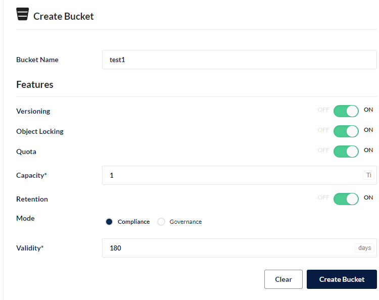

# 一、介绍

MinIO 是在 GNU Affero 通用公共许可证 v3.0 下发布的高性能对象存储。  对于 Kubernetes 环境，请使用 [MinIO Kubernetes Operator](https://github.com/minio/operator/blob/master/README.md)。 

# 二、安装

非k8s

```
yum install -y podman
wget -c https://dl.min.io/server/minio/release/linux-amd64/minio
#启动
podman run   -p 9000:9000  -p 9001:9001 minio server /var/lib/containerd/data --console-address ":9001"
#启动2
./minio server /mnt/data
```

k8s

```
#单机
helm install stable/minio
#集群
helm install --set mode=distributed,replicas=4 stable/minio
```

java客户端

```
<dependency>
                        <groupId>io.minio</groupId>
                        <artifactId>minio</artifactId>
                        <version>8.0.0</version>
                    </dependency>
```

# 三、查看



```
Versioning 允许将同一对象的多个版本保留在同一键下。
Object Locking  可防止删除对象。需要支持保留和法定保留。只能在创建存储桶时启用。
Quota 限制存储桶中的数据量。
Retention 会施加规则，以在一段时间内阻止对象删除。必须启用版本控制才能设置存储桶保留策略。

存储桶命名规则
存储桶名称的长度必须介于 3（最小）到 63（最大）个字符之间。
存储桶名称只能由小写字母、数字、点 （.） 和连字符 （-） 组成。
存储桶名称不得包含两个相邻的句点。
存储桶名称不得格式化为 IP 地址 （例如，192.168.5.4）。
存储桶名称不得以前缀 xn 开头--.
存储桶名称不得以后缀 -s3alias 结尾。此后缀是为接入点别名保留的。
存储桶名称在分区中必须是唯一的。
```

# 四、Java客户端

```java
package com.example.bootminio.upload;

import io.minio.BucketExistsArgs;
import io.minio.MakeBucketArgs;
import io.minio.MinioClient;
import io.minio.PutObjectArgs;
import io.minio.errors.MinioException;
import okhttp3.OkHttpClient;

import javax.net.ssl.*;
import java.io.FileInputStream;
import java.io.IOException;
import java.security.InvalidKeyException;
import java.security.KeyManagementException;
import java.security.NoSuchAlgorithmException;
import java.security.SecureRandom;
import java.security.cert.CertificateException;
import java.security.cert.X509Certificate;

public class FileUploader {
    public static void main(String[] args) throws NoSuchAlgorithmException, IOException, InvalidKeyException {
        try {
            MinioClient minioClient = MinioClient.builder()
                    .httpClient(getUnsafeOkHttpsClient())
                    .credentials("K8sgt80o0TzhWRGg", "t7l2L6l3pVptLEWsfdZa4iaxadptD2aB")
                    .endpoint("192.168.66.31", 9000, false)
                    .build();

            // 检查存储桶是否已经存在
            boolean isExist = minioClient.bucketExists(BucketExistsArgs.builder().bucket("test").build());
            if (isExist) {
                System.out.println("Bucket already exists.");
            } else {
                // 创建一个名为asiatrip的存储桶，用于存储照片的zip文件。
                minioClient.makeBucket(MakeBucketArgs.builder().bucket("test").build());
            }
            FileInputStream fis = new FileInputStream("./pom.xml");
            // 使用putObject上传一个文件到存储桶中。
            minioClient.putObject(PutObjectArgs.builder()
                    .bucket("test")
                    .object("pom.xml")
                    .stream(fis, fis.available(), -1)
                    .build());
            System.out.println("pom.xml is successfully uploaded as pom.xml to `test` bucket.");
        } catch (MinioException e) {
            System.out.println("Error occurred: " + e);
        } catch (KeyManagementException e) {
            throw new RuntimeException(e);
        }
    }

    public static OkHttpClient getUnsafeOkHttpsClient() throws KeyManagementException {
        try {
            final TrustManager[] trustAllCerts = new TrustManager[]{
                    new X509TrustManager() {
                        @Override
                        public void checkClientTrusted(X509Certificate[] x509Certificates, String s) throws CertificateException {

                        }

                        @Override
                        public void checkServerTrusted(X509Certificate[] x509Certificates, String s) throws CertificateException {

                        }

                        @Override
                        public X509Certificate[] getAcceptedIssuers() {
                            return new X509Certificate[]{};
                        }
                    }
            };


            final SSLContext sslContext = SSLContext.getInstance("SSL");
            sslContext.init(null, trustAllCerts, new SecureRandom());
            final SSLSocketFactory sslSocketFactory = sslContext.getSocketFactory();
            OkHttpClient.Builder builder = new OkHttpClient.Builder();
            builder.sslSocketFactory(sslSocketFactory,new X509TrustManager() {
                @Override
                public void checkClientTrusted(X509Certificate[] x509Certificates, String s) throws CertificateException {

                }

                @Override
                public void checkServerTrusted(X509Certificate[] x509Certificates, String s) throws CertificateException {

                }

                @Override
                public X509Certificate[] getAcceptedIssuers() {
                    return new X509Certificate[]{};
                }
            });


            builder.hostnameVerifier(new HostnameVerifier() {
                @Override
                public boolean verify(String s, SSLSession sslSession) {
                    return true;
                }
            });
            return builder.build();

        } catch (NoSuchAlgorithmException e) {
            e.printStackTrace();
        }
        return null;
    }
}
```

api文档：

```
API文档: 操作存储桶
makeBucket
listBuckets
bucketExists
removeBucket
listObjects
listIncompleteUploads
API文档: 操作文件对象
getObject
putObject
copyObject
statObject
removeObject
removeIncompleteUpload
API文档: Presigned操作
presignedGetObject
presignedPutObject
presignedPostPolicy
API文档: 操作存储桶策略
getBucketPolicy
setBucketPolicy
```

更多示例：

https://github.com/minio/minio-java/tree/master/examples