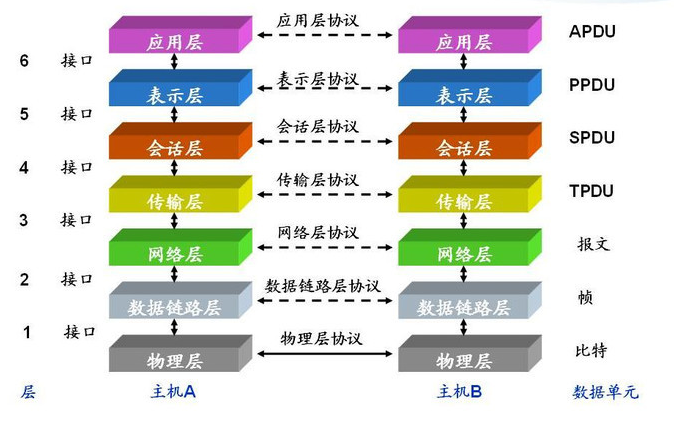
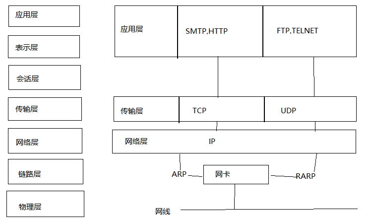
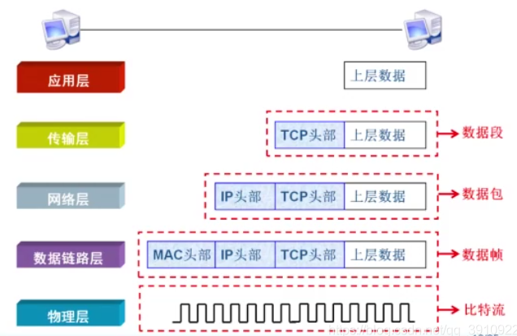

# 七层协议图

七层协议走势图

 

# 七层协议定义

| 应用层     | 网络服务与最终用户的一个接口(用户操作)人机交互窗口，把人的语言输入到计算机当中。 |
| ---------- | ------------------------------------------------------------ |
| 表示层     | 编码，解码，加密，解密（二进制）                             |
| 会话层     | 建立，维持，终止会话进程（QQ号码）                           |
| 传输层     | 通过端口号区分不同的服务，数据分段（受MTU限制），确认、重传、流控、排序（TCP） |
| 网络层     | 通过IP地址（IPV4、IPV6）进行逻辑寻址（ICMP，ARP协议）        |
| 数据链路层 | 建立逻辑连接、进行硬件地址寻址、差错校验等功能(交换机网卡)将上层数据加上源和目的方的物理(MAC)地址封装成数据帧，MAC地址是用来标识网卡的物理地址，建立数据链路:当发现数据错误时，可以重传数据帧。 |
| 物理层     | 建立、维护、断开物理连接(网卡，网线，光纤，集线器，中继器，调制解调器) 报文头部和上层数据信息都是由二进制数组成的，物理层将这些二进制数字组成的比特流转换成电信号在网络中传输。 |

## 应用层

应用层（Application layer）是七层OSI模型的第七层。应用层直接和应用程序接口并提供常见的网络应用服务。应用层也向表示层发出请求。应用层是开放系统的最高层,是直接为应用进程提供服务的。其作用是在实现多个系统应用进程相互通信的同时,完成一系列业务处理所需的服务.其服务元素分为两类:公共应用服务元素CASE和特定应用服务元素SASE.

网络服务与最终用户的一个接口(用户操作)人机交互窗口，把人的语言输入到计算机当中。例如，在00的对话窗口输入字符。 

应用层直接和应用程式介面结合，并提供常见的网路应用服务。应用层也向第六层表示层发出请求。 

应用层协议例子 ：

AFP、APPC、BitTorrent、CFDP、DHCP、DNS、FTAM、FTP、Gopher、HTTP、IMAP、iTMS、IRC、LDAP、Modbus、NFS、NNTP、NTP、POP3、SIP、SMB、SMTP、SNMP、SNTP、SSH、Telnet、TFTP、TSP、Whois、X.400、X.500、XMPP、RPC

## 表示层

表示层(Presentation)亦称表达层，为不同终端的上层用户提供数据和信息正确的语法表示变换方法。如文本文件的ASCII格式和UTF-8格式。

数据的表示、安全、压缩(人的语言翻译成计算机)将接收到的数据翻译成二进制数组成的计算机语言，并对数据进行压缩和解压、数据加密和解密等工作0101。 

表示层的主要功能：

数据语法转换
语法表示
连接管理
数据处理
	数据加密和解密
	数据压缩和解压
	数据编码和解码

具有表示层功能的协议 ：

HTTP/HTTPS
FTP/FTPS
SSH
Telnet
ASN.1

## 会话层

主要为两个会话层实体进行会话（Session），而进行的对话连接的管理服务。

建立、管理、中止会话(通信软件建立会话，比如:QQ)管理是否允许不同机器上的用户之间建立会话连接关系。 

会话层为客户端的应用程序提供了开启、关闭和管理会话的机制，亦即半永久的对话。会话的实体包含了对其他程序作会话链接的要求及回应其他程序提出的会话链接要求。在应用程序的执行环境中，会话层是这些程序用来提出远程过程调用（remote procedure calls，RPC）的地方。

会话层标准为了使会话连接创建阶段能进行功能协商，也为了便于其它国际标准参考和引用，定义了12种功能单元。各个系统可根据自身情况和需要，以核心功能服务单元为基础，选配其他功能单元组成合理的会话服务子集。

会话层协议：

ADSP：AppleTalk的数据流协议
ASP：AppleTalk的动态会话协议
H.245, Call Control Protocol for Multimedia Communication
ISO-SP, OSI Session Layer Protocol（X.225, ISO 8327）
iSNS, Internet Storage Name Service
NetBIOS
PAP, 密码认证协议
PPTP, 点对点隧道协议
L2TP, 第二层隧道协议
RPC, 远程过程调用
RTCP, 实时传输控制协议
SMPP, Short Message Peer-to-Peer
ZIP, Zone Information Protocol
SDP, 套接字直接协议
SOCKS

## 传输层

传输层（英语：Transport Layer）在计算机网络中是互联网协议包与开放系统互连（英语：Open Systems Interconnection）（OSI）网络堆栈中协议的分层结构中的方法的一个概念划分。该层的协议为应用进程提供端到端的通信服务。[1] 它提供面向连接的数据流支持、可靠性、流量控制、多路复用等服务。

定义传输数据的协议端口号，以及流控和差错校验(防火墙端到端) 将上层数据分片并加上端口号封装成数据段，或通过对报文头中的端口识别，实现网络中不同主机上的用户进程之间的数据。 

具有传输层功能的协议：
TCP
UDP
SPX

## 网络层

网络层（Network Layer）是OSI模型中的第三层（TCP/IP模型中的网际层），提供路由和寻址的功能，使两终端系统能够互连且决定最佳路径，并具有一定的拥塞控制和流量控制的能力。相当于发送邮件时需要地址一般重要。由于TCP/IP协议体系中的网络层功能由IP协议规定和实现，故又称IP层。

进行逻辑地址寻址，实现"不同网络之间"的"路径选择"(路由器) 将上层数据加上源和目的方的逻辑(IP)地址封装成数据包，实现数据从源端到目的端的传输。 

网络层协议 ：

IP （V4、V6）
IPX
X.25
RARP
ICMP（V4、V6）
IGMP
IPsec
RIP
OSPF

## 链路层

链路层是计算机网络中互联网协议包的最低一层。链路层是一组仅限于主机物理连接的线路的方法和通信协议。链路是用于网络中的主机或节点的物理和逻辑网络组件，链路协议是一套仅在网段的相邻网络节点之间运行的方法和标准。

建立逻辑连接、进行硬件地址寻址、差错校验等功能(交换机网卡)将上层数据加上源和目的方的物理(MAC)地址封装成数据帧，MAC地址是用来标识网卡的物理地址，建立数据链路:当发现数据错误时，可以重传数据帧。 

TCP/IP 模型中的链路层是网络协议的描述性领域，仅在主机所连接的本地网段（链路）上运行。此类协议数据包不会通到其他网络。链路层包括定义本地（on-link）网络节点之间通信的协议，这些协议实现了维护本地节点之间的链路状态的目的，例如本地网络拓扑，并且通常使用基于框架的协议。特定于链路类型的数据包。

互联网工程任务组（IETF） 在这一层指定的核心协议是地址解析协议（ARP）、反向地址解析协议（RARP） 和邻居发现协议（NDP），这是一种提供类似功能的设施作为IPv6的ARP。自IPv6出现以来，开放式最短路径优先协议（OSPF）也被认为在链路级别上运行，尽管该协议的IPv4版本被认为是在网络层上运行。

IS-IS（RFC 1142）是另一种链路状态路由协议，在考虑TCP/IP模型时适合该层，但是，它是在OSI模型规范堆栈中开发的，它是第2层协议。它不是互联网标准。

## 物理层

物理层（Physical Layer）是计算机网络OSI模型中最低的一层，也是最基本的一层。简单的说，网络的物理层面确保原始的数据可在各种物理媒体上传输。

建立、维护、断开物理连接(网卡，网线，光纤，集线器，中继器，调制解调器) 报文头部和上层数据信息都是由二进制数组成的，物理层将这些二进制数字组成的比特流转换成电信号在网络中传输。 

物理层协议：

电话网络modems- V.92
IRDA物理层
USB物理层
EIA RS-232, EIA-422, EIA-423, RS-449, RS-485
Ethernet physical layer Including 10BASE-T, 10BASE2, 10BASE5, 100BASE-TX, 100BASE-FX, 100BASE-T, 1000BASE-T, 1000BASE-SX还有其他类型
Varieties of 802.11 Wi-Fi物理层
DSL
ISDN
T1 and other T-carrier links, and E1 and other E-carrier links
SONET/SDH
Optical Transport Network（OTN）
GSM Um air interface物理层
Bluetooth物理层
ITU Recommendations: see ITU-T
IEEE 1394 interface
TransferJet物理层
Etherloop
ARINC 818航空电子数字视频总线
G.hn/G.9960物理层
CAN bus（controller area network）物理层
资料编码技巧
编辑
RS-232-C编码
Zero-complemented差动式编码
曼彻斯特编码（Manchester Encoding）
差分曼彻斯特编码（Differential Manchester Encoding）

# 数据封装与解封装

